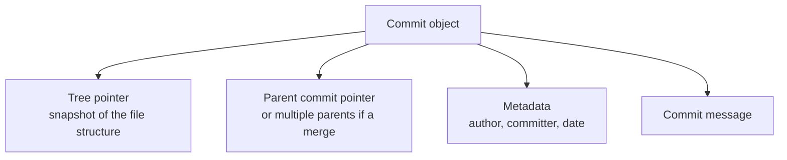

# 8. Commits and Commit Messages

> **Tags:** #git #foundations #commits

A commit is the atomic unit of history in Git. Every commit is a snapshot of the project at a moment in time, plus metadata about who created it, when, and why. Good commits — small, focused, well-described — make a repository easy to understand, bisect, and revert. Bad commits make all three painful.

---

## 8.1 Anatomy of a Commit

Every commit contains four things:



The **commit hash** (e.g., `a1b2c3d4e5...`) is the SHA-1 of the commit object's contents. Because the hash includes the parent's hash, commits form an append-only chain: changing any commit invalidates the hashes of all commits that descend from it.

You can inspect a commit with:

```bash
git show <commit-hash>
```

This prints the metadata, the parent, and the diff introduced by that commit.

---

## 8.2 What Makes a Good Commit

A good commit has three properties:

1. **Atomic** — it makes exactly one logical change. If you fixed a bug and also renamed a function, that is two commits.
2. **Self-contained** — the code compiles and tests pass after the commit. Avoid "WIP" commits on shared branches that leave the build broken.
3. **Clearly described** — the commit message explains *why* the change was made, not just *what* changed (the diff already shows what).

The benefits compound:

- **Bisecting** — when a bug appears, `git bisect` can find the exact commit that introduced it, but only if commits are atomic.
- **Reverting** — if a commit does one thing, you can revert it cleanly. If it does five things, you have to cherry-pick around.
- **Reviewing** — pull requests made of small, focused commits are reviewed faster and more accurately than one giant commit.

---

## 8.3 The Commit Message Format

The conventional format, used by the Linux kernel, Git itself, and most large projects:

```
<one-line summary, imperative mood, max 72 chars>

<optional body, wrapped at 72 chars, explaining why>

<optional footer, e.g., signed-off-by, refs to issues>
```

### The Summary Line

- **Imperative mood:** "Add login form" not "Added login form" or "Adds login form". The summary should complete the sentence "If applied, this commit will ___".
- **Capitalized first letter.**
- **No trailing period.**
- **Max 72 characters** — Git logs indent and wrap, and 72 fits cleanly in an 80-column terminal.

### The Body

- **Explain *why*, not *what*.** The diff already shows what changed.
- **Wrap at 72 characters.**
- **One blank line between summary and body.**
- **Use bullet points with `-` if listing multiple reasons.**

### The Footer

- Reference issues: `Fixes #123` or `Refs #456`.
- Indicate breaking changes: `BREAKING CHANGE: removes the legacy API`.

---

## 8.4 Examples

### Good

```
Fix race condition in session cleanup

Sessions were being deleted while still in use because the cleanup
task and the request handler both held a reference to the session
object but neither coordinated. Add a reference counter so that
cleanup waits for in-flight requests to finish.

Fixes #428
```

### Bad

```
bug fix
```

### Also Bad

```
fixed the bug where the user could not log in if they had a space in
their username and also updated the readme and refactored the auth
module to use async/await instead of promises
```

The first bad example says nothing. The second crams multiple unrelated changes into one commit and one paragraph.

---

## 8.5 Writing Multi-line Commit Messages

For a one-line message:

```bash
git commit -m "Add login form"
```

For a multi-line message, omit `-m` and let Git open your editor:

```bash
git commit
```

Or pass multiple `-m` flags — each becomes a paragraph:

```bash
git commit -m "Add login form" -m "Form supports email and password. Validation is client-side only; server-side validation to follow in a separate commit."
```

To configure your editor:

```bash
git config --global core.editor "code --wait"   # VS Code
git config --global core.editor "nvim"           # Neovim
git config --global core.editor "nano"           # Nano
```

---

## 8.6 Amending the Last Commit

If you forgot to stage a file or want to fix the message of the most recent commit **on a branch you have not pushed yet**:

```bash
git add forgotten-file.txt
git commit --amend
```

This opens your editor with the original message for editing. To amend without changing the message:

```bash
git commit --amend --no-edit
```

**Warning:** amending a commit that has already been pushed rewrites history. You will need `git push --force-with-lease`, and anyone who has based work on the old commit will have to recover. Never amend shared commits.

---

## 8.7 Splitting a Commit

If you committed two unrelated changes together and want to split them:

```bash
git reset HEAD~1           # undo the commit, keep changes staged
git restore --staged .     # unstage everything
git add file1.txt
git commit -m "First change"
git add file2.txt
git commit -m "Second change"
```

For commits further back in history, use `git rebase -i <commit>~1` and mark the commit as `edit`.

---

## 8.8 Viewing History

```bash
git log --oneline --graph --all -20
```

This shows the last 20 commits across all branches as a compact graph. It is the single most useful `git log` incantation.

To see what a specific commit changed:

```bash
git show <hash>
```

To see the diff between two commits:

```bash
git diff <hash1>..<hash2>
```

---

## 8.9 Common Mistakes

- **Vague messages** like "fix" or "update". Six months later you will have no idea what was fixed.
- **Messages that describe the diff** ("changed line 42 of auth.js"). Useless to readers.
- **Committing unrelated changes together** because they happened to be in your working tree at the same time.
- **Committing broken code** to a shared branch. Use a feature branch and squash later if needed.
- **Leaving `console.log` / `print` debugging statements** in committed code.

---

## 8.10 The Conventional Commits Standard

Many projects adopt the **Conventional Commits** specification, which uses structured prefixes:

- `feat: add dark mode` — new feature.
- `fix: correct login redirect` — bug fix.
- `docs: update README` — documentation only.
- `style: format code` — formatting only, no logic change.
- `refactor: extract auth module` — code restructuring with no behavior change.
- `test: add unit tests for login` — test changes only.
- `chore: bump dependencies` — tooling, deps, etc.
- `perf: cache user lookups` — performance improvement.
- `build:` — build system or external dependencies.
- `ci:` — CI configuration.
- `revert: revert feat: add dark mode` — reverts a previous commit.

A `!` after the type signals a breaking change: `feat!: remove legacy API`.

This convention enables automated changelog generation and semantic versioning. Adopt it if your project benefits from automation.

---

**Previous:** [[7. Git Commands Overview]]
**Next:** [[9. Staged Changes and the Index]]
