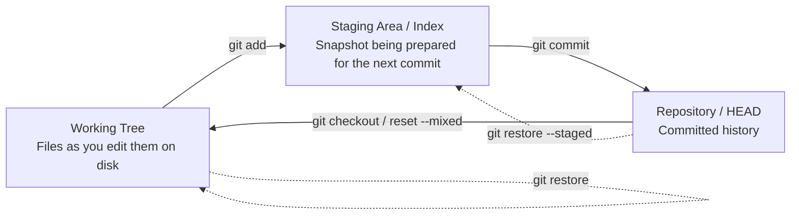
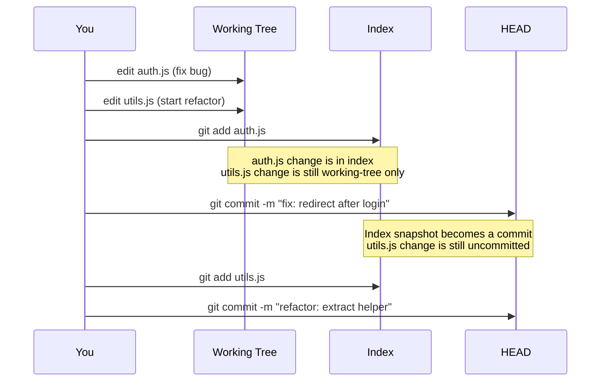

# 9. Staged Changes and the Index

> **Tags:** #git #foundations #staging #index

The staging area — also called the **index** — is the single feature that most distinguishes Git from other version control systems. Understanding it is the difference between feeling in control of Git and feeling victimized by it.

---

## 9.1 The Three-Area Model

Git tracks your files across three areas:



| Area | Where it lives | What it represents |
| --- | --- | --- |
| Working tree | Your filesystem | The files you actually edit in your editor. |
| Staging area (index) | `.git/index` binary file | A snapshot-in-progress: the next commit you will create. |
| Repository (HEAD) | `.git/objects/` | All commits you have already made. |

The staging area is what lets you craft a commit out of *some* of your changes rather than *all* of them.

---

## 9.2 Why Staging Exists

Without a staging area, every commit would include every change in your working tree. That sounds fine until you have:

- Fixed a bug in `auth.js` *and* started a refactor in `utils.js` *and* left some debugging `console.log` statements you forgot about. You do not want all three in one commit.

With a staging area, you can:

1. Stage only the `auth.js` change. Commit it as "fix: redirect after login".
2. Stage only the `utils.js` refactor. Commit it as "refactor: extract helper".
3. Decide what to do with the `console.log` later.

This is the **atomic commit** practice. It produces history that is easy to read, bisect, and revert.

---

## 9.3 The Staging Workflow in Detail



---

## 9.4 Inspecting the Three Areas

| Command | Shows you |
| --- | --- |
| `git status` | A summary of all three areas — what is staged, what is unstaged, what is untracked. |
| `git diff` | Working tree vs index — what you have changed but not staged. |
| `git diff --staged` (or `--cached`) | Index vs HEAD — what you have staged but not committed. |
| `git diff HEAD` | Working tree vs HEAD — everything that would change if you committed everything. |

The three diffs correspond to the three "gaps" between the areas.

---

## 9.5 Staging Strategies

### Staging Whole Files

```bash
git add auth.js
git add .
git add -A
```

`git add .` stages everything in the current directory and below. `git add -A` stages everything in the entire repository regardless of where you are.

### Staging Hunks Interactively

The killer feature for atomic commits:

```bash
git add -p auth.js
```

Git will walk you through each hunk (a contiguous block of changes) in `auth.js` and ask:

- `y` — stage this hunk.
- `n` — do not stage this hunk.
- `s` — split this hunk into smaller hunks.
- `e` — manually edit the hunk.
- `q` — quit.

This lets you stage only the bug fix from `auth.js` while leaving the unrelated cleanup you also did in the same file unstaged.

### Staging by Path

```bash
git add src/auth/
git add '*.test.js'
```

Quotes around globs are important — they prevent the shell from expanding the glob before Git sees it.

---

## 9.6 Unstaging

To move a file from the index back to the working tree (without losing the change):

```bash
git restore --staged auth.js
# older form:
git reset HEAD auth.js
```

The change remains in your working tree — only its "staged" status is removed.

---

## 9.7 What `git commit -a` Does (and Why to Be Careful)

```bash
git commit -am "fix bug"
```

This is shorthand for `git add -u` (stage all **already-tracked** modified files) followed by `git commit -m`. It is convenient but bypasses the entire point of staging:

- It does **not** add new (untracked) files.
- It stages **all** modified files at once, defeating atomic commits.
- It can sweep in changes you forgot you made.

Use it only when you genuinely want to commit every modification in the working tree.

---

## 9.8 The Index as a Binary File

The index lives at `.git/index`. It is a binary file containing one entry per staged file, with the file's mode, the SHA-1 of the staged blob, and the path. You can inspect it with:

```bash
git ls-files --stage
```

You will rarely need to look at this, but knowing it exists explains why a corrupted index (rare but possible after a crash) is repaired with `git reset` — which rebuilds the index from HEAD.

---

## 9.9 Common Mistakes

- **`git add .` followed by a single commit.** This bundles everything into one commit. Use `git add -p` to stage selectively.
- **Forgetting that `git add .` does not include deletions in older Git versions.** Modern Git (2.0+) includes deletions in `git add .`, but `git add -A` is the unambiguous form.
- **Confusing `git diff` and `git diff --staged`.** One shows unstaged changes; the other shows staged changes. Many beginners stare at empty `git diff` output and conclude they have nothing to commit, when in fact their changes are all staged.
- **Using `git commit -a` habitually.** It trains you to ignore the staging area, which is Git's most powerful feature.

---

## 9.10 Key Takeaways

- The staging area (index) sits between the working tree and HEAD.
- `git add` moves changes from working tree to index.
- `git commit` moves the index's snapshot into HEAD as a new commit.
- `git restore --staged` moves a file from index back to working tree.
- `git add -p` is the most useful command you have not yet learned.

---

**Previous:** [[8. Commits and Commit Messages]]
**Next:** [[10. Git Status Explained]]
