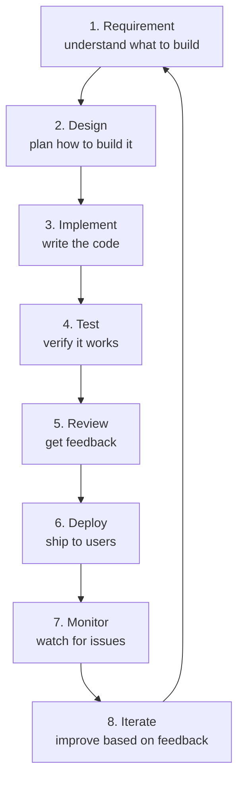
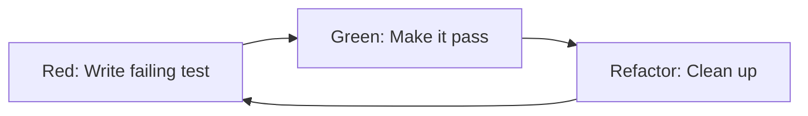

# 1. Feature Development Workflow

> **Tags:** #workflow #features #process #agile

Building a feature is more than writing code. It involves understanding the requirement, designing the solution, implementing, testing, reviewing, and deploying. This note covers the end-to-end workflow.

---

## 10.1 The Feature Development Lifecycle



---

## 10.2 Phase 1 — Understanding the Requirement

Before writing any code, make sure you understand what you are building.

### Questions to Ask

- **What problem does this solve?** (Not "what feature to build" but "what user need".)
- **Who is the user?** (End user, admin, another developer, an API consumer?)
- **What are the acceptance criteria?** (How do we know it is done?)
- **What are the edge cases?** (Empty input, maximum input, concurrent access?)
- **Are there constraints?** (Performance, security, backward compatibility?)
- **Is there existing code for this?** (Do not reinvent.)
- **What is the priority?** (Must-have, should-have, nice-to-have?)

### Write It Down

Document the requirement in the ticket / issue tracker. A good ticket has:

```markdown
## User Story
As a [user type], I want [action] so that [benefit].

## Acceptance Criteria
- [ ] Criterion 1
- [ ] Criterion 2

## Technical Notes
- Must be backward compatible with v1 API
- Should handle up to 10,000 concurrent users

## Out of Scope
- Admin UI (separate ticket)
- Mobile app (separate ticket)
```

---

## 10.3 Phase 2 — Design

For non-trivial features, spend time designing before coding.

### Design Activities

- **Sketch the architecture.** How does the new feature fit into the existing system?
- **Identify the data model.** What new tables, fields, or API contracts are needed?
- **Plan the API.** What endpoints, request/response formats?
- **Consider edge cases.** What happens when things fail?
- **Think about testing.** How will you test this? What test data do you need?

### Design Documents

For large features, write a short design doc:

```markdown
# Feature: User Notifications

## Overview
Allow users to receive notifications for important events.

## Architecture
- New `Notification` table in the database
- New `NotificationService` in the application layer
- WebSocket connection for real-time delivery
- Background job for email digests

## API
POST /api/notifications/send
GET /api/notifications
PATCH /api/notifications/:id/read

## Edge Cases
- User offline: store notification, deliver on reconnect
- User has notifications disabled: do not send, but store
- Rate limiting: max 100 notifications per user per hour

## Testing
- Unit tests for NotificationService
- Integration tests for API endpoints
- E2E test for real-time delivery
```

Share the design doc with the team for feedback before implementing.

---

## 10.4 Phase 3 — Implementation

### Branch and Commit

```bash
# Create a feature branch from the latest main
git switch main
git pull
git switch -b feature/user-notifications

# Commit frequently with clear messages
git add .
git commit -m "feat: add Notification model and migration"
git commit -m "feat: add NotificationService with send method"
git commit -m "test: add unit tests for NotificationService"
```

### Implementation Best Practices

- **Write tests alongside the code.** Either TDD (tests first) or test-after, but do not skip tests.
- **Keep commits small and focused.** One logical change per commit.
- **Run tests locally** before pushing.
- **Use feature flags** for features that are not ready to be visible to users.
- **Do not leave commented-out code.** Delete it; Git remembers.
- **Handle errors properly.** Do not swallow exceptions; log them with context.

### Test-Driven Development (Optional but Recommended)



See [[1. Introduction to Testing]] in Chapter 7 for TDD details.

---

## 10.5 Phase 4 — Testing

### Test Levels

| Level | What to test |
| --- | --- |
| **Unit** | Each function and method in isolation |
| **Integration** | API endpoints, database queries, service composition |
| **E2E** | Critical user journeys (login, checkout, etc.) |

### Self-Testing Checklist

Before requesting review:

- [ ] All unit tests pass.
- [ ] All integration tests pass.
- [ ] New code has test coverage.
- [ ] Edge cases are tested (empty, null, boundary).
- [ ] Error cases are tested.
- [ ] Manual testing of the happy path.
- [ ] No console errors or warnings.
- [ ] Linter passes.
- [ ] Type checker passes.

---

## 10.6 Phase 5 — Code Review

Open a pull request (see [[23. Pull Requests and Code Reviews]] in Chapter 1).

### PR Checklist

- [ ] PR description explains what, why, and how.
- [ ] PR is linked to the issue/ticket.
- [ ] CI passes (tests, lint, build).
- [ ] PR is small enough to review (under 500 lines if possible).
- [ ] Self-reviewed the diff.
- [ ] No debugging code left (console.log, print, TODO).
- [ ] Documentation updated (README, API docs, changelog).

### Responding to Review Feedback

- Address every comment.
- If you disagree, explain why respectfully.
- Push fixes as new commits (do not force-push during review).
- Mark resolved threads as resolved.

---

## 10.7 Phase 6 — Deployment

### Deployment Strategies

| Strategy | Description | Risk |
| --- | --- | --- |
| **Big bang** | Deploy to all users at once | High risk; if something breaks, all users are affected |
| **Rolling** | Gradually replace old instances with new | Lower risk; slow rollback |
| **Blue-green** | Two environments; switch traffic | Instant rollback; requires double capacity |
| **Canary** | Deploy to a small percentage of users | Lowest risk; gradual rollout |
| **Feature flags** | Deploy code, enable feature gradually | Decouples deploy from release |

### Deployment Checklist

- [ ] CI passes on the merge commit.
- [ ] Database migrations are backward compatible.
- [ ] Feature flags are set correctly.
- [ ] Monitoring and alerts are in place.
- [ ] Rollback plan is ready.
- [ ] Communication to stakeholders (if impactful).

---

## 10.8 Phase 7 — Monitoring

After deployment, monitor the feature:

- **Error rates.** Are there new errors?
- **Performance.** Is the feature fast enough?
- **Usage.** Are users using it as expected?
- **Logs.** Any unexpected log entries?

Set up alerts for critical metrics. If something goes wrong, you want to know before users report it.

---

## 10.9 Phase 8 — Iteration

No feature is perfect on the first release. Gather feedback:

- User feedback (support tickets, surveys, analytics).
- Performance data.
- Bug reports.

Plan improvements based on real data, not assumptions.

---

## 10.10 Common Mistakes

- **Starting to code without understanding the requirement.** You build the wrong thing.
- **Skipping the design phase.** You discover design issues late, when they are expensive to fix.
- **Not writing tests.** You ship bugs and fear changes.
- **Giant PRs.** Reviews take forever; bugs slip through.
- **Not handling edge cases.** The happy path works; everything else crashes.
- **Deploying without monitoring.** You do not know if the feature is working.
- **Not iterating.** The first version is never the final version.

---

## 10.11 Key Takeaways

- Feature development: requirement → design → implement → test → review → deploy → monitor → iterate.
- Understand the problem before coding.
- Design before implementing, especially for non-trivial features.
- Write tests alongside the code.
- Keep PRs small and reviewable.
- Deploy with a rollback plan.
- Monitor after deployment.
- Iterate based on real feedback.

---

**Next:** [[2. Bug Fixing Workflow]]
