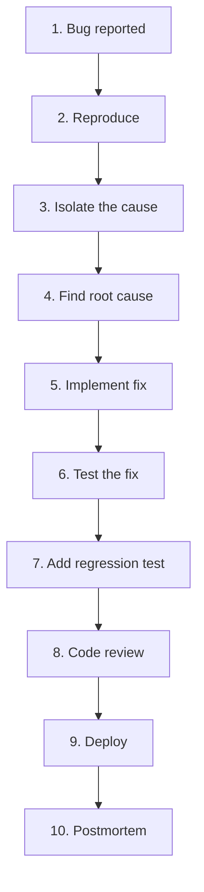
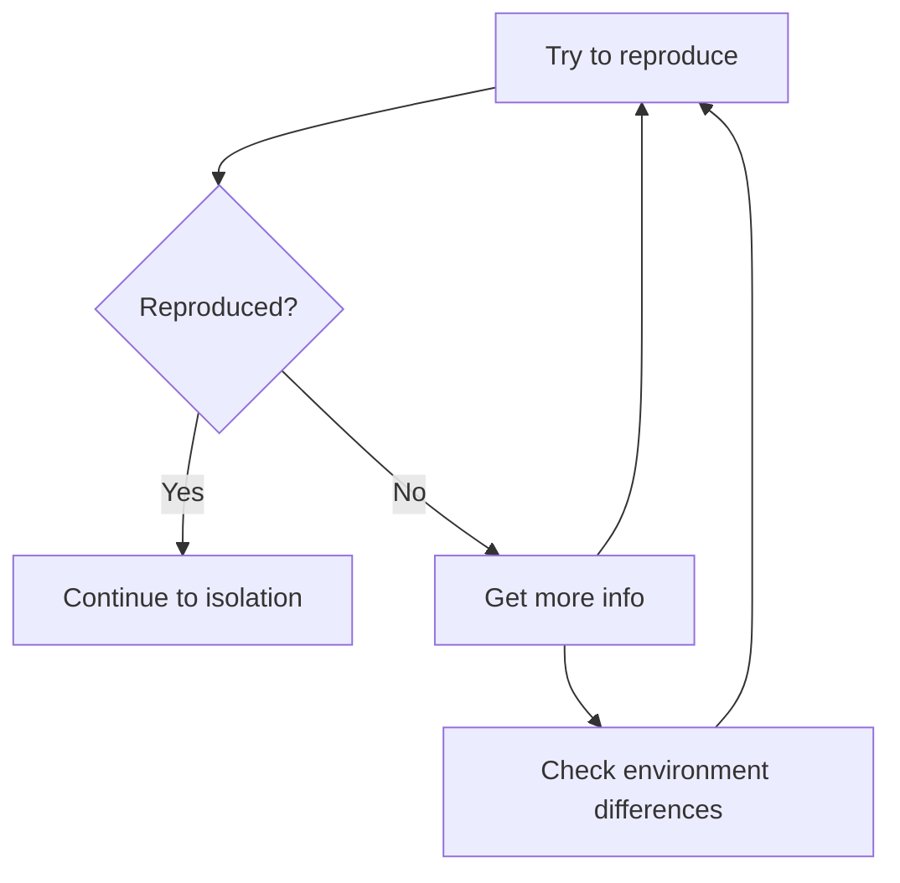
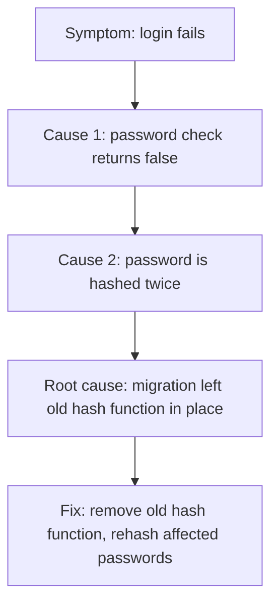

# 2. Bug Fixing Workflow

> **Tags:** #workflow #bugs #debugging #process

Fixing a bug is a distinct workflow from building a feature. The goal is not just to make the symptom go away, but to understand and fix the root cause, prevent regressions, and learn from the incident. This note covers the end-to-end bug fixing process.

---

## 10.2.1 The Bug Fixing Lifecycle



---

## 10.2.2 Phase 1 — Bug Report

A good bug report contains:

- **Steps to reproduce.** Exact steps, in order.
- **Expected behavior.** What should happen.
- **Actual behavior.** What actually happens.
- **Environment.** OS, browser, app version, user role.
- **Frequency.** Always, sometimes, once.
- **Screenshots/logs.** Visual evidence.

If the report lacks any of these, ask for clarification. You cannot fix a bug you cannot reproduce.

---

## 10.2.3 Phase 2 — Reproduce

The first rule of bug fixing: **reproduce the bug.** If you cannot reproduce it, you cannot verify your fix.



### Tips for Reproducing

- **Match the environment.** Same OS, browser, app version as the reporter.
- **Match the data.** Same user, same inputs.
- **Check for race conditions.** Try multiple times; some bugs are timing-dependent.
- **Check for state.** The bug may depend on prior actions.
- **Check logs.** Server logs may show errors the user did not see.

### If You Cannot Reproduce

- Ask the reporter for more details.
- Add extra logging and deploy, then wait for the bug to recur.
- Check if the bug was already fixed in a recent deploy.
- Do not close the bug as "cannot reproduce" without trying these steps.

---

## 10.2.4 Phase 3 — Isolate

Once you can reproduce, isolate the bug to the smallest possible scope.

### Debugging Techniques

- **Binary search.** Comment out half the code; does the bug still happen? Narrow down.
- **Bisect commits.** `git bisect` to find the commit that introduced the bug.
- **Debugger.** Set breakpoints, step through, inspect variables (see Chapter 4).
- **Logging.** Add log statements to trace the flow.
- **Diff with working version.** Compare the buggy code with the last known-good version.

### Git Bisect

```bash
git bisect start
git bisect bad          # current commit is bad
git bisect good v1.2.0  # v1.2.0 was good
# Git checks out a commit in between
# Test it, then:
git bisect good  # or git bisect bad
# Repeat until git identifies the commit
git bisect reset
```

---

## 10.2.5 Phase 4 — Find the Root Cause

The **root cause** is the underlying reason the bug occurs. The **symptom** is what the user sees. Fixing the symptom without fixing the root cause means the bug will recur.



### The "Five Whys" Technique

Ask "why" until you reach the root cause:

1. Why does login fail? → Password check returns false.
2. Why does it return false? → The stored hash does not match.
3. Why does it not match? → The password was hashed twice.
4. Why was it hashed twice? → The migration left the old hash function running.
5. Why was it left running? → The migration script did not remove it. (Root cause: incomplete migration.)

Fix the root cause (remove the old hash function), not just the symptom (make login work for affected users).

---

## 10.2.6 Phase 5 — Implement the Fix

### Principles

- **Fix the root cause, not the symptom.**
- **Make the smallest change that fixes the bug.** Do not refactor at the same time.
- **Do not introduce new bugs.** Be conservative.
- **Consider side effects.** Does the fix affect other code paths?

### Two Hats Rule

Fix the bug first (Feature Hat). Refactor later (Refactoring Hat). Do not mix them — see [[1. Introduction to Refactoring]] in Chapter 5.

---

## 10.2.7 Phase 6 — Test the Fix

### Verify the Fix

- Reproduce the original bug → apply the fix → verify the bug is gone.
- Test edge cases around the bug.
- Run the full test suite to check for regressions.

### Manual Testing

- Test the happy path.
- Test edge cases.
- Test in a production-like environment.

---

## 10.2.8 Phase 7 — Add a Regression Test

A **regression test** ensures the bug does not come back. Without it, a future change might reintroduce the bug.

```python
def test_login_with_double_hashed_password():
    # This test verifies the fix for bug #1234
    # where passwords were accidentally hashed twice
    user = create_user(password="secret", double_hash=True)  # simulate the bug condition
    assert login(user.email, "secret") == True  # should succeed after fix
```

The regression test should:

- Fail before the fix (to verify it catches the bug).
- Pass after the fix.
- Be named to describe the bug it prevents.

---

## 10.2.9 Phase 8 — Code Review

Open a PR for the fix. The PR description should include:

- **What was the bug?** Link to the issue.
- **What was the root cause?**
- **What is the fix?**
- **How was it tested?** (Reproduction steps, regression test.)
- **What is the risk of the fix?** (Could it break anything else?)

---

## 10.2.10 Phase 9 — Deploy

Deploy the fix using the same strategy as any change (see [[1. Feature Development Workflow]]). For urgent production bugs, consider:

- **Hotfix branch.** Branch from the production tag, fix, deploy, then merge back to `main`.
- **Expedited deploy.** Skip the normal release schedule, but still go through CI.

---

## 10.2.11 Phase 10 — Postmortem

For significant bugs (especially production incidents), write a **postmortem**:

```markdown
# Postmortem: Login Failure on 2024-06-25

## Summary
On June 25, 2024, approximately 500 users could not log in for 2 hours.

## Timeline
- 10:00 - First report of login failures
- 10:15 - On-call engineer paged
- 10:30 - Root cause identified (double-hashed passwords)
- 10:45 - Fix deployed
- 11:00 - Affected users' passwords reset
- 12:00 - All users able to log in

## Root Cause
The migration script to upgrade the hash function did not remove the old function, causing passwords to be hashed twice for new signups.

## Impact
- 500 users affected for 2 hours
- ~50 support tickets
- 3 cancelled subscriptions

## What Went Well
- On-call responded quickly
- Fix was straightforward once root cause was found

## What Went Wrong
- Migration script was not reviewed for completeness
- No test verified that only one hash function was active
- Monitoring did not alert on the increased login failures

## Action Items
- [ ] Add test for single-hash invariant
- [ ] Review all migration scripts for completeness
- [ ] Add alert for login failure rate > 5%
- [ ] Document the migration review process
```

A postmortem is **blameless** — it focuses on the process, not the people. The goal is to learn and prevent recurrence.

---

## 10.2.12 Common Mistakes

- **Fixing the symptom, not the root cause.** The bug recurs.
- **Not reproducing the bug.** You cannot verify the fix.
- **Not writing a regression test.** The bug comes back.
- **Mixing bug fix with refactoring.** Makes review harder and introduces risk.
- **Not testing edge cases.** The fix works for the reported case but breaks others.
- **Deploying without monitoring.** You do not know if the fix worked.
- **Not doing a postmortem.** You miss the opportunity to learn and prevent recurrence.

---

## 10.2.13 Key Takeaways

- Bug fixing: reproduce → isolate → root cause → fix → test → regression test → review → deploy → postmortem.
- Always reproduce before fixing.
- Use "Five Whys" to find the root cause.
- Fix the root cause, not the symptom.
- Add a regression test that fails before the fix and passes after.
- Do not mix bug fixing with refactoring.
- Write a blameless postmortem for significant bugs.

---

**Previous:** [[1. Feature Development Workflow]]
**Next:** [[3. Agile and Scrum]]
