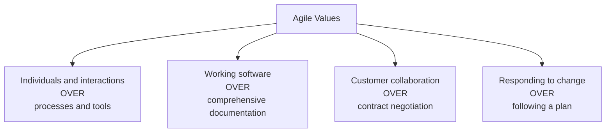
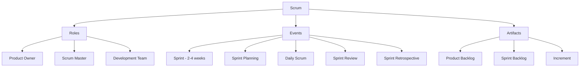
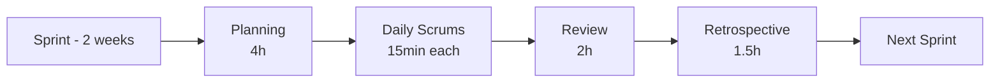
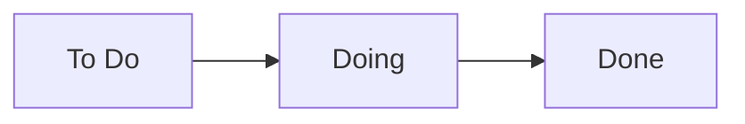

# 3. Agile and Scrum

> **Tags:** #agile #scrum #workflow #process #methodology

Agile is a philosophy of software development that emphasizes iterative progress, collaboration, and adaptability. Scrum is the most popular framework for implementing Agile. This note covers the principles of Agile and the mechanics of Scrum.

---

## 10.3.1 The Agile Manifesto

In 2001, a group of software developers wrote the **Agile Manifesto** — four values and twelve principles that define Agile development.

### The Four Values

The key word is **"over"** — the items on the right have value, but the items on the left have more value. Agile does not say "no documentation"; it says "working software matters more."

### The Twelve Principles (Summary)

1. Satisfy the customer through early and continuous delivery.
2. Welcome changing requirements, even late in development.
3. Deliver working software frequently (weeks, not months).
4. Business and developers work together daily.
5. Build projects around motivated individuals; trust them.
6. Face-to-face conversation is the most efficient communication.
7. Working software is the primary measure of progress.
8. Agile processes promote sustainable development.
9. Continuous attention to technical excellence.
10. Simplicity — the art of maximizing the amount of work not done.
11. Self-organizing teams produce the best architectures and designs.
12. Reflect and adjust regularly.

---

## 10.3.2 Scrum Overview

Scrum is a framework with specific roles, events, and artifacts.

---

## 10.3.3 Scrum Roles

### Product Owner (PO)

- Owns the **product backlog** — the prioritized list of features.
- Represents the customer and stakeholders.
- Decides **what** to build and in what order.
- Does not decide **how** to build it (that is the team's job).

### Scrum Master (SM)

- Facilitates Scrum events (planning, daily, review, retro).
- Removes impediments blocking the team.
- Coaches the team on Scrum and Agile.
- Does **not** manage the team — the team is self-organizing.

### Development Team

- Cross-functional: has all the skills needed to deliver (frontend, backend, QA, etc.).
- Self-organizing: decides how to do the work.
- Typically 3-9 people.
- Delivers a working increment each sprint.

---

## 10.3.4 Scrum Events

### The Sprint

A **sprint** is a time-boxed period (usually 2 weeks) during which the team delivers a working increment. Sprints have a consistent length and start immediately after the previous one ends.

### Sprint Planning

At the start of each sprint, the team plans what to deliver:

- The PO presents the prioritized backlog.
- The team selects items they can complete in the sprint.
- The team creates a sprint backlog (the selected items + a plan for delivering them).

### Daily Scrum (Stand-up)

A 15-minute daily meeting where each team member answers:

1. What did I do yesterday?
2. What will I do today?
3. Are there any impediments?

The daily scrum is for synchronization, not problem-solving. Take side discussions offline.

### Sprint Review

At the end of the sprint, the team demonstrates the working increment to stakeholders. Feedback is collected and fed into the next sprint's planning.

### Sprint Retrospective

The team reflects on the sprint and identifies improvements:

- What went well?
- What could be improved?
- What will we change next sprint?

The retro is the engine of **continuous improvement** — the core of Agile.

---

## 10.3.5 Scrum Artifacts

### Product Backlog

The master list of all features, bug fixes, and technical work needed for the product. Maintained by the Product Owner. Items at the top are higher priority and more detailed.

### Sprint Backlog

The subset of the product backlog selected for the current sprint, plus the plan for delivering them.

### Increment

The working software delivered at the end of the sprint. It must meet the team's **Definition of Done** (DoD) — a shared agreement on what "done" means (e.g., "coded, tested, reviewed, documented, deployed to staging").

---

## 10.3.6 Backlog Refinement

During the sprint, the team spends time **refining** the product backlog:

- Adding detail to upcoming items.
- Estimating effort.
- Splitting large items into smaller ones.
- Removing items that are no longer needed.

Refinement ensures items are "ready" for the next sprint planning.

---

## 10.3.7 Estimation

Scrum teams estimate effort using **story points** — a relative measure of complexity, not time.

### Planning Poker

1. The team reads a user story.
2. Each member privately picks an estimate (usually Fibonacci: 1, 2, 3, 5, 8, 13, 21).
3. Everyone reveals simultaneously.
4. The highest and lowest estimators explain their reasoning.
5. Repeat until consensus.

Story points are relative: a "2" is twice as complex as a "1". Over time, the team's **velocity** (points completed per sprint) stabilizes, allowing rough forecasting.

---

## 10.3.8 Kanban (Alternative to Scrum)

Kanban is another Agile framework, focused on continuous flow rather than time-boxed sprints.

### Kanban Principles

- **Visualize the workflow.** A board with columns for each stage.
- **Limit work in progress (WIP).** Each column has a maximum number of items.
- **Manage flow.** Move items from left to right as they progress.
- **Make policies explicit.** Define what "done" means for each column.
- **Improve collaboratively.** Evolve the process over time.

Kanban is lighter than Scrum — no sprints, no ceremonies. It suits teams with continuous, unpredictable work (e.g., support, maintenance, ops).

---

## 10.3.9 Agile vs Scrum vs Kanban

| Aspect | Agile | Scrum | Kanban |
| --- | --- | --- | --- |
| What it is | Philosophy | Framework | Framework |
| Time-boxed | No | Yes (sprints) | No |
| Roles | No specific roles | PO, SM, Team | No specific roles |
| Ceremonies | No specific ones | Planning, Daily, Review, Retro | No specific ones |
| Estimation | Optional | Story points | Optional |
| Best for | Iterative development | Product development | Support, maintenance, ops |

---

## 10.3.10 Common Agile Anti-Patterns

- **"Agile" as an excuse for no planning.** Agile planning is continuous, not absent.
- **Stand-ups as status reports to the manager.** Stand-ups are for team synchronization.
- **Sprint goals that change mid-sprint.** The sprint is a commitment; do not change it.
- **No retrospectives.** Without retros, there is no continuous improvement.
- **Velocity as a performance metric.** Velocity is for forecasting, not for measuring productivity.
- **"We are doing Agile" while following a waterfall plan.** Agile is not just renaming "phases" to "sprints."

---

## 10.3.11 Key Takeaways

- Agile is a philosophy: working software, collaboration, responding to change.
- Scrum is a framework with roles (PO, SM, Team), events (Sprint, Planning, Daily, Review, Retro), and artifacts (backlogs, increment).
- Sprints are 2-4 week time-boxes for delivering a working increment.
- The retrospective is the engine of continuous improvement.
- Kanban is a lighter alternative: visualize flow, limit WIP, no sprints.
- Agile is not "no planning" — it is continuous planning and adaptation.

---

**Previous:** [[2. Bug Fixing Workflow]]
**Next:** [[4. Task Breakdown and Estimation]]
