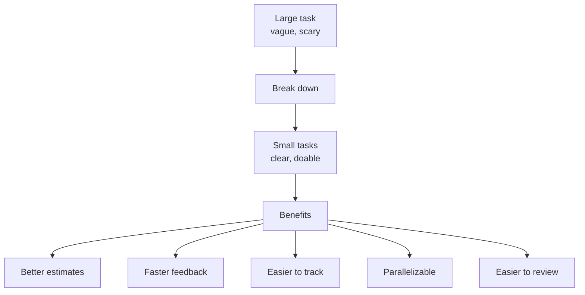
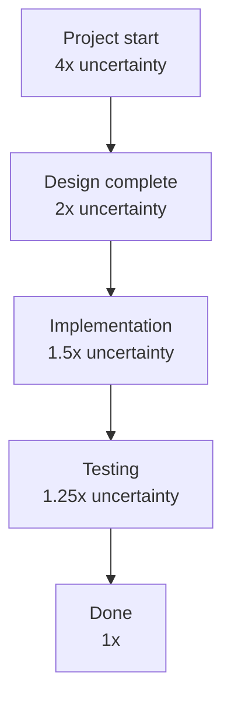

# 4. Task Breakdown and Estimation

> **Tags:** #workflow #estimation #planning #agile

Breaking down work and estimating effort are core skills for any developer. Good breakdown makes work manageable; good estimation makes planning realistic. This note covers techniques for both.

---

## 10.4.1 Why Break Down Tasks?



A task that is "implement the notification system" is too large to estimate, track, or review. Break it down until each task is:

- **Independent** — can be done without waiting for another task.
- **Small** — completable in 1-2 days.
- **Testable** — has clear acceptance criteria.
- **Valuable** — delivers a piece of working software.

---

## 10.4.2 Breakdown Techniques

### Horizontal Breakdown (By Layer)

Break by technical layer:

```text
Feature: User Notifications
  Database: Add notifications table
  Backend: Add notification API endpoints
  Backend: Add notification service
  Frontend: Add notification bell icon
  Frontend: Add notification dropdown
  Frontend: Add real-time updates via WebSocket
```

### Vertical Breakdown (By Slice)

Break by user-facing slice — each slice delivers end-to-end value:

```text
Feature: User Notifications
  Slice 1: Display in-app notifications (DB + API + UI)
  Slice 2: Mark notification as read (DB + API + UI)
  Slice 3: Real-time delivery (WebSocket)
  Slice 4: Email notifications (background job + email service)
  Slice 5: Notification preferences (settings UI + API)
```

**Prefer vertical breakdown.** Each slice is independently deliverable and testable. You can ship slice 1 without waiting for slice 5.

### Breakdown by User Journey

Break by the steps a user takes:

```text
Feature: Checkout
  View cart
  Add shipping address
  Select shipping method
  Enter payment
  Review order
  Place order
  Order confirmation
```

---

## 10.4.3 How Small Is Small Enough?

A task is small enough when:

- You can describe it in one sentence.
- You can estimate it with confidence (not "I have no idea").
- It can be completed in 1-2 days.
- It has clear acceptance criteria.
- It can be tested independently.

If a task takes more than 3 days, break it down further.

---

## 10.4.4 Estimation Techniques

### Story Points (Relative Estimation)

Story points are a relative measure of effort/complexity, not time. Use the Fibonacci sequence: 1, 2, 3, 5, 8, 13, 21.

| Points | Meaning |
| --- | --- |
| 1 | Trivial; less than half a day. |
| 2 | Simple; half a day. |
| 3 | Moderate; 1 day. |
| 5 | Complex; 2-3 days. |
| 8 | Large; 3-5 days. Consider breaking down. |
| 13 | Very large; a week+. Must break down. |
| 21 | Epic; split into multiple stories. |

Why Fibonacci? The gap between numbers grows, reflecting increasing uncertainty for larger tasks.

### Planning Poker

1. The team reads the story together.
2. Questions are asked and answered.
3. Each member privately picks a card with their estimate.
4. Everyone reveals simultaneously.
5. The highest and lowest estimators explain their reasoning.
6. Repeat until consensus (or close to it).

Planning poker surfaces assumptions and knowledge gaps. If estimates vary widely, the team does not understand the task — discuss more.

### T-Shirt Sizes

For rough, early estimates: XS, S, M, L, XL. Useful for roadmap planning when detail is not yet needed.

### Time-Based Estimation

Estimate in hours or days. Simpler but less accurate because:

- Different people work at different speeds.
- Interruptions and context switching are hard to predict.
- Unknowns dominate for complex tasks.

Use time estimates for small, well-understood tasks. Use story points for larger, uncertain work.

---

## 10.4.5 Estimation Best Practices

### 1. Estimate Effort, Not Value

A task might deliver little value but take a lot of effort (or vice versa). Estimate effort separately from prioritizing value.

### 2. Include All Work

Estimate includes:

- Coding.
- Testing (writing and running).
- Code review (giving and receiving).
- Documentation.
- Deployment.
- Bug fixing.

Not just "writing the code."

### 3. Account for Unknowns

If a task has unknowns, add a "spike" — a time-boxed investigation to reduce uncertainty before estimating:

```text
Spike: Investigate WebSocket library options (4 hours)
  → Outcome: chose Socket.io, estimated main feature at 5 points
```

### 4. Use Historical Data

Track your team's velocity (points completed per sprint). After a few sprints, you can forecast:

- "We average 30 points per sprint."
- "This feature is 60 points, so it will take about 2 sprints."

### 5. Re-estimate When You Learn More

Estimates are not contracts. If you discover the task is more complex than expected, re-estimate and communicate the change.

### 6. Do Not Estimate Alone

Estimation is a team activity. Different perspectives catch blind spots. Use planning poker or similar.

---

## 10.4.6 Common Estimation Mistakes

- **Estimating too high.** Padding estimates "to be safe" leads to Parkinson's Law: work expands to fill the time available.
- **Estimating too low.** Optimism bias: you imagine the happy path and forget edge cases, testing, and integration.
- **Including only coding time.** A 4-hour coding task is a 2-day task when you include testing, review, and deployment.
- **Not accounting for context switching.** If you are interrupted 5 times a day, a "4-hour" task takes 2 days.
- **Treating estimates as commitments.** Estimates are predictions, not promises. Holding developers to estimates leads to sandbagging (over-estimating to look good).
- **Estimating in large units.** "2 weeks" is too coarse. Break down into smaller tasks and estimate each.

---

## 10.4.7 The Cone of Uncertainty

Estimates are more accurate when the work is closer to being done:



Early in a project, your estimate might be off by 4x. As you learn more, the estimate narrows. Do not treat early estimates as precise — they are ranges, not points.

---

## 10.4.8 Key Takeaways

- Break down work until each task is 1-2 days, independent, testable, and valuable.
- Prefer vertical slices (end-to-end) over horizontal layers.
- Estimate with story points (relative) using planning poker.
- Include all work: coding, testing, review, documentation, deployment.
- Use spikes to reduce uncertainty before estimating.
- Track velocity to forecast, not to measure productivity.
- Estimates are predictions, not commitments. Re-estimate when you learn more.

---

**Previous:** [[3. Agile and Scrum]]
**Next chapter:** [[1. Make and CMake]] (Chapter 11)
