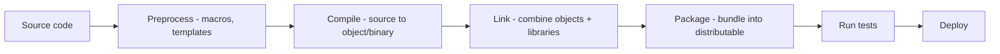

# 1. Introduction to Build Tools

> **Tags:** #build-tools #tooling #automation #workflow

A **build tool** automates the process of transforming source code into a runnable artifact. It compiles, links, packages, and sometimes deploys. Every language ecosystem has its build tools; understanding them is essential for professional development.

---

## 11.1 What Build Tools Do

Build tools automate some or all of these steps:

1. **Dependency resolution.** Download and manage third-party libraries.
2. **Compilation.** Transform source code into binaries or bytecode.
3. **Linking.** Combine compiled objects with libraries.
4. **Packaging.** Bundle the result into a distributable format (JAR, Docker image, npm package).
5. **Testing.** Run automated tests.
6. **Deployment.** Publish or deploy the artifact.

---

## 11.2 Build Tools by Language

| Language | Build Tool(s) | Package Manager |
| --- | --- | --- |
| C / C++ | Make, CMake, Ninja | (varies) |
| Java | Maven, Gradle, Ant | Maven Central, Gradle |
| Kotlin | Gradle | Maven Central |
| C# / .NET | MSBuild, `dotnet` CLI | NuGet |
| Python | setuptools, Poetry, Hatch | pip, PyPI |
| JavaScript / TypeScript | npm, Yarn, pnpm, Vite, Webpack | npm registry |
| Go | `go build` (built-in) | Go modules |
| Rust | Cargo (built-in) | crates.io |

---

## 11.3 The Role of Package Managers

Package managers and build tools are related but distinct:

- **Package manager**: downloads and manages external dependencies (e.g., `npm install`, `pip install`).
- **Build tool**: compiles and packages your code (e.g., `webpack`, `tsc`).

In some ecosystems, they are the same tool (Cargo for Rust, `go` for Go). In others, they are separate (npm for packages, Webpack for building in JavaScript).

---

## 11.4 Key Concepts

### Dependency Manifests

A file that declares your project's dependencies:

| Language | Manifest | Lockfile |
| --- | --- | --- |
| Python | `requirements.txt`, `pyproject.toml` | `requirements.lock`, `poetry.lock` |
| JavaScript | `package.json` | `package-lock.json`, `yarn.lock`, `pnpm-lock.yaml` |
| Java (Maven) | `pom.xml` | (Maven resolves versions at build time) |
| Java (Gradle) | `build.gradle` | `gradle.lockfile` |
| .NET | `.csproj` | `packages.lock.json` |
| Go | `go.mod` | `go.sum` |
| Rust | `Cargo.toml` | `Cargo.lock` |

The **lockfile** records the exact versions installed, ensuring reproducible builds. Commit it to version control (for applications) or not (for libraries, depending on convention).

### Reproducible Builds

A reproducible build produces the exact same output every time, given the same source. This requires:

- Pinned dependency versions (lockfiles).
- No network access during the build (all deps cached).
- No timestamps or random values in the output.
- Deterministic build tools (some older tools are not deterministic).

Reproducible builds are essential for security (verifying that a binary was built from a specific source) and for debugging (reproducing a production issue locally).

### Incremental Builds

An incremental build only rebuilds what changed, not the entire project. This makes builds fast. Tools like Make, Ninja, Gradle, and Cargo all support incremental builds by tracking file modification times and dependency graphs.

---

## 11.5 Common Build Tool Features

| Feature | What it does |
| --- | --- |
| **Build** | Compile and package the project. |
| **Clean** | Remove build artifacts. |
| **Test** | Run the test suite. |
| **Lint** | Run linters. |
| **Format** | Auto-format code. |
| **Run** | Build and execute the application. |
| **Watch** | Rebuild on file change. |
| **Install** | Install the package globally or to a virtual environment. |
| **Publish** | Publish the artifact to a registry. |

Most build tools provide these as subcommands: `npm run build`, `cargo build`, `mvn package`, `dotnet build`.

---

## 11.6 Choosing a Build Tool

In most cases, the build tool is determined by the language:

- **C/C++**: CMake is the modern standard (Make for smaller projects).
- **Java**: Gradle for new projects (Maven for legacy).
- **.NET**: `dotnet` CLI (MSBuild under the hood).
- **Python**: Poetry for new projects (setuptools for legacy).
- **JavaScript**: npm or pnpm (with Vite or Webpack for bundling).
- **Go**: `go` (built-in).
- **Rust**: Cargo (built-in).

You rarely choose a build tool independently — you choose a language, and the build tool comes with it.

---

## 11.7 Build Tool Best Practices

1. **Commit the lockfile.** Reproducible builds require pinned versions.
2. **Pin the build tool version.** Use a version manager (nvm, pyenv, SDKMAN) or a wrapper (gradlew, npm ci).
3. **Automate in CI.** The same build command should work locally and in CI.
4. **Keep builds fast.** Slow builds kill productivity. Use caching, incremental builds, and parallelism.
5. **Do not commit build artifacts.** They bloat the repo and cause conflicts. Add them to `.gitignore`.
6. **Use scripts for common tasks.** `npm run` scripts, Makefile targets, or `just` commands make it easy to run common operations.

---

## 11.8 Key Takeaways

- Build tools automate: dependency resolution, compilation, linking, packaging, testing, deployment.
- Each language has its build tools: CMake (C/C++), Maven/Gradle (Java), npm/Vite (JS), Cargo (Rust), etc.
- Package managers manage dependencies; build tools compile and package. Sometimes they are the same.
- Use lockfiles for reproducible builds.
- Keep builds fast with caching and incremental builds.
- Automate the same build command locally and in CI.

---

**Next:** [[2. Make and CMake]]
