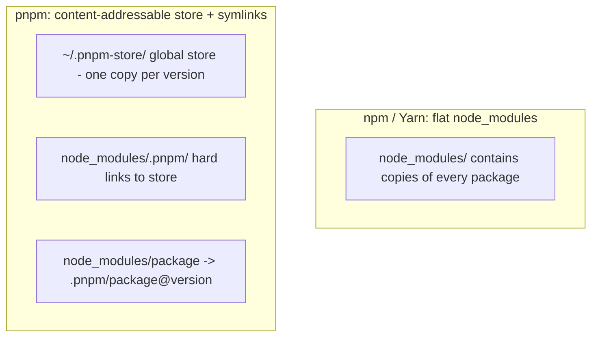

# 3. npm, Yarn, and pnpm

> **Tags:** #npm #yarn #pnpm #javascript #build-tools #package-managers

npm, Yarn, and pnpm are the three main package managers for the JavaScript ecosystem. They all read `package.json` and install from the npm registry, but they differ in speed, disk usage, and features.

---

## 11.3.1 package.json

The `package.json` file is the manifest for a JavaScript project:

```json
{
  "name": "my-app",
  "version": "1.0.0",
  "description": "A sample application",
  "main": "index.js",
  "scripts": {
    "build": "webpack --mode production",
    "dev": "webpack serve --mode development",
    "test": "jest",
    "lint": "eslint ."
  },
  "dependencies": {
    "express": "^4.18.2",
    "react": "^18.2.0",
    "react-dom": "^18.2.0"
  },
  "devDependencies": {
    "jest": "^29.5.0",
    "eslint": "^8.40.0",
    "webpack": "^5.85.0"
  },
  "engines": {
    "node": ">=18.0.0"
  }
}
```

### Key Fields

| Field | Purpose |
| --- | --- |
| `name` | Package name (lowercase, no spaces). |
| `version` | Semantic version. |
| `main` | Entry point for `require()`. |
| `scripts` | Custom commands run with `npm run <name>`. |
| `dependencies` | Packages needed at runtime. |
| `devDependencies` | Packages needed only for development (tests, linters, build tools). |
| `peerDependencies` | Packages the consumer is expected to provide (common in plugins). |
| `engines` | Required Node.js / npm versions. |

### Version Specifiers

| Specifier | Meaning |
| --- | --- |
| `4.18.2` | Exact version. |
| `^4.18.2` | Compatible with 4.18.2 (allows 4.x.x, not 5.0.0). |
| `~4.18.2` | Approximately equivalent (allows 4.18.x, not 4.19.0). |
| `>=4.18.2` | Any version >= 4.18.2. |
| `*` | Any version (dangerous). |

Prefer `^` for libraries (allows patch and minor updates). Pin exact versions for applications (with a lockfile).

---

## 11.3.2 npm

**npm** (Node Package Manager) is the default package manager, bundled with Node.js.

### Common Commands

```bash
npm install              # install all dependencies (reads package.json + lockfile)
npm install <package>    # install a package and add to dependencies
npm install -D <package> # install as devDependency
npm install -g <package> # install globally

npm run <script>         # run a script from package.json
npm test                 # shorthand for npm run test
npm start                # shorthand for npm run start

npm update               # update dependencies within version ranges
npm outdated             # show outdated dependencies
npm audit                # check for security vulnerabilities

npm publish              # publish to the npm registry
npm uninstall <package>  # remove a package
```

### npm ci (Clean Install)

```bash
npm ci
```

`npm ci` is like `npm install` but:

- Removes `node_modules` before installing.
- Uses the lockfile exactly (no version resolution).
- Faster and more deterministic.
- Fails if `package-lock.json` is out of sync with `package.json`.

Use `npm ci` in CI. Use `npm install` for local development.

---

## 11.3.3 Yarn

**Yarn** is Facebook's alternative to npm. It introduced lockfiles and offline caching before npm had them.

### Yarn 1 (Classic)

```bash
yarn install             # install dependencies
yarn add <package>       # add a dependency
yarn add -D <package>    # add as devDependency
yarn remove <package>    # remove a dependency
yarn run <script>        # run a script
yarn test                # run tests
```

### Yarn 2+ (Berry)

Yarn Berry is a major rewrite with:

- **Plug'n'Play (PnP)**: no `node_modules` directory; dependencies are referenced directly from a cache. Faster installs, less disk usage.
- **Workspaces**: first-class monorepo support.
- **Constraints**: enforce dependency rules.

```bash
yarn set version berry   # enable Yarn Berry
yarn install             # install with PnP
```

PnP can cause compatibility issues with tools that expect `node_modules`. Use `nodeLinker: node-modules` in `.yarnrc.yml` to fall back to the traditional approach.

---

## 11.3.4 pnpm

**pnpm** (Performant npm) is the fastest and most disk-efficient of the three.

### How pnpm Is Different



pnpm stores each package version once in a global store (`~/.pnpm-store/`). Projects reference the store via hard links, so:

- **Disk-efficient**: a 100MB package used in 10 projects takes 100MB, not 1GB.
- **Fast**: installing is mostly creating hard links, not copying files.
- **Strict**: packages cannot access dependencies they did not declare (prevents phantom dependencies).

### Common Commands

```bash
pnpm install             # install dependencies
pnpm add <package>       # add a dependency
pnpm add -D <package>    # add as devDependency
pnpm remove <package>    # remove a dependency
pnpm run <script>        # run a script
pnpm test                # run tests
pnpm -r run build        # run a script across all workspaces (monorepo)
```

### pnpm Workspaces (Monorepo)

```yaml
# pnpm-workspace.yaml
packages:
  - 'apps/*'
  - 'packages/*'
```

```bash
pnpm install             # installs all workspace dependencies
pnpm -r run build        # build all packages
pnpm --filter @my/app run test  # run tests in one package
```

---

## 11.3.5 Comparison

| Feature | npm | Yarn Classic | Yarn Berry | pnpm |
| --- | --- | --- | --- | --- |
| Speed | Slow | Fast | Fast | Fastest |
| Disk usage | High | High | Low (PnP) | Lowest |
| Lockfile | `package-lock.json` | `yarn.lock` | `yarn.lock` | `pnpm-lock.yaml` |
| Workspaces | Yes (7+) | Yes | Yes | Yes |
| Strict deps | No | No | Optional | Yes |
| PnP | No | No | Yes | No |
| Global store | No | No | No | Yes |

### Which to Choose?

- **npm**: default, no extra setup, good enough for most projects.
- **pnpm**: best performance and disk efficiency; great for monorepos; strictness prevents bugs.
- **Yarn Berry**: PnP is innovative but has compatibility issues; use if you need its specific features.

For new projects, **pnpm** is the recommended choice.

---

## 11.3.6 Bundlers: Webpack, Vite, esbuild

Package managers install dependencies. **Bundlers** combine your source code and dependencies into optimized files for the browser.

| Bundler | When to use |
| --- | --- |
| **Webpack** | Mature, configurable, large existing projects. |
| **Vite** | Modern, fast (esbuild dev, Rollup build), default for new projects. |
| **esbuild** | Extremely fast, simpler configuration, library builds. |
| **Rollup** | Library builds (tree-shaking). |
| **Parcel** | Zero-config, beginner-friendly. |

### Vite Example

```bash
npm create vite@latest my-app -- --template react-ts
cd my-app
npm install
npm run dev    # start dev server with HMR
npm run build  # production build
```

Vite uses esbuild for fast dev startup and Rollup for production builds. It is the recommended choice for new projects.

---

## 11.3.7 Key Takeaways

- `package.json` is the manifest: name, version, scripts, dependencies.
- Version specifiers: `^` (compatible), `~` (approximately), exact (pinned).
- npm is the default; `npm ci` for CI, `npm install` for dev.
- Yarn Berry introduced PnP (no `node_modules`).
- pnpm is fastest and most disk-efficient; great for monorepos; strict dependencies.
- Use bundlers (Vite, Webpack, esbuild) to combine source + deps for the browser.
- For new projects: pnpm + Vite.

---

**Previous:** [[2. Make and CMake]]
**Next:** [[4. Gradle and Maven]]
