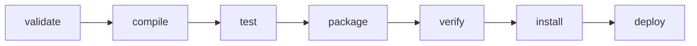

# 4. Gradle and Maven

> **Tags:** #gradle #maven #java #jvm #build-tools

Gradle and Maven are the two main build tools for the JVM ecosystem (Java, Kotlin, Scala). Maven is older and declarative; Gradle is newer and imperative (with a Groovy or Kotlin DSL).

---

## 11.4.1 Maven

**Maven** is the classic Java build tool. It uses `pom.xml` (Project Object Model) to declare the project structure and dependencies.

### A Minimal pom.xml

```xml
<project xmlns="http://maven.apache.org/POM/4.0.0"
         xmlns:xsi="http://www.w3.org/2001/XMLSchema-instance"
         xsi:schemaLocation="http://maven.apache.org/POM/4.0.0
         http://maven.apache.org/xsd/maven-4.0.0.xsd">
    <modelVersion>4.0.0</modelVersion>
    
    <groupId>com.example</groupId>
    <artifactId>my-app</artifactId>
    <version>1.0.0</version>
    <packaging>jar</packaging>
    
    <properties>
        <maven.compiler.source>17</maven.compiler.source>
        <maven.compiler.target>17</maven.compiler.target>
        <project.build.sourceEncoding>UTF-8</project.build.sourceEncoding>
    </properties>
    
    <dependencies>
        <dependency>
            <groupId>org.springframework</groupId>
            <artifactId>spring-core</artifactId>
            <version>6.1.0</version>
        </dependency>
        <dependency>
            <groupId>org.junit.jupiter</groupId>
            <artifactId>junit-jupiter</artifactId>
            <version>5.10.0</version>
            <scope>test</scope>
        </dependency>
    </dependencies>
    
    <build>
        <plugins>
            <plugin>
                <groupId>org.apache.maven.plugins</groupId>
                <artifactId>maven-surefire-plugin</artifactId>
                <version>3.2.0</version>
            </plugin>
        </plugins>
    </build>
</project>
```

### Maven Coordinates

Every Maven artifact is identified by three coordinates:

| Coordinate | Meaning | Example |
| --- | --- | --- |
| `groupId` | Organization / group | `com.example` |
| `artifactId` | Project name | `my-app` |
| `version` | Version | `1.0.0` |

### Maven Lifecycle

Maven has a defined lifecycle with phases:



| Phase | What it does |
| --- | --- |
| `validate` | Validate the project is correct. |
| `compile` | Compile the source code. |
| `test` | Run unit tests. |
| `package` | Package compiled code into JAR/WAR. |
| `verify` | Run integration tests and checks. |
| `install` | Install to local Maven repository (~/.m2). |
| `deploy` | Deploy to a remote repository. |

### Common Maven Commands

```bash
mvn clean            # remove target/
mvn compile          # compile source
mvn test             # run tests
mvn package          # build JAR
mvn install          # install to local repo
mvn deploy           # deploy to remote repo
mvn clean install    # clean + install (common)
mvn site             # generate documentation
```

### Maven Repository

Maven downloads dependencies from repositories:

- **Maven Central** (default): the public repository.
- **Private repositories**: Nexus, Artifactory (for internal packages).

Dependencies are cached in `~/.m2/repository/`.

---

## 11.4.2 Gradle

**Gradle** is a more modern, flexible build tool. It uses Groovy or Kotlin DSL instead of XML.

### A Minimal build.gradle (Groovy)

```groovy
plugins {
    id 'java'
    id 'application'
}

group = 'com.example'
version = '1.0.0'

java {
    sourceCompatibility = JavaVersion.VERSION_17
    targetCompatibility = JavaVersion.VERSION_17
}

repositories {
    mavenCentral()
}

dependencies {
    implementation 'org.springframework:spring-core:6.1.0'
    testImplementation 'org.junit.jupiter:junit-jupiter:5.10.0'
}

application {
    mainClass = 'com.example.Main'
}

test {
    useJUnitPlatform()
}
```

### A Minimal build.gradle.kts (Kotlin DSL)

```kotlin
plugins {
    java
    application
}

group = "com.example"
version = "1.0.0"

java {
    sourceCompatibility = JavaVersion.VERSION_17
    targetCompatibility = JavaVersion.VERSION_17
}

repositories {
    mavenCentral()
}

dependencies {
    implementation("org.springframework:spring-core:6.1.0")
    testImplementation("org.junit.jupiter:junit-jupiter:5.10.0")
}

application {
    mainClass.set("com.example.Main")
}

tasks.test {
    useJUnitPlatform()
}
```

### Gradle Concepts

| Concept | Meaning |
| --- | --- |
| `plugins` | Apply plugins (java, application, kotlin, etc.). |
| `repositories` | Where to find dependencies. |
| `dependencies` | Project dependencies with configurations. |
| `tasks` | Units of work (compileJava, test, build). |
| `configurations` | Dependency groups (implementation, api, testImplementation). |

### Dependency Configurations

| Configuration | Meaning |
| --- | --- |
| `implementation` | Used at compile and runtime; not exposed to consumers. |
| `api` | Used at compile and runtime; exposed to consumers (for libraries). |
| `compileOnly` | Needed at compile time only (e.g., annotations). |
| `runtimeOnly` | Needed at runtime only (e.g., database drivers). |
| `testImplementation` | Needed for tests only. |
| `testRuntimeOnly` | Needed for running tests only. |

### Common Gradle Commands

```bash
gradle build          # build the project (compile + test + package)
gradle test           # run tests
gradle clean          # remove build/
gradle run            # run the application
gradle tasks          # list available tasks
gradle dependencies   # show dependency tree
```

### Gradle Wrapper

The **Gradle Wrapper** lets you run Gradle without installing it:

```bash
./gradlew build       # use the wrapper (Unix)
gradlew.bat build     # Windows
```

The wrapper downloads the correct Gradle version automatically. Always commit the wrapper files (`gradlew`, `gradlew.bat`, `gradle/wrapper/`) to version control.

---

## 11.4.3 Maven vs Gradle

| Aspect | Maven | Gradle |
| --- | --- | --- |
| Configuration | XML (`pom.xml`) | Groovy or Kotlin DSL |
| Flexibility | Low (convention-based) | High (programmable) |
| Performance | Slower | Faster (incremental, daemon, build cache) |
| Learning curve | Easier | Steeper |
| Custom tasks | Difficult (plugins) | Easy (write in Groovy/Kotlin) |
| Best for | Standard Java projects | Complex builds, Kotlin, Android |

**Choose Maven** for standard projects where convention is sufficient and the team prefers XML.

**Choose Gradle** for complex builds, Android projects, Kotlin projects, or when you need custom build logic.

---

## 11.4.4 Multi-Module Projects

Both Maven and Gradle support multi-module (monorepo) projects.

### Maven Multi-Module

```xml
<!-- parent pom.xml -->
<project>
    <groupId>com.example</groupId>
    <artifactId>my-project</artifactId>
    <version>1.0.0</version>
    <packaging>pom</packaging>
    
    <modules>
        <module>app</module>
        <module>library</module>
        <module>utils</module>
    </modules>
</project>
```

### Gradle Multi-Project

```groovy
// settings.gradle
rootProject.name = 'my-project'
include 'app', 'library', 'utils'
```

```groovy
// build.gradle (root)
subprojects {
    apply plugin: 'java'
    repositories { mavenCentral() }
}
```

---

## 11.4.5 Key Takeaways

- **Maven** uses `pom.xml` (XML); convention-based; phases (validate, compile, test, package, deploy).
- **Gradle** uses `build.gradle` (Groovy/Kotlin); flexible; tasks; faster with daemon and cache.
- Maven coordinates: `groupId:artifactId:version`.
- Gradle dependency configurations: `implementation`, `api`, `testImplementation`, `runtimeOnly`.
- Always use the Gradle Wrapper (`./gradlew`) for reproducible builds.
- Both support multi-module projects.
- Choose Maven for standard Java; Gradle for Kotlin, Android, or complex builds.

---

**Previous:** [[3. npm yarn pnpm]]
**Next:** [[5. Vite and Webpack]]
