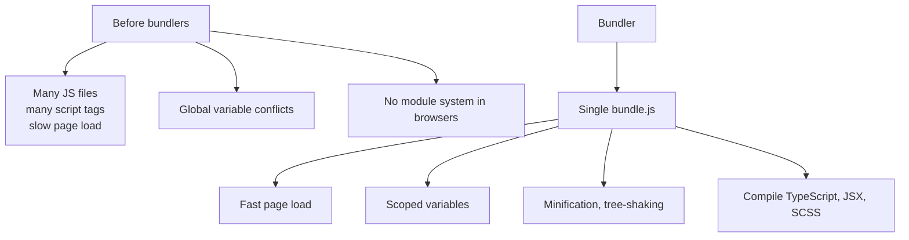
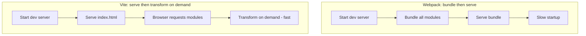

# 5. Vite and Webpack

> **Tags:** #vite #webpack #bundler #javascript #frontend

Bundlers combine your source code and dependencies into optimized files for the browser. **Webpack** is the established, configurable bundler. **Vite** is the modern, fast alternative. This note covers both.

---

## 11.5.1 Why Bundlers Exist



Bundlers solve several problems:

1. **Module system.** Allow `import`/`export` in code that runs in browsers.
2. **Performance.** Combine many files into few; minify; tree-shake unused code.
3. **Transformation.** Compile TypeScript, JSX, SCSS, etc. to browser-compatible JavaScript and CSS.
4. **Code splitting.** Split the bundle into chunks loaded on demand.
5. **Hot Module Replacement (HMR).** Update code in the browser without a full reload during development.

---

## 11.5.2 Webpack

**Webpack** is the most established bundler. It is extremely configurable but has a steep learning curve.

### A Minimal webpack.config.js

```javascript
const path = require('path');

module.exports = {
  entry: './src/index.js',
  output: {
    path: path.resolve(__dirname, 'dist'),
    filename: 'bundle.js',
  },
  module: {
    rules: [
      {
        test: /\.js$/,
        exclude: /node_modules/,
        use: 'babel-loader',
      },
      {
        test: /\.css$/,
        use: ['style-loader', 'css-loader'],
      },
      {
        test: /\.(png|jpg|gif)$/,
        type: 'asset/resource',
      },
    ],
  },
  resolve: {
    extensions: ['.js', '.jsx'],
  },
  devServer: {
    contentBase: './dist',
    hot: true,
    port: 3000,
  },
  mode: 'development', // or 'production'
};
```

### Webpack Concepts

| Concept | Meaning |
| --- | --- |
| **Entry** | The starting file(s) for the bundle. |
| **Output** | Where to write the bundle and what to name it. |
| **Loaders** | Transform non-JS files (CSS, images, TypeScript) into modules. |
| **Plugins** | Perform actions on the bundle (minification, environment variable injection). |
| **Mode** | `development` (fast, unminified) or `production` (slow, optimized). |
| **Resolve** | Configure how modules are resolved (extensions, aliases). |
| **DevServer** | Development server with HMR. |

### Webpack Strengths and Weaknesses

**Strengths:**
- Extremely configurable.
- Huge ecosystem of loaders and plugins.
- Mature and battle-tested.
- Handles complex use cases (multiple entry points, code splitting, SSR).

**Weaknesses:**
- Slow dev server startup (bundles everything before serving).
- Complex configuration.
- Configuration is XML-like JavaScript, hard to read and write.

---

## 11.5.3 Vite

**Vite** (French for "fast") is a modern build tool created by Evan You (the creator of Vue.js). It uses **esbuild** for fast dev server startup and **Rollup** for production builds.

### How Vite Is Different



Vite's dev server does not bundle your code upfront. Instead, it serves the source files directly, and the browser's native ES module support loads them. Vite transforms files on demand (TypeScript → JavaScript, JSX → JavaScript) using esbuild, which is 10-100x faster than Babel.

### Creating a Vite Project

```bash
npm create vite@latest my-app -- --template react-ts
cd my-app
npm install
npm run dev    # start dev server
npm run build  # production build (uses Rollup)
npm run preview  # preview the production build
```

### Vite Configuration

Vite needs minimal configuration. A `vite.config.ts`:

```typescript
import { defineConfig } from 'vite';
import react from '@vitejs/plugin-react';

export default defineConfig({
  plugins: [react()],
  server: {
    port: 3000,
    proxy: {
      '/api': 'http://localhost:8080',  // proxy API requests to backend
    },
  },
  build: {
    outDir: 'dist',
    sourcemap: true,
  },
});
```

### Vite Plugins

Vite has a growing plugin ecosystem:

- `@vitejs/plugin-react` — React support (JSX, Fast Refresh).
- `@vitejs/plugin-vue` — Vue support.
- `@vitejs/plugin-legacy` — Support older browsers.
- `vite-plugin-pwa` — Progressive Web App support.

---

## 11.5.4 Webpack vs Vite

| Feature | Webpack | Vite |
| --- | --- | --- |
| Dev server startup | Slow (bundles first) | Instant (serves source) |
| Dev server speed | Slower HMR | Instant HMR (esbuild) |
| Production build | Webpack | Rollup |
| Configuration | Complex | Simple |
| Ecosystem | Huge | Growing |
| Best for | Existing large projects | New projects |

**For new projects, use Vite.** It is faster, simpler, and the ecosystem has matured enough for most use cases.

**For existing Webpack projects**, migrating to Vite is worthwhile if dev server speed is a bottleneck, but it requires rewriting the configuration.

---

## 11.5.5 esbuild

**esbuild** is a Go-based JavaScript bundler that is 10-100x faster than Webpack or Rollup. It is used internally by Vite for dev transforms.

You can use esbuild directly for simple builds:

```bash
# Bundle a file
esbuild src/index.js --bundle --outfile=dist/bundle.js --minify --sourcemap

# Or via API
npx esbuild src/index.js --bundle --outfile=dist/bundle.js --format=esm --platform=browser
```

esbuild is great for library builds where you do not need the full Vite/Rollup feature set.

---

## 11.5.6 Key Bundler Concepts

### Code Splitting

Split the bundle into chunks loaded on demand:

```javascript
// Dynamic import - creates a separate chunk
const module = await import('./heavy-module.js');
```

```javascript
// React.lazy for components
const HeavyComponent = React.lazy(() => import('./HeavyComponent'));
```

Code splitting improves initial load time — the user only downloads the code they need immediately.

### Tree Shaking

Remove unused code from the bundle:

```javascript
// math.js
export function add(a, b) { return a + b; }
export function subtract(a, b) { return a - b; }

// app.js
import { add } from './math.js';  // only add is used
add(1, 2);
```

The bundler detects that `subtract` is not used and excludes it from the bundle. This requires ES module syntax (`import`/`export`), not CommonJS (`require`).

### Hot Module Replacement (HMR)

When you save a file, the browser updates just that module without a full page reload. This preserves application state and is much faster than a full reload.

Vite's HMR is near-instant because it only needs to transform the changed file, not the entire bundle.

### Source Maps

Source maps map the bundled/minified code back to the original source, enabling debugging in the browser's devtools:

```javascript
// vite.config.ts
export default defineConfig({
  build: {
    sourcemap: true,  // generate source maps
  },
});
```

Always enable source maps in development. In production, you may want to disable them (for security) or serve them only to authenticated users.

---

## 11.5.7 Key Takeaways

- Bundlers combine source + dependencies into optimized files for the browser.
- **Webpack** is established, configurable, complex; slow dev startup.
- **Vite** is modern, fast (esbuild dev, Rollup build), simple configuration.
- **esbuild** is a fast low-level bundler, used by Vite internally.
- Use Vite for new projects; migrate from Webpack if dev speed is a bottleneck.
- Key concepts: code splitting, tree shaking, HMR, source maps.

---

**Previous:** [[4. Gradle and Maven]]
**Next chapter:** [[1. README Files and Documentation]] (Chapter 12)
