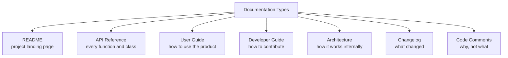
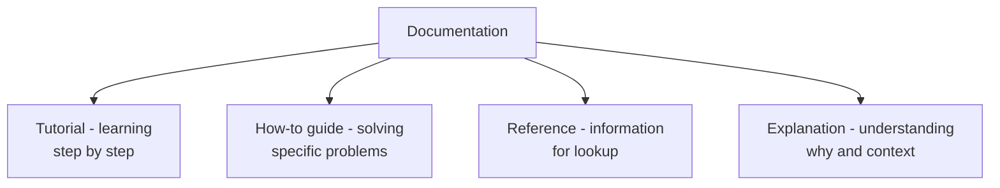

# 1. README Files and Documentation

> **Tags:** #documentation #readme #writing #communication

Documentation is how you communicate with everyone who touches your code: users, contributors, future maintainers, and your future self. Good documentation saves time; bad documentation wastes it. This note covers the types of documentation and how to write each well.

---

## 12.1 Types of Documentation



---

## 12.2 The README

The README is the most-read file in your project. On GitHub, it is rendered on the repository home page. A good README answers: **What is this? Why should I care? How do I use it?**

### README Structure

```markdown
# Project Name

> One-sentence description.

[Badges: build status, version, license]

## Features
- Feature 1
- Feature 2

## Quick Start
```bash
npm install my-package
```

## Usage
```javascript
const lib = require('my-package');
lib.doThing();
```

## Configuration
| Option | Default | Description |
| --- | --- | --- |
| `timeout` | 30000 | Request timeout in ms |

## Documentation
See [docs.example.com](https://docs.example.com) for full docs.

## Contributing
See [CONTRIBUTING.md](CONTRIBUTING.md).

## License
MIT — see [LICENSE](LICENSE).
```

### README Best Practices

- **Lead with the value.** The first sentence should tell the reader what the project does and why they should care.
- **Show, don't tell.** Include a code example in the first screenful.
- **Keep it current.** An outdated README is worse than no README — it actively misleads.
- **Link, don't duplicate.** Link to detailed docs instead of cramming everything into the README.
- **Include badges.** Build status, version, license badges give quick credibility signals.

---

## 12.3 API Reference Documentation

API reference documents every public function, class, and module. It should be **complete** (every public symbol is documented) and **consistent** (same format everywhere).

### Doc comments

Most languages have a standard format for inline API docs:

#### Python (docstrings)

```python
def calculate_discounted_price(original_price: float, discount_percent: float) -> float:
    '''Calculate the final price after applying a discount.
    
    Args:
        original_price: The original price before discount. Must be non-negative.
        discount_percent: The discount as a percentage (0-100). Must be 0-100.
    
    Returns:
        The final price after discount, rounded to 2 decimal places.
    
    Raises:
        ValueError: If original_price is negative or discount_percent is not in 0-100.
    
    Example:
        >>> calculate_discounted_price(100, 20)
        80.0
    '''
    if original_price < 0:
        raise ValueError("original_price must be non-negative")
    if not 0 <= discount_percent <= 100:
        raise ValueError("discount_percent must be 0-100")
    discount = original_price * (discount_percent / 100)
    return round(original_price - discount, 2)
```

#### JavaScript (JSDoc)

```javascript
/**
 * Calculate the final price after applying a discount.
 *
 * @param {number} originalPrice - The original price before discount. Must be non-negative.
 * @param {number} discountPercent - The discount as a percentage (0-100).
 * @returns {number} The final price after discount.
 * @throws {Error} If inputs are invalid.
 * @example
 * calculateDiscountedPrice(100, 20); // 80
 */
function calculateDiscountedPrice(originalPrice, discountPercent) {
  // ...
}
```

#### Java (Javadoc)

```java
/**
 * Calculate the final price after applying a discount.
 *
 * @param originalPrice the original price before discount; must be non-negative
 * @param discountPercent the discount as a percentage (0-100)
 * @return the final price after discount
 * @throws IllegalArgumentException if inputs are invalid
 * @see <a href="https://example.com/docs">Pricing Documentation</a>
 */
public BigDecimal calculateDiscountedPrice(BigDecimal originalPrice, BigDecimal discountPercent) {
    // ...
}
```

### API Doc Generators

| Language | Tool | Output |
| --- | --- | --- |
| Python | Sphinx, MkDocs, pdoc | HTML docs |
| JavaScript | JSDoc, TypeDoc (TypeScript) | HTML docs |
| Java | Javadoc | HTML docs |
| C# | DocFX, Sandcastle | HTML docs |
| Go | `go doc`, pkg.go.dev | HTML docs (built-in) |
| Rust | rustdoc | HTML docs (built-in) |

These tools extract doc comments from your code and generate browsable HTML documentation.

---

## 12.4 User Guides

User guides explain **how to use** the product. They are written for users, not developers.

### User Guide Structure

```markdown
# User Guide

## Getting Started
- Installation
- First run
- Basic concepts

## Tutorials
- Step-by-step walkthroughs for common tasks

## How-To Guides
- Solutions to specific problems

## Reference
- Detailed description of every feature

## Troubleshooting
- Common problems and solutions
```

### Diátaxis Framework

The [Diátaxis](https://diataxis.fr/) framework divides documentation into four types:



| Type | Purpose | Orientation | Example |
| --- | --- | --- | --- |
| **Tutorial** | Learning by doing | Practical, beginner | "Build your first web app with Django" |
| **How-to guide** | Solving a specific problem | Practical, experienced | "How to deploy Django to production" |
| **Reference** | Looking up details | Theoretical, any level | "Django ORM field reference" |
| **Explanation** | Understanding concepts | Theoretical, any level | "Why Django uses ORM instead of SQL" |

Each type has a different writing style and audience. Mixing them (e.g., putting a tutorial in the reference) confuses readers.

---

## 12.5 Developer / Contribution Guides

A `CONTRIBUTING.md` file tells contributors how to get involved:

```markdown
# Contributing

## Getting Started
1. Fork the repository
2. Clone your fork: `git clone https://github.com/YOU/repo.git`
3. Install dependencies: `npm install`
4. Run tests: `npm test`

## Development Workflow
1. Create a branch: `git switch -c feature/my-feature`
2. Make changes and commit (see Commit Style below)
3. Push: `git push -u origin feature/my-feature`
4. Open a pull request

## Code Style
- Run `npm run lint` before committing
- Follow the existing code style
- Add tests for new features

## Commit Style
Use Conventional Commits:
- `feat: add login form`
- `fix: correct redirect after login`
- `docs: update README`

## Pull Request Guidelines
- Keep PRs small (under 500 lines)
- Write a clear description (what, why, how)
- Link to the issue
- Ensure CI passes

## Reporting Bugs
Open an issue with:
- Steps to reproduce
- Expected vs actual behavior
- Environment (OS, version, etc.)
```

---

## 12.6 Architecture Decision Records (ADRs)

An **ADR** is a short document that captures a significant architectural decision: the context, the decision, and the consequences.

```markdown
# ADR-001: Use PostgreSQL for the primary database

## Status
Accepted (2024-06-25)

## Context
We need a relational database for the e-commerce platform. Requirements:
- ACID transactions
- JSON support (for flexible product attributes)
- Full-text search
- Strong community support

Options considered: PostgreSQL, MySQL, SQLite, MongoDB.

## Decision
Use PostgreSQL 16.

## Consequences
- Positive: mature, ACID-compliant, excellent JSON support, strong ecosystem
- Negative: more complex to operate than SQLite
- Migration: if we change later, data migration is non-trivial
```

ADRs are stored in a `docs/adr/` directory, numbered sequentially. They create a historical record of **why** the architecture is the way it is.

---

## 12.7 Changelogs

A changelog records what changed in each release. See [[22. Tags and Release Management]] in Chapter 1 for the format.

```markdown
# Changelog

## [1.2.0] - 2024-06-25
### Added
- OAuth login support
- Dark mode

### Changed
- Improved search performance by 3x

### Fixed
- Crash on empty cart
- Login redirect loop

### Deprecated
- `oldLoginMethod()` — will be removed in 2.0

## [1.1.0] - 2024-05-10
### Added
- User profiles
```

Use tools like `conventional-changelog` or `changesets` to auto-generate changelogs from commit messages.

---

## 12.8 Code Comments

Code comments are the most intimate form of documentation — they live next to the code they describe.

### When to Comment

- **Why, not what.** The code shows what; the comment explains why.
- **Non-obvious decisions.** "We use a ring buffer here because the queue size is bounded and we need O(1) operations."
- **Workarounds.** "This is a workaround for bug #1234 in library X. Remove when v2.0 is released."
- **TODOs with context.** "TODO: add rate limiting. See issue #456."
- **Complex algorithms.** "This implements Dijkstra's shortest path algorithm."

### When NOT to Comment

- **Restating the code.** `i++; // increment i` — useless.
- **Outdated comments.** Comments that contradict the code are worse than no comments.
- **Commented-out code.** Delete it; Git remembers.
- **Mandated comments.** "Every function must have a docstring" produces boilerplate.

---

## 12.9 Documentation as Code

Treat documentation like code:

- **Version control.** Store docs in the same repository as the code.
- **Review.** Review doc changes in PRs, just like code.
- **Test.** Verify code examples in docs actually run (tools like `doctest`, `markdown-code-blocks`).
- **Automate.** Generate API docs from code; generate changelogs from commits.
- **Deploy.** Auto-deploy docs on every merge (GitHub Pages, Netlify, Read the Docs).

---

## 12.10 Key Takeaways

- Documentation types: README, API reference, user guide, developer guide, architecture, changelog, code comments.
- README: lead with value, show code examples, keep it current.
- API docs: use doc comments (docstrings, JSDoc, Javadoc); auto-generate with tools.
- User guides: use the Diátaxis framework (tutorial, how-to, reference, explanation).
- CONTRIBUTING.md: how to fork, branch, test, commit, and open PRs.
- ADRs: record architectural decisions with context and consequences.
- Changelogs: record what changed in each release.
- Code comments: explain why, not what; delete commented-out code.
- Treat docs as code: version control, review, test, automate, deploy.

---

**Next:** [[2. API Documentation]]
