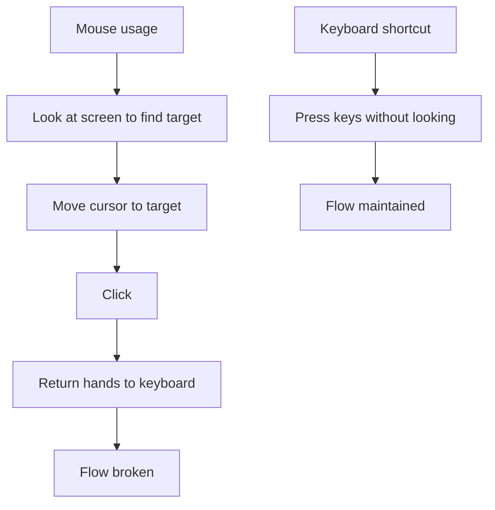
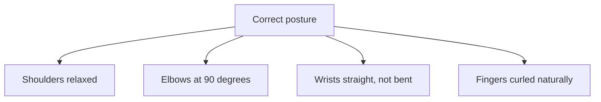

# 1. Keyboard Shortcuts and Ergonomics

> **Tags:** #productivity #shortcuts #ergonomics #workflow

The single biggest productivity boost for any developer is mastering the keyboard. Every time you reach for the mouse, you lose a second and break flow. This note covers the shortcuts and ergonomic practices that compound into huge time savings.

---

## 13.1 Why Keyboard Matters

A mouse trip takes 2-5 seconds. A keyboard shortcut takes 0.2 seconds. Over a day (100+ trips), that is 5-8 minutes saved — and more importantly, your flow is never broken.

---

## 13.2 Universal Shortcuts (Most Operating Systems and Editors)

| Shortcut | Action |
| --- | --- |
| `Ctrl+C` / `Cmd+C` | Copy |
| `Ctrl+V` / `Cmd+V` | Paste |
| `Ctrl+X` / `Cmd+X` | Cut |
| `Ctrl+Z` / `Cmd+Z` | Undo |
| `Ctrl+Y` / `Cmd+Shift+Z` | Redo |
| `Ctrl+S` / `Cmd+S` | Save |
| `Ctrl+A` / `Cmd+A` | Select all |
| `Ctrl+F` / `Cmd+F` | Find |
| `Ctrl+H` / `Cmd+H` | Find and replace |
| `Ctrl+P` / `Cmd+P` | Print (OS) / Quick Open (editor) |
| `Ctrl+Tab` / `Cmd+Tab` | Switch windows / apps |
| `Alt+Tab` / `Cmd+~` | Switch within app |
| `Ctrl+W` / `Cmd+W` | Close tab |
| `Ctrl+T` / `Cmd+T` | New tab (browser) |
| `Ctrl+N` / `Cmd+N` | New window |
| `Ctrl+Shift+T` / `Cmd+Shift+T` | Reopen closed tab (browser) |

---

## 13.3 Editor Shortcuts (VS Code, JetBrains, Sublime)

### Navigation

| Shortcut (VS Code / JetBrains) | Action |
| --- | --- |
| `Ctrl+P` / `Ctrl+Shift+N` | Quick Open file |
| `Ctrl+Shift+P` / `Ctrl+Shift+A` | Command palette / Find action |
| `F12` / `Ctrl+B` | Go to definition |
| `Shift+F12` / `Alt+F7` | Find all references |
| `Alt+F12` / `Ctrl+Shift+I` | Peek definition |
| `Ctrl+Shift+O` / `Ctrl+F12` | Go to symbol in file |
| `Ctrl+T` / `Ctrl+N` | Go to symbol in workspace |
| `Ctrl+G` / `Ctrl+G` | Go to line |
| `Ctrl+-` / `Ctrl+Alt+Left` | Navigate back |
| `Ctrl+Shift+-` / `Ctrl+Alt+Right` | Navigate forward |
| `Ctrl+Tab` / `Ctrl+Tab` | Switch tabs |
| `Ctrl+E` / `Ctrl+E` | Recent files |

### Editing

| Shortcut | Action |
| --- | --- |
| `Ctrl+D` / `Ctrl+D` | Select next occurrence |
| `Ctrl+Shift+L` / `Ctrl+Shift+Alt+J` | Select all occurrences |
| `Alt+Up/Down` / `Alt+Shift+Up/Down` | Move line up/down |
| `Shift+Alt+Down` / `Ctrl+D` | Duplicate line |
| `Ctrl+Shift+K` / `Ctrl+Y` | Delete line |
| `Ctrl+/` / `Ctrl+/` | Toggle comment |
| `Ctrl+]` / `Tab` | Indent |
| `Ctrl+[` / `Shift+Tab` | Outdent |
| `Ctrl+Space` / `Ctrl+Space` | Trigger completion |
| `F2` / `Shift+F6` | Rename symbol |
| `Ctrl+.` / `Alt+Enter` | Quick fix |

### Multi-cursor

| Shortcut | Action |
| --- | --- |
| `Alt+Click` | Add cursor at click |
| `Ctrl+Alt+Down/Up` | Add cursor below/above |
| `Ctrl+D` | Add cursor at next occurrence |
| `Ctrl+Shift+L` | Add cursor at all occurrences |
| `Ctrl+U` | Undo cursor |

### Search

| Shortcut | Action |
| --- | --- |
| `Ctrl+F` | Find in file |
| `Ctrl+H` | Replace in file |
| `Ctrl+Shift+F` / `Ctrl+Shift+F` | Find in project |
| `Ctrl+Shift+H` / `Ctrl+Shift+R` | Replace in project |

---

## 13.4 OS-Level Shortcuts

### Window Management

| OS | Shortcut | Action |
| --- | --- | --- |
| Windows | `Win+Left/Right` | Snap window to half |
| Windows | `Win+Up/Down` | Maximize / minimize |
| Windows | `Win+D` | Show desktop |
| Windows | `Win+Tab` | Task view |
| macOS | `Cmd+Option+Left/Right` | Move window to next display |
| macOS | `Cmd+M` | Minimize |
| macOS | `Cmd+H` | Hide |
| Linux (GNOME) | `Super+Left/Right` | Snap window |
| Linux (GNOME) | `Super+Up` | Maximize |

Consider a window management tool for more control:

- **Windows**: FancyZones (PowerToys), DisplayFusion.
- **macOS**: Rectangle, Magnet, Moom.
- **Linux**: built-in tiling window managers (i3, sway, bspwm).

---

## 13.5 The Command Palette Pattern

Most modern editors have a "command palette" — a searchable list of every command. This is the most important shortcut to learn:

| Editor | Shortcut |
| --- | --- |
| VS Code | `Ctrl+Shift+P` |
| JetBrains | `Ctrl+Shift+A` (Find Action) |
| Sublime Text | `Ctrl+Shift+P` |
| Vim/Neovim | `:` (command mode) |

If you do not know the shortcut for something, open the command palette, type what you want, and the shortcut is shown next to it. Over time, you memorize the ones you use often.

---

## 13.6 Terminal Shortcuts

| Shortcut | Action |
| --- | --- |
| `Ctrl+A` | Move to start of line |
| `Ctrl+E` | Move to end of line |
| `Ctrl+W` | Delete word before cursor |
| `Ctrl+U` | Delete to start of line |
| `Ctrl+K` | Delete to end of line |
| `Ctrl+Y` | Paste deleted text |
| `Ctrl+R` | Reverse search history |
| `Ctrl+L` | Clear screen |
| `Ctrl+C` | Cancel command |
| `Ctrl+D` | Exit (EOF) |
| `Tab` | Autocomplete |
| `Up/Down` | Navigate history |

`Ctrl+R` (reverse search) is the most underused terminal shortcut. Instead of pressing Up 20 times to find a command, press `Ctrl+R` and type part of the command.

---

## 13.7 Ergonomics

Productivity is not just about speed; it is about sustainability. Repetitive strain injury (RSI) ends careers. Take ergonomics seriously.

### Keyboard Position

- **Keyboard at elbow height.** Your forearms should be parallel to the floor.
- **Wrists straight.** Do not bend them up or down. Use a wrist rest if needed.
- **Shoulders relaxed.** Do not hunch.
- **Feet flat on the floor.** Use a footrest if your chair is too high.

### Mouse / Trackpad

- Use a **vertical mouse** or **trackball** to reduce wrist pronation.
- Learn to navigate without the mouse (keyboard shortcuts).
- Consider a split keyboard (Kinesis, ErgoDox, Moonlander) for serious typists.

### Monitor

- **Top of screen at eye level.** You should look slightly down at the center.
- **Arm's length away.** About 50-70cm.
- **Reduce glare.** Position perpendicular to windows if possible.

### Breaks

- **20-20-20 rule.** Every 20 minutes, look at something 20 feet away for 20 seconds.
- **Take a 5-minute break every hour.** Stand, stretch, walk.
- **Use a break reminder.** Tools like Workrave, Stretchly, or your watch.

### Standing Desks

Alternate between sitting and standing. Standing all day is as bad as sitting all day. Aim for a mix: 1 hour sitting, 30 minutes standing, repeat.

---

## 13.8 Common Productivity Killers

- **Reaching for the mouse.** Learn the keyboard shortcut.
- **Hunting through menus.** Use the command palette.
- **Switching windows with the mouse.** Use `Alt+Tab` / `Cmd+Tab`.
- **Typing the same thing repeatedly.** Use snippets.
- **Not using autocomplete.** Press `Ctrl+Space` aggressively.
- **Poor posture.** It catches up with you. Fix it now.
- **No breaks.** Flow is good; exhaustion is not. Take breaks.

---

## 13.9 Building Muscle Memory

You cannot learn all shortcuts at once. Build muscle memory gradually:

1. **Pick one shortcut per day.** Today, use `Ctrl+D` (select next occurrence) every chance you get.
2. **Use it deliberately.** Even when the mouse would be faster in the short term.
3. **After a week, it is automatic.** Pick the next one.
4. **Track your progress.** Keep a list of shortcuts you have learned.

After a few months, you will navigate your editor at the speed of thought.

---

## 13.10 Key Takeaways

- Keyboard shortcuts are the single biggest productivity boost.
- Master the command palette (`Ctrl+Shift+P` in VS Code) — it finds any command.
- Learn navigation (F12, Shift+F12, Ctrl+P), editing (Ctrl+D, multi-cursor), and search (Ctrl+Shift+F).
- Terminal: `Ctrl+R` (reverse search), `Ctrl+A/E` (line start/end), `Ctrl+W` (delete word).
- Ergonomics matter: correct posture, take breaks, use a good keyboard and mouse.
- Build muscle memory one shortcut at a time.

---

**Next:** [[2. Shell Scripting and Automation]]
