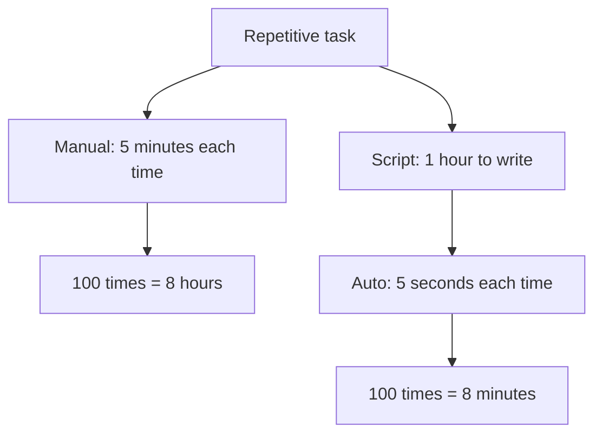

# 2. Shell Scripting and Automation

> **Tags:** #shell #bash #automation #scripting #productivity

Shell scripting is the developer's Swiss Army knife. Any repetitive task — renaming files, running tests, deploying code — can be automated with a shell script. This note covers the fundamentals of Bash scripting for automation.

---

## 13.2.1 Why Shell Scripting?



If you do a task more than 3 times, automate it. The time invested in writing the script pays off quickly.

---

## 13.2.2 Shell Basics

### The Shebang

Every script starts with a **shebang** — the path to the interpreter:

```bash
#!/bin/bash         # use bash
#!/usr/bin/env bash # more portable
#!/usr/bin/env python3  # Python script
#!/usr/bin/env node     # Node.js script
```

The shebang tells the OS which interpreter to use. `#!/usr/bin/env bash` is more portable than `#!/bin/bash` because it finds `bash` wherever it is installed.

### Making a Script Executable

```bash
chmod +x myscript.sh
./myscript.sh
```

### Variables

```bash
#!/bin/bash

# Variable assignment (no spaces around =)
NAME="Alice"
AGE=30

# Use with $ prefix
echo "Hello, $NAME. You are $AGE years old."

# Command substitution
CURRENT_DIR=$(pwd)
echo "You are in $CURRENT_DIR"

# Or with backticks (older, less readable)
CURRENT_DIR=`pwd`
```

### Arguments

```bash
#!/bin/bash
# Arguments: $0 (script name), $1, $2, ... (positional), $# (count), $@ (all)

echo "Script name: $0"
echo "First argument: $1"
echo "Second argument: $2"
echo "Number of arguments: $#"
echo "All arguments: $@"

# Run: ./script.sh foo bar baz
# Output:
# Script name: ./script.sh
# First argument: foo
# Second argument: bar
# Number of arguments: 3
# All arguments: foo bar baz
```

---

## 13.2.3 Control Flow

### Conditionals

```bash
#!/bin/bash

if [ -f "/etc/hosts" ]; then
    echo "File exists"
elif [ -d "/etc" ]; then
    echo "Directory exists"
else
    echo "Neither"
fi

# String comparison
if [ "$1" = "help" ]; then
    echo "Usage: $0 [help|version]"
fi

# Numeric comparison
if [ "$AGE" -ge 18 ]; then
    echo "Adult"
fi

# Test operators
# -f: file exists    -d: directory exists
# -e: exists         -r: readable
# -w: writable       -x: executable
# -z: string empty   -n: string not empty
# =: string equal    !=: string not equal
# -eq: num equal     -ne: num not equal
# -lt: less than     -gt: greater than
# -le: less/equal    -ge: greater/equal
```

### Loops

```bash
#!/bin/bash

# For loop over a list
for file in *.txt; do
    echo "Processing $file"
done

# For loop over a range
for i in {1..5}; do
    echo "Iteration $i"
done

# C-style for loop
for ((i=0; i<10; i++)); do
    echo "Number $i"
done

# While loop
count=0
while [ $count -lt 5 ]; do
    echo "Count: $count"
    ((count++))
done

# While reading lines
while IFS= read -r line; do
    echo "Line: $line"
done < input.txt
```

### Case

```bash
#!/bin/bash

case "$1" in
    start)
        echo "Starting..."
        ;;
    stop)
        echo "Stopping..."
        ;;
    restart)
        echo "Restarting..."
        ;;
    *)
        echo "Usage: $0 {start|stop|restart}"
        exit 1
        ;;
esac
```

---

## 13.2.4 Functions

```bash
#!/bin/bash

# Define a function
greet() {
    local name=$1
    echo "Hello, $name!"
}

# Call it
greet "Alice"
greet "Bob"

# Function with return value (via echo)
calculate_total() {
    local sum=0
    for num in "$@"; do
        ((sum += num))
    done
    echo $sum
}

# Capture return value
total=$(calculate_total 1 2 3 4 5)
echo "Total: $total"  # 15
```

---

## 13.2.5 Common Automation Tasks

### Batch File Renaming

```bash
#!/bin/bash
# Rename all .txt files to .md

for file in *.txt; do
    new_name="${file%.txt}.md"
    mv "$file" "$new_name"
    echo "Renamed: $file -> $new_name"
done
```

### Running Tests on File Change

```bash
#!/bin/bash
# Run tests whenever a .py file changes (using inotifywait)

while inotifywait -r -e modify --include '.*\.py$' .; do
    pytest
done
```

Or use `entr`:
```bash
ls *.py | entr pytest
```

### Project Setup Script

```bash
#!/bin/bash
# setup.sh - set up the development environment

set -e  # exit on error

echo "Installing dependencies..."
npm install

echo "Setting up environment..."
cp .env.example .env

echo "Running migrations..."
npm run migrate

echo "Setup complete!"
```

### Deployment Script

```bash
#!/bin/bash
# deploy.sh - deploy to production

set -e

BRANCH=${1:-main}
SERVER="user@production-server"

echo "Deploying branch $BRANCH to production..."

# Build
npm run build

# Sync files
rsync -avz --delete dist/ $SERVER:/var/www/app/

# Restart service
ssh $SERVER "sudo systemctl restart app"

echo "Deployment complete!"
```

---

## 13.2.6 Error Handling

```bash
#!/bin/bash

# Exit on error
set -e

# Treat unset variables as errors
set -u

# Fail on any command in a pipe
set -o pipefail

# Or all at once
set -euo pipefail

# Trap errors
trap 'echo "Error on line $LINENO"' ERR

# Custom error handling
if ! cd /nonexistent; then
    echo "Failed to change directory" >&2
    exit 1
fi
```

`set -euo pipefail` is the recommended starting point for robust scripts. It catches errors early instead of silently continuing.

---

## 13.2.7 Makefiles as Task Runners

Even if you are not building C code, a `Makefile` is a convenient task runner:

```makefile
.PHONY: install test lint run deploy

install:
        pip install -r requirements.txt

test:
        pytest

lint:
        ruff check .
        ruff format --check .

run:
        uvicorn app.main:app --reload

deploy:
        ./scripts/deploy.sh
```

Run: `make test`, `make deploy`, etc. Makefiles are universally understood and require no extra tooling.

### Alternatives

- **just** — a modern task runner with a syntax similar to Make.
- **Taskfile** — YAML-based task runner (Go).
- **npm scripts** — if you already have `package.json`.

---

## 13.2.8 Script Best Practices

1. **Start with `set -euo pipefail`.** Catch errors early.
2. **Use `#!/usr/bin/env bash`.** Portable shebang.
3. **Quote variables.** `"$VAR"` not `$VAR` — handles spaces in paths.
4. **Use `local` in functions.** Avoid polluting the global namespace.
5. **Check arguments.** Print usage if required arguments are missing.
6. **Use `trap` for cleanup.** Clean up temp files even on error.
7. **Log to stderr.** Reserve stdout for actual output.
8. **Exit codes.** `0` = success, non-zero = failure.
9. **Document with comments.** Especially non-obvious parts.
10. **Test.** Run the script in a safe environment before production.

---

## 13.2.9 Key Takeaways

- Shell scripting automates repetitive tasks — if you do it 3+ times, script it.
- Start scripts with `#!/usr/bin/env bash` and `set -euo pipefail`.
- Variables: `NAME=value`, use with `$NAME`, quote with `"$NAME"`.
- Control flow: `if/elif/else`, `for`, `while`, `case`.
- Functions: define with `name() { ... }`, call with `name args`.
- Use Makefiles (or `just`) as task runners for project commands.
- Best practices: quote variables, use `local`, check arguments, trap errors, log to stderr.

---

**Previous:** [[1. Keyboard Shortcuts and Ergonomics]]
**Next:** [[3. Tmux and Terminal Multiplexers]]
