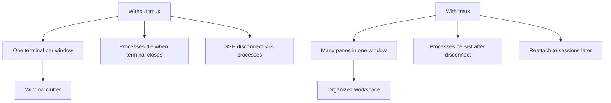
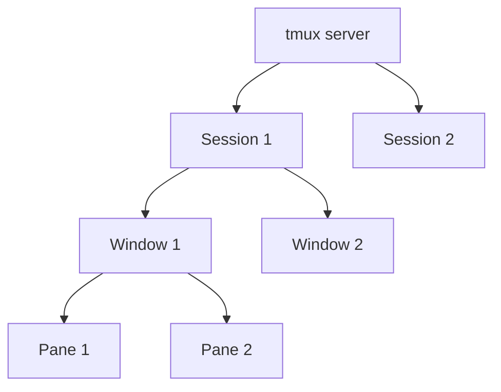
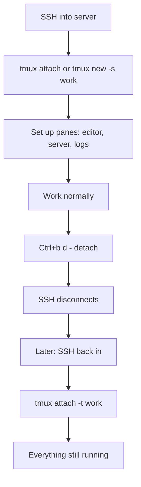

# 3. Tmux and Terminal Multiplexers

> **Tags:** #tmux #terminal #productivity #workflow

A **terminal multiplexer** lets you run multiple terminal sessions in one window, detach and reattach to them, and keep them running in the background. **Tmux** is the most popular terminal multiplexer. This note covers its essential features.

---

## 13.3.1 Why Use a Terminal Multiplexer?



Tmux solves three problems:

1. **Window clutter.** Run multiple terminals in one window, organized into panes.
2. **Process persistence.** Start a long-running process, detach, and it keeps running. Reattach later to check on it.
3. **SSH session survival.** If your SSH connection drops, the tmux session (and all processes in it) keep running on the server. Reconnect and reattach.

---

## 13.3.2 Core Concepts



| Concept | Meaning |
| --- | --- |
| **Server** | The tmux process that manages sessions. |
| **Session** | A named workspace. You can have multiple sessions. |
| **Window** | A "tab" within a session. Each session has one or more windows. |
| **Pane** | A split within a window. Each window has one or more panes. |

---

## 13.3.3 Starting and Stopping

```bash
# Start a new session
tmux
tmux new -s mysession    # named session

# List sessions
tmux ls

# Attach to an existing session
tmux attach
tmux attach -t mysession  # by name

# Detach from a session (inside tmux)
Ctrl+b d

# Kill a session
tmux kill-session -t mysession

# Kill the server (kills all sessions)
tmux kill-server
```

---

## 13.3.4 The Prefix Key

Tmux commands start with a **prefix key**: `Ctrl+b` by default. You press the prefix, release, then press the next key.

```text
Press: Ctrl+b (release) then d
```

To change the prefix (many people change it to `Ctrl+a`):

```bash
# ~/.tmux.conf
set -g prefix C-a
unbind C-b
bind C-a send-prefix
```

---

## 13.3.5 Essential Commands

All commands start with the prefix (`Ctrl+b` by default).

### Session Management

| Command | Action |
| --- | --- |
| `prefix d` | Detach from session |
| `prefix s` | List sessions (switch between them) |
| `prefix $` | Rename current session |
| `prefix (` | Previous session |
| `prefix )` | Next session |

### Window Management

| Command | Action |
| --- | --- |
| `prefix c` | Create new window |
| `prefix ,` | Rename current window |
| `prefix n` | Next window |
| `prefix p` | Previous window |
| `prefix 0-9` | Go to window by number |
| `prefix w` | List windows |
| `prefix &` | Close current window |
| `prefix f` | Find window by name |

### Pane Management

| Command | Action |
| --- | --- |
| `prefix %` | Split vertically (left/right) |
| `prefix "` | Split horizontally (top/bottom) |
| `prefix ←↑↓→` | Navigate between panes |
| `prefix o` | Cycle to next pane |
| `prefix z` | Zoom (toggle full-screen for current pane) |
| `prefix x` | Close current pane |
| `prefix {` | Swap pane with previous |
| `prefix }` | Swap pane with next |
| `prefix Space` | Cycle through pane layouts |
| `prefix Ctrl+←/→` | Resize pane left/right |
| `prefix Ctrl+↑/↓` | Resize pane up/down |

### Copy Mode

| Command | Action |
| --- | --- |
| `prefix [` | Enter copy mode (scroll, search, copy) |
| `Space` | Start selection (in copy mode) |
| `Enter` | Copy selection |
| `prefix ]` | Paste |
| `/` | Search forward (in copy mode) |
| `?` | Search backward (in copy mode) |
| `q` | Quit copy mode |

---

## 13.3.6 A Typical Workflow



1. SSH into a server.
2. `tmux new -s work` — create a named session.
3. Set up your workspace: one pane for the editor, one for the dev server, one for logs.
4. Work normally.
5. When you need to leave, `Ctrl+b d` to detach.
6. Later, SSH back in and `tmux attach -t work` — everything is still running.

---

## 13.3.7 Configuration (~/.tmux.conf)

A minimal but useful `~/.tmux.conf`:

```bash
# Change prefix to Ctrl+a
set -g prefix C-a
unbind C-b
bind C-a send-prefix

# Enable mouse support (scroll, resize panes, select)
set -g mouse on

# Start window numbering at 1
set -g base-index 1
set -g pane-base-index 1

# Renumber windows when one is closed
set -g renumber-windows on

# Increase scrollback history
set -g history-limit 50000

# Faster escape (for vim)
set -g escape-time 0

# Better terminal colors
set -g default-terminal "screen-256color"

# Split panes with | and - (more intuitive)
bind | split-window -h
bind - split-window -v

# Reload config with prefix r
bind r source-file ~/.tmux.conf \; display "Config reloaded"

# Vi-style pane navigation
bind h select-pane -L
bind j select-pane -D
bind k select-pane -U
bind l select-pane -R
```

---

## 13.3.8 Tmux Plugins

Use **TPM** (Tmux Plugin Manager) to install plugins:

```bash
# Install TPM
git clone https://github.com/tmux-plugins/tpm ~/.tmux/plugins/tpm

# Add to ~/.tmux.conf
set -g @plugin 'tmux-plugins/tpm'
set -g @plugin 'tmux-plugins/tmux-sensible'    # sensible defaults
set -g @plugin 'tmux-plugins/tmux-resurrect'   # save/restore sessions
set -g @plugin 'tmux-plugins/tmux-continuum'   # auto-save sessions

# Initialize TPM (keep at the bottom)
run '~/.tmux/plugins/tpm/tpm'
```

Notable plugins:

- **tmux-sensible**: sensible default settings.
- **tmux-resurrect**: save and restore tmux sessions across reboots.
- **tmux-continuum**: automatic saving and restoration.
- **tmux-yank**: better copy/paste integration with the system clipboard.

---

## 13.3.9 Alternatives to Tmux

| Tool | Notes |
| --- | --- |
| **GNU Screen** | Older, less feature-rich than tmux |
| **Zellij** | Modern, Rust-based, user-friendly |
| **Byobu** | Wrapper around tmux with sensible defaults |

For new users, **Zellij** is worth trying — it has a built-in help bar and is easier to learn.

---

## 13.3.10 Common Mistakes

- **Not learning the prefix key.** Every tmux command starts with it. Burn it into muscle memory.
- **Too many panes.** More than 4 panes in a window becomes hard to read. Use multiple windows instead.
- **Not naming sessions.** `tmux attach` to the wrong session is confusing. Name them: `tmux new -s work`.
- **Not using copy mode.** Scrolling with the mouse works but copy mode (`prefix [`) gives you search and precise selection.
- **Forgetting to detach.** If you close the terminal without detaching, the session persists, but it is cleaner to detach explicitly.
- **Not configuring tmux.** The defaults are suboptimal. Spend 10 minutes on `~/.tmux.conf`.

---

## 13.3.11 Key Takeaways

- Tmux is a terminal multiplexer: multiple panes in one window, sessions persist after disconnect.
- Core concepts: server → session → window → pane.
- Prefix key is `Ctrl+b` (or `Ctrl+a` if reconfigured).
- Essential commands: `prefix c` (new window), `prefix %` / `prefix "` (split), `prefix d` (detach), `prefix s` (list sessions).
- Configure `~/.tmux.conf` for mouse support, intuitive splits, and vi navigation.
- Use plugins (tmux-resurrect, tmux-continuum) for session persistence.
- Essential for SSH workflows — processes survive disconnects.

---

**Previous:** [[2. Shell Scripting and Automation]]
**Next:** [[4. Dotfiles and Environment Setup]]
