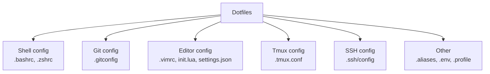

# 4. Dotfiles and Environment Setup

> **Tags:** #dotfiles #environment #setup #productivity #configuration

**Dotfiles** are configuration files (often starting with a dot, hence the name) that customize your development environment: shell config, editor config, Git config, and more. Managing dotfiles in version control lets you replicate your environment on any machine in minutes.

---

## 13.4.1 What Are Dotfiles?



These files live in your home directory (`~`). They customize how your tools behave. Without them, every machine feels different; with them, every machine feels like home.

---

## 13.4.2 Why Manage Dotfiles?

1. **Reproducibility.** Set up a new machine in minutes, not hours.
2. **Version control.** Track changes to your config; revert if something breaks.
3. **Sharing.** Share your config across machines (work, personal, server).
4. **Backup.** If your machine dies, your config is safe on GitHub.
5. **Learning.** Browse others' dotfiles to discover new tools and tricks.

---

## 13.4.3 The Dotfiles Repository Pattern

There are several patterns for managing dotfiles. The most popular:

### 1. The Symlink Farm (with a script)

Store your dotfiles in a directory (e.g., `~/dotfiles/`), and create symlinks from your home directory to the files in the repo.

```text
~/dotfiles/
  .bashrc
  .gitconfig
  .tmux.conf
  .vimrc
  install.sh

~/
  .bashrc -> ~/dotfiles/.bashrc
  .gitconfig -> ~/dotfiles/.gitconfig
  .tmux.conf -> ~/dotfiles/.tmux.conf
  .vimrc -> ~/dotfiles/.vimrc
```

The `install.sh` script creates the symlinks:

```bash
#!/bin/bash
# install.sh - create symlinks for dotfiles

DOTFILES_DIR="$(cd "$(dirname "${BASH_SOURCE[0]}")" && pwd)"

files=(".bashrc" ".gitconfig" ".tmux.conf" ".vimrc" ".zshrc")

for file in "${files[@]}"; do
    target="$HOME/$file"
    source="$DOTFILES_DIR/$file"
    
    # Backup existing file
    if [ -f "$target" ] && [ ! -L "$target" ]; then
        mv "$target" "$target.backup"
        echo "Backed up existing $file to $file.backup"
    fi
    
    # Create symlink
    ln -sf "$source" "$target"
    echo "Linked $file -> $source"
done
```

### 2. The Bare Repository

Use a bare Git repository in your home directory. This avoids symlinks entirely.

```bash
# Set up
git init --bare $HOME/.cfg
alias config='/usr/bin/git --git-dir=$HOME/.cfg/ --work-tree=$HOME'
config config --local status.showUntrackedFiles no

# Add to .bashrc or .zshrc
alias config='/usr/bin/git --git-dir=$HOME/.cfg/ --work-tree=$HOME'

# Usage
config status
config add .vimrc
config commit -m "Add vimrc"
config push
```

Now you use `config` instead of `git` to manage files directly in your home directory.

### 3. Dotfile Managers

Tools like **GNU Stow**, **chezmoi**, and **yadm** automate dotfile management:

- **GNU Stow**: symlink farm manager.
- **chezmoi**: dotfile manager with templating and secrets.
- **yadm**: Yet Another Dotfiles Manager (Git-based).

```bash
# chezmoi
chezmoi init
chezmoi add ~/.vimrc
chezmoi edit ~/.vimrc
chezmoi apply
```

---

## 13.4.4 Essential Dotfiles

### .bashrc / .zshrc

```bash
# ~/.bashrc or ~/.zshrc

# Aliases
alias ll='ls -la'
alias gs='git status'
alias gd='git diff'
alias gc='git commit'
alias gp='git push'
alias gl='git pull'
alias ..='cd ..'
alias ...='cd ../..'

# History settings
export HISTSIZE=10000
export HISTFILESIZE=20000
export HISTCONTROL=ignoredups:erasedups

# Editor
export EDITOR=vim
export VISUAL=vim

# PATH additions
export PATH="$HOME/bin:$HOME/.local/bin:$PATH"

# Prompt (simple)
PS1='\u@\h:\w\$ '

# Load machine-specific config
if [ -f ~/.bashrc.local ]; then
    source ~/.bashrc.local
fi
```

### .gitconfig

```ini
# ~/.gitconfig

[user]
    name = Your Name
    email = you@example.com

[init]
    defaultBranch = main

[core]
    editor = vim
    excludesfile = ~/.gitignore_global

[pull]
    rebase = false

[push]
    default = current
    followTags = true

[alias]
    co = checkout
    br = branch
    ci = commit
    st = status
    unstage = reset HEAD --
    last = log -1 HEAD
    visual = log --oneline --graph --all --decorate

[color]
    ui = auto

[diff]
    tool = vscode

[difftool "vscode"]
    cmd = code --wait --diff $LOCAL $REMOTE

[merge]
    tool = vscode

[mergetool "vscode"]
    cmd = code --wait $MERGED
```

### .tmux.conf

See [[3. Tmux and Terminal Multiplexers]] for a full example.

### .vimrc / init.lua

See [[1. Introduction to Vim]] in Chapter 3 for a minimal Vim config.

### .ssh/config

```text
# ~/.ssh/config

Host github.com
    HostName github.com
    User git
    IdentityFile ~/.ssh/id_ed25519

Host work
    HostName work-server.example.com
    User myuser
    IdentityFile ~/.ssh/id_work

Host *
    ServerAliveInterval 60
    ServerAliveCountMax 3
```

---

## 13.4.5 Machine-Specific Configuration

Not every machine should have the same config. For example, your work email differs from your personal email. Handle this with:

### Conditional logic in dotfiles

```bash
# ~/.bashrc
if [ "$(hostname)" = "work-laptop" ]; then
    export GIT_AUTHOR_EMAIL="work@company.com"
else
    export GIT_AUTHOR_EMAIL="personal@example.com"
fi
```

### Include files

```ini
# ~/.gitconfig
[include]
    path = ~/.gitconfig.local  # machine-specific, not in version control
```

```ini
# ~/.gitconfig.local (not in version control)
[user]
    email = work@company.com
```

### Templating (chezmoi)

Chezmoi supports templating for machine-specific values:

```bash
# ~/.local/share/chezmoi/gitconfig.tmpl
[user]
    name = {{ .name }}
    email = {{ .email }}
```

Chezmoi fills in `{{ .name }}` and `{{ .email }}` from its config, which can differ per machine.

---

## 13.4.6 Secrets in Dotfiles

**Never commit secrets** (API keys, passwords, tokens) to your dotfiles repo. Even private repos get leaked.

For secrets:

1. **Use a separate file** that is git-ignored (e.g., `~/.secrets`).
2. **Source it** from your shell config: `[ -f ~/.secrets ] && source ~/.secrets`.
3. **Use a password manager** (1Password, Bitwarden, pass) for actual secrets.
4. **Use environment variables** loaded from a `.env` file (git-ignored).

---

## 13.4.7 Setting Up a New Machine

With dotfiles in version control, setting up a new machine is:

```bash
# 1. Install essential tools (git, vim, tmux)
sudo apt install git vim tmux

# 2. Clone dotfiles
git clone https://github.com/you/dotfiles.git ~/dotfiles
cd ~/dotfiles

# 3. Run the install script
./install.sh

# 4. Install a package manager (nvm, pyenv, etc.)
curl -o- https://raw.githubusercontent.com/nvm-sh/nvm/v0.39.7/install.sh | bash

# 5. Install languages
nvm install 20
pyenv install 3.12

# 6. Install tools
npm install -g typescript prettier eslint
pip install ruff mypy pytest

# 7. SSH keys
ssh-keygen -t ed25519 -C "you@example.com"
# Copy ~/.ssh/id_ed25519.pub to GitHub, GitLab, etc.
```

With a well-maintained dotfiles repo, this takes 15-30 minutes instead of hours.

---

## 13.4.8 Key Takeaways

- Dotfiles are configuration files that customize your environment.
- Manage them in version control for reproducibility, backup, and sharing.
- Patterns: symlink farm (with install script), bare repository, dotfile managers (Stow, chezmoi, yadm).
- Essential dotfiles: `.bashrc`/`.zshrc`, `.gitconfig`, `.tmux.conf`, `.vimrc`, `.ssh/config`.
- Handle machine-specific config with conditionals, includes, or templating.
- Never commit secrets — use separate git-ignored files or a password manager.
- A good dotfiles repo lets you set up a new machine in minutes.

---

**Previous:** [[3. Tmux and Terminal Multiplexers]]
**Next chapter:** [[1. Python Best Practices]] (Chapter 14)
