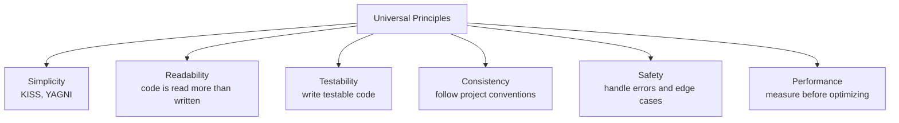

# 5. Common Patterns Across Languages

> **Tags:** #patterns #best-practices #cross-language #conventions

Despite syntactic differences, good practices are remarkably consistent across languages. This note covers the patterns that apply regardless of whether you are writing Python, JavaScript, Java, C++, or any other language.

---

## 14.5.1 Universal Principles



---

## 14.5.2 Error Handling Patterns

### 1. Fail Fast

Detect errors as early as possible. The longer an error propagates, the harder it is to debug.

```python
# BAD: error propagates silently
def process_order(order):
    total = order["total"]  # KeyError if "total" missing
    discount = order.get("discount", 0)  # silently defaults
    return total - discount

# GOOD: validate early
def process_order(order):
    if "total" not in order:
        raise ValueError("Order must have 'total'")
    total = order["total"]
    discount = order.get("discount", 0)
    return total - discount
```

### 2. Use the Language's Error Mechanism

- **Exceptions**: Python, Java, C#, JavaScript (throw/catch).
- **Result types**: Rust (`Result<T, E>`), Go (multiple return values).
- **Optional**: Swift, Kotlin, Java (`Optional`).

Do not reinvent error handling. Use the language's idiom.

### 3. Do Not Swallow Errors

```python
# BAD: error is swallowed
try:
    risky_operation()
except Exception:
    pass  # silent failure

# GOOD: log or rethrow
try:
    risky_operation()
except Exception as e:
    logger.error("Risky operation failed: %s", e)
    raise  # or handle meaningfully
```

### 4. Provide Context

```python
# BAD: bare exception
raise ValueError("Invalid input")

# GOOD: context in the message
raise ValueError(f"Invalid email format: '{email}'. Expected format: user@domain.com")
```

---

## 14.5.3 Naming Patterns

### Consistent Naming

Whatever convention you choose, apply it consistently:

- **Python**: `snake_case` for variables and functions, `PascalCase` for classes.
- **JavaScript/TypeScript**: `camelCase` for variables and functions, `PascalCase` for classes and types.
- **Java**: `camelCase` for methods and variables, `PascalCase` for classes.
- **C++**: `snake_case` or `camelCase` (varies by project), `PascalCase` for classes.
- **Rust**: `snake_case` for functions and variables, `PascalCase` for types.

### Boolean Names

Use predicates: `is_`, `has_`, `can_`, `should_`:

- `is_valid`, `has_permission`, `can_edit`, `should_retry`
- `isValid`, `hasPermission`, `canEdit`, `shouldRetry`

### Avoid Negations

```python
# BAD: double negative
if not is_not_valid:  # what does this mean?
    ...

# GOOD: positive
if is_valid:
    ...
```

---

## 14.5.4 Testing Patterns

### Test Names Describe Behavior

```
# Python
test_calculateTotal_appliesDiscountCorrectly
test_calculateTotal_returnsZeroWhenCartIsEmpty
test_calculateTotal_throwsWhenDiscountExceeds100

# JavaScript
test("calculateTotal applies discount correctly")
test("calculateTotal returns zero when cart is empty")
test("calculateTotal throws when discount exceeds 100")
```

### Arrange-Act-Assert

Every test follows this structure, in every language:

```python
def test_example():
    # Arrange
    input = "hello"
    expected = "HELLO"
    
    # Act
    result = input.upper()
    
    # Assert
    assert result == expected
```

### One Test, One Behavior

Do not test multiple things in one test. If a test fails, you should know exactly what broke.

### Test Edge Cases

- Empty input.
- Null / None / undefined.
- Maximum and minimum values.
- Boundary conditions (off-by-one).
- Concurrent access (if applicable).
- Error cases (invalid input, network failure).

---

## 14.5.5 Refactoring Patterns

The refactoring techniques in [[3. Catalog of Refactoring Techniques]] (Chapter 5) apply to all languages:

- **Extract Method / Function**: split long functions.
- **Extract Class**: split classes with multiple responsibilities.
- **Rename**: improve names.
- **Replace Conditional with Polymorphism**: replace switch statements with subclass overrides.
- **Introduce Parameter Object**: group related parameters.

The mechanics are the same; only the syntax differs.

---

## 14.5.6 Code Organization Patterns

### Modules / Packages

Group related code into modules or packages:

- **Python**: packages (directories with `__init__.py`).
- **JavaScript**: ES modules (`import`/`export`).
- **Java**: packages (directory structure mirrors package name).
- **C++**: namespaces.
- **Rust**: modules (`mod`).

### Layered Architecture

Separate code into layers:

1. **Presentation** (controllers, UI).
2. **Business logic** (services, domain).
3. **Data access** (repositories, DAOs).

Dependencies point inward: the domain does not depend on the database or the UI.

### Convention Over Configuration

Follow framework conventions rather than inventing your own:

- **Rails**: models in `app/models/`, controllers in `app/controllers/`.
- **Django**: apps with `models.py`, `views.py`, `urls.py`.
- **Spring**: `@Controller`, `@Service`, `@Repository` annotations.

Conventions make code predictable. Anyone familiar with the framework knows where to find things.

---

## 14.5.7 Performance Patterns

### Measure Before Optimizing

> "Premature optimization is the root of all evil." — Donald Knuth

Do not guess what is slow. Profile, find the bottleneck, then optimize.

```python
# Python: use cProfile
import cProfile
cProfile.run('my_function()')

# JavaScript: use the Performance tab in browser DevTools
# Or: console.time / console.timeEnd
console.time('myFunction');
myFunction();
console.timeEnd('myFunction');
```

### Optimize Algorithms First

An O(n²) algorithm is slow regardless of micro-optimizations. Use the right data structure:

- Need fast lookups? Use a hash map (dict, Map, HashMap).
- Need ordered unique items? Use a tree set (sortedcontainers in Python, TreeSet in Java).
- Need FIFO? Use a queue (collections.deque, Queue).

### Cache Expensive Operations

```python
from functools import lru_cache

@lru_cache(maxsize=128)
def expensive_computation(n):
    # ... slow computation
    return result
```

### Avoid Premature Abstraction

Do not add layers of abstraction "for flexibility." Add them when you have a second use case (YAGNI).

---

## 14.5.8 Documentation Patterns

### Self-Documenting Code

The best documentation is code that explains itself:

- Clear names.
- Small, focused functions.
- No magic numbers (use named constants).
- Comments explain **why**, not **what**.

### API Documentation

Use the language's doc comment format:

- **Python**: docstrings.
- **JavaScript**: JSDoc.
- **Java**: Javadoc.
- **C++**: Doxygen.
- **Rust**: rustdoc.

### README

Every project needs a README. See [[1. README Files and Documentation]] in Chapter 12.

---

## 14.5.9 The Boy Scout Rule (Universal)

> "Leave the code better than you found it."

This applies in every language, every project, every file. Small improvements compound over time.

---

## 14.5.10 Key Takeaways

- Universal principles: simplicity, readability, testability, consistency, safety, performance.
- Error handling: fail fast, use the language's mechanism, do not swallow errors, provide context.
- Naming: be consistent, use predicates for booleans, avoid negations.
- Testing: descriptive names, Arrange-Act-Assert, one test one behavior, test edge cases.
- Refactoring: Extract Method, Extract Class, Rename, Replace Conditional with Polymorphism — same in every language.
- Organization: modules/packages, layered architecture, convention over configuration.
- Performance: measure before optimizing, choose the right algorithm, cache expensive operations.
- Documentation: self-documenting code, doc comments, README.
- Boy Scout Rule: leave the code better than you found it.

---

**Previous:** [[4. C Plus Plus Best Practices]]
**Back to:** [[README]]
