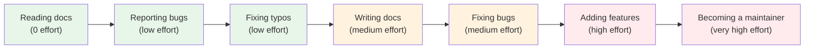

# Ways to Contribute

One of the biggest misconceptions about open source is that contributing means writing code. In reality, projects need many different kinds of help, and some of the most valuable contributions have nothing to do with code at all. Every project has a unique set of needs, and there's almost certainly a way for you to help right now, regardless of your experience level.

## Code Contributions

### Bug Fixes

Fixing bugs is the classic entry point for new contributors. Bugs are usually well-defined, self-contained, and easier to tackle than designing new features. The process typically involves:

1. Finding a reported bug in the issue tracker
2. Reproducing the bug locally
3. Identifying the root cause in the code
4. Writing a fix
5. Submitting a [[What is a Pull Request|Pull Request]]

Projects often label these as `good first issue` or `bug` — look for those tags.

### New Features

Once you're comfortable with a project, you might take on feature development. This is more complex because it requires understanding the project's architecture and design philosophy. Features usually start with a discussion in an issue before any code is written, so that maintainers can provide direction and avoid wasted effort.

### Performance Improvements

Optimizing code to run faster, use less memory, or scale better. These contributions are highly valued because they benefit all users and are often overlooked. If you notice a function that's slow or an algorithm that could be more efficient, that's a great contribution opportunity.

### Refactoring

Improving the internal structure of code without changing its external behavior. This includes simplifying complex functions, removing duplicate code, improving naming, and organizing files. Refactoring makes the codebase easier to understand and maintain, which helps every future contributor.

## Non-Code Contributions

### Documentation

> [!important] Documentation is often the single most impactful contribution you can make.

Good documentation is the difference between a project that thrives and one that dies. If you've ever struggled to understand a library because its docs were incomplete or confusing, you understand the pain. Documentation contributions include:

- **Fixing typos and grammar** — The easiest possible contribution. Seriously, projects love this.
- **Writing tutorials and guides** — Step-by-step walkthroughs for common tasks.
- **Improving API documentation** — Making function descriptions clearer, adding examples.
- **Creating diagrams** — Visual explanations of architecture or data flow.
- **Translating documentation** — Making projects accessible to non-English speakers.
- **Writing README sections** — Explaining what the project does and how to get started.

### Bug Reports

Reporting a bug effectively is a skill, and a well-written bug report is incredibly valuable. A good bug report includes:

- A clear, descriptive title
- Steps to reproduce the issue
- What you expected to happen
- What actually happened
- Your environment (OS, browser, version, etc.)
- Screenshots or error logs if applicable

### Testing

Tests are the safety net that allows projects to evolve without breaking. Contributing tests includes:

- **Writing unit tests** for functions that aren't covered
- **Adding integration tests** for feature workflows
- **Creating test utilities** that make writing tests easier
- **Improving test coverage** for edge cases

Many projects have low test coverage, and they're extremely grateful for test contributions.

### Design and UX

If you have design skills, projects often need help with:

- User interface design and prototyping
- Logo and branding
- Accessibility improvements
- User experience research and feedback
- Creating illustrations or icons

### Community and Support

- **Answering questions** in GitHub Discussions, Discord, Stack Overflow, or forums
- **Triaging issues** — Confirming bugs, categorizing, adding labels
- **Reviewing pull requests** — Even as a beginner, you can review docs or test PRs
- **Mentoring** — Helping newer contributors navigate the project
- **Organizing events** — Meetups, hackathons, contributor sprints

### Internationalization (i18n)

Translating the project's user interface, documentation, and error messages into other languages. This opens the project to millions of additional users who might not be comfortable with English.

## Which Type of Contribution Is Right for You?

| Your Strength | Best Starting Point |
|---------------|-------------------|
| Strong writer | Documentation, tutorials, bug reports |
| Detail-oriented | Bug fixes, testing, triaging issues |
| Visual thinker | Diagrams, UX design, accessibility |
| Patient helper | Community support, mentoring |
| Curious learner | Reading code, refactoring, adding tests |
| Full-on coder | Feature development, performance optimization |

> [!tip] Start Small
> Your first contribution doesn't need to be impressive. A typo fix, a documentation improvement, or a simple bug fix is the perfect starting point. What matters is that you go through the full workflow — fork, branch, change, commit, PR, review, merge — so you learn the process.

## The Contribution Spectrum

## What Counts as a Contribution?

Everything on this page counts. A typo fix that takes 5 minutes is a real contribution. An answered question in a forum is a real contribution. A well-written bug report that helps a maintainer fix a critical issue is a real contribution. Don't fall into the trap of thinking only code matters — projects need all kinds of help, and every bit of it moves the project forward.

---

**Previous:** [[Why Contribute]]
**Next:** [[Finding Beginner-Friendly Projects]]
