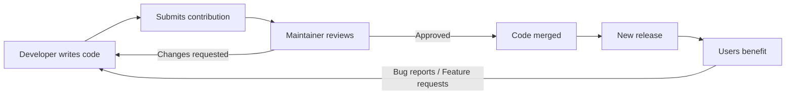

# What is Open Source?

## The Core Idea

Open source software is software whose **source code is publicly available** for anyone to view, use, modify, and distribute. Unlike proprietary software (think Microsoft Windows or Adobe Photoshop), where the code is a closely guarded secret, open source projects invite the entire world to look under the hood.

The term "open source" refers to something more fundamental than just "free to use." It means the **blueprint** of the software is available. You can see exactly how it works, learn from it, modify it to suit your needs, and share your modifications with others.

## A Simple Analogy

Imagine a restaurant. Proprietary software is like a restaurant that serves you a delicious meal but keeps the recipe secret. You can enjoy the food, but you can't see how it was made, and you certainly can't modify the recipe.

Open source software is like a restaurant that not only serves the meal but also **posts the full recipe on the wall**. You can see every ingredient and every step. You can try making it at home, adjust the seasoning, add new flavors, and even share your improved version with others.

## The Open Source Definition

For software to be truly "open source," it must meet the criteria defined by the **Open Source Initiative (OSI)**. The key requirements include:

1. **Free Redistribution** — Anyone can give away or sell the software without paying royalties.
2. **Source Code Available** — The source code must be included or easily obtainable.
3. **Derived Works Allowed** — You can modify the code and distribute your modified version.
4. **Integrity of the Author's Source Code** — The license may require modified versions to carry a different name or version number (to protect the original author's reputation).
5. **No Discrimination Against Persons or Groups** — Everyone is welcome to use the software.
6. **No Discrimination Against Fields of Endeavor** — You can use it for business, research, activism, or anything else.
7. **Distribution of License** — The rights apply automatically to everyone who receives the software.
8. **License Must Not Be Specific to a Product** — The rights aren't tied to a particular distribution.
9. **License Must Not Restrict Other Software** — The license can't say "you can only distribute this alongside open source software."
10. **License Must Be Technology-Neutral** — No restrictions on specific technologies or interfaces.

## How the Ecosystem Works

The open source ecosystem is a massive, decentralized network of developers, organizations, and communities. Here's how the pieces fit together:

### The Stakeholders

| Role | Description |
|------|-------------|
| **Maintainers** | The people (or organization) who own and manage a project. They review contributions, make decisions, and keep the project healthy. |
| **Contributors** | Anyone who submits changes — code, documentation, bug reports, designs, etc. |
| **Users** | People and organizations who use the software. Every contributor is also a user. |
| **Organizations** | Companies like Google, Meta, and Microsoft that sponsor, maintain, or build on open source projects. |

### The Workflow at a Glance

### Platforms That Host Open Source

- **GitHub** — The dominant platform (owned by Microsoft). Most open source projects live here.
- **GitLab** — A popular alternative with strong CI/CD features.
- **Bitbucket** — Often used with Atlassian's ecosystem (Jira, Confluence).
- **Codeberg** — A community-run, non-profit alternative.
- **SourceHut** — A lightweight, hacker-oriented platform.

## Major Open Source Projects You've Probably Used

You likely interact with open source software every single day without realizing it:

- **Linux** — Powers the vast majority of the world's servers, Android phones, and supercomputers.
- **Firefox** — The privacy-focused web browser.
- **VS Code** — Microsoft's popular code editor (yes, the core is open source).
- **Python, Node.js, React, Vue** — The languages and frameworks you write code in.
- **Docker, Kubernetes** — The infrastructure that runs modern cloud applications.
- **TensorFlow, PyTorch** — The AI/ML frameworks behind modern AI.

## Common Licenses

Open source projects use licenses to define how their code can be used. The most common ones:

| License | Key Trait | Can You Use in Proprietary Software? |
|---------|-----------|--------------------------------------|
| **MIT** | Very permissive. Do almost anything, just include the license. |  Yes |
| **Apache 2.0** | Permissive + patent protection. |  Yes |
| **GPL (v2/v3)** | Copyleft. Derivatives must also be open source. |  No (not in closed source) |
| **BSD (2/3-clause)** | Permissive, similar to MIT. |  Yes |
| **MPL 2.0** | Weak copyleft. File-level copyleft. |  Yes (with conditions) |

> [!tip] For Contributors
> You generally don't need to worry about licenses when contributing — the project's license already covers your contribution. But it's good to understand the basics, especially if you ever start your own project.

## Why Open Source Matters

Open source isn't just a development model — it's a philosophy about collaboration, transparency, and shared progress. The software that runs the internet, powers smartphones, launches rockets, and trains AI models is largely open source. By contributing to open source, you become part of this global engine of innovation.

---

**Next:** [[Why Contribute]] — Understand the personal and professional benefits of contributing to open source.
