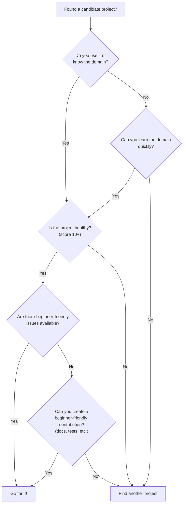

# Choosing the Right Project

Once you've found a few candidate projects, how do you choose? The right project depends on your skills, interests, goals, and available time. This note helps you evaluate projects systematically so you can make a confident choice.

## Match Your Skills

### Programming Language

The most natural starting point is a project written in a language you're comfortable with. If you write Python daily, contributing to a Python project means you can focus on learning the contribution workflow instead of struggling with syntax.

However, don't limit yourself rigidly. If a JavaScript project has a documentation issue you can fix, you don't need deep JavaScript knowledge — you just need to understand the docs. Similarly, many projects need help with CI/CD configuration (YAML), Docker files, or shell scripts, which are relatively language-agnostic.

### Domain Knowledge

Your non-programming expertise is valuable too:

| Your Background | Ideal Projects |
|-----------------|---------------|
| Data science / ML | Scikit-learn, Pandas, Jupyter, TensorFlow |
| Web development | React, Next.js, Django, Express, Tailwind |
| DevOps / Infrastructure | Docker, Kubernetes, Terraform, Ansible |
| Security | OWASP projects, OpenSSL, security scanners |
| Design | CSS frameworks, icon libraries, design systems |
| Writing / teaching | Any project with poor documentation |

### Familiarity Level

| Level | Recommendation |
|-------|---------------|
| I use this daily | Ideal — deep context, genuine motivation |
| I've used it a few times | Good — you understand the basics |
| I've heard of it but never used | Possible, but you'll need to learn the tool first |
| I've never heard of it | Risky — steep learning curve for your first contribution |

## Evaluate Project Health

Before investing time, assess whether the project is alive and well-maintained. A healthy project means your contribution has a real chance of being reviewed and merged.

### Key Metrics to Check

**1. Commit Activity**
- Visit the repo's commit history (the "Commits" tab on GitHub)
- Look for commits within the last 2-4 weeks
- Consistent activity is better than sporadic bursts

**2. Issue Response Time**
- Check how quickly maintainers respond to new issues
- If issues sit for months without response, your PR may also be ignored
- A healthy project responds within 1-7 days

**3. PR Review Time**
- Look at recently merged PRs
- How long did they sit before getting reviewed?
- How many rounds of review did they go through?
- This gives you realistic expectations for your own PR

**4. Number of Active Maintainers**
- One maintainer = bottleneck risk (burnout, slow reviews)
- 3-5 active maintainers = healthy
- Check who is merging PRs — is it always the same person?

**5. Community Size**
- Stars and forks indicate interest, but not necessarily responsiveness
- Check Discussions, Discord, or Slack for community activity
- A small but active community is better than a large but silent one

### Quick Health Check Scorecard

Rate each signal from 1-3:

| Signal | 1 (Poor) | 2 (Okay) | 3 (Great) |
|--------|----------|----------|-----------|
| Recent commits | None in 3+ months | Some in last month | Weekly or daily |
| Issue response | 30+ days | 7-14 days | 1-3 days |
| PR review time | 30+ days | 7-14 days | 1-5 days |
| Maintainer count | 1 | 2-3 | 4+ |
| Contributing guide | None | Basic | Comprehensive |
| Good first issues | 0 | A few | Regularly added |

**Total 15-18:** Excellent choice.  
**Total 10-14:** Good choice, but expect slower responses.  
**Total below 10:** Consider looking elsewhere for your first contribution.

## Assess the Learning Opportunity

Different projects offer different learning opportunities. Think about what you want to get out of the experience:

- **Want to learn Git workflows?** → Any active project will teach you this.
- **Want to learn a specific technology?** → Choose a project built with that tech.
- **Want to learn software architecture?** → Choose a larger, well-structured project.
- **Want to build confidence quickly?** → Choose a smaller project with simpler code.
- **Want mentorship?** → Choose projects with mentorship programs (Google Summer of Code, Outreachy).

## Time Commitment

Be honest about how much time you can invest:

| Available Time | Best Approach |
|----------------|--------------|
| 1-2 hours | Fix a typo, improve a doc, report a bug |
| 3-5 hours | Fix a simple bug, add a small test |
| 10-20 hours | Tackle a `good first issue`, add a small feature |
| 20+ hours | Take on a significant feature or refactor |

> [!important] Undercommit, Don't Overcommit
> It's better to successfully complete a tiny contribution than to abandon a large one. Start with something you can finish in a single session. You can always take on bigger challenges later.

## The Decision Framework

## Real-World Example

Let's say you're a JavaScript developer who uses React:

1. **You use React** → Visit `github.com/facebook/react`
2. **Check health** → Very active, many maintainers, comprehensive contributing guide 
3. **Check issues** → Filter by `good first issue` — several available 
4. **Pick one** → "Fix typo in documentation" or "Add missing test for X"
5. **Read CONTRIBUTING.md** → Follow the setup instructions
6. **Start contributing!**

This is the ideal path. But even if you don't use the project directly, you can still find a great fit by following the framework above.

---

**Previous:** [[Finding Beginner-Friendly Projects]]
**Next:** [[Project Structure]]
