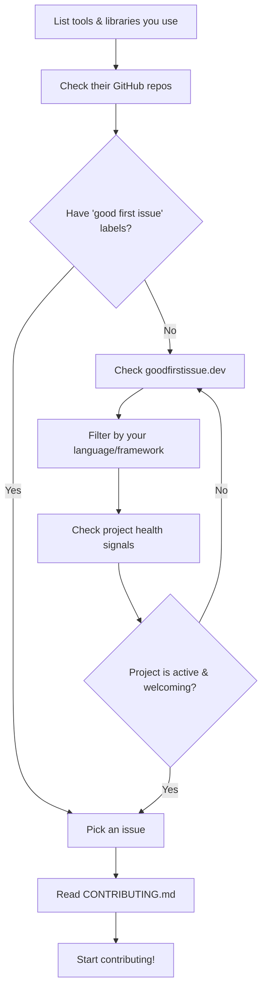

# Finding Beginner-Friendly Projects

Finding the right project to contribute to is half the battle. Many beginners spend weeks searching for the "perfect" first project. The truth is, there is no perfect project — but there are many good ones. The key is knowing where to look and what signals to watch for.

## Where to Look

### 1. GitHub's Built-In Tools

GitHub provides several features specifically designed to help new contributors:

- **`good first issue` label** — Many projects tag their simplest issues with this label. It's the most direct route to a beginner-friendly contribution.
- **`help wanted` label** — Issues that maintainers actively want help with. These may be slightly more complex than "good first issue" but are still accessible.
- **`hacktoberfest` label** — Projects participating in Hacktoberfest (October's open source celebration) are explicitly welcoming to new contributors.
- **GitHub Explore** (`github.com/explore`) — Curated collections of trending repos and topics.
- **GitHub Topic Pages** — Browse `github.com/topics/{your-interest}` to find projects by technology.

### 2. Dedicated Websites

| Website | URL | Description |
|---------|-----|-------------|
| **Good First Issue** | goodfirstissue.dev | Aggregates `good first issue` labels across GitHub |
| **First Timers Only** | firsttimersonly.com | Lists issues specifically for first-time contributors |
| **Up For Grabs** | up-for-grabs.net | Curated list of projects with beginner-friendly issues |
| **CodeTriage** | codetriage.com | Sends you a daily issue from a project you choose |
| **24 Pull Requests** | 24pullrequests.com | December-focused advent calendar of open source contributions |
| **Open Source Friday** | opensourcefriday.com | Encourages contributing on Fridays, with project suggestions |

### 3. Projects You Already Use

This is often the best approach. If you use a library, framework, or tool regularly, you already understand its purpose, its API, and its rough architecture. You've likely encountered bugs or missing features. Contributing to software you use means:

- You have genuine context and motivation
- You can test your changes against real workflows
- Your contributions are more likely to be useful

> [!tip] The "Eat Your Own Dog Food" Principle
> The best projects to contribute to are the ones you use daily. When you're already a user, you intuitively understand what improvements would be valuable. You don't need to study the project from scratch — you've already been doing that every time you use it.

### 4. Community Recommendations

- **Reddit** — r/opensource, r/github, r/programming, and language-specific subreddits
- **Discord/Slack communities** — Many large projects have dedicated channels for new contributors
- **Twitter/X** — Follow maintainers and open source advocates; they often highlight good first issues
- **Local meetups** — Open source nights and hackathons are great for finding projects and getting in-person help

## Signs of a Beginner-Friendly Project

Not every open source project is welcoming to newcomers. Here are the signals that indicate a project will support your first contribution:

###  Green Flags

| Signal | Why It Matters |
|--------|---------------|
| `CONTRIBUTING.md` file exists | The project has documented how to contribute |
| `good first issue` or `help wanted` labels | Issues are tagged for newcomers |
| Active issue tracker | Maintainers respond to issues within days, not months |
| Recent commit activity | The project is actively maintained |
| Friendly code of conduct | The community values respect and inclusivity |
| Responds to pull requests | Existing PRs get reviews, not ignored |
| Welcoming language in README | Explicitly invites contributions |
| Test suite exists | You can verify your changes work |
| Clear setup instructions | You can get the project running locally |

###  Red Flags

| Signal | Why It Matters |
|--------|---------------|
| No response to issues for months | Your PR may also be ignored |
| No contributing guidelines | You'll guess at what's expected |
| Hostile or dismissive maintainers | The review process will be painful |
| Abandoned project (no commits in 1+ year) | Your PR will never be merged |
| Massive unreviewed PR backlog | Maintainers are overwhelmed |
| No test suite and no CI | Hard to verify your changes are correct |

## A Practical Search Strategy

Here's a step-by-step approach to finding your first project:

### Step-by-Step Search Walkthrough

1. **Make a list of 5-10 open source tools you use regularly.** This could be your text editor, a web framework, a CSS library, a Python package, or a CLI tool.

2. **Visit each project's GitHub repository.** Look for the `CONTRIBUTING.md` file, the issue labels, and recent activity.

3. **Filter issues by `good first issue` or `help wanted`.** Read through a few to see if any match your skills and interest.

4. **If none of your used projects fit**, go to [goodfirstissue.dev](https://goodfirstissue.dev) and filter by your preferred language.

5. **Evaluate 3-5 candidate projects** using the green/red flag lists above.

6. **Pick ONE project and ONE issue.** Don't try to contribute to multiple projects at once for your first time.

## Projects Known for Welcoming Beginners

Some well-known projects have built reputations for being exceptionally friendly to new contributors:

- **React** (Facebook/Meta) — Excellent documentation, active community, many good first issues
- **VS Code** (Microsoft) — Well-organized contribution guide, responsive maintainers
- **Python** (CPython) — Extensive contributor documentation, mentorship programs
- **Django** — One of the most welcoming communities in Python
- **Angular** — Detailed contribution guide, community rotation for reviews
- **Node.js** — Strong contributor guidelines, mentorship available
- **Elasticsearch** — Clear contribution process, good documentation
- **Mozilla Projects** (Firefox, MDN, etc.) — Long history of onboarding new contributors

> [!warning] Don't Overthink It
> The biggest trap is spending weeks searching for the "perfect" project. Your first contribution doesn't define your open source career. Pick a project that seems reasonably active and welcoming, make a small contribution, and learn from the experience. You can always switch to another project later.

---

**Previous:** [[Ways to Contribute]]
**Next:** [[Choosing the Right Project]]
