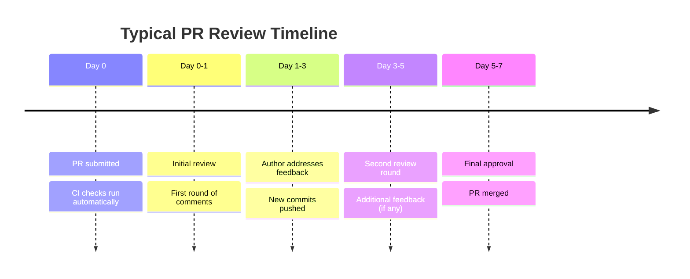

# The Code Review Process

Code review is the heart of the Pull Request system. It's where the community collectively ensures quality, shares knowledge, and builds trust. Understanding how reviews work — from both sides — makes you a better contributor and a better collaborator.

## Who Reviews Pull Requests?

### Maintainers

The primary reviewers are the project's **maintainers** — the people who have write access and decision-making authority. They are responsible for everything that goes into the codebase, so they review carefully.

**How to identify maintainers:**
- Check the repository's "People" tab on GitHub
- Look at who is merging PRs and closing issues
- Check `CODEOWNERS` file (`.github/CODEOWNERS`)
- Check the project's governance documentation

### Code Owners

Many projects use GitHub's **CODEOWNERS** feature to automatically request reviews from specific people when certain files are changed. For example, if you modify the authentication module, the security lead automatically gets a review request.

### Community Reviewers

Some projects allow or encourage anyone to review PRs, not just maintainers. This is more common in large projects with many contributors. Even if you're a beginner, you can sometimes review documentation changes or test additions — it's a great way to learn.

### How Many Reviewers Are Needed?

| Project Size | Typical Required Approvals |
|-------------|---------------------------|
| Small | 1 approval from any maintainer |
| Medium | 1-2 approvals, including from a relevant code owner |
| Large | 2+ approvals, including from specific team leads |
| Security-sensitive | Often requires review from a security-focused team |

## What Reviewers Evaluate

### 1. Correctness

The most fundamental question: **Does this code actually do what it claims to do?**

Reviewers will:
- Read the PR description and check if the code implements it
- Trace the logic of the changes
- Consider edge cases and error handling
- Verify the approach makes sense for the problem being solved

### 2. Code Quality

Reviewers look at **how** the code is written, not just what it does:

- **Readability** — Can someone unfamiliar with this change understand it in 6 months?
- **Naming** — Are variable and function names clear and consistent?
- **Complexity** — Is there a simpler way to achieve the same result?
- **Duplication** — Does this code repeat something that already exists?
- **Error handling** — Are error cases handled gracefully?

### 3. Testing

Reviewers check that your changes are adequately tested:

- **New functionality** has corresponding new tests
- **Bug fixes** include a test that would have caught the bug
- **Edge cases** are covered
- Tests are meaningful — not just testing that the code runs without crashing

### 4. Performance

Reviewers consider whether the change could negatively impact performance:

- Unnecessary loops or expensive operations
- Memory leaks
- N+1 database queries
- Unnecessary re-renders (in frontend code)

### 5. Security

Reviewers look for potential security vulnerabilities:

- SQL injection, XSS, CSRF
- Improper input validation
- Sensitive data exposure
- Authentication/authorization issues

### 6. Scope

Reviewers check that the PR stays focused:

- Does it do one thing, or has it grown into multiple unrelated changes?
- Are there "while I'm here" changes that should be a separate PR?
- Is the change proportional to the issue it solves?

### 7. Documentation

Reviewers verify that documentation is updated when needed:

- New features are documented
- API changes are reflected in the docs
- Breaking changes are noted
- README or CONTRIBUTING.md is updated if needed

## How Maintainers Decide: Accept or Reject

### Criteria for Accepting a PR

A PR is typically merged when:

1.  It solves a real problem (linked to an issue)
2.  The code is correct and well-written
3.  It includes adequate tests
4.  It follows the project's style and conventions
5.  CI checks all pass
6.  At least one maintainer has approved
7.  Documentation is updated (if needed)
8.  No unresolved review comments

### Criteria for Requesting Changes

A reviewer will request changes when:

1.  The code doesn't correctly solve the problem
2.  There are edge cases or bugs
3.  The code is hard to read or maintain
4.  Tests are missing or inadequate
5.  The approach is fundamentally wrong (a different solution is needed)
6.  Code style violations
7.  The PR scope is too broad

### Criteria for Rejecting (Closing) a PR

A PR may be closed without merging when:

1.  It solves a problem the maintainers don't agree needs solving
2.  The approach conflicts with the project's architecture or roadmap
3.  The PR has been abandoned (no response to feedback for weeks/months)
4.  The change introduces unacceptable risks
5.  There's already a PR addressing the same issue
6.  The contributor refuses to make requested changes

> [!important] Rejection Is Not Failure
> Having a PR closed is not a personal rejection. It often means the proposed approach didn't align with the project's direction. Many maintainers will explain their reasoning and suggest alternatives. Every PR — merged or not — is a learning experience.

## The Review Timeline



> [!note] Timeline Varies Greatly
> Small, well-written PRs may be reviewed and merged within hours. Large or complex PRs can take weeks. Projects with few maintainers may take longer. Be patient, and don't hesitate to politely follow up.

## Types of Review Comments

### Inline Comments

Comments on specific lines of code. These are the most common and most useful type:

```
Line 42: Consider using a Set here instead of an Array for O(1) lookups.
```

### General Comments

Comments on the PR as a whole, not tied to specific lines:

```
Overall this looks great! Just a few minor suggestions:
1. The error handling could be more robust
2. Could you add a test for the empty input case?
```

### Suggested Changes

GitHub allows reviewers to suggest specific code changes that you can commit with one click:

```
```suggestion
return items.filter(item => item.active && item.visible);
```
```

This is extremely helpful — it saves you from guessing what the reviewer wants.

### Approval with Comments

```
LGTM! (Looks Good To Me) 
Just one minor suggestion that you can address or ignore.
```

### Request for Changes

```
I'd like to see a few changes before this can be merged:
1. The database query needs parameterized inputs to prevent SQL injection
2. Please add a test for the timeout case
3. The function name `doStuff` should be more descriptive
```

## How to Be a Good Reviewee

1. **Be responsive** — Address feedback within a reasonable timeframe (1-3 days)
2. **Be open** — Don't be defensive about your code; suggestions are meant to help
3. **Be clear** — If you disagree with a suggestion, explain why respectfully
4. **Be thorough** — Address all comments, not just the easy ones
5. **Be appreciative** — Thank reviewers for their time and feedback
6. **Ask questions** — If you don't understand a suggestion, ask for clarification

---

**Previous:** [[PR Workflow]]
**Next:** [[Responding to Review Feedback]]
