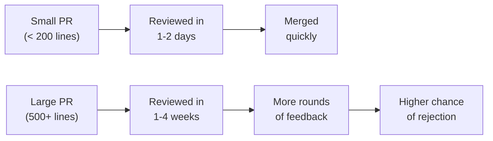

# Best Practices for Writing High-Quality Pull Requests

A great Pull Request is like a great resume — it gets you in the door, makes a strong impression, and leads to the outcome you want. This note covers the practices that experienced contributors follow to ensure their PRs are reviewed quickly, approved smoothly, and merged without drama.

## Before You Start Coding

### 1. Discuss First, Code Second

Before writing any code, make sure the maintainers agree with your approach:

- **Check existing issues** — Is there already an open issue for what you want to do?
- **Create an issue** if none exists — Describe the problem and your proposed solution
- **Wait for feedback** — Maintainers may suggest a different approach, or they may tell you the change isn't needed
- **Comment on the issue** — "I'd like to work on this. Is anyone already on it?"

> [!important] This Step Saves Hours
> Nothing is more frustrating than spending days on a PR only to have it rejected because the maintainers disagree with the approach. A 5-minute discussion upfront can prevent weeks of wasted effort.

### 2. Understand the Codebase

- Read the relevant parts of the codebase before making changes
- Understand how your change fits into the existing architecture
- Look at similar PRs that were recently merged for patterns to follow
- Check if there are utility functions you should be using instead of writing new ones

### 3. Set Up Your Environment Properly

- Follow the project's setup instructions exactly
- Run the test suite to confirm everything works before you make any changes
- Set up pre-commit hooks if the project provides them
- Install the correct version of the language/runtime

## While Coding

### 4. Make Minimal, Focused Changes

Every line of code in your PR should serve the specific issue you're addressing. Ask yourself:

- "Is this change necessary to fix the issue?"
- "Is this the simplest way to solve the problem?"
- "Am I introducing any unnecessary complexity?"

**The Minimal Change Principle:** Fix the bug with the fewest possible changes. Add the feature with the least amount of new code. Every additional line is an additional line that could contain a bug.

### 5. Follow the Project's Conventions

- Use the same coding style as the rest of the codebase
- Follow the same patterns and architectural decisions
- Use the same naming conventions
- Import modules the same way existing code does
- Handle errors the same way the project already handles them

When in doubt, look at existing code and match its style.

### 6. Write Self-Documenting Code

Your code should explain *what* it does. Your comments should explain *why*:

```javascript
//  Bad: Comment explains what the code does (obvious from reading it)
// Increment the counter by 1
counter++;

//  Good: Comment explains why
// Reset the retry counter because we've successfully connected
counter = 0;
```

### 7. Write Tests First (When Possible)

Writing tests before writing the implementation code (Test-Driven Development) helps you:

- Clarify what the code should do
- Ensure your implementation actually works
- Provide a safety net for future changes
- Demonstrate to reviewers that your code is correct

Even if you don't follow TDD strictly, always include tests with your PR.

### 8. Handle Edge Cases

Think about what happens when:

- Input is null, undefined, or empty
- The operation fails or times out
- The user provides unexpected input
- The system is under heavy load
- Dependencies are unavailable

### 9. Don't Mix Concerns

A single PR should do **one thing**:

|  Don't |  Do |
|----------|-------|
| Fix a bug + refactor a module + update docs | Fix the bug in one PR, refactor in another, docs in another |
| Add a feature + change the CI config | Separate PRs for each |
| Fix two unrelated bugs | Two separate PRs |

## Writing the PR Description

### 10. Use the PR Template

Most projects provide a PR template. Fill it out completely. Every section exists for a reason.

### 11. Write a Great Title

The title should be a complete, concise sentence that describes the change:

```
 "Fixed stuff"
 "Changes to auth"
 "WIP"
 "Fix infinite redirect loop when session token expires"
 "Add pagination to user list API endpoint"
 "Update Docker setup instructions for Apple Silicon"
```

### 12. Structure Your Description

A high-quality PR description includes:

```markdown
## Summary
One-paragraph summary of what this PR does and why.

## Related Issue
Fixes #123

## Changes
- Specific change 1
- Specific change 2
- Specific change 3

## How to Test
1. Step-by-step instructions for testing
2. Expected behavior
3. Edge cases to verify

## Screenshots (if applicable)
Before/after for UI changes

## Additional Notes
Any context that would help the reviewer understand
the approach or tradeoffs considered.
```

### 13. Explain Your Reasoning

If you chose a specific approach over alternatives, explain why:

```markdown
## Approach
I considered three approaches:
1. **Option A:** [description] — Rejected because [reason]
2. **Option B:** [description] — Rejected because [reason]  
3. **Option C:** [description] — Chosen because [reason]

This approach aligns with how the project handles [similar feature].
```

This shows reviewers that you thought carefully about the problem and makes it easier for them to evaluate your choice.

## After Submitting

### 14. Verify CI Passes

After you submit, watch the CI checks. If they fail, fix the issue immediately. A PR with failing CI is unlikely to get reviewed.

### 15. Respond to Reviews Promptly

Aim to respond to review feedback within 1-3 days. If you need more time, let the reviewer know.

### 16. Make It Easy to Review

Reviewers are busy. Make their job easier by:

- Keeping the PR small and focused
- Writing clear commit messages
- Explaining non-obvious code with inline comments
- Adding screenshots for UI changes
- Providing testing instructions

### 17. Keep the PR Up to Date

If the base branch changes while your PR is open, rebase or merge to stay current. This prevents merge conflicts from accumulating.

## The PR Quality Scorecard

Rate your PR on these dimensions before submitting:

| Dimension | 1 (Poor) | 3 (Good) | 5 (Excellent) |
|-----------|-----------|----------|---------------|
| **Focus** | Multiple unrelated changes | One logical change | One small, well-defined change |
| **Clarity** | Vague title, no description | Clear title, basic description | Detailed description with context |
| **Testing** | No tests | Some tests | Comprehensive tests with edge cases |
| **Style** | Doesn't match project | Mostly matches | Perfectly consistent |
| **Documentation** | No doc updates | Key updates | Thorough documentation |
| **Commit quality** | Messy commits | Reasonable commits | Clean, meaningful commits |
| **Issue linkage** | No issue reference | References issue | "Fixes #123" (auto-close) |

**Target: 25+ out of 35** — Your PR is likely to be reviewed and merged quickly.

## The Art of the Small PR

The single most impactful thing you can do is keep your PRs small. Here's why small PRs win:



**Strategies for small PRs:**
- Break large features into incremental steps
- Submit infrastructure changes separately from feature code
- Create a "refactor" PR before the "feature" PR if the code needs restructuring
- Use feature flags to merge partial implementations safely

## Communication Best Practices

### Be Professional

- Use clear, grammatical language
- Avoid slang, sarcasm, or passive-aggressive tone
- Be concise but thorough
- Acknowledge feedback before disagreeing

### Be Proactive

- If you notice a potential issue with your own PR, call it out in the description
- If you're unsure about a design decision, ask for input in the PR
- If you need help, say so — don't struggle silently

### Be Respectful

- Thank reviewers for their time
- Consider feedback carefully before responding
- If you disagree, explain your reasoning with evidence
- Accept that maintainers have the final say — it's their project

## Advanced Tips

### Use Draft PRs for Early Feedback

Open your PR as a draft to get early feedback on the approach before the code is polished. This prevents you from investing time in a direction that maintainers don't support.

### Add Visual Context

For UI changes, include:
- Screenshots of before and after
- Screen recordings for interactive changes
- Annotated mockups if available

### Reference Related PRs and Issues

If your PR relates to other work:
```markdown
Related to #42 (the original bug report)
Depends on #56 (infrastructure change that must merge first)
Supersedes #38 (previous attempt at this fix)
```

### Consider the Reviewer's Experience

Reviewers often review PRs between other tasks. Make your PR easy to understand at a glance:
- The title tells them what changed
- The description tells them why
- The code changes show them how
- The tests prove it works

---

**Previous:** [[Common PR Mistakes]]
**Next:** [[Step-by-Step First Contribution]]
