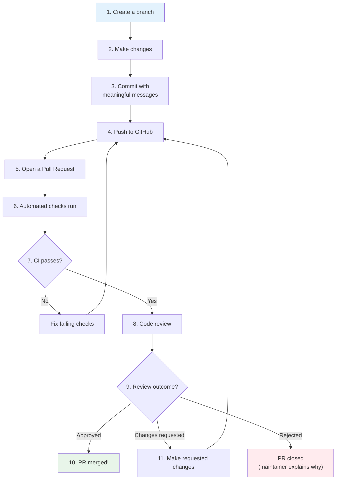

# The PR Workflow

Understanding the full lifecycle of a Pull Request — from creation to merge — is essential for contributing confidently. This note walks you through every stage, what happens at each step, and what you need to do.

## The Complete PR Lifecycle



## Stage 1: Preparation (Before the PR)

### Create a Branch

Never work directly on `main` or `master`. Always create a new branch for your changes:

```bash
# Make sure you're on main and up to date
git checkout main
git pull upstream main

# Create and switch to a new branch
git checkout -b fix/login-redirect-bug
```

**Branch naming best practices:**
- `fix/description` — for bug fixes
- `feature/description` — for new features
- `docs/description` — for documentation changes
- `your-name/description` — some projects require your username

### Make Your Changes

Keep your changes **focused and minimal**. A PR that does one thing well is much easier to review than a PR that does five different things.

### Commit Your Changes

Write clear, meaningful commit messages:

```bash
git add src/auth/login.js
git commit -m "fix(auth): resolve redirect loop on expired session tokens"
```

### Push to Your Fork

```bash
git push origin fix/login-redirect-bug
```

## Stage 2: Creating the PR

### Opening the PR on GitHub

1. Navigate to your fork on GitHub
2. GitHub will often show a "Compare & pull request" button — click it
3. Or go to the original repository's "Pull requests" tab and click "New pull request"

### Filling Out the PR

**Title:** Clear and concise. Follow the project's convention (often Conventional Commits format).

**Description:** Use the project's PR template if one exists. If not, include:

```markdown
## What does this PR do?
Brief description of the change.

## Why is this change needed?
Link to the issue: Fixes #123
Explain the problem this solves.

## How was it tested?
Describe how you verified the change works.

## Screenshots (if applicable)
Before/after images for UI changes.

## Checklist
- [ ] I have read the CONTRIBUTING.md
- [ ] My code follows the project's style guidelines
- [ ] I have added tests for my changes
- [ ] All tests pass locally
- [ ] I have updated the documentation (if needed)
```

### Draft PRs

If your PR is not yet ready for full review, open it as a **Draft PR**. This signals to maintainers that you're still working on it and aren't ready for a formal review. You can convert it to a regular PR when you're ready.

## Stage 3: Automated Checks

### What Runs Automatically

When you open a PR, the project's CI (Continuous Integration) system kicks in. Common checks include:

| Check | What It Does |
|-------|-------------|
| **Unit tests** | Runs the test suite to ensure nothing is broken |
| **Linter** | Checks code style and common errors |
| **Type checker** | Validates TypeScript/Flow types (if applicable) |
| **Build** | Ensures the project compiles/builds successfully |
| **Security scan** | Checks for known vulnerabilities |
| **Commit lint** | Validates commit message format |

### If Checks Fail

Don't panic. Failing CI is extremely common, even for experienced contributors. Common causes:

- **Test failure** — Your change broke an existing test or your new test has an issue
- **Linting error** — Code style violation (easy fix)
- **Build failure** — Your change caused a compilation error
- **Commit format** — Your commit message doesn't match the required format

Fix the issue locally, commit, and push. The CI will re-run automatically.

## Stage 4: Code Review

### Who Reviews

- **Project maintainers** — People with write access to the repository
- **Code owners** — Specific people assigned to review changes in certain files (defined in `.github/CODEOWNERS`)
- **Other contributors** — Some projects allow anyone to review PRs

### What Reviewers Look For

1. **Correctness** — Does the code do what it claims to do?
2. **Edge cases** — Does it handle unusual inputs and error states?
3. **Performance** — Are there unnecessary performance costs?
4. **Security** — Could this introduce a vulnerability?
5. **Readability** — Can others understand and maintain this code?
6. **Testing** — Are the changes adequately tested?
7. **Style** — Does the code follow the project's conventions?
8. **Scope** — Does the PR stay focused on one change?

### How Long Reviews Take

| Project Size | Typical Review Time |
|-------------|-------------------|
| Small (few contributors) | 1-7 days |
| Medium | 2-14 days |
| Large (React, Node.js, etc.) | 1-4 weeks |

> [!tip] Be Patient But Proactive
> If you haven't heard back after a week, it's perfectly acceptable to politely ping the PR by commenting: "Hi! Just checking if anyone has had a chance to look at this. Happy to make any changes needed." Maintainable projects appreciate the nudge — they often have more PRs than reviewers.

## Stage 5: Responding to Review Feedback

See [[Responding to Review Feedback]] for detailed guidance. Key principles:

- Don't take feedback personally
- Ask questions if you don't understand a suggestion
- Make requested changes promptly
- Push new commits to the same branch (don't close and re-open the PR)

## Stage 6: Merge

See [[Merging a PR]] for the details of how PRs are merged and what happens afterward.

## The Complete Workflow in Git Commands

```bash
# 1. Fork the repo on GitHub (click the Fork button)

# 2. Clone your fork
git clone https://github.com/YOUR-USERNAME/project-name.git
cd project-name

# 3. Add the original repo as "upstream"
git remote add upstream https://github.com/ORIGINAL-OWNER/project-name.git

# 4. Create a branch
git checkout -b fix/my-first-contribution

# 5. Make changes, then stage and commit
git add .
git commit -m "fix: resolve redirect loop on expired tokens"

# 6. Push to your fork
git push origin fix/my-first-contribution

# 7. Open a PR on GitHub (via the web interface)

# 8. After review feedback, make more changes
git add .
git commit -m "fix: address review feedback - add edge case handling"
git push origin fix/my-first-contribution

# 9. After approval, the maintainer merges your PR!
```

## Common PR States

| State | Meaning | Your Action |
|-------|---------|------------|
|  **Awaiting review** | No one has reviewed yet | Wait patiently; ping after a week |
|  **Approved** | A reviewer has approved | Wait for merge (maintainers handle this) |
|  **Changes requested** | A reviewer wants modifications | Make the changes and push again |
|  **Merged** | Your PR has been incorporated! | Celebrate!  |
|  **Closed** | Your PR was not merged | Read the explanation; learn from it |
|  **Draft** | Work in progress | Continue working; convert to ready when done |

---

**Previous:** [[Why PRs Exist]]
**Next:** [[Code Review Process]]
