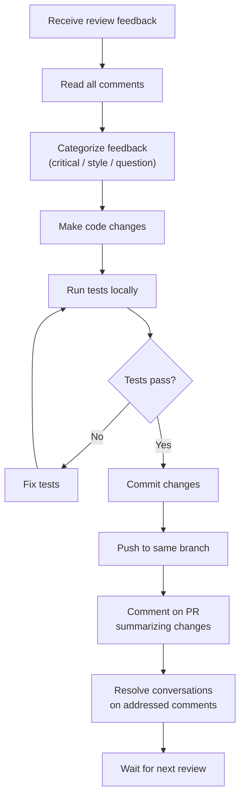

# Updating an Existing PR

One of the most common questions from beginners is: "I got feedback on my PR. How do I update it?" The answer is beautifully simple — just push new commits to the same branch. Your PR will automatically update. There's no need to close it and open a new one.

## The Basic Method: Adding New Commits

The simplest and safest way to update a PR is to add new commits on top of your existing ones.

```bash
# 1. Make your changes locally
# (edit files based on review feedback)

# 2. Stage the changes
git add src/auth/login.js

# 3. Commit with a descriptive message
git commit -m "fix: address review feedback - add empty input validation"

# 4. Push to the same branch
git push origin fix/login-redirect-bug
```

That's it. Your PR on GitHub will automatically show the new commit, and reviewers can see exactly what changed since their last review.

### Why This Works

Your PR is tied to a **branch**, not a specific commit. When you push new commits to that branch, the PR automatically includes them. GitHub tracks the entire history, so reviewers can see:

- All commits in the PR (chronological)
- The cumulative diff (all changes combined)
- Changes since their last review

## The Advanced Method: Squashing and Rewriting

Sometimes you want to clean up your commit history before the PR is merged. Common reasons:

- You have many "fix typo" or "address feedback" commits that clutter the history
- Your commit messages are inconsistent
- You want the merged history to be clean and readable

### Interactive Rebase

```bash
# Rebase the last N commits interactively
git rebase -i HEAD~3
```

This opens an editor where you can:
- **Squash** — Combine multiple commits into one
- **Reword** — Change commit messages
- **Reorder** — Rearrange commits
- **Drop** — Remove commits

Example rebase todo:
```
pick abc1234 fix: resolve redirect loop
squash def5678 fix: typo in variable name
squash ghi9012 fix: address review feedback
```

After saving, Git combines those commits into one, and you can write a new commit message for the combined change.

### Force Push After Rebase

After a rebase, you need to force push:

```bash
git push origin fix/login-redirect-bug --force
```

> [!warning] Force Push with Care
> Force push rewrites the branch history. If someone else is also working on the same branch, this can cause problems. For personal contribution branches, it's usually fine. Just be aware that it makes previous review comments harder to trace because line numbers may shift.

### Should You Squash?

| Situation | Recommendation |
|-----------|---------------|
| Your PR has 2-3 clean commits | Leave them as is |
| You have many small "fix" commits | Consider squashing into logical units |
| The project has a squashing policy | Follow the project's convention |
| You're unsure | Ask the reviewer — they may prefer one or the other |

## Syncing with the Base Branch

While your PR is open, other changes may be merged into the main branch. If those changes conflict with yours, you need to sync:

### Option 1: Merge (Simpler)

```bash
# Fetch the latest from the original repo
git fetch upstream

# Merge the main branch into your branch
git merge upstream/main

# Resolve any conflicts, then push
git push origin fix/login-redirect-bug
```

This creates a "merge commit" that combines the histories. It preserves the complete history but can make the commit graph complex.

### Option 2: Rebase (Cleaner)

```bash
# Fetch the latest
git fetch upstream

# Rebase your commits on top of the latest main
git rebase upstream/main

# Resolve any conflicts, then force push
git push origin fix/login-redirect-bug --force
```

This replays your commits on top of the latest main, creating a linear history. It's cleaner but requires force pushing.

> [!tip] Which to Use?
> Check the project's contributing guide. Many projects prefer rebase for a clean history. If there's no guidance, merge is safer because it doesn't require force push.

## Handling Merge Conflicts

When your changes conflict with changes that have been merged into the base branch:

```bash
# After git merge upstream/main or git rebase upstream/main
# Git will pause and tell you which files have conflicts

# Open each conflicted file. You'll see something like:
# <<<<<<< HEAD
# your changes
# =======
# their changes
# >>>>>>> upstream/main

# Edit the file to resolve the conflict
# Choose the correct version (or combine both)

# Stage the resolved files
git add <resolved-file>

# Continue the process
git rebase --continue  # if rebasing
# or just commit if merging

# Push the result
git push origin fix/login-redirect-bug
```

### Conflict Resolution Tips

1. **Don't panic** — Conflicts are normal and expected
2. **Read both versions carefully** — Understand what each change does before choosing
3. **Test after resolving** — Run the test suite to make sure nothing broke
4. **Ask for help** — If the conflict is in code you don't understand, ask the reviewer for guidance

## Keeping Your PR Organized

### Comment on What You Changed

After pushing updates, leave a comment summarizing the changes:

```markdown
Updated based on review feedback:

- Added input validation for empty strings (addressing @reviewer's comment)
- Renamed `process()` to `validateAndProcess()` for clarity
- Added test case for null input
- Rebased on latest main to resolve merge conflict
```

### Respond to Each Review Comment

On GitHub, you can reply to each inline comment:

```markdown
Fixed in commit abc1234. Changed to use the `validate()` helper as suggested.
```

This makes it easy for reviewers to verify their feedback was addressed.

### Use "Resolve Conversation"

On GitHub, after you've addressed a comment, click "Resolve conversation" to mark it as handled. This helps reviewers see what's been taken care of and what still needs attention.

## Common Update Scenarios

### Scenario 1: Small Fix After Review

```bash
# Make the fix
git add .
git commit -m "fix: add missing null check in validateInput"
git push origin fix/my-branch
```

### Scenario 2: Significant Refactor After Review

```bash
# Make changes
git add .
git commit -m "refactor: restructure auth flow based on review feedback

- Extract validation into separate function
- Add comprehensive error handling
- Add 5 new test cases"

git push origin fix/my-branch
```

### Scenario 3: CI Is Failing

```bash
# Run tests locally first
npm test

# Fix the failing test
git add .
git commit -m "fix: resolve failing CI test for edge case"
git push origin fix/my-branch
```

### Scenario 4: Branch Is Out of Date with Main

```bash
git fetch upstream
git rebase upstream/main
# resolve conflicts if any
git push origin fix/my-branch --force
```

## A Complete Update Workflow



---

**Previous:** [[Responding to Review Feedback]]
**Next:** [[Merging a PR]]
