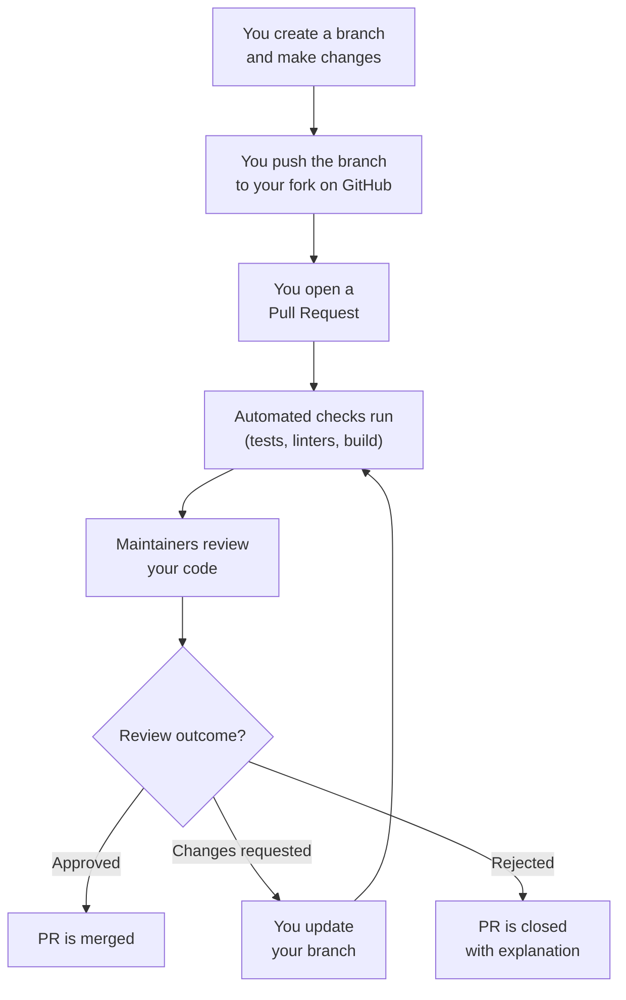

# What is a Pull Request?

A **Pull Request (PR)** is a mechanism for proposing changes to a repository. It's essentially a message that says: *"I've made some changes to the code in my copy of the project. Would you like to pull those changes into the official version?"*

The name is literal: you are **requesting** that someone **pull** your changes into their repository.

## The Core Concept

When you work on an open source project, you don't have permission to directly modify the official codebase. Instead, you:

1. Make a copy (fork) of the project
2. Make your changes in your copy
3. Submit a **Pull Request** asking the project maintainers to review and incorporate your changes

Think of it like this: you can't walk into a restaurant's kitchen and start cooking. But you can prepare a dish at home, bring it to the chef, and say, "I think this would be a great addition to your menu. Would you like to try it?" The chef tastes it, maybe suggests adjustments, and if they like it, they add it to the menu. That's exactly how a Pull Request works.

## Anatomy of a Pull Request

Every Pull Request contains several components:

### 1. Title
A concise summary of what the PR does. This is the first thing maintainers see, so it needs to be clear and descriptive.

```
 "Fixed stuff"
 "Changes"
 "Update"
 "Fix redirect loop when session token expires"
 "Add dark mode support to settings page"
 "Update API documentation for v2 endpoints"
```

### 2. Description
A detailed explanation of:
- **What** changed
- **Why** it changed (the motivation or problem being solved)
- **How** it was changed (the technical approach)
- Any context, screenshots, or references to related issues

### 3. Code Changes (Diffs)
The actual code modifications, shown as a diff — lines added (green) and lines removed (red). This is the heart of the PR.

### 4. Linked Issue
Most PRs reference a related issue: "Fixes #123" or "Resolves #456." This connects your code change to the problem it solves.

### 5. Review Comments
Discussion between you (the author) and the reviewers. Comments can be on the PR as a whole or on specific lines of code.

### 6. Status Checks
Automated checks that run when the PR is submitted (tests, linters, build verification). These must pass before the PR can be merged.

### 7. Review Status
Indicates whether the PR has been approved, needs changes, or is still awaiting review.

## The Terminology

| Term | What It Means |
|------|--------------|
| **Pull Request (PR)** | GitHub's term for a proposed change |
| **Merge Request (MR)** | GitLab's term — same concept, different name |
| **Author** | The person who created the PR |
| **Reviewer** | The person(s) evaluating the PR |
| **Maintainer** | The project member with merge authority |
| **Base branch** | The branch you want to merge INTO (usually `main` or `master`) |
| **Head branch** | The branch your changes are ON (your feature branch) |
| **Diff** | The difference between the base and head branches |
| **Conflict** | When your changes overlap with other changes that have been made |
| **Merge** | Accepting the PR and incorporating the changes |
| **Close** | Rejecting the PR without merging |
| **Rebase** | Re-applying your commits on top of the latest base branch |

## A Visual Overview



## Pull Request vs. Direct Push

| Aspect | Direct Push | Pull Request |
|--------|------------|--------------|
| Who can do it | Only people with write access | Anyone with a GitHub account |
| Code review | None (unless you set up rules) | Built-in review process |
| Quality checks | Manual | Automated (CI) |
| Discussion | Not embedded in the change | Full conversation thread |
| History preservation | Just the commit | Full context: why, who, discussion |
| Safety | Risky — errors go straight to main | Safe — changes are vetted before merging |

> [!important] Pull Requests Are the Standard
> Even project maintainers with full write access typically use PRs for their own changes. The only exception is trivial changes like fixing a typo in a README. This culture of "every change is reviewed" is what keeps open source projects reliable.

## What a Pull Request Is NOT

- **It's not a question.** If you have a question about the code, open an issue or a discussion instead.
- **It's not a draft.** Well, it can be (GitHub has a "draft PR" feature), but you should treat it as a serious proposal.
- **It's not guaranteed to be merged.** Maintainers may request changes, suggest alternatives, or decline it entirely.
- **It's not private.** PRs are public. Anyone can see, comment on, and learn from them.

## The Emotional Side

Your first PR can feel intimidating. You're putting your code out there for experienced developers to judge. Here's what you need to know:

- **Reviewers are reviewing the code, not you.** Feedback on your code is not feedback on your worth as a developer.
- **Requested changes are normal and expected.** Even senior developers get feedback on their PRs. It's the system working as designed.
- **Every contributor started where you are.** The maintainers reviewing your PR were once nervous first-time contributors too.

---

**Previous:** [[Reading Contribution Guidelines]]
**Next:** [[Why PRs Exist]]
