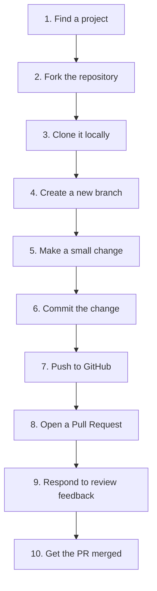
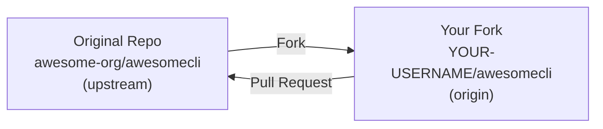

# Step-by-Step: Your First Open Source Contribution

This is the practical, hands-on guide you've been building toward. We'll walk through every single step of making your first open source contribution, from finding a project to getting your Pull Request merged. Follow along with a real project, and by the end, you'll have completed the full workflow.

## Overview: The 10 Steps



## Prerequisites

Before starting, make sure you have:

- [ ] A **GitHub account** (sign up at github.com — it's free)
- [ ] **Git installed** on your computer (`git --version` to verify)
- [ ] A **code editor** (VS Code, Vim, or any editor you're comfortable with)
- [ ] **Basic Git knowledge** (you should know what `add`, `commit`, and `push` do)
- [ ] A **terminal/command line** you're comfortable using

---

## Step 1: Finding a Beginner-Friendly Project

### What to Look For

For your first contribution, you want a project that:
- Has a `CONTRIBUTING.md` file
- Has issues tagged `good first issue` or `help wanted`
- Has recent commits (within the last few weeks)
- Has maintainers who respond to issues and PRs within days
- Is written in a language you're comfortable with

### Where to Search

1. **Think of tools you use.** Do you use any Python libraries, JavaScript frameworks, or CLI tools? Those are ideal starting points.
2. **Visit [goodfirstissue.dev](https://goodfirstissue.dev)** and filter by your language.
3. **Browse [firsttimersonly.com](https://www.firsttimersonly.com)** for curated beginner issues.

### For This Walkthrough

Let's say you've found a Python project called **"AwesomeCLI"** (a hypothetical CLI tool) with a `good first issue` that says: *"Fix typo in help command output — the word 'recieve' should be 'receive'."*

This is perfect for a first contribution:
-  It's small and well-defined
-  It's a documentation/text fix (low risk)
-  It will take you through the full PR workflow
-  It doesn't require deep knowledge of the codebase

> [!tip] Don't Worry About Being "Too Small"
> A typo fix is a legitimate, valuable contribution. It teaches you the workflow, and every project appreciates attention to detail. Your first PR is about learning the process, not proving your coding ability.

### Claim the Issue

Before starting work, comment on the issue:

```markdown
Hi! I'd like to work on this issue. Is anyone already on it?
```

Wait for a maintainer to confirm. This prevents duplicate work and signals that the project is active.

---

## Step 2: Forking the Repository

A **fork** is your personal copy of the project on GitHub. You can make any changes to your fork without affecting the original project.

### How to Fork

1. Go to the project's GitHub page (e.g., `github.com/awesome-org/awesomecli`)
2. Click the **"Fork"** button in the top-right corner
3. Select your GitHub account as the destination
4. GitHub creates a copy at `github.com/YOUR-USERNAME/awesomecli`

### Understanding the Fork Relationship



- **Upstream** — The original project repository
- **Origin** — Your fork (your personal copy)
- You'll push changes to your **origin**, then submit a PR to the **upstream**

> [!note] You Only Need to Fork Once
> Once you've forked a project, you keep that fork forever. For future contributions, you just sync it with the upstream and create new branches.

---

## Step 3: Cloning It Locally

Now you need to get the code onto your computer so you can work on it.

### Clone Your Fork

```bash
# Replace YOUR-USERNAME with your actual GitHub username
git clone https://github.com/YOUR-USERNAME/awesomecli.git

# Navigate into the project directory
cd awesomecli
```

### Add the Original Repository as "Upstream"

This lets you pull the latest changes from the original project:

```bash
# Add the upstream remote
git remote add upstream https://github.com/awesome-org/awesomecli.git

# Verify your remotes
git remote -v
```

You should see:
```
origin    https://github.com/YOUR-USERNAME/awesomecli.git (fetch)
origin    https://github.com/YOUR-USERNAME/awesomecli.git (push)
upstream  https://github.com/awesome-org/awesomecli.git (fetch)
upstream  https://github.com/awesome-org/awesomecli.git (push)
```

### Install Dependencies and Run the Project

```bash
# Follow the instructions in CONTRIBUTING.md or README.md
# For a Python project, this might be:
pip install -e .

# For a Node.js project:
npm install

# Verify the project works
python -m awesomecli --help
```

> [!important] Always Verify the Project Runs
> Before making any changes, confirm the project works on your machine. If it doesn't, you won't be able to test your changes. If you have trouble, check the project's issue tracker or ask for help in discussions.

---

## Step 4: Creating a New Branch

Never work directly on `main`. Create a dedicated branch for your change.

### Sync with the Latest Main

```bash
# Fetch the latest from upstream
git fetch upstream

# Make sure you're on main
git checkout main

# Merge the latest changes from upstream
git merge upstream/main
```

### Create Your Feature Branch

```bash
# Create and switch to a new branch
git checkout -b fix/typo-in-help-command
```

**Branch naming tips:**
- `fix/description` for bug fixes
- `feature/description` for new features
- `docs/description` for documentation changes
- Some projects have specific naming conventions — check CONTRIBUTING.md

### Verify You're on the Right Branch

```bash
git branch
# Should show: * fix/typo-in-help-command
```

---

## Step 5: Making a Small Change

Now it's time to make the actual change described in the issue.

### Find the File That Needs Changing

```bash
# Search for the typo in the codebase
# Using grep or your editor's search
grep -r "recieve" .
```

Let's say you find it in `src/cli/help.py`:

```python
# Before (line 42):
print("Usage: awesomecli recieve [options] <input>")
```

### Make the Fix

```python
# After:
print("Usage: awesomecli receive [options] <input>")
```

### Verify the Fix Works

```bash
# Run the project and check the output
python -m awesomecli --help

# Run the test suite to make sure nothing broke
pytest
```

### Check for Other Occurrences

Always search for other instances of the same issue:

```bash
grep -r "recieve" .
```

If there are more, fix them all in this PR.

---

## Step 6: Committing the Change

### Stage Your Changes

```bash
# Stage the specific file(s) you changed
git add src/cli/help.py

# Or stage all changes (be careful — make sure you're only changing what you intend)
git add .
```

### Review What You're About to Commit

```bash
# See what's staged
git diff --staged
```

This shows exactly what will be in your commit. Review it carefully to make sure you're not accidentally including:
- Unrelated changes
- Debug code or print statements
- IDE configuration files
- Secret keys or credentials

### Commit with a Meaningful Message

Follow the project's commit message convention (check CONTRIBUTING.md). If they use Conventional Commits:

```bash
git commit -m "fix(cli): correct typo in help command output"
```

If no convention is specified, write a clear, descriptive message:

```bash
git commit -m "Fix typo: 'recieve' → 'receive' in help command output"
```

### Commit Message Best Practices

```
 "Fixed it"
 "Changes"
 "typo"
 "fix(cli): correct typo in help command output"
 "docs: update API reference for authentication endpoints"
 "feat(search): add fuzzy matching support"
```

---

## Step 7: Pushing to GitHub

### Push Your Branch to Your Fork

```bash
git push origin fix/typo-in-help-command
```

If this is the first time pushing this branch, Git will set up the tracking:

```bash
# If Git prompts you to set the upstream:
git push -u origin fix/typo-in-help-command
```

### Verify on GitHub

Go to your fork on GitHub (`github.com/YOUR-USERNAME/awesomecli`) and verify that:
- Your branch appears in the branch dropdown
- Your commit is visible in the commit history
- The changes look correct in the file viewer

---

## Step 8: Opening a Pull Request

### Navigate to the PR Page

1. Go to the **original** repository: `github.com/awesome-org/awesomecli`
2. Click the **"Pull requests"** tab
3. Click **"New pull request"**
4. Click **"compare across forks"**
5. Set the base fork to `awesome-org/awesomecli` and the base branch to `main`
6. Set the head fork to `YOUR-USERNAME/awesomecli` and the compare branch to `fix/typo-in-help-command`

### Alternatively: Use the Quick Button

After pushing, GitHub often shows a yellow banner on your fork with a **"Compare & pull request"** button. Click it — it auto-fills the branches.

### Fill Out the PR

**Title:**
```
fix(cli): correct typo in help command output
```

**Description:**
```markdown
## What does this PR do?
Fixes a typo in the CLI help command output where "recieve" 
was misspelled as "receive".

## Related Issue
Fixes #42

## Changes
- Corrected "recieve" → "receive" in `src/cli/help.py` (line 42)

## How to Test
1. Run `python -m awesomecli --help`
2. Verify the output shows "receive" instead of "recieve"

## Checklist
- [x] I have read the CONTRIBUTING.md
- [x] My code follows the project's style guidelines
- [x] I have run the test suite and all tests pass
- [x] I have verified the fix locally
```

### Review Before Submitting

Before clicking "Create pull request":

- [ ] Is the base repository correct? (Should be the original, not your fork)
- [ ] Is the base branch correct? (Usually `main` or `master`)
- [ ] Is your title clear and descriptive?
- [ ] Does your description include the "what," "why," and "how"?
- [ ] Did you link the issue? ("Fixes #42")
- [ ] Are there no unintended changes in the diff?

### Click "Create Pull Request"

Congratulations — you've opened your first Pull Request! 

---

## Step 9: Responding to Code Review Feedback

### What Happens Next

After you open your PR:

1. **Automated checks run** — CI tests, linters, etc.
2. **A reviewer is assigned** — Either automatically (via CODEOWNERS) or manually
3. **The reviewer reads your code** and leaves comments

### If CI Fails

```bash
# Read the error message in the CI output on GitHub
# Fix the issue locally

# Example: If a test failed
pytest  # Run locally to reproduce

# Fix the issue, then:
git add .
git commit -m "fix: resolve failing test in help command"
git push origin fix/typo-in-help-command
```

The PR automatically updates with your new commit, and CI re-runs.

### If the Reviewer Leaves Comments

**Example feedback:**
> "Great catch! Could you also check if this typo appears anywhere else in the codebase?"

**Your response:**
```markdown
Good point! I searched and found another instance in `docs/usage.md`. 
I've added a commit that fixes that one too. Updated the PR description 
to reflect the additional change.
```

**Then:**
```bash
# Make the additional fix
git add docs/usage.md
git commit -m "fix(docs): correct same typo in usage documentation"
git push origin fix/typo-in-help-command
```

### If the Reviewer Approves

They might leave a comment like:
> "LGTM! (Looks Good To Me)" or "Approved "

Now you wait for the maintainer to merge it.

### If You Don't Hear Back

After a week with no response:
```markdown
Hi! Just following up on this PR. Let me know if there's anything 
else you'd like me to change. Happy to help!
```

---

## Step 10: Getting the Pull Request Merged

### The Merge

When the maintainer is ready, they'll click "Merge pull request." Your PR status changes to **"Merged"** (shown in purple on GitHub).

### Clean Up

After the merge, clean up your local environment:

```bash
# Switch to main and pull the latest (including your merged change!)
git checkout main
git pull upstream main

# Delete your feature branch locally
git branch -d fix/typo-in-help-command

# Delete the remote branch on your fork
git push origin --delete fix/typo-in-help-command

# Push the updated main to your fork
git push origin main
```

### Verify Your Contribution

1. Go to the original repository's commit history — you should see your commit
2. Check the project's contributors page — your name should appear
3. Look at your GitHub profile — the contribution should show on your graph

### Celebrate! 

You've done it. You've made your first open source contribution. You went through the entire workflow:

1.  Found a project
2.  Forked the repository
3.  Cloned it locally
4.  Created a branch
5.  Made a change
6.  Committed it properly
7.  Pushed to GitHub
8.  Opened a Pull Request
9.  Responded to feedback
10.  Got it merged

**The second time will be 10x easier.** The third time, you won't even need this guide. And soon, you'll be the one reviewing PRs and helping new contributors.

---

## Quick Reference: The Complete Command Sequence

```bash
# Step 1: Fork on GitHub (click the button)

# Step 2: Clone your fork
git clone https://github.com/YOUR-USERNAME/awesomecli.git
cd awesomecli

# Step 3: Add upstream remote
git remote add upstream https://github.com/awesome-org/awesomecli.git

# Step 4: Create a branch
git checkout -b fix/typo-in-help-command

# Step 5: Make your changes
# (edit files)

# Step 6: Commit
git add src/cli/help.py
git commit -m "fix(cli): correct typo in help command output"

# Step 7: Push
git push origin fix/typo-in-help-command

# Step 8: Open a PR on GitHub (via the web interface)

# Step 9: Address feedback
git add .
git commit -m "fix: address review feedback"
git push origin fix/typo-in-help-command

# Step 10: After merge, clean up
git checkout main
git pull upstream main
git branch -d fix/typo-in-help-command
git push origin --delete fix/typo-in-help-command
git push origin main
```

---

**Previous:** [[PR Best Practices]]
**Next:** [[PR Description Template]]
