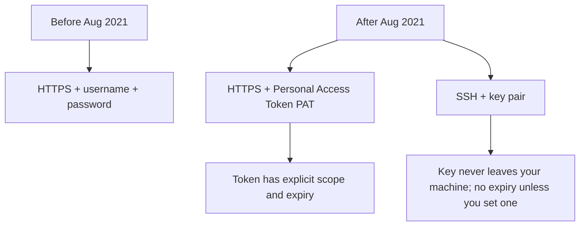
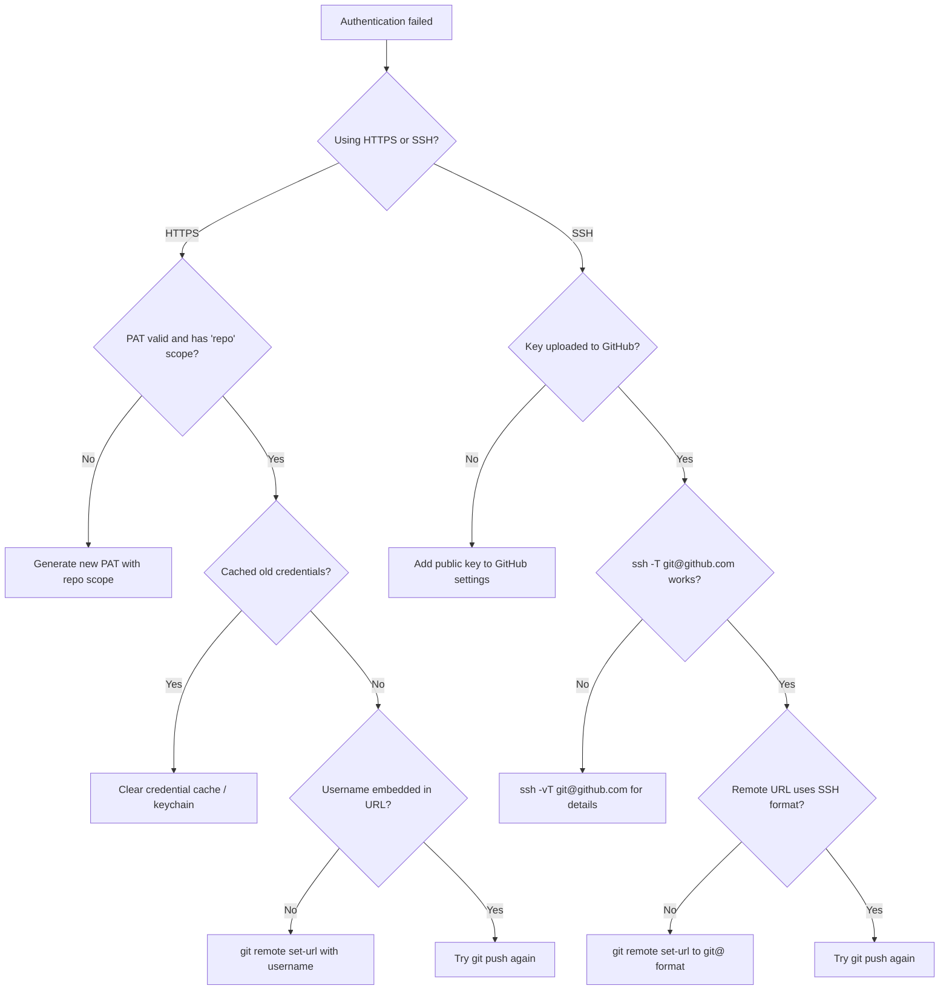

# 1. Password Authentication Not Supported

> **Tags:** #git #github #authentication #troubleshooting #pat #ssh

If you try to push to GitHub over HTTPS and see:

```
remote: Invalid username or token. Password authentication is not supported for Git operations.
fatal: Authentication failed
```

this note explains exactly why it happens and how to fix it permanently.

---

## 1.1 Why This Happens

On **August 13, 2021**, GitHub removed password-based HTTPS authentication for Git operations. Before that date, you could push to a private repository by typing your GitHub username and password. After that date, the password no longer works.

GitHub made this change for security reasons. Passwords are weak: users reuse them, they get phished, and they cannot be scoped. Replacing them with **Personal Access Tokens (PATs)** and **SSH keys** gives each credential a limited scope and an explicit expiration date.



---

## 1.2 Two Paths to a Fix

You have two options. Pick one based on your tolerance for setup:

| Option | Pros | Cons |
| --- | --- | --- |
| **HTTPS with a Personal Access Token** | No new tooling; works through restrictive firewalls | Tokens expire; must be re-pasted; must be scoped carefully |
| **SSH keys** (recommended) | Long-lived; no copy-paste; works across all your repositories | One-time setup; SSH port 22 must be reachable (port 443 fallback available) |

If you have not already set up SSH, do it once and forget about this problem forever. See [[15. GitHub SSH Setup]] in Chapter 1 for the full SSH setup procedure.

---

## 1.3 Option A — Personal Access Token over HTTPS

### Step 1 — Generate a PAT

1. Sign in to GitHub.
2. Go to **Settings → Developer settings → Personal access tokens → Tokens (classic)**. Direct link: <https://github.com/settings/tokens>.
3. Click **Generate new token → Generate new token (classic)**.
4. Give it a **note** (e.g., "Laptop git push").
5. Set an **expiration**. Long-lived is convenient but riskier; 90 days is a reasonable default.
6. Select **scopes**. For typical use:
   - `repo` (full control of private repositories)
   - `workflow` (if you push GitHub Actions workflows)
7. Click **Generate token** at the bottom.
8. **Copy the token immediately.** You will not be able to see it again. If you lose it, you must regenerate.

### Step 2 — Clear Cached Credentials

If Git is using an old password or expired token, you must clear the cache before the new token will work.

On Linux:

```bash
# Clear the credential cache
git credential-cache exit

# If using libsecret or gnome-keyring, reject stored credentials
echo "url=https://github.com" | git credential reject
echo "protocol=https" | git credential reject
echo "host=github.com" | git credential reject
```

On macOS (using Keychain):

```bash
# Clear GitHub credentials from Keychain
git credential-osxkeychain erase
# Then type:
# host=github.com
# protocol=https
# (press Ctrl+D to finish)
```

On Windows (using Credential Manager):

Open **Credential Manager → Windows Credentials → Generic Credentials**, find `git:https://github.com`, and remove it.

### Step 3 — Embed Your Username in the Remote URL

To avoid being prompted for a username each time, embed it in the remote URL:

```bash
git remote set-url origin https://USERNAME@github.com/USERNAME/REPO.git
```

### Step 4 — Push and Enter the PAT

```bash
git push -u origin main
```

When prompted:

- **Username:** your GitHub username (already embedded if you did step 3).
- **Password:** paste your PAT (not your GitHub password).

### Step 5 — Cache the PAT (Optional but Recommended)

To avoid pasting the PAT every time, configure a credential helper:

```bash
# Linux: cache in memory for 1 hour
git config --global credential.helper 'cache --timeout=3600'

# macOS: store in Keychain
git config --global credential.helper osxkeychain

# Windows: store in Credential Manager (default in Git for Windows)
git config --global credential.helper manager
```

After this, Git remembers the PAT for the configured duration.

---

## 1.4 Option B — SSH (Recommended)

The full setup is in [[15. GitHub SSH Setup]]. The summary:

```bash
# 1. Generate a key
ssh-keygen -t ed25519 -C "your_email@example.com"

# 2. Copy the public key
cat ~/.ssh/id_ed25519.pub

# 3. Add to GitHub: Settings → SSH and GPG keys → New SSH key

# 4. Test
ssh -T git@github.com

# 5. Switch the remote to SSH
git remote set-url origin git@github.com:USERNAME/REPO.git
```

After this, `git push` and `git pull` work without any prompts.

---

## 1.5 Diagnosing Which Method Git Is Using

If you are not sure whether your repo is using HTTPS or SSH:

```bash
git remote -v
```

Output patterns:

- `https://github.com/...` — HTTPS (uses PAT or cached password).
- `git@github.com:...` — SSH (uses SSH key).

To switch from HTTPS to SSH:

```bash
git remote set-url origin git@github.com:USERNAME/REPO.git
```

To switch from SSH to HTTPS:

```bash
git remote set-url origin https://github.com/USERNAME/REPO.git
```

---

## 1.6 Verifying the PAT Works

To verify a PAT without disturbing your repository, clone a private repo into a temporary directory:

```bash
git clone https://USERNAME@github.com/USERNAME/private-repo.git /tmp/test-clone
```

If this succeeds, your PAT is valid. If it fails with the same authentication error, the PAT is wrong, expired, or lacks the `repo` scope.

Clean up:

```bash
rm -rf /tmp/test-clone
```

---

## 1.7 Common Pitfalls

### Pitfall 1 — Using the GitHub Password Instead of the PAT

When Git prompts for a password, many users instinctively type their GitHub password. This will fail with the exact error this note opens with. The "password" field expects a PAT, not your GitHub password.

### Pitfall 2 — Token Without `repo` Scope

If you generate a PAT without the `repo` scope, you can authenticate but cannot push to private repositories. The error message is the same as if the token were wrong. Regenerate the token with `repo` selected.

### Pitfall 3 — Cached Old Credentials Win

If Git keeps using old credentials even after you set a new PAT, the credential cache or keychain is still holding the old one. Clear it (see step 2) before trying again.

### Pitfall 4 — Two-Factor Interfering

If your GitHub account has 2FA enabled, password authentication fails even for the API. Use a PAT or SSH — both bypass 2FA because they are already strong authentication factors.

### Pitfall 5 — Forgetting to Update the Remote After Renaming the Repo

If you rename the repository on GitHub, the URL changes. Update your local remote:

```bash
git remote set-url origin https://USERNAME@github.com/USERNAME/NEW-NAME.git
```

---

## 1.8 Quick Troubleshooting Checklist



---

## 1.9 Key Takeaways

- GitHub disabled HTTPS password authentication in August 2021.
- Use a PAT over HTTPS, or SSH keys (recommended).
- For HTTPS, embed the username in the remote URL and cache the PAT.
- For SSH, generate a key, upload the public key, and switch the remote URL.
- Clear cached old credentials before testing a new credential.

---

**Previous chapter:** [[15. GitHub SSH Setup]] (Chapter 1)
**Next:** [[2. Making a Branch the Default and Single Timeline]]
