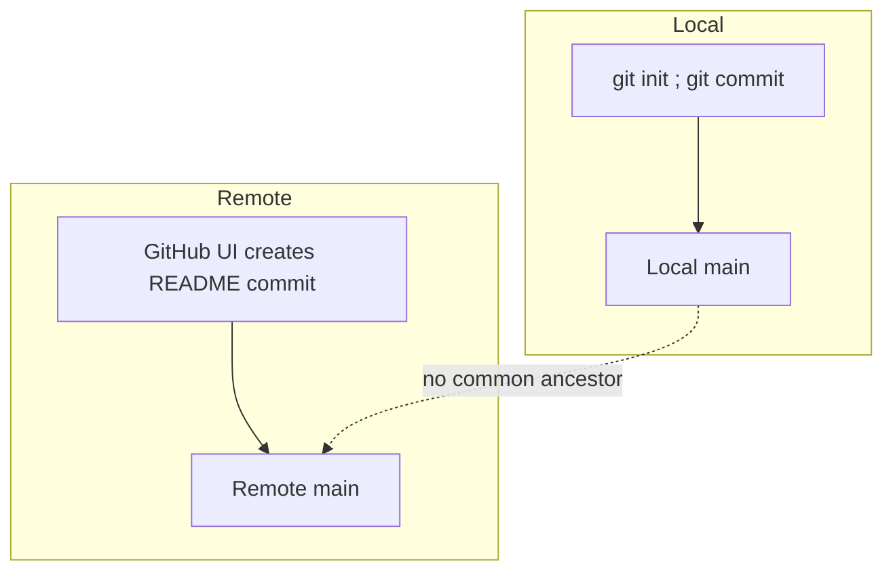

# 2. Making a Branch the Default and Single Timeline

> **Tags:** #git #github #branching #troubleshooting #workflow

This note is a postmortem of a real Git session where the goal was to push a local project to GitHub, make a non-default branch (`Pizza2`) the new default, and collapse the repository's history so that `Pizza2` is the only canonical branch. It documents what happened, why each step was needed, and how to reproduce the result safely.

---

## 2.1 The Goal

The session had five explicit goals:

1. Push a local project to a GitHub repository.
2. Make `Pizza2` the **default branch** on the remote.
3. Collapse the repository so `Pizza2` is effectively **the only branch** (a single linear timeline).
4. Resolve HTTPS authentication problems by switching to SSH.
5. Resolve "unrelated histories" errors that appeared when trying to merge with the remote's pre-existing `main` branch.

---

## 2.2 What Actually Happened

```mermaid
sequenceDiagram
    participant You
    participant Local as Local repo
    participant Remote as GitHub remote
    You->>Local: git init ; git add . ; git commit
    You->>Remote: git push over HTTPS
    Remote-->>You: ERROR: password auth not supported
    You->>Local: git remote remove origin
    You->>Local: git remote add origin git@github.com:USER/REPO.git
    You->>Remote: git push -u origin Pizza2
    Remote-->>You: OK - Pizza2 pushed
    You->>Local: git checkout main ; git merge origin/main
    Local-->>You: ERROR: unrelated histories
    You->>Local: git merge origin/main --allow-unrelated-histories
    Local-->>You: CONFLICT on .gitignore
    You->>Local: git checkout --ours .gitignore ; git add ; git commit
    You->>Remote: gh repo edit USER/REPO --default-branch Pizza2
    Remote-->>You: Pizza2 is now default
```

Step by step:

1. Initialized a repo locally and tried to push over HTTPS. Failed with "Invalid username or token. Password authentication is not supported…"
2. Switched the remote to SSH: `git remote remove origin` followed by `git remote add origin git@github.com:Vtheonly/Pizza_Stores_Tamplates.git`.
3. Staged and committed; pushed `Pizza2`: `git push -u origin Pizza2`. Succeeded.
4. Tried to merge `Pizza2` into `main` locally and push `main`. The remote `main` had its own independent history (a README created through GitHub's web UI), so the merge failed with "unrelated histories."
5. Resolved by allowing unrelated histories and keeping the local version of conflicting files (notably `.gitignore`).
6. Installed the GitHub CLI (`gh`), authenticated, and set the default branch to `Pizza2`: `gh repo edit Vtheonly/Pizza_Stores_Tamplates --default-branch Pizza2`.
7. Final state: `Pizza2` exists on the remote and is the default branch.

---

## 2.3 Root Cause Analysis

### Root Cause 1 — HTTPS Push Failing

GitHub disabled password-based HTTPS pushes in August 2021 (see [[1. Password Authentication Not Supported]]). Without a PAT or SSH key, HTTPS pushes fail.

**Fix chosen:** switch to SSH. SSH keys are long-lived and integrate well with CLI tooling and CI.

### Root Cause 2 — Divergent Histories

When you initialize a repository on GitHub's web UI with a README, GitHub creates an initial commit on the remote's default branch. When you then `git init` a fresh repository locally and try to push, the two histories share **no common ancestor** — they are "unrelated."



Git refuses to merge unrelated histories by default to prevent accidents. The fix is to explicitly allow it:

```bash
git merge origin/main --allow-unrelated-histories
```

or to decide which side is canonical and force-update the other.

### Root Cause 3 — "Make Pizza2 the One and Only Head"

This request had two interpretations:

- **A.** Keep `main` as the canonical branch but overwrite its content with `Pizza2` (force-update).
- **B.** Promote `Pizza2` to be the default branch and (optionally) delete `main`.

The session executed **B**: set `Pizza2` as the default branch on GitHub. The "Option A vs Option B" decision is explored below.

---

## 2.4 Two Final Repository Shapes

### Option A — `Pizza2` is Default, `main` Is Deleted (Single Branch Repo)

**Pros:** cleanest representation of "one canonical line of development"; no confusion about which branch to clone.

**Cons:** any integrations expecting `main` will need updating.

```bash
# Ensure Pizza2 is fully up to date
git checkout Pizza2
git pull --ff-only

# Delete local main if it exists
git branch -D main || true

# Delete remote main
git push origin --delete main
```

Verification:

```bash
git ls-remote --heads origin
# Should show only refs/heads/Pizza2
```

### Option B — Force-Update `main` to Match `Pizza2`, Make `main` Default, Delete `Pizza2`

**Pros:** aligns with common tooling defaults that expect `main`.

**Cons:** force push rewrites remote history of `main` (destructive). Anyone who has already cloned will see weird state.

```bash
# From Pizza2, force-update remote main to match Pizza2 exactly
git checkout Pizza2
git push origin +Pizza2:main

# Set default back to main
gh repo edit USER/REPO --default-branch main

# Delete Pizza2 if you want a single branch
git push origin --delete Pizza2
```

Verification:

```bash
git fetch origin
git rev-parse origin/main
git rev-parse origin/Pizza2  # if you kept Pizza2
# The two hashes should be identical.
```

---

## 2.5 Safe, Repeatable Procedure

If you ever need to do this again, here is the recipe distilled from the session:

### 1. Initialize with SSH from the Start

```bash
git init
git remote add origin git@github.com:USER/REPO.git
```

Do not create files on GitHub's web UI before your first push. If you do, you create unrelated histories (see section 2.3).

### 2. First Commit and Push a Canonical Branch

```bash
git add .
git commit -m "Initial commit"
git push -u origin Pizza2
```

### 3. Set the Default Branch Early

```bash
gh auth login   # once per machine
gh repo edit USER/REPO --default-branch Pizza2
```

### 4. Avoid Unrelated Histories

If you already have a remote with content and a local with different content, either:

```bash
# Pull first, then resolve
git pull --allow-unrelated-histories
# (resolve conflicts)
git push
```

or, if you want your local to win:

```bash
git push -u origin Pizza2 --force-with-lease
gh repo edit USER/REPO --default-branch Pizza2
git push origin --delete main
```

### 5. If You Truly Want a Single Branch

Either delete the non-canonical branch:

```bash
git push origin --delete main
```

or force-update it to match your canonical branch:

```bash
git push origin +Pizza2:main
gh repo edit USER/REPO --default-branch main
git push origin --delete Pizza2
```

---

## 2.6 Curated Command Reference

### Switch a Remote to SSH

```bash
git remote remove origin  # if an origin existed
git remote add origin git@github.com:USER/REPO.git
```

### Push a Branch as Canonical

```bash
git checkout -B Pizza2
git push -u origin Pizza2
```

### Set the Default Branch via GitHub CLI

```bash
sudo apt install gh        # once
gh auth login              # once per machine
gh repo edit USER/REPO --default-branch Pizza2
```

### Resolve Unrelated Histories by Keeping Local Content

```bash
git checkout main
git fetch origin
git merge origin/main --allow-unrelated-histories
# If conflicts, keep ours (local):
git checkout --ours .gitignore
git add .gitignore
git commit -m "Merge unrelated histories; keep local as canonical"
git push origin main
```

### Force-Update Remote `main` to Match `Pizza2` (Destructive)

```bash
git checkout Pizza2
git push origin +Pizza2:main
```

### Delete a Remote Branch

```bash
git push origin --delete main
```

---

## 2.7 Why SSH Is Preferred for This Workflow

- GitHub disabled password-based HTTPS pushes. PATs work but must be managed and scoped.
- SSH keys are long-lived, easy to rotate, and integrate well with CLI tooling and CI.
- In the original session, SSH worked immediately after `gh auth login`, while HTTPS kept failing.

---

## 2.8 Verification Checklist

After completing the workflow, verify each outcome:

```bash
# Default branch is Pizza2
gh repo view USER/REPO --json defaultBranchRef -q '.defaultBranchRef.name'
# Output: Pizza2

# Remote branches
git ls-remote --heads origin
# Should show only refs/heads/Pizza2 (if you went with Option A)

# Local-to-remote tracking
git status
git branch -vv

# If you force-updated main to match Pizza2
git rev-parse origin/main
git rev-parse origin/Pizza2
# Hashes should be identical
```

---

## 2.9 Opinionated Guidance

- If you have no external dependencies expecting `main`, keep `Pizza2` as the only branch and delete `main`. It is the cleanest representation of "one canonical line of development."
- If some tooling expects `main`, force-update `main` to match `Pizza2` and make `main` the default, then delete `Pizza2`. Avoid keeping two branches that are supposed to be the same — it invites drift.
- Avoid the "allow unrelated histories" path entirely by pushing first from your local repo before creating anything in the GitHub UI.

---

## 2.10 One-Page TL;DR

- Use SSH, not HTTPS passwords.
- Push `Pizza2`, set it as default:
  ```bash
  git checkout -B Pizza2
  git push -u origin Pizza2
  gh repo edit USER/REPO --default-branch Pizza2
  ```
- To make a single branch:
  - Delete `main`: `git push origin --delete main`
  - Or overwrite `main` with `Pizza2`:
    ```bash
    git push origin +Pizza2:main
    gh repo edit USER/REPO --default-branch main
    git push origin --delete Pizza2
    ```

---

**Previous:** [[1. Password Authentication Not Supported]]
**Next:** [[3. Origin HEAD Not a Symbolic Ref]]
