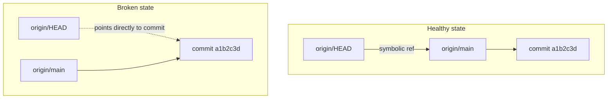

# 3. Origin HEAD Not a Symbolic Ref

> **Tags:** #git #troubleshooting #remotes #symbolic-ref

If you have ever seen this error:

```
fatal: ref refs/remotes/origin/HEAD is not a symbolic ref
```

this note explains what it means, why it happens, and how to fix it.

---

## 3.1 What the Error Means

`origin/HEAD` is a special remote-tracking ref. It points to the **default branch** of the `origin` remote — usually `origin/main` or `origin/master`. When Git or tools like VS Code want to know "what is the default branch of this remote?", they read `origin/HEAD`.

A **symbolic ref** is a ref that points to another ref (rather than to a commit). For example, `HEAD` itself is a symbolic ref: it typically contains `ref: refs/heads/main`, meaning "HEAD points to `refs/heads/main`."

The error "is not a symbolic ref" means `origin/HEAD` exists but is broken — it points directly to a commit hash instead of pointing to another ref like `origin/main`.



When `origin/HEAD` is broken, tools that depend on it cannot determine the default branch and fail.

---

## 3.2 Why It Happens

This usually happens in one of three scenarios:

1. **You cloned a repo, but the remote's default branch changed afterward.** Your local `origin/HEAD` still points to the old default branch, which may no longer exist on the remote.
2. **You created the repo locally and added a remote manually** without setting the upstream HEAD. `git clone` sets `origin/HEAD` automatically; manual `git remote add` does not.
3. **You fetched but pruned a branch that `origin/HEAD` was pointing to.** Now `origin/HEAD` points to a ref that no longer exists.

---

## 3.3 How to Fix It

### Fix 1 — Let Git Determine the Default Branch Automatically

```bash
git remote set-head origin -a
```

The `-a` flag tells Git to query the remote for its current default branch and update `origin/HEAD` accordingly. This is the easiest and most reliable fix.

### Fix 2 — Set It Manually

If you know the default branch name:

```bash
git remote set-head origin main
```

Replace `main` with `master` or whatever the actual default is.

### Fix 3 — Delete and Re-add the Remote

If both above fail, the nuclear option:

```bash
git remote remove origin
git remote add origin git@github.com:USER/REPO.git
git fetch origin
```

`git fetch` on a freshly added remote will set `origin/HEAD` correctly.

---

## 3.4 Why It Matters

Many tools read `origin/HEAD` to determine the default branch:

- **VS Code** uses it to decide which branch to show by default in the source control view.
- **GitHub CLI (`gh`)** uses it for commands that operate on "the default branch" without an explicit name.
- **Custom scripts and CI pipelines** often read it to know where to merge PRs by default.

If `origin/HEAD` is broken, these tools fail in confusing ways — often with no obvious connection to the actual problem.

---

## 3.5 Verifying the Fix

After applying one of the fixes, verify that `origin/HEAD` is now a symbolic ref:

```bash
git symbolic-ref refs/remotes/origin/HEAD
```

Expected output:

```
refs/remotes/origin/main
```

If you see a commit hash instead of a ref name, the symbolic ref is still broken — try a different fix.

You can also list all symbolic refs:

```bash
git symbolic-ref --all
```

---

## 3.6 Related Commands

| Command | What it does |
| --- | --- |
| `git remote set-head origin -a` | Auto-detect and set `origin/HEAD`. |
| `git remote set-head origin <branch>` | Manually set `origin/HEAD` to point to `origin/<branch>`. |
| `git remote set-head origin -d` | Delete `origin/HEAD`. |
| `git symbolic-ref refs/remotes/origin/HEAD` | Show what `origin/HEAD` currently points to. |
| `git symbolic-ref HEAD` | Show what local `HEAD` points to (e.g., `refs/heads/main`). |

---

## 3.7 The Deeper Lesson: Refs vs Symbolic Refs

This error is a good opportunity to understand Git's ref system:

- A **ref** is a named pointer to a commit. Branches (`refs/heads/main`), tags (`refs/tags/v1.0`), and remote-tracking branches (`refs/remotes/origin/main`) are all refs.
- A **symbolic ref** is a ref that points to another ref. `HEAD` is the most common example: it points to `refs/heads/main`, which in turn points to a commit.
- Most refs point directly to commits. Only `HEAD` and `origin/HEAD` are commonly symbolic.

When a tool reads `HEAD`, it follows the chain: `HEAD` → `refs/heads/main` → commit hash. If `HEAD` were to point directly to a commit hash, it would no longer be a symbolic ref, and `git branch` would show `(detached HEAD)` instead of `On branch main`.

The same applies to `origin/HEAD`. When it is symbolic, tools can resolve "what is the default branch?" by following the chain. When it is not, they cannot.

---

## 3.8 Key Takeaways

- `origin/HEAD` is a symbolic ref pointing to the remote's default branch.
- The error "not a symbolic ref" means it is broken — pointing directly to a commit.
- Fix with `git remote set-head origin -a` (auto-detect) or `git remote set-head origin <branch>` (manual).
- Verify with `git symbolic-ref refs/remotes/origin/HEAD`.
- This is more than cosmetic: many tools depend on `origin/HEAD` to determine the default branch.

---

**Previous:** [[2. Making a Branch the Default and Single Timeline]]
**Next:** [[4. Why a Folder Might Appear Green in Git Tools]]
