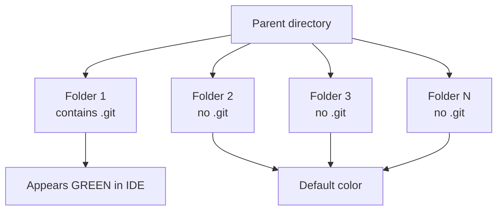

# 4. Why a Folder Might Appear Green in Git Tools

> **Tags:** #git #troubleshooting #ide #ui

A common confusion when working with multiple projects in one IDE workspace: one folder appears **green** in the file explorer while the others do not, even though `git status` reports the folder as clean. This note explains why.

---

## 4.1 The Scenario

You observe that:

- One specific folder in your codebase appears **green** in your IDE or file explorer.
- The other 19 folders do not show the green color.
- `git status` for that folder reports `nothing to commit, working tree clean`.
- The branch is `main`, up to date with `origin/main`.
- Most files in the green folder are listed in `.gitignore`.

The question: **why is it green when there is nothing to do?**

---

## 4.2 The Key Observation



Run this in the suspicious folder:

```bash
ls -a | grep .git
```

If you see `.git`, the folder is its **own Git repository**, separate from any parent repository. The parent directory contains multiple independent Git repositories.

---

## 4.3 Why the Green Color

In most modern IDEs (VS Code, JetBrains IDEs, etc.), folder colors indicate Git status. The exact meaning varies by IDE, but the common patterns are:

| Color | Typical meaning |
| --- | --- |
| Green | Newly added / untracked / "this folder is a Git repository and it is clean and synced" |
| Yellow / Orange | Modified (uncommitted changes) |
| Red | Conflict / error |
| Blue | Renamed or moved |
| Gray | Ignored (in `.gitignore`) |
| Default | Not under version control |

For a folder that is a standalone Git repository with no uncommitted changes, several IDEs highlight it green to signal "this is a recognized repository, and it is in a good state." The other folders, which are not Git repositories, get no special highlight.

---

## 4.4 Possible Reasons for the Green Indicator

### Reason 1 — Repository Status Indicator

In many Git UIs, green can mean "repository is clean and synced with remote." The indicator is not always about pending changes; it can also signify "good state."

### Reason 2 — It Is a Git Repository, Others Are Not

The folder is an actual Git repo. The other folders may be:

- Not under Git at all.
- Part of a different repo without color indicators enabled.
- Plain directories with no version control.

### Reason 3 — IDE-Specific Color Coding

Different editors use green differently:

- "Clean and synced" state.
- "Active repository" highlight.
- "Recently committed" status.

Check your IDE's documentation for the exact meaning.

### Reason 4 — Submodule or Multi-Repo Behavior

If you have multiple repos in one workspace, your IDE might show green only for the one that is:

- On the default branch.
- In sync with its remote.
- Without untracked or uncommitted changes.

### Reason 5 — Recent Git Activity

The green folder could be:

- The most recently updated repo in the workspace.
- The only repo fully up to date (others may be behind or ahead).

---

## 4.5 Diagnostic Commands

Run these inside the suspicious folder to confirm what is going on:

```bash
# Is it its own repo?
ls -a | grep .git

# See ignored files (in addition to tracked)
git status --ignored

# Compare with other repos in the parent directory
find .. -name ".git" -type d -maxdepth 2

# What does the IDE think the default branch is?
git rev-parse --abbrev-ref HEAD
```

If `find .. -name ".git" -type d` returns multiple results, your parent directory contains multiple independent repositories. Each is highlighted (or not) according to its own state.

---

## 4.6 The Conclusion

The green color is most likely a **UI signal** from your IDE that:

1. The folder is a standalone Git repository.
2. It is clean and up to date.
3. It may be highlighted because it is the current active repository in your project view.

There is nothing wrong with the repository. The green color is informational, not a warning.

---

## 4.7 Should You Be Concerned About Nested Repositories?

Having multiple independent repositories in a parent directory is fine **if you intended it**. Common scenarios:

- A `~/projects/` folder containing many independent projects.
- A monorepo-style workspace where each sub-project is its own repository (consider [Git submodules](https://git-scm.com/book/en/v2/Git-Tools-Submodules) or [subtrees](https://git-scm.com/book/en/v2/Git-Tools-Subtree-merge) if you want them integrated instead).

Be careful about one scenario: **accidentally nesting repositories**. If you run `git init` inside an existing repository's subdirectory, Git treats the inner directory as a separate repository, and the outer repository sees the inner one as an opaque "gitlink" rather than tracking its files. This is rarely what you want.

To check whether you have accidentally nested repositories, run from the repository root:

```bash
find . -name ".git" -type d -not -path "./.git"
```

If this returns any results, you have nested repositories. Decide whether you want them to be submodules, subtrees, or separate directories outside the parent repo.

---

## 4.8 A Quick Reference: IDE Color Meanings

Different IDEs use color slightly differently. Below is a rough guide; consult your IDE's documentation for the authoritative list.

| IDE | Green folder meaning |
| --- | --- |
| VS Code | Newly added (untracked) file or folder; or in some themes, "active repository" highlight |
| IntelliJ / WebStorm / PyCharm | Newly added file (green = "Added" in VCS); also used for newly created folders |
| GitHub Desktop | Green checkmark = clean and synced |
| GitKraken | Green = clean working tree |

The exact meaning can also depend on the **theme** you have installed. Always cross-check with `git status` rather than relying solely on color.

---

## 4.9 Key Takeaways

- A green folder in your IDE often means "this folder is a Git repository and it is clean."
- Confirm with `ls -a | grep .git` and `git status --ignored`.
- Having multiple independent repositories in one parent directory is fine if intentional.
- Watch out for accidentally nested repositories — `find . -name ".git" -type d -not -path "./.git"` reveals them.
- IDE color meanings vary; always cross-check with `git status`.

---

**Previous:** [[3. Origin HEAD Not a Symbolic Ref]]
**Next:** [[5. Common Git Errors and Fixes]]
