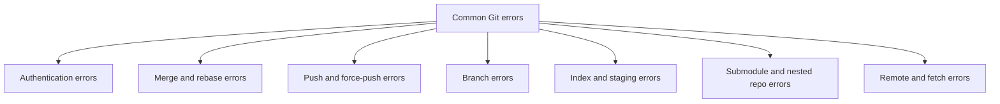

# 5. Common Git Errors and Fixes

> **Tags:** #git #troubleshooting #errors #reference

A consolidated catalog of the Git errors most frequently encountered by developers, with the cause and the fix for each. Use this as a field manual when an error message appears.

---

## 5.1 Error Catalog



---

## 5.2 Authentication Errors

### "Invalid username or token. Password authentication is not supported."

**Cause:** Since August 13, 2021, GitHub no longer accepts passwords over HTTPS.

**Fix:** Use a Personal Access Token (PAT) or switch to SSH. See [[1. Password Authentication Not Supported]] for the full procedure.

### "Permission denied (publickey)."

**Cause:** SSH key authentication failed. Either the public key is not on GitHub, the private key file has wrong permissions, the SSH agent is not running, or the agent does not have the key loaded.

**Fix:** Verify each in order:

```bash
# Public key on GitHub?
ls ~/.ssh/*.pub
cat ~/.ssh/id_ed25519.pub  # copy and paste to GitHub settings

# Private key permissions?
chmod 600 ~/.ssh/id_ed25519

# Agent running?
eval "$(ssh-agent -s)"

# Key loaded?
ssh-add ~/.ssh/id_ed25519

# Test
ssh -T git@github.com
```

### "remote: Repository not found. fatal: 'repo' does not seem to be a git repository"

**Cause:** Either the URL is wrong, the repository does not exist, or you do not have access (and GitHub hides private repos by pretending they do not exist).

**Fix:**

- Verify the URL: `git remote -v`.
- Verify you can access the repository on the web.
- If private, verify you are authenticated as a user with access.

---

## 5.3 Merge and Rebase Errors

### "fatal: refusing to merge unrelated histories"

**Cause:** The two branches being merged share no common ancestor. This typically happens when a remote has an initial commit created through the web UI (e.g., a README) and the local repository was initialized separately.

**Fix:** Explicitly allow unrelated histories:

```bash
git merge origin/main --allow-unrelated-histories
```

Then resolve any conflicts. Going forward, avoid this by pushing from your local repository before creating anything on the GitHub UI. See [[2. Making a Branch the Default and Single Timeline]] for a full case study.

### "CONFLICT (content): Merge conflict in <file>"

**Cause:** Both branches modified the same lines of the same file. Git cannot decide which version to keep.

**Fix:**

1. Open the file. Conflict markers look like:
   ```
   <<<<<<< HEAD
   Your local version
   =======
   The incoming version
   >>>>>>> feature-branch
   ```
2. Edit the file to keep what you want (you can keep one, the other, or a combination).
3. Remove the conflict markers.
4. Stage the file: `git add <file>`.
5. Commit the merge: `git commit` (the default merge message is fine).

To abort the merge entirely:

```bash
git merge --abort
```

### "error: cannot rebase: You have unstaged changes."

**Cause:** Rebase requires a clean working tree.

**Fix:** Commit or stash your changes first:

```bash
git stash
git rebase main
git stash pop
```

### "The previous cherry-pick is now empty, possibly due to conflict resolution."

**Cause:** You tried to cherry-pick a commit whose changes are already present in the current branch.

**Fix:** Skip the cherry-pick:

```bash
git cherry-pick --skip
```

Or, if you intentionally want an empty commit:

```bash
git cherry-pick --allow-empty
```

---

## 5.4 Push and Force-Push Errors

### "Updates were rejected because the remote contains work that you do not have locally."

**Cause:** Someone else pushed commits you have not pulled. A plain push would overwrite their work.

**Fix:** Pull (or fetch + rebase) first:

```bash
git pull --rebase origin main
git push
```

### "Updates were rejected because a pushed branch tip is behind its remote counterpart."

**Cause:** Same as above — your local branch is behind the remote.

**Fix:** Same — pull first.

### "! [rejected] main -> main (non-fast-forward)" after a rebase or amend

**Cause:** You rewrote local history that has already been pushed. The remote has the old commits; your local has new ones with different hashes.

**Fix:** If this is a branch only you work on, force-push:

```bash
git push --force-with-lease
```

Never force-push to shared branches (`main`, `develop`). It rewrites everyone's history.

### "fatal: the remote end hung up unexpectedly" on large pushes

**Cause:** Push too large for the default buffer or network issue.

**Fix:** Increase the post buffer:

```bash
git config --global http.postBuffer 524288000
```

Or push in smaller batches by branch.

---

## 5.5 Branch Errors

### "fatal: not a valid object name: 'feature-branch'"

**Cause:** The branch you are trying to checkout does not exist locally or on any remote.

**Fix:**

- List branches: `git branch -a`.
- If it exists only on a remote you have not fetched: `git fetch --all`.
- If it does not exist at all, create it: `git switch -c feature-branch`.

### "error: pathspec 'file.txt' did not match any file(s) known to git"

**Cause:** You tried to `git add` or `git checkout` a file that does not exist (or is not tracked).

**Fix:** Check the path: `ls path/to/file.txt`. If the file exists but is untracked, `git add path/to/file.txt` should work. If the path has spaces, quote it.

### "Cannot delete branch 'main' which is currently checked out"

**Cause:** You cannot delete the branch you are currently on.

**Fix:** Switch to another branch first:

```bash
git switch main
git branch -D feature-branch
```

---

## 5.6 Index and Staging Errors

### "fatal: Unable to create '/path/.git/index.lock': File exists."

**Cause:** Another Git process is running, or a previous Git command crashed and left a stale lock file.

**Fix:** Verify no other Git process is running (check `ps aux | grep git`), then remove the lock:

```bash
rm .git/index.lock
```

Be careful — only remove the lock if you are sure no other Git process is active.

### "fatal: bad object refs/heads/main"

**Cause:** The branch ref points to a commit that does not exist in the object store. This usually indicates repository corruption.

**Fix:** Try `git fsck` to identify broken objects:

```bash
git fsck --full
```

If the corruption is severe, you may need to re-clone from a healthy remote.

### "Changes not staged for commit" after `git add .`

**Cause:** The files were added but then modified again before commit. Or, on older Git versions, deletions were not included in `git add .`.

**Fix:**

- Use `git add -A` to include deletions.
- Re-stage after modifying: `git add <file>`.
- Check status with `git status` to see exactly what is staged.

---

## 5.7 Submodule and Nested Repository Errors

### "fatal: No url found for submodule path 'path' in .gitmodules"

**Cause:** Git sees `path` as a submodule (because there is a gitlink entry in the tree), but there is no corresponding entry in `.gitmodules`.

**Fix:** Either add the submodule properly to `.gitmodules`, or remove the cached entry:

```bash
git rm --cached path
```

Then commit. See also [[4. Why a Folder Might Appear Green in Git Tools]] for the related scenario of accidentally nested repositories.

### "fatal: cannot run git: No such file or directory" inside a submodule

**Cause:** The submodule was not initialized or updated.

**Fix:**

```bash
git submodule update --init --recursive
```

---

## 5.8 Remote and Fetch Errors

### "fatal: 'origin' does not appear to be a git repository"

**Cause:** The remote URL is wrong, or you have not added a remote named `origin`.

**Fix:**

```bash
git remote -v
# If empty, add the remote:
git remote add origin git@github.com:USER/REPO.git
```

### "fatal: ref refs/remotes/origin/HEAD is not a symbolic ref"

**Cause:** Your local `origin/HEAD` is broken — it points directly to a commit instead of to a branch ref.

**Fix:** See [[3. Origin HEAD Not a Symbolic Ref]].

```bash
git remote set-head origin -a
```

### "RPC failed; curl 56 GnuTLS recv error"

**Cause:** A network problem during a large clone or fetch, often related to TLS buffer issues.

**Fix:** Try a shallow clone or increase the buffer:

```bash
git clone --depth 1 <url>
# or
git config --global http.postBuffer 1048576000
```

---

## 5.9 The Universal First Step: Read the Error Message

Every Git error message contains a hint. Before searching the web, read the message carefully. Common patterns:

- "fatal:" — Git could not complete the operation. The reason follows.
- "error:" — A specific failure within a larger operation.
- "warning:" — Something unusual happened but the operation completed.
- "hint:" — Git is suggesting a command to fix the situation.

When in doubt, run `git status` and `git log --oneline -5` to orient yourself before doing anything destructive.

---

## 5.10 The Safety Net: `git reflog`

If you ever make a destructive mistake — `git reset --hard`, force-push, accidental branch deletion — `git reflog` records where HEAD has been:

```bash
git reflog
```

Output looks like:

```
a1b2c3d HEAD@{0}: reset: moving to HEAD~1
d4e5f6a HEAD@{1}: commit: add feature
9f8e7d6 HEAD@{2}: checkout: moving from main to feature
```

To recover a previous state:

```bash
git reset --hard HEAD@{1}
```

The reflog is local only — it is not pushed. Entries are kept for 90 days by default (configurable). If you discover a mistake within that window, you can almost always recover.

---

## 5.11 Key Takeaways

- Most Git errors have specific, well-documented causes and fixes.
- Read the error message carefully before searching the web.
- `git status` and `git reflog` are your two most important diagnostic tools.
- Never force-push to shared branches.
- `git fsck` diagnoses repository corruption; `git reflog` recovers from mistakes.

---

**Previous:** [[4. Why a Folder Might Appear Green in Git Tools]]
**Next chapter:** [[1. Introduction to Vim]] (Chapter 3)
