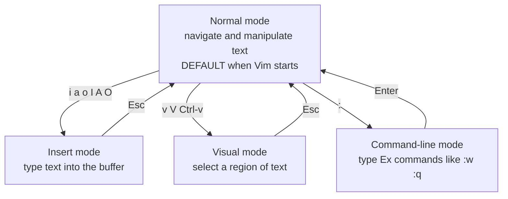
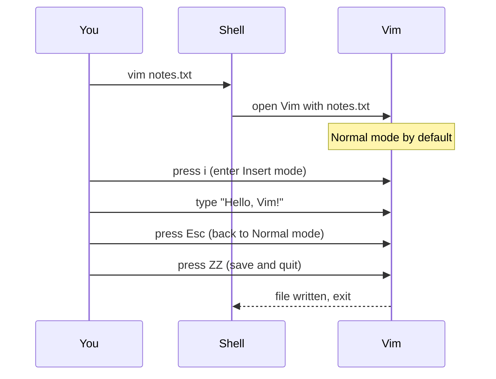

# 1. Introduction to Vim

> **Tags:** #vim #neovim #foundations #editor

Vim (Vi IMproved) and its modern fork Neovim are **modal text editors**. They look like ordinary terminal editors at first glance, but their entire design philosophy is different from editors like Notepad, VS Code, or Sublime Text. This note introduces that philosophy and the essential commands you need to start, use, and exit Vim without confusion.

---

## 1.1 What Makes Vim Different: Modes

Most editors are **modeless**: whatever you type appears in the document. There is no concept of "states" — typing `a` always inserts the letter `a`.

Vim is **modal**: the effect of a keystroke depends on the current mode. There are four modes that matter for a beginner:



| Mode | Purpose | How to enter | How to exit |
| --- | --- | --- | --- |
| **Normal** | Navigate, delete, copy, paste, manipulate text. This is the default. | (default at startup) or press `Esc` from any other mode | — |
| **Insert** | Type text into the buffer as in a normal editor. | `i`, `a`, `o`, `I`, `A`, `O` from Normal mode | `Esc` (back to Normal) |
| **Visual** | Select a region of text for an operation. | `v` (char), `V` (line), `Ctrl-v` (block) from Normal | `Esc` (back to Normal) |
| **Command-line** | Type Ex commands like `:w`, `:q`, `:s/old/new/g`. | `:` from Normal mode | `Enter` (run) or `Esc` (cancel) |

The single biggest mistake new Vim users make is **trying to type while in Normal mode**. They open Vim, see a cursor, start typing, and watch in horror as random things happen — files are deleted, lines are joined, the cursor jumps. That is because Normal mode keystrokes are *commands*, not text. Always check your mode before typing.

---

## 1.2 Starting Vim

Open a file from the terminal:

```bash
vim filename.txt
```

If the file exists, Vim opens it. If it does not exist, Vim creates an empty buffer and will write the file when you save.

To open multiple files in tabs:

```bash
vim -p file1.txt file2.txt
```

To open Neovim instead:

```bash
nvim filename.txt
```

For the rest of this chapter, "Vim" refers to both Vim and Neovim — the basics are identical.

---

## 1.3 The Default Mode Is Normal

When Vim starts, you are in **Normal mode**. The cursor is a block, not a line. You cannot type text into the document from Normal mode — your keystrokes are interpreted as commands.

To verify you are in Normal mode, press `Esc` once or twice. Vim beeps or flashes to confirm. (You can disable the beep with `:set noerrorbells` if it annoys you.)

---

## 1.4 Entering Insert Mode

There are six ways to enter Insert mode, each placing the cursor differently:

| Key | Cursor position after entering Insert mode |
| --- | --- |
| `i` | Insert at the current cursor position. |
| `a` | Append — move cursor one character right, then enter Insert. |
| `I` | Insert at the **beginning** of the line (first non-blank character). |
| `A` | Append at the **end** of the line. |
| `o` | Open a new line **below** the current line and enter Insert. |
| `O` | Open a new line **above** the current line and enter Insert. |

A useful mnemonic: **i**nsert, **a**ppend, **o**pen. Their uppercase versions go to the "extreme" of the line (`I` = beginning, `A` = end) or the opposite direction (`O` = above).

Once you are in Insert mode, the cursor becomes a vertical line, and typing works as in any other editor: characters appear at the cursor, Backspace deletes the previous character, arrows move the cursor.

---

## 1.5 Returning to Normal Mode

Press `Esc` to return to Normal mode. If you are unsure which mode you are in, press `Esc` twice — Vim will beep on the second press, confirming you were already in Normal mode the first time.

Many experienced Vim users remap `Caps Lock` to `Esc` because `Esc` is far from the home row on most keyboards. On macOS and Linux, this is a system setting; on Windows, tools like PowerToys can do it.

In Neovim, you can also use `Ctrl-c` as a synonym for `Esc` (slightly faster to type). Some users prefer `jk` or `kj` mapped to `Esc`:

```vim
inoremap jk <Esc>
```

This way, you never leave the home row.

---

## 1.6 Saving and Quitting

These are command-line mode commands. Type `:` from Normal mode, then the command, then `Enter`.

| Command | What it does |
| --- | --- |
| `:w` | **Write** (save) the buffer to disk. |
| `:q` | **Quit** Vim. Fails if there are unsaved changes. |
| `:wq` | Write and quit. |
| `:x` | Write (only if changed) and quit. Same as `:wq` but skips writing if nothing changed. |
| `:q!` | Quit **without saving** (force quit). |
| `:w!` | Write **even if read-only** is set (forces overwrite). |
| `:wq!` | Force write and quit. |
| `ZZ` | Save and quit (same as `:x`). Two capital Z's, no colon. |
| `ZQ` | Quit without saving (same as `:q!`). Two capital Q's. |

The two-letter `ZZ` and `ZQ` shortcuts are faster than their `:` equivalents because they skip the command-line mode. Memorize them.

---

## 1.7 A First Workflow

Here is the simplest possible workflow in Vim:



Step by step:

1. `vim notes.txt` — open Vim with `notes.txt` (creating it if it does not exist).
2. Press `i` — enter Insert mode. The cursor changes from block to line.
3. Type `Hello, Vim!` — the text appears in the buffer.
4. Press `Esc` — return to Normal mode. The cursor becomes a block again.
5. Press `ZZ` (capital Z twice) — save the buffer to `notes.txt` and quit Vim.

You are back at the shell prompt, and `notes.txt` contains `Hello, Vim!`.

---

## 1.8 What If I Am Stuck in Vim?

The classic "how do I quit Vim?" joke exists because beginners open Vim by accident (often through `git commit` without a configured editor), type some characters, panic, and cannot figure out how to leave.

If you are stuck:

1. Press `Esc` to make sure you are in Normal mode.
2. Type `:q!` and press `Enter`. This quits without saving any changes.

If you want to save your work:

1. Press `Esc`.
2. Type `:wq` and press `Enter`.

That is the minimum to escape. Everything else in this chapter builds on top of this foundation.

---

## 1.9 Configuring Vim: The vimrc

Vim reads configuration from a file called `.vimrc` (Vim) or `init.vim` (Neovim) at startup. A minimal config to make Vim friendlier:

```vim
" Enable syntax highlighting
syntax on

" Show line numbers
set number

" Highlight the current line
set cursorline

" Use spaces instead of tabs
set expandtab
set tabstop=4
set shiftwidth=4

" Show partial commands in the bottom right
set showcmd

" Highlight matching brackets
set showmatch

" Allow hidden buffers (switch without saving)
set hidden

" Better search
set incsearch
set hlsearch
set ignorecase
set smartcase
```

Place this in `~/.vimrc` (Vim) or `~/.config/nvim/init.vim` (Neovim). Restart Vim to pick it up.

For Neovim with Lua (`init.lua`), the equivalent is:

```lua
vim.cmd('syntax on')
vim.wo.number = true
vim.wo.cursorline = true
vim.opt.expandtab = true
vim.opt.tabstop = 4
vim.opt.shiftwidth = 4
vim.opt.showcmd = true
vim.opt.hlsearch = true
vim.opt.incsearch = true
vim.opt.ignorecase = true
vim.opt.smartcase = true
```

---

## 1.10 Vim vs Neovim: What Is the Difference?

Neovim (Nvim) is a fork of Vim, created in 2014 to modernize the codebase and add features that were hard to add in Vim itself. The two are compatible at the user level — almost everything in this chapter works identically in both.

Key differences:

| Aspect | Vim | Neovim |
| --- | --- | --- |
| Default config file | `~/.vimrc` (Vimscript) | `~/.config/nvim/init.vim` (Vimscript) or `init.lua` (Lua) |
| Configuration language | Vimscript only | Vimscript and Lua |
| Built-in terminal emulator | Limited (`:terminal`) | First-class (`:terminal`) |
| LSP (Language Server Protocol) support | Via plugins (coc.nvim, etc.) | Built-in (`vim.lsp`) |
| Default plugin manager | None (use vim-plug, pathogen, etc.) | None, but built-in package support is cleaner |
| Codebase | C, older | C, refactored and tested |
| Async jobs | Limited (Vim 8+ jobs) | First-class (Lua `vim.uv`) |
| Community momentum | Established, conservative | Faster-moving, larger modern plugin ecosystem |

For a new learner, either works. Neovim is the more future-proof choice if you are starting today and willing to use Lua for configuration. Vim is still the right choice if you log into servers where only Vim is installed.

---

## 1.11 Common Mistakes

- **Typing in Normal mode.** Random text manipulations happen. Press `Esc` first.
- **Forgetting to save.** `:q` will fail with "E37: No write since last change". Use `:wq` or `:x`.
- **Using the mouse.** Vim is keyboard-first. While mouse support exists, learning the keyboard motions is what makes Vim fast.
- **Treating Vim like Notepad.** Vim's power is in its commands, not in typing text. If you spend most of your time in Insert mode, you are not using Vim — you are using a slow editor.
- **Trying to learn everything at once.** Vim has hundreds of commands. Learn ten at a time. The next notes in this chapter will give you the most important ones.

---

## 1.12 Key Takeaways

- Vim is **modal**: Normal, Insert, Visual, Command-line.
- **Normal mode is the default.** Press `Esc` to return to it from any other mode.
- Enter Insert mode with `i`, `a`, `o`, `I`, `A`, `O`.
- Save and quit with `:wq` (or `ZZ`); quit without saving with `:q!` (or `ZQ`).
- If you are stuck, press `Esc`, type `:q!`, press `Enter`.
- Configure Vim through `~/.vimrc` or `~/.config/nvim/init.vim`.

---

**Next:** [[2. Moving Basics]]
