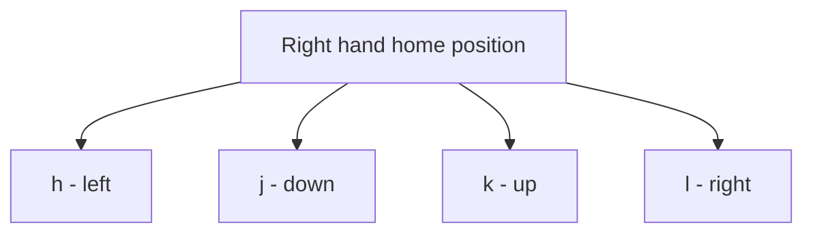

# 2. Moving Basics

> **Tags:** #vim #neovim #motion #foundations

The single biggest productivity gain in Vim comes from **never using the mouse**. Once you stop reaching for the mouse or arrow keys, editing speed doubles. This note covers the foundational motion commands that let you navigate a file purely with the keyboard.

---

## 2.1 The Home Row Principle

Vim's motion keys are designed so your hands stay on the home row of the keyboard:

```
q w e r t y u i o p
a s d f g h j k l ;
z x c v b n m , . /
```

The most important motion keys — `h`, `j`, `k`, `l` — sit directly under your right hand's home position. You never need to leave the home row to move the cursor.



| Key | Direction |
| --- | --- |
| `h` | Left one character |
| `j` | Down one line |
| `k` | Up one line |
| `l` | Right one character |

A useful mnemonic: `j` looks like a downward hook; `k` points up; `h` and `l` are on the left and right ends of the four.

---

## 2.2 Why Not Use Arrow Keys?

You *can* use the arrow keys in Vim — they work in Normal mode and Insert mode. But you should not, for two reasons:

1. **They force you to leave the home row.** Reaching for the arrow keys takes time and breaks flow.
2. **They train the wrong habit.** Once you are used to arrow keys, learning `hjkl` later is painful. Better to learn correctly from the start.

Many experienced Vim users **disable the arrow keys** in their config to force the habit:

```vim
nnoremap <Left> <Nop>
nnoremap <Right> <Nop>
nnoremap <Up> <Nop>
nnoremap <Down> <Nop>
```

---

## 2.3 Character Motion

The simplest motions move the cursor one character at a time:

- `h` — left
- `l` — right

You can prefix any motion with a **count** to repeat it. For example:

- `5h` — move 5 characters left
- `10l` — move 10 characters right

Counts work with nearly every Vim motion and command. They are one of Vim's most powerful features.

---

## 2.4 Line Motion

Within a line:

| Key | Action |
| --- | --- |
| `0` | Move to the **first character** of the line (column 0). |
| `^` | Move to the **first non-blank character** of the line (useful with indented code). |
| `$` | Move to the **last character** of the line. |
| `g_` | Move to the last non-blank character of the line. |
| `f<char>` | Move to the next occurrence of `<char>` on the line (e.g., `f,` jumps to the next comma). |
| `F<char>` | Move to the previous occurrence of `<char>` (backward search). |
| `t<char>` | Move until just before the next `<char>` (e.g., `t,` puts cursor before the next comma). |
| `T<char>` | Move until just after the previous `<char>`. |
| `;` | Repeat the last `f`, `F`, `t`, or `T`. |
| `,` | Repeat the last `f`, `F`, `t`, or `T` in the opposite direction. |

Between lines:

| Key | Action |
| --- | --- |
| `j` | Down one line. |
| `k` | Up one line. |
| `gj` | Down one **displayed** line (matters when `wrap` is on and a long line wraps). |
| `gk` | Up one displayed line. |
| `gg` | Go to the first line of the file. |
| `G` | Go to the last line of the file. |
| `:<line>` | Go to a specific line number (e.g., `:42` jumps to line 42). |
| `<n>G` | Go to line `<n>` (e.g., `42G` jumps to line 42). |
| `H` | Go to the **H**ighest line visible on screen (top of viewport). |
| `M` | Go to the **M**iddle line visible on screen. |
| `L` | Go to the **L**owest line visible on screen (bottom of viewport). |
| `Ctrl-d` | Scroll **down** half a page. |
| `Ctrl-u` | Scroll **up** half a page. |
| `Ctrl-f` | Scroll **forward** a full page. |
| `Ctrl-b` | Scroll **backward** a full page. |
| `Ctrl-e` | Scroll down one line without moving the cursor. |
| `Ctrl-y` | Scroll up one line without moving the cursor. |
| `zz` | Center the current line on screen. |
| `zt` | Put the current line at the top of the screen. |
| `zb` | Put the current line at the bottom of the screen. |

---

## 2.5 Word Motion

Word motion is the workhorse of Vim navigation. The three primary keys are `w`, `b`, `e`, plus their uppercase and "WORD" variants:

| Key | Action |
| --- | --- |
| `w` | Move to the start of the next **word**. |
| `b` | Move to the start of the previous word (backward). |
| `e` | Move to the end of the current word (or next word if already at end). |
| `W` | Same as `w` but for **WORDs** (see below). |
| `B` | Same as `b` but for WORDs. |
| `E` | Same as `e` but for WORDs. |

**Word vs WORD:** A *word* is a sequence of letters, digits, and underscores, OR a sequence of other non-blank characters. Punctuation breaks words. A *WORD* is any sequence of non-blank characters — punctuation does not break WORDs.

For example, in `foo.bar.baz`:
- `w` moves: `foo` → `.` → `bar` → `.` → `baz` (5 jumps to traverse).
- `W` moves: `foo.bar.baz` is one WORD, so `W` jumps to the next WORD after it.

Word motion is so important it has its own dedicated note: [[3. Word Jumping With B W E]].

---

## 2.6 Paragraph and Section Motion

| Key | Action |
| --- | --- |
| `{` | Move to the previous paragraph (block of text separated by blank lines). |
| `}` | Move to the next paragraph. |
| `(` | Move to the start of the current sentence. |
| `)` | Move to the start of the next sentence. |
| `[[` | Move to the previous section (typically a function definition in code). |
| `]]` | Move to the next section. |

These are particularly useful in code, where blank lines often separate functions.

---

## 2.7 Search Motion

| Key | Action |
| --- | --- |
| `/<pattern>` | Search forward for `<pattern>`. |
| `?<pattern>` | Search backward. |
| `n` | Repeat the last search in the same direction. |
| `N` | Repeat the last search in the opposite direction. |
| `*` | Search forward for the word under the cursor. |
| `#` | Search backward for the word under the cursor. |

Search is a motion — you can use it as the destination for any command. For example, `d/foo<CR>` deletes from the cursor to the next occurrence of "foo".

---

## 2.8 Mark Motion

Marks let you bookmark positions in a file and jump back to them.

| Key | Action |
| --- | --- |
| `m<a-z>` | Set a mark with the given letter (e.g., `ma` sets mark `a`). |
| `` `<a-z>`` | Jump to the line and column of mark `<a-z>` (e.g., `` `a `` jumps to mark `a`). |
| `'<a-z>` | Jump to the first non-blank character of the line of mark `<a-z>`. |
| `m<A-Z>` | Set a **global** mark (works across files). |
| `` `<A-Z>`` | Jump to a global mark. |
| `` `` `` | Jump back to the position before the last jump. |
| `` `.`` | Jump to the position of the last edit. |

Marks are incredibly useful for "go look at something, then come back" workflows. Set mark `a`, go read code elsewhere, return with `` `a ``.

---

## 2.9 Putting Motion to Work: Counts and Operators

The true power of Vim motion comes from combining **counts**, **motions**, and **operators**:

```
[count] [operator] [count] [motion]
```

Examples:

| Command | What it does |
| --- | --- |
| `2j` | Move down 2 lines. |
| `3w` | Move forward 3 words. |
| `d3w` | Delete 3 words. |
| `2dd` | Delete 2 lines. |
| `d$` | Delete to end of line. |
| `d0` | Delete to beginning of line. |
| `df,` | Delete from cursor up to and including the next comma. |
| `dt)` | Delete from cursor up to but not including the next `)`. |
| `caw` | Change (delete + enter Insert mode) the current word. |
| `yas` | Yank (copy) the current sentence. |
| `ggdG` | Go to top, then delete to end (clears the entire buffer). |

The pattern is: every motion can be the target of an operator. Once you internalize this, you start editing in **chunks** rather than character by character.

---

## 2.10 A Practice Routine

To build muscle memory, spend 10 minutes a day on each of these drills:

1. **`hjkl` only.** Disable arrow keys, navigate a file using only `hjkl` for 5 minutes.
2. **Word motion.** Navigate using only `w`, `b`, `e`, `W`, `B`, `E` for 5 minutes.
3. **Line extremes.** Use `0`, `^`, `$`, `g_` to jump to line boundaries.
4. **Find on line.** Use `f<char>`, `F<char>`, `t<char>`, `T<char>`, `;`, `,` to navigate within a line by character.
5. **Page motion.** Use `Ctrl-d`, `Ctrl-u`, `Ctrl-f`, `Ctrl-b`, `H`, `M`, `L`, `gg`, `G` to navigate a large file.
6. **Search.** Use `/`, `?`, `n`, `N`, `*`, `#` to navigate by content.

After a week of this, your hands will know the keys without conscious thought.

---

## 2.11 Common Mistakes

- **Reaching for the mouse.** Every mouse trip breaks flow. Force yourself to use the keyboard.
- **Using arrow keys.** They work but they slow you down and prevent muscle memory for `hjkl`.
- **Not using counts.** Typing `jjjjjjjjj` instead of `9j` is a clear sign you have not internalized counts.
- **Using `:42<CR>` instead of `42G`.** Both work, but `42G` is faster.
- **Not using search as motion.** Once you start using `/` and `*` as navigation, you stop scrolling aimlessly.

---

## 2.12 Key Takeaways

- `hjkl` for character motion — never use the arrow keys.
- `0`, `^`, `$` for line extremes.
- `w`, `b`, `e` for word motion; `W`, `B`, `E` for WORD motion.
- `gg`, `G`, `:<n>`, `<n>G` for jumping across the file.
- `Ctrl-d`, `Ctrl-u`, `H`, `M`, `L`, `zz` for viewport control.
- `/`, `?`, `n`, `N`, `*`, `#` for search-based motion.
- Counts and operators combine with motion for powerful edits: `d3w`, `2dd`, `caw`.

---

**Previous:** [[1. Introduction to Vim]]
**Next:** [[3. Word Jumping With B W E]]
