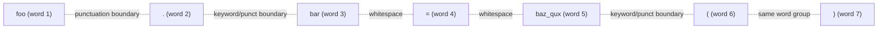
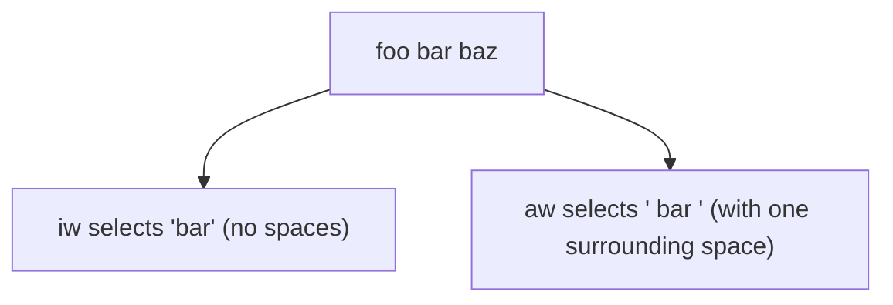

# 3. Word Jumping With B W E

> **Tags:** #vim #neovim #motion #words

The three motion keys `b`, `w`, `e` are the most-used navigation tools in Vim after `hjkl`. They move the cursor by **word**, and they have uppercase variants `B`, `W`, `E` that move by **WORD**. The distinction between "word" and "WORD" is subtle but important — this note explains it thoroughly with examples.

---

## 3.1 The Three Operators

| Key | Direction | Lands on |
| --- | --- | --- |
| `w` | Forward | Start of next word |
| `e` | Forward | End of current word (or next if already at end) |
| `b` | Backward | Start of current word (or previous if already at start) |
| `W` | Forward | Start of next WORD |
| `E` | Forward | End of current WORD |
| `B` | Backward | Start of current WORD |

Mnemonic:

- **w** = word (forward)
- **e** = end (forward, lands on last char)
- **b** = back (backward)
- **Uppercase** = "bigger" (WORD, includes punctuation)

---

## 3.2 Word vs WORD

This is the crucial distinction.

A **word** in Vim is one of:

1. A sequence of **letters, digits, and underscores** (a "keyword character" sequence).
2. A sequence of **other non-blank characters** (a "punctuation" sequence).

Whitespace separates words, but so does the boundary between keyword characters and punctuation.

A **WORD** is a sequence of **any non-blank characters**. Only whitespace separates WORDs.

### Worked Example

Consider the text:

```
foo.bar = baz_qux()
```

Let's number the words/WORDs:



Word boundaries (lowercase `w`): `foo` | `.` | `bar` | `=` | `baz_qux` | `(` | `)` — **7 words**.

WORD boundaries (uppercase `W`): `foo.bar` | `=` | `baz_qux()` — **3 WORDs**.

So if the cursor is at the start of `foo`:

- `w` jumps to `.`
- `W` jumps to `=`

And from `=`:

- `w` jumps to `b` (start of `baz_qux`)
- `W` jumps to `b` (start of `baz_qux`)

In this case, both land on `b`, but the cursor stops at intermediate points for `w` that `W` skips.

---

## 3.3 Detailed Examples

Consider the sentence:

```
This is a test sentence.
```

With the cursor at the `T` of `This`:

| Command | Cursor lands on | Explanation |
| --- | --- | --- |
| `w` | `i` of `is` | Start of next word |
| `e` | `s` of `This` (last char) | End of current word |
| `b` | (no move) | Already at start of word |
| `2w` | `a` of `a` | Two words forward |
| `3w` | `t` of `test` | Three words forward |
| `4w` | `s` of `sentence` | Four words forward (skips `.`? no — `.` is its own word) |

Wait — let's be careful. In `sentence.`, the period is its own word because it is punctuation. So actually:

- `4w` from `T` lands on `s` of `sentence` (word 4).
- `5w` from `T` lands on `.` (word 5).
- `6w` from `T` is past the end of the line.

With the cursor at the last `s` of `This`:

| Command | Cursor lands on |
| --- | --- |
| `w` | `i` of `is` |
| `e` | `s` of `This` (already at end — stays? No, `e` moves to end of *next* word if already at end) |

Actually, `e` moves to the end of the *next* word if the cursor is already at the end of the current word. So from `s` of `This`:

- `e` moves to `s` of `is` (end of next word).

With the cursor at `e` (last letter) of `sentence`:

| Command | Cursor lands on |
| --- | --- |
| `w` | `.` (the period — it is its own word) |
| `e` | `.` (the period — same end) |
| `b` | `c` of `sentence` (start of current word — but wait, we are at the end. `b` from end-of-word goes to start of *current* word) |

Actually `b` from the middle or end of a word goes to the start of the *current* word. From the start of a word, `b` goes to the start of the *previous* word.

These details are subtle. The best way to internalize them is to open Vim and try them.

---

## 3.4 Combining With Operators

`w`, `e`, `b` are motions — they can be the target of any operator (`d`, `c`, `y`, `v`).

| Command | What it does |
| --- | --- |
| `dw` | Delete from cursor to start of next word (deletes the word AND trailing whitespace). |
| `de` | Delete from cursor to end of current word (deletes the word only, NOT trailing whitespace). |
| `db` | Delete from cursor back to start of previous word. |
| `cw` | Change word — delete to start of next word and enter Insert mode. |
| `ce` | Change to end of word — delete to end of current word and enter Insert mode. |
| `cb` | Change backward — delete to start of current word and enter Insert mode. |
| `yw` | Yank (copy) word. |
| `ye` | Yank to end of word. |
| `yb` | Yank backward. |
| `vwy` | Visual-select word and yank (equivalent to `yw`). |
| `daw` | Delete **a** word — deletes the word AND surrounding whitespace (special "a" form). |
| `diw` | Delete **inner** word — deletes the word only, no surrounding whitespace. |
| `caw` | Change a word. |
| `ciw` | Change inner word. |

The `aw`, `iw` forms are called **text objects**. They are more semantically meaningful than plain `w`/`e`/`b` for word-based edits.



---

## 3.5 Differences From Plain Word Motion

A subtle but important difference:

- `dw` deletes from the cursor *up to but not including* the start of the next word. If the cursor is in the middle of a word, `dw` deletes only the rest of that word.
- `de` deletes from the cursor *up to and including* the end of the current word.
- `daw` deletes the entire word the cursor is on, regardless of where in the word the cursor is, plus one surrounding space.

For "delete the whole word I am on", use `daw`, not `dw`.

---

## 3.6 Practice With Real Code

Open a code file and try these drills:

1. Place the cursor on the first character of a line.
2. Press `w` repeatedly. Notice how it stops at every punctuation mark.
3. Press `W` repeatedly. Notice how it skips punctuation and only stops at whitespace.
4. Press `e` repeatedly. Notice that it lands on the last character of each word.
5. Press `b` repeatedly to go back.
6. Now try `daw` on a word — the whole word and a trailing space should disappear.
7. Try `ciw` on a word — the word should disappear and you should be in Insert mode ready to type a replacement.
8. Try `ea` to put the cursor at the end of the current word and enter Insert mode (append).

---

## 3.7 A Common Workflow: Renaming a Variable

To rename a variable cleanly:

1. Place the cursor on the variable.
2. Press `*` to search for the next occurrence.
3. Press `ciw` to change the word — type the new name.
4. Press `Esc` to return to Normal mode.
5. Press `n` to go to the next occurrence.
6. Press `.` to repeat the change (the `.` command repeats the last change).
7. Repeat `n` and `.` until done.

This is dramatically faster than selecting with a mouse and retyping.

---

## 3.8 Tips and Gotchas

- **`w` from the last word of a line** moves to the first word of the next line. If you want to stay on the same line, use `e` instead, or use a more specific motion like `f<char>`.
- **`b` from the first word of a line** moves to the last word of the previous line.
- **`e` lands on the last character**, not the position after. This matters for operators: `de` includes the last character; `dw` does not include the start of the next word.
- **`iw`, `aw` are text objects, not motions.** They work with operators but not as standalone cursor moves. Pressing `iw` alone does nothing.
- **Use `W` for URLs and file paths.** A URL like `https://example.com/path` is one WORD but many words (because of `:`, `/`, `.`). `W` jumps over it cleanly; `w` stops at every punctuation mark.

---

## 3.9 Common Mistakes

- **Confusing `w` and `e`.** `w` lands on the *start* of the next word; `e` lands on the *end* of the current word. They feel similar but produce different selections when used with operators.
- **Using `dw` to delete a whole word.** If the cursor is in the middle of the word, `dw` only deletes from the cursor forward. Use `daw` instead.
- **Forgetting `iw` and `aw`.** These text objects are the right tool for "operate on this word" — learn them early.
- **Not using `W` for code with dots.** `obj.method.property` is three words but one WORD. `W` skips the dots.

---

## 3.10 Key Takeaways

- `w`, `e`, `b` move by **word** (punctuation breaks words).
- `W`, `E`, `B` move by **WORD** (only whitespace breaks WORDs).
- `e` lands on the last character; `w` lands on the first character of the next word.
- `iw`, `aw` are text objects for operating on a whole word.
- Use `daw` to delete a whole word; `ciw` to change a whole word.
- `.` repeats the last change — combine with `*` and `n` for fast renaming.

---

**Previous:** [[2. Moving Basics]]
**Next:** [[4. Active Recall Test 0 Intro]]
