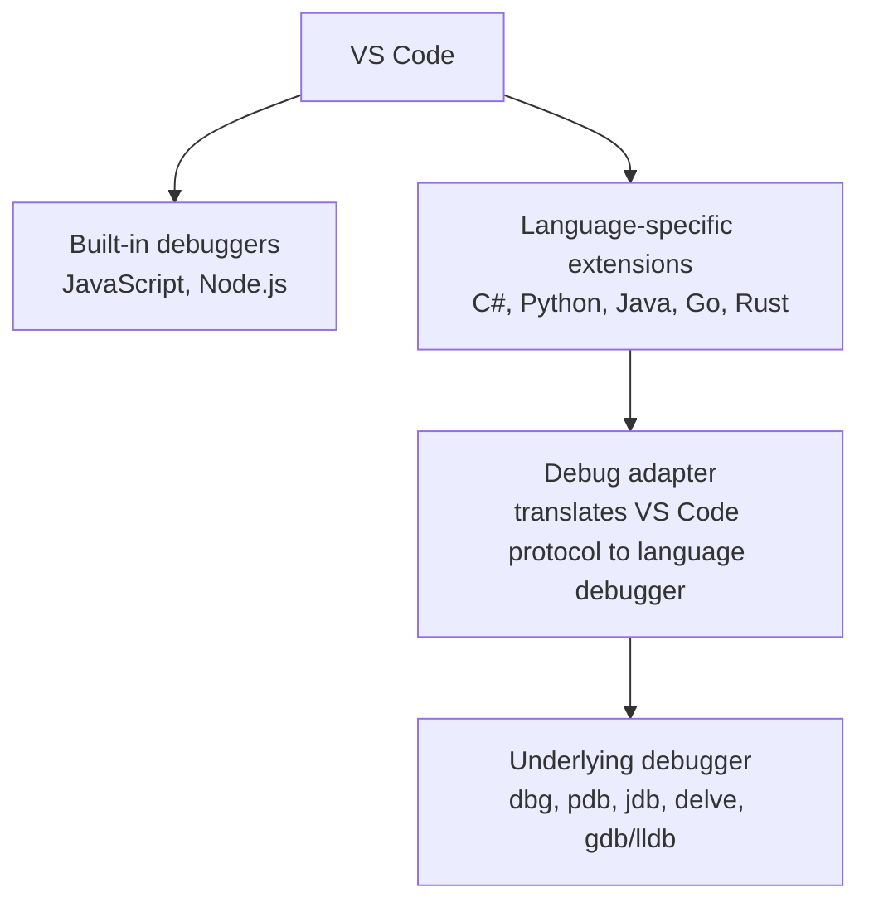
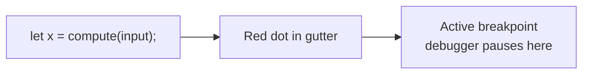
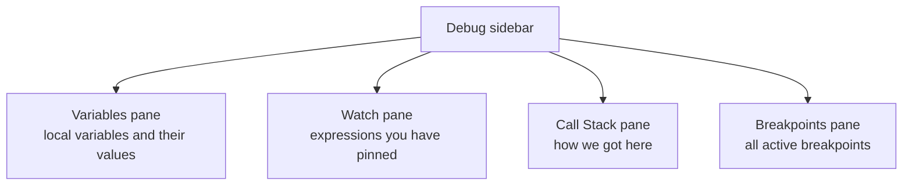
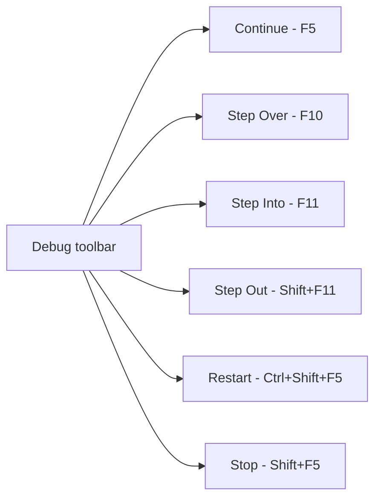

# 1. Getting Started with Debugging

> **Tags:** #vscode #debugging #javascript #nodejs #csharp #react #webdev #launchjson

This note covers the foundational setup and workflow for debugging in VS Code: setting breakpoints, understanding the debug sidebar, and running your first session. Later notes in this chapter drill into each toolbar button, breakpoint strategy, and the Watch pane.

---

## 1.1 What Debugging Actually Is

**Debugging** is the process of running a program under the control of a **debugger** — a tool that lets you:

1. Pause execution at specific lines of code.
2. Inspect the current value of variables.
3. Step through execution one line at a time.
4. Evaluate expressions in the context of the paused program.
5. Modify variables on the fly to test hypotheses.

The alternative — sprinkling `console.log()` or `print()` statements throughout your code — works, but it is slow, requires re-running the program each time you want to see a new value, and gives you no control over execution flow. A debugger lets you stop time and look around.

---

## 1.2 The Two Layers of VS Code Debugging

VS Code debugging has two layers:



For JavaScript and Node.js, VS Code has a built-in debugger — no extension required. For other languages, you install an extension that provides a **debug adapter** translating between VS Code's Debug Adapter Protocol and the language's underlying debugger.

| Language | Extension needed |
| --- | --- |
| JavaScript / Node.js | None (built-in) |
| Python | Python extension (uses `debugpy`) |
| C# / .NET | C# Dev Kit + .NET Install Tool |
| Java | Java Extension Pack |
| Go | Go extension (uses `delve`) |
| Rust | CodeLLDB or rust-analyzer |
| PHP | PHP Debug extension (uses Xdebug) |

---

## 1.3 Setting a Breakpoint

A **breakpoint** is a marker that tells the debugger "pause here." In VS Code:

1. Open a source file.
2. Find the line where you want execution to pause.
3. Click in the **gutter** — the empty space to the left of the line number.

A red dot appears in the gutter, indicating an active breakpoint. Click again to remove it.

You can also use the keyboard:

- **F9** (Windows/Linux) or **Cmd+F9** (macOS) — toggle a breakpoint on the current line.



When the debugger reaches a breakpoint, execution pauses **before** that line executes. The line is highlighted in yellow. At this moment, you can inspect variables, evaluate expressions, and decide how to proceed.

---

## 1.4 Starting a Debug Session

### For JavaScript / Node.js

1. Open the file you want to debug (e.g., `app.js`).
2. Set a breakpoint on a line of interest.
3. Click the **Run and Debug** icon in the Activity Bar on the left (or press `Ctrl+Shift+D` / `Cmd+Shift+D`).
4. Click the green **Run and Debug** button (or press **F5**).
5. If this is your first time, VS Code asks what environment to use. Choose **Node.js**.

The debugger starts. The program runs until it hits your breakpoint (or finishes if it never does).

### For Other Languages

1. Install the appropriate extension (see table in 1.2).
2. Open a file in your project.
3. Set a breakpoint.
4. Press F5. VS Code will use the language's debug adapter to start the session.

For complex projects (web apps, servers, tests), you typically create a `launch.json` configuration file — see section 1.7.

---

## 1.5 The Debug Sidebar

When a debug session is paused, the **Debug** view in the left sidebar shows several panes:



### Variables Pane

Shows every variable in the current scope, with its type and value. Click the triangle next to an object to expand its properties. Right-click a variable and choose **Set Value** to change it on the fly (useful for testing how the program behaves with different inputs).

### Watch Pane

Lets you pin expressions that are evaluated each time execution pauses. Useful for monitoring a specific variable that is not in the immediate scope, or for evaluating computed expressions like `user.orders.length`. Add an expression by clicking the **+** icon.

### Call Stack Pane

Shows the chain of function calls that led to the current pause point. The top entry is the function you are currently inside; below it is the function that called this one; below that is the function that called *that* one; and so on. Click any entry to jump to that frame and inspect its variables.

### Breakpoints Pane

Lists every active breakpoint in the project. You can:

- Toggle individual breakpoints on/off (checkbox).
- Toggle **"Caught Exceptions"** — pause when an exception is thrown, even if it is caught.
- Add **function breakpoints** — pause whenever a named function is entered, even without a source line.
- Add **logpoints** — print a message without pausing (see [[6. Inner Breakpoints and Conditional Breakpoints]]).

---

## 1.6 The Debug Toolbar

When a session is paused, a floating toolbar appears at the top of the editor:



Each button is covered in detail in its own note:

- **Continue / F5** — [[3. Continue vs Step Over]]
- **Step Over / F10** — [[3. Continue vs Step Over]]
- **Step Into / F11** — [[4. Step Into and Step Out]]
- **Step Out / Shift+F11** — [[4. Step Into and Step Out]]
- **Restart / Ctrl+Shift+F5** — [[2. The Debug Toolbar]]
- **Stop / Shift+F5** — [[2. The Debug Toolbar]]

---

## 1.7 The `launch.json` File

For simple scripts, pressing F5 with no configuration works. For anything more complex (a web server, a test suite, a browser-launched app), you need a `launch.json` file that tells VS Code how to start the debug session.

### Creating `launch.json`

1. Open the **Run and Debug** view.
2. Click **create a launch.json file**.
3. Choose an environment.

VS Code creates `.vscode/launch.json` in your project root.

### Anatomy of a `launch.json`

```json
{
  "version": "0.2.0",
  "configurations": [
    {
      "type": "pwa-chrome",
      "request": "launch",
      "name": "Launch Chrome against localhost",
      "url": "http://localhost:3000",
      "webRoot": "${workspaceFolder}"
    },
    {
      "type": "node",
      "request": "launch",
      "name": "Debug current Node file",
      "program": "${file}"
    }
  ]
}
```

| Field | What it does |
| --- | --- |
| `type` | The debugger type. Examples: `node`, `pwa-chrome`, `msedge`, `python`, `go`, `coreclr` (C#). |
| `request` | Either `launch` (start a new process) or `attach` (attach to an already-running process). |
| `name` | A human-readable name shown in the debug configuration dropdown. |
| `url` | For browser debuggers — the URL to open. |
| `webRoot` | For browser debuggers — the directory that maps to the URL root. Usually `${workspaceFolder}`. |
| `program` | For Node — the file to run. `${file}` means "the currently open file." |

You can have multiple configurations in one `launch.json` and switch between them using the dropdown in the Run and Debug view.

---

## 1.8 Common Debugging Scenarios

### Scenario A — Debug a Node.js Script

1. Open the script file.
2. Set a breakpoint on the first executable line.
3. Press F5, choose Node.js if prompted.
4. Step through with F10 (Step Over) or F11 (Step Into).

### Scenario B — Debug a React App Running on `localhost:3000`

1. Start your dev server (`npm start`).
2. Create a `launch.json` with the `pwa-chrome` configuration pointing at `http://localhost:3000`.
3. Set a breakpoint inside a component.
4. Press F5. VS Code launches Chrome and pauses when the breakpoint is hit.
5. Interact with the app to trigger the breakpoint.

### Scenario C — Debug a C# Console App

1. Install C# Dev Kit and the .NET Install Tool.
2. Open the project folder.
3. Set a breakpoint in `Main`.
4. Press F5. VS Code builds the project and pauses at the breakpoint.

### Scenario D — Debug a Test

1. Open the test file.
2. Above each test function, VS Code shows a "Debug" code lens (small text above the function).
3. Click **Debug Test** to run just that test under the debugger.

---

## 1.9 The Debug Console

The **Debug Console** tab (next to Terminal in the lower panel) is an interactive REPL that runs in the context of the paused program. You can:

- Type `user.name` to see the value of `user.name`.
- Type `process.env` to dump environment variables.
- Call functions: `getUserById(42)`.
- Mutate state: `user.isAdmin = true`.

The Debug Console is invaluable for testing hypotheses without modifying source code.

---

## 1.10 Common Beginner Mistakes

- **Setting the breakpoint on a non-executable line** (e.g., a blank line or a comment). The breakpoint will not be hit. Set breakpoints on lines that actually do something.
- **Forgetting to start the dev server** before launching a browser debugger. The browser opens, but the URL is unreachable, so the debugger cannot attach.
- **Confusing `launch` and `attach`.** `launch` starts a new process; `attach` connects to one that is already running. They use different `request` values in `launch.json`.
- **Modifying code while debugging.** VS Code does not always hot-reload during a debug session. Restart the session after significant edits.
- **Ignoring the call stack.** When the debugger pauses, your first instinct should be to look at the call stack — it tells you *how* you got here, which is often more important than *where* you are.

---

## 1.11 Key Takeaways

- VS Code has a built-in debugger for Node.js and JavaScript; other languages need extensions.
- Set breakpoints by clicking in the gutter or pressing F9.
- Start a session by pressing F5.
- The debug sidebar has four panes: Variables, Watch, Call Stack, Breakpoints.
- The debug toolbar has six buttons: Continue, Step Over, Step Into, Step Out, Restart, Stop.
- For complex projects, create a `launch.json` configuration.
- The Debug Console is an interactive REPL in the paused context.

---

**Next:** [[2. The Debug Toolbar]]
