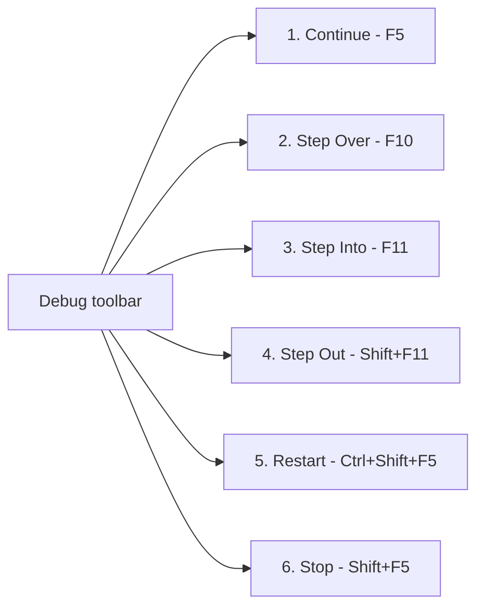
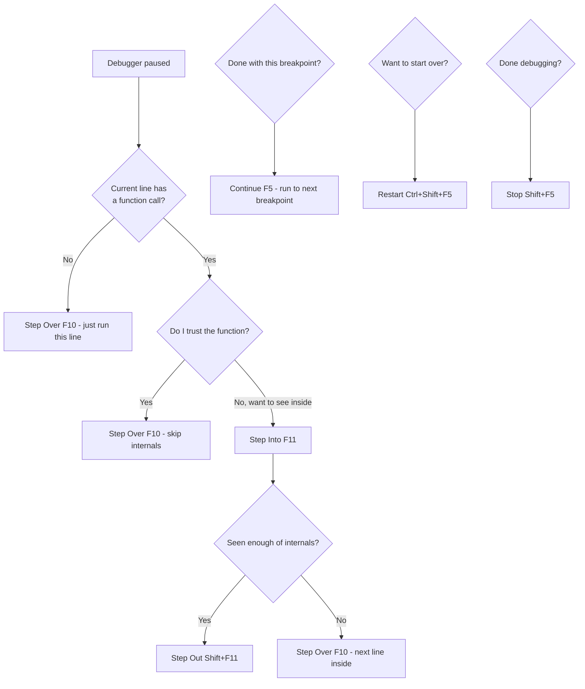

# 2. The Debug Toolbar

> **Tags:** #vscode #debugging #toolbar #reference

The floating debug toolbar is the control panel for stepping through your code. This note explains every button in detail, with a running example to make the differences concrete.

---

## 2.1 The Running Example

We will use this JavaScript file throughout the note:

```javascript
// app.js
function greet(name) {
    console.log("Entering greet function");      // Line 2
    let greeting = "Hello, " + name + "!";        // Line 3
    console.log(greeting);                         // Line 4
    console.log("Exiting greet function");         // Line 5
    return greeting;                               // Line 6
}

function processUser(user) {
    console.log("Processing user:", user.name);    // Line 10
    let message = greet(user.name);                // Line 11
    console.log("Message received from greet:", message);  // Line 12
    if (user.isAdmin) {                            // Line 13
        console.log(user.name + " is an admin.");  // Line 14
    }
    console.log("Finished processing user:", user.name);  // Line 16
}

console.log("Script starting...");                 // Line 19

let user1 = { name: "Alice", isAdmin: false };     // Line 21
let user2 = { name: "Bob",   isAdmin: true  };     // Line 22

processUser(user1);                                // Line 24
processUser(user2);                                // Line 27

console.log("Script finished.");                   // Line 29
```

We set two breakpoints: **Line 24** (call to `processUser(user1)`) and **Line 27** (call to `processUser(user2)`).

---

## 2.2 The Six Toolbar Buttons



---

## 2.3 Button 1 — Continue (Play Icon, F5)

**What it does:** Resumes execution from the current paused state. The program runs until it hits the *next* breakpoint, encounters an unhandled exception, or completes.

**In detail:** When you are paused at a breakpoint and have inspected everything you need, Continue lets the program run freely. If there are other breakpoints set later in the code, it will stop at the very next one it encounters. If there are no more breakpoints, the program runs to completion (or until an error stops it).

**Example scenario (using `app.js`):**

1. Start debugging. The debugger pauses at **Breakpoint 1 (Line 24)**: `processUser(user1);`.
2. You inspect variables, etc.
3. You click **Continue**.
4. The entire `processUser(user1)` function executes (including calls to `greet`), and all its `console.log` statements print.
5. The debugger then runs until it hits **Breakpoint 2 (Line 27)**: `processUser(user2);`, and pauses there.
6. If you click **Continue** again, `processUser(user2)` executes, then `console.log("Script finished.")` runs, and the script ends — no more breakpoints.

**Mental model:** "I am done looking at this spot. Let the program run, and only stop me again at another breakpoint I have set, or when the whole thing is done."

---

## 2.4 Button 2 — Step Over (Curved Arrow Over Dot, F10)

**What it does:** Executes the current highlighted line of code. If the current line contains a function call, "Step Over" executes that *entire function* without stepping into its individual lines, and then pauses on the *next line of code in the current scope*.

**In detail:** This is useful when you are confident that a particular function works correctly and you do not need to inspect its internal logic. You just want to execute it and see its result or side effects, then move to the next statement in the function you are currently in.

**Example scenario:**

1. Start debugging. Paused at **Breakpoint 1 (Line 24)**: `processUser(user1);`.
2. Click **Step Over**.
    - The *entire* `processUser(user1)` function (including its internal call to `greet`) executes. You see its console logs appear ("Processing user: Alice", "Entering greet function", "Hello, Alice!", etc.).
    - The debugger then pauses on the next executable line in the *current* (global) scope, which is **Line 27** (`processUser(user2);`). It did *not* step into the `processUser` or `greet` functions line-by-line.
3. If you were inside `processUser` at Line 11 (`let message = greet(user.name);`) and clicked **Step Over**, the `greet` function would execute completely, `message` would get its value, and the debugger would pause at Line 12 (`console.log("Message received from greet:", message);`).

**Mental model:** "Execute this line, including any function calls, but do not drill into them. Bring me to the next line *in the function I am currently in*."

---

## 2.5 Button 3 — Step Into (Downward Arrow, F11)

**What it does:** If the current highlighted line contains a function call, "Step Into" moves the debugger to the *first line inside that function*. If the current line is not a function call, it behaves like "Step Over" (executes the line and moves to the next).

**In detail:** Use this when you want to examine the internal workings of a function called on the current line. It is how you "drill down" into your code's execution path.

**Example scenario:**

1. Start debugging. Paused at **Breakpoint 1 (Line 24)**: `processUser(user1);`.
2. Click **Step Into**.
    - The debugger jumps to the first line inside the `processUser` function: **Line 10**: `console.log("Processing user:", user.name);`.
3. Now you are at Line 10. Click **Step Over**. Line 10 executes. Debugger moves to **Line 11**: `let message = greet(user.name);`.
4. You are now at Line 11. Click **Step Into** again.
    - The debugger jumps to the first line inside the `greet` function: **Line 2**: `console.log("Entering greet function");`.
5. You can now use Step Over to go line-by-line within the `greet` function.

**Mental model:** "Drill into the function called on this line. I want to see its internals."

---

## 2.6 Button 4 — Step Out (Upward Arrow, Shift+F11)

**What it does:** If you are currently paused inside a function, "Step Out" executes the *remaining lines of the current function* and then pauses on the line of code in the *calling function* immediately after the original function call.

**In detail:** This is useful when you have stepped into a function, perhaps looked at a few lines, and decided you have seen enough of its internal details. Step Out quickly finishes the current function's execution and takes you back to where it was called from, saving you from stepping over many remaining lines within that function.

**Example scenario:**

1. Follow the Step Into example above until you are paused inside the `greet` function at, say, **Line 3**: `let greeting = "Hello, " + name + "!";`.
2. You have seen what you need in `greet`. Click **Step Out**.
    - The remaining lines of the `greet` function (Lines 4, 5, 6) execute.
    - The debugger returns to the `processUser` function and pauses at the line immediately following the call to `greet`, which is **Line 12**: `console.log("Message received from greet:", message);`. The variable `message` now has the value returned by `greet`.

**Mental model:** "Get me out of this function. Run it to completion and bring me back to where it was called."

---

## 2.7 Button 5 — Restart (Curved Arrow, Ctrl+Shift+F5 or Cmd+Shift+F5)

**What it does:** Stops the current debugging session and immediately starts a new debugging session from the very beginning of your program. All existing breakpoints remain active.

**In detail:** This is handy if:

- You have made changes to your code and want to rerun the debugging process from scratch.
- The program has reached a state that is confusing, and you want a fresh start.
- You hit an error and want to try again after a quick fix.

**Example scenario:**

1. Start debugging. Paused at **Breakpoint 1 (Line 24)**.
2. You step through a few lines. Perhaps you are inside `greet` for `user1`.
3. You realize you made a mistake in your logic or want to observe the initial state again.
4. Click **Restart**.
    - The current debug session ends.
    - A new debug session starts immediately.
    - The debugger pauses at the first breakpoint it encounters, which is **Breakpoint 1 (Line 24)**. All program variables are reset to their initial states.

**Mental model:** "Start over. I want a fresh run."

---

## 2.8 Button 6 — Stop (Red Square, Shift+F5)

**What it does:** Completely terminates the current debugging session and the program being debugged.

**In detail:** Use this when you are finished debugging or if the program is stuck in an infinite loop or a state from which you want to forcefully exit. The program execution halts, and the debug toolbar disappears.

**Example scenario:**

1. Start debugging. Paused at **Breakpoint 1 (Line 24)**.
2. You step through some code, perhaps into `processUser` or `greet`.
3. You have found the bug or are done with your debugging task.
4. Click **Stop**.
    - The debugging session ends. The program stops running. The debug console may show a message like "Debugger detached."

**Mental model:** "I am done. Kill it."

---

## 2.9 Quick Comparison Table

| Button | Shortcut | Function call behavior | Where it stops |
| --- | --- | --- | --- |
| Continue | F5 | Executes and keeps going | Next breakpoint or end of program |
| Step Over | F10 | Executes the entire function | Next line in current scope |
| Step Into | F11 | Drills into the function | First line inside the function |
| Step Out | Shift+F11 | Finishes the current function | Line after the call in the caller |
| Restart | Ctrl+Shift+F5 | N/A | First breakpoint of new run |
| Stop | Shift+F5 | N/A | (terminates) |

---

## 2.10 When to Use Which



---

## 2.11 Common Mistakes

- **Pressing F5 (Continue) when you meant F10 (Step Over).** The program runs to the next breakpoint, skipping all the lines you wanted to inspect.
- **Forgetting that Step Into can descend into library code.** If you Step Into a call like `console.log(...)`, you may end up deep in Node internals. Use Step Out to escape, or configure "skipFiles" in `launch.json` (see [[8. Step Over Built-in Files]]).
- **Restarting instead of Stopping.** Restart immediately starts a new session. If you just want to stop and edit code, use Stop.
- **Holding Shift wrong.** Step Out is `Shift+F11`. Step Over is `F10`. The Shift distinguishes them.

---

## 2.12 Key Takeaways

- Six toolbar buttons: Continue, Step Over, Step Into, Step Out, Restart, Stop.
- Step Over skips function internals; Step Into drills into them; Step Out escapes from them.
- Continue runs to the next breakpoint; Restart starts over; Stop kills the session.
- Learn the shortcuts: F5, F10, F11, Shift+F11, Ctrl+Shift+F5, Shift+F5.

---

**Previous:** [[1. Getting Started with Debugging]]
**Next:** [[3. Continue vs Step Over]]
