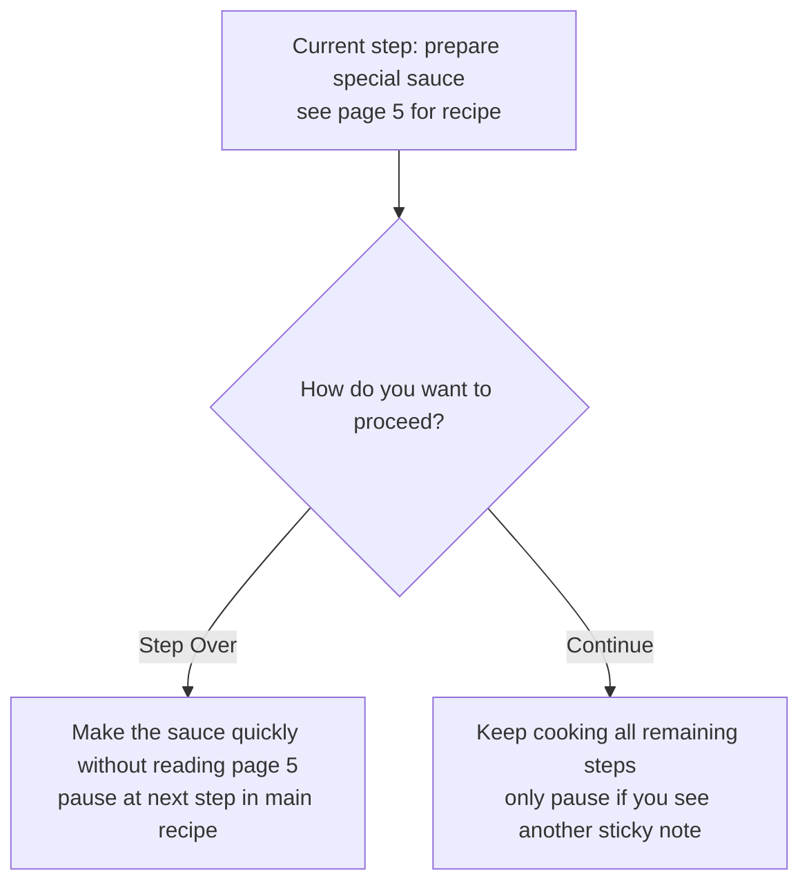
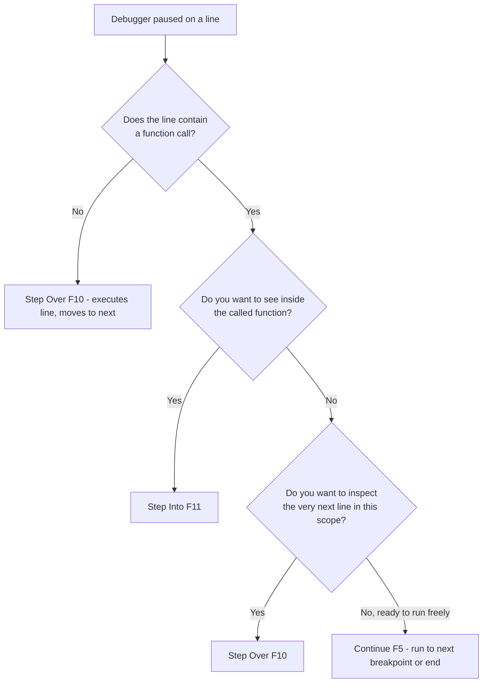

# 3. Continue vs Step Over

> **Tags:** #vscode #debugging #toolbar #continue #step-over

The single most common source of debugger confusion is the difference between **Continue** and **Step Over**. They sound similar — both make the program "go" — but they handle the question "where do I stop next?" completely differently.

---

## 3.1 The Setup

We will use the same JavaScript example as the previous note, with the debugger paused at Line 11 of `app.js`:

```javascript
function processUser(user) {
    console.log("Processing user:", user.name);          // Line 10
    // <<< DEBUGGER PAUSED HERE, ON LINE 11 >>>
    let message = greet(user.name);                       // Line 11
    console.log("Message received from greet:", message); // Line 12
    if (user.isAdmin) {                                   // Line 13
        console.log(user.name + " is an admin.");         // Line 14
    }
    console.log("Finished processing user:", user.name);  // Line 16
}
```

Line 11 contains a function call to `greet()`. We will trace what happens under both Continue and Step Over.

---

## 3.2 Step Over (F10)

**What it does:** Executes the *entire current line* (Line 11).

Because Line 11 contains a call to `greet()`, Step Over:

1. Executes the `greet(user.name)` function completely, from its beginning (Line 2) to its end (Line 6).
2. You will **not** see the debugger move line-by-line *inside* the `greet()` function. It is as if `greet()` happens in a black box from your current perspective.
3. The return value from `greet()` (e.g., `"Hello, Alice!"`) will be assigned to the `message` variable.

After Line 11 is fully executed (including the entire `greet()` call), the debugger pauses on the **very next line of code within the current function (`processUser`)**.

**Where it stops next:** Line 12 (`console.log("Message received from greet:", message);`).

**Mental model:** "I trust this function call on this line, or I do not care about its internal details right now. Just execute it, get its result, and take me to the next line *in this current function*."

---

## 3.3 Continue (F5)

**What it does:** Resumes program execution and tells the debugger to run freely **until it hits the next breakpoint you have set, OR until the program finishes.**

When you are paused at Line 11 and press Continue:

1. The `greet(user.name)` function is called and executes.
2. Then Line 12 (`console.log("Message received from greet:", message);`) executes.
3. Then Line 13 (`if (user.isAdmin)`) executes, and so on.
4. The entire rest of the `processUser` function executes.
5. Then Line 29 (`console.log("Script finished.");`) executes.

**Where it stops next:**

- If you have **another breakpoint set somewhere later** (e.g., a breakpoint on Line 29), it stops there.
- If you have **no other breakpoints**, the entire script runs to completion, and the debugging session ends.
- **Crucially:** It does *not* automatically stop on Line 12 just because it is the next line. It is looking for the *next explicit stop signal* (a breakpoint).

**Mental model:** "I am done looking at this specific spot. Let the program run, and only stop me again if I have specifically marked another place with a breakpoint, or if the whole thing is done."

---

## 3.4 The Recipe Analogy

Imagine you are following a recipe (your program).

You are at a step: "Prepare the special sauce (see page 5 for sauce recipe)." This is Line 11, where `greet()` is called.



- **Step Over:** You say, "Okay, I will assume the sauce recipe on page 5 is fine. I will just make the sauce quickly without looking at each step of the sauce recipe, and then I will come back to the *next step in this main recipe*."
    - You (magically) make the sauce.
    - You pause at the next instruction in your main recipe: "Add sauce to the dish." (This is like Line 12.)

- **Continue:** You say, "Okay, I am going to keep cooking. I will make the sauce, add it to the dish, and then continue with all the remaining steps of the main recipe until I either finish the whole meal or reach another point where I have put a sticky note saying 'Pause here and check.'"
    - You make the sauce, add it to the dish, bake it, serve it... you do everything.
    - You only stop if you hit that "Pause here" sticky note (another breakpoint) or if the meal is complete.

---

## 3.5 Key Differences Summarized

| Feature | Step Over (F10) | Continue (F5) |
| --- | --- | --- |
| **Function call** | Executes the entire function *without* stepping into its lines. | Executes the function and keeps going. |
| **Stopping point** | The **very next line** in the current function/scope. | The **next breakpoint** or the **end of the program**. |
| **Control** | More granular control *within* the current function, skipping over internals of calls. | Less granular; lets the program run more freely. |

---

## 3.6 Decision Tree



---

## 3.7 When to Use Each

### Use Step Over when:

- You are stepping through a function and want to inspect each line of *that* function.
- The current line calls a function you trust (e.g., `console.log`, a library function, a well-tested helper).
- You want to skip the internals of the called function but still pause on the next line of the current function.

### Use Continue when:

- You are done inspecting this region and want the program to run until the next breakpoint.
- You have set breakpoints at the specific places you care about and want to skip everything in between.
- The program is in a long-running loop and you want to skip to the next iteration where a condition is met (combine with a conditional breakpoint — see [[6. Inner Breakpoints and Conditional Breakpoints]]).

### Use Step Into (F11) when:

- The current line calls a function you want to inspect line-by-line.
- You suspect the bug is inside the called function.

### Use Step Out (Shift+F11) when:

- You are inside a function you stepped into and want to escape back to the caller.
- The remaining lines of the current function are not interesting.

---

## 3.8 A Common Mistake: Hitting Continue by Accident

If you meant to press F10 (Step Over) but pressed F5 (Continue), the program runs to the next breakpoint or finishes. You have lost your place.

To recover:

- If the program is still running and you want to pause it manually, use the **Pause** button (if available in your debugger) — typically a pause icon next to Continue on the toolbar. Note: not all debuggers support mid-execution pause.
- Otherwise, use **Restart** (Ctrl+Shift+F5) to start over.

To prevent this, learn the shortcuts by touch. F10 and F5 are next to each other on most keyboards, but they have very different effects.

---

## 3.9 Practical Exercise

Open the `app.js` example from [[2. The Debug Toolbar]] and try this exercise:

1. Set a breakpoint on Line 11 (`let message = greet(user.name);`).
2. Start debugging. Pause at Line 11.
3. Press **F10** (Step Over). Notice:
    - The console logs from `greet` appear.
    - The debugger pauses on Line 12.
    - The `message` variable in the Variables pane now has its value.
4. Press **Restart** (Ctrl+Shift+F5). Pause at Line 11 again.
5. Press **F5** (Continue). Notice:
    - The console logs from `greet`, the rest of `processUser`, and `Script finished.` all appear.
    - If there are no more breakpoints, the session ends.
6. Now set a breakpoint on Line 6 of `greet` (`return greeting;`). Restart. Press F5 from Line 11. Notice the debugger stops inside `greet` because of the new breakpoint.

---

## 3.10 Key Takeaways

- **Step Over (F10):** execute this line, including any function calls, then pause on the next line in this scope.
- **Continue (F5):** run freely until the next breakpoint or end of program.
- Step Over gives you granular control within a function; Continue lets the program run between breakpoints.
- The mistake of pressing Continue when you meant Step Over is universal. Restart and try again.

---

**Previous:** [[2. The Debug Toolbar]]
**Next:** [[4. Step Into and Step Out]]
