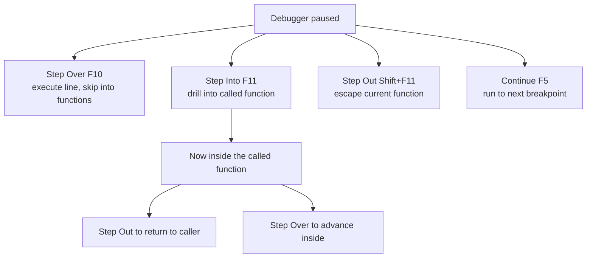
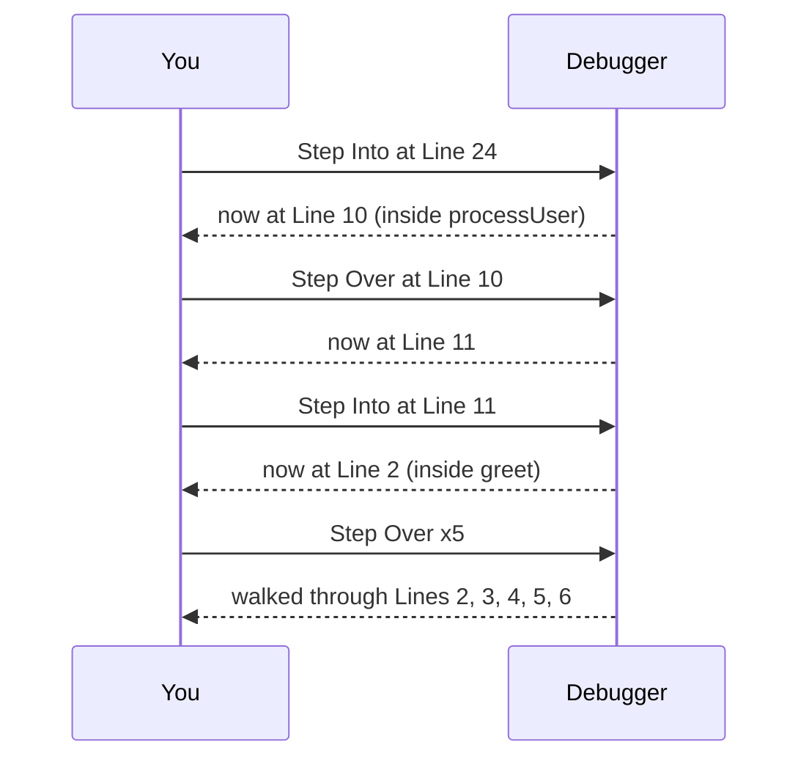
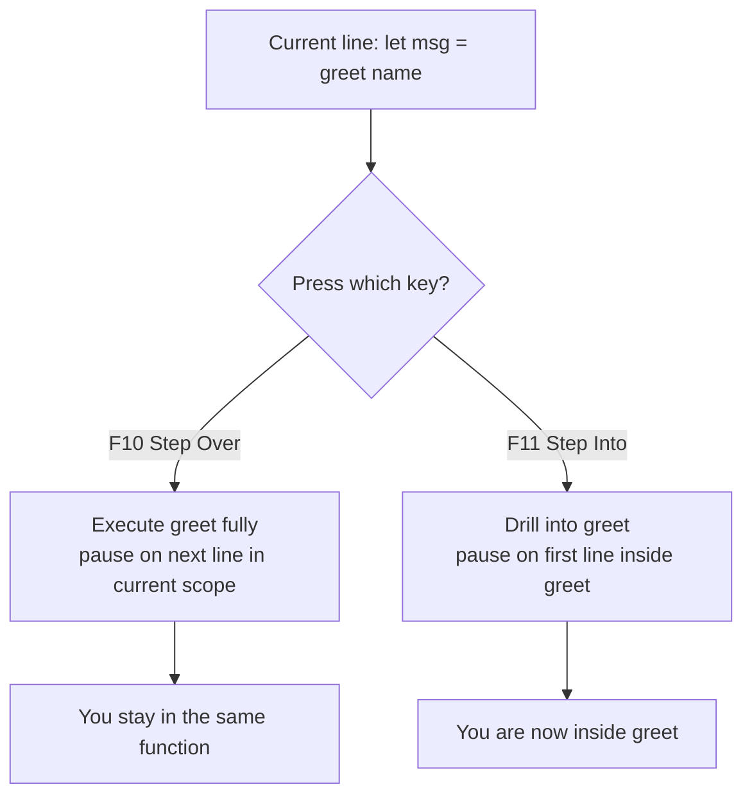

# 4. Step Into and Step Out

> **Tags:** #vscode #debugging #toolbar #step-into #step-out

Step Into and Step Out complete the four-button stepping model (the other two being Step Over and Continue). Where Step Over skips the internals of a function call and Continue runs to the next breakpoint, Step Into drills *down* into a function and Step Out escapes *up* out of one.

---

## 4.1 The Four-Button Stepping Model



| Button | Shortcut | Direction | Stops at |
| --- | --- | --- | --- |
| Step Over | F10 | Forward, same scope | Next line in current scope |
| Step Into | F11 | Forward, *down* into callee | First line of called function |
| Step Out | Shift+F11 | Forward, *up* out of current function | Line after the call, in caller |
| Continue | F5 | Forward, free | Next breakpoint |

---

## 4.2 Step Into in Detail

**What it does:** If the current line contains a function call, Step Into moves the debugger to the *first line inside that function*. If the current line is not a function call, it behaves like Step Over (executes the line and moves to the next).

**Use it when:** You want to examine the internal workings of a function called on the current line. It is how you "drill down" into your code's execution path.

### Worked Example

Using the `app.js` from [[2. The Debug Toolbar]]:

```javascript
function greet(name) {
    console.log("Entering greet function");      // Line 2
    let greeting = "Hello, " + name + "!";        // Line 3
    console.log(greeting);                         // Line 4
    console.log("Exiting greet function");         // Line 5
    return greeting;                               // Line 6
}

function processUser(user) {
    console.log("Processing user:", user.name);   // Line 10
    let message = greet(user.name);                // Line 11
    // ...
}
```

1. Start debugging with a breakpoint on Line 24 (`processUser(user1);`).
2. Click **Step Into**. The debugger jumps to the first line inside `processUser`: **Line 10** (`console.log("Processing user:", user.name);`).
3. Click **Step Over** to execute Line 10. The debugger moves to **Line 11** (`let message = greet(user.name);`).
4. Click **Step Into** again. The debugger jumps to the first line inside `greet`: **Line 2** (`console.log("Entering greet function");`).
5. Now you are inside `greet`. You can Step Over to walk through Lines 2, 3, 4, 5, 6 line by line.



---

## 4.3 Step Out in Detail

**What it does:** If you are currently paused inside a function, Step Out executes the *remaining lines of the current function* and then pauses on the line of code in the *calling function* immediately after the original function call.

**Use it when:** You have stepped into a function, looked at a few lines, and decided you have seen enough. Step Out finishes the function and takes you back to the caller, saving you from stepping through many remaining lines.

### Worked Example

Continuing from where we left off in the Step Into example:

1. You are inside `greet` at, say, **Line 3** (`let greeting = "Hello, " + name + "!";`).
2. You have seen what you need in `greet`. Click **Step Out**.
    - The remaining lines of `greet` (Lines 4, 5, 6) execute.
    - The debugger returns to the `processUser` function and pauses at the line immediately following the call to `greet`, which is **Line 12** (`console.log("Message received from greet:", message);`).
    - The variable `message` now has the value returned by `greet`.

Step Out is the "I changed my mind, get me out of here" button. If you Step Into a function by accident, or you stepped into a function and only needed to see the first line, Step Out is your escape hatch.

---

## 4.4 Step Into vs Step Over — A Direct Comparison

The crucial difference: what happens when the current line calls a function?



| Question | Step Over (F10) | Step Into (F11) |
| --- | --- | --- |
| Is `greet()` executed? | Yes, fully. | Yes, but you pause inside it. |
| Where does the debugger stop? | Next line in the current function. | First line inside `greet()`. |
| Use case | You trust `greet()` and do not need to see its internals. | You suspect `greet()` has a bug and want to inspect it. |

---

## 4.5 The "I Stepped Into Too Deep" Problem

A common frustration: you Step Into a function call, then Step Into another, then another, and now you are deep in library code you do not care about.

Two ways to escape:

1. **Step Out (Shift+F11)** repeatedly. Each press pops you up one level until you are back to a function you recognize.
2. **Use the Call Stack pane.** Click any frame in the call stack to jump directly to that frame. The Variables and Watch panes update to reflect that frame's context.

The Call Stack pane is the fast escape: instead of pressing Shift+F11 five times, click the frame five levels up and you are there.

---

## 4.6 Step Into Not Working? You May Be Stepping Into Library Code

When you Step Into a line like `let result = arr.map(fn)`, the debugger may descend into the implementation of `Array.prototype.map`, which is rarely useful. To prevent this, configure `skipFiles` in your `launch.json`:

```json
{
  "type": "node",
  "request": "launch",
  "name": "Debug skipFiles",
  "program": "${file}",
  "skipFiles": [
    "<node_internals>/**",
    "node_modules/**/*.js"
  ]
}
```

With `skipFiles` set, Step Into skips over the listed files and lands on the next line of *your* code. See [[8. Step Over Built-in Files]] for the full treatment.

---

## 4.7 Step Into on Lines Without Function Calls

If the current line has no function call (e.g., `let x = 5;`), Step Into behaves exactly like Step Over: it executes the line and moves to the next. There is nothing to "step into."

If the current line has *multiple* function calls (e.g., `let y = foo(bar())`), Step Into descends into the innermost call first (`bar`), then on the next Step Into, descends into `foo`.

---

## 4.8 Practical Exercise

Using the `app.js` example:

1. Set a breakpoint on Line 11 (`let message = greet(user.name);`).
2. Start debugging. Pause at Line 11.
3. Press **F11** (Step Into). Notice you are now at Line 2 inside `greet`.
4. Press **Shift+F11** (Step Out). Notice you are back at Line 12 inside `processUser`, and `message` has the value returned by `greet`.
5. Repeat step 3 (Step Into `greet`).
6. This time, instead of Step Out, click **Line 12** in the Call Stack pane. Notice you are now looking at Line 12 of `processUser` without executing the rest of `greet` — but `message` does not yet have its value, because `greet` has not finished.

The Call Stack approach lets you *inspect* a caller's frame without *finishing* the current frame. The variables you see reflect the state at the moment the call was made, not after.

---

## 4.9 Common Mistakes

- **Pressing F11 when you meant F10.** You end up inside a function you did not want to inspect. Press Shift+F11 to escape.
- **Forgetting that Step Out runs the rest of the function.** Step Out does not "rewind" — it executes the remaining lines. If those lines have side effects (logging, network calls, mutations), they happen.
- **Not using the Call Stack pane.** Clicking frames in the call stack is faster than repeatedly Step Out for navigating deep call chains.
- **Stepping into library code by accident.** Configure `skipFiles` to avoid descending into `node_modules` or built-in code.

---

## 4.10 Key Takeaways

- **Step Into (F11):** drill down into a function called on the current line.
- **Step Out (Shift+F11):** finish the current function and return to the caller.
- **Call Stack pane:** click any frame to inspect that frame's context without executing code.
- **`skipFiles` in `launch.json`:** prevents Step Into from descending into library code.
- Step Into on a line without function calls behaves like Step Over.

---

**Previous:** [[3. Continue vs Step Over]]
**Next:** [[5. Where to Use a Breakpoint]]
