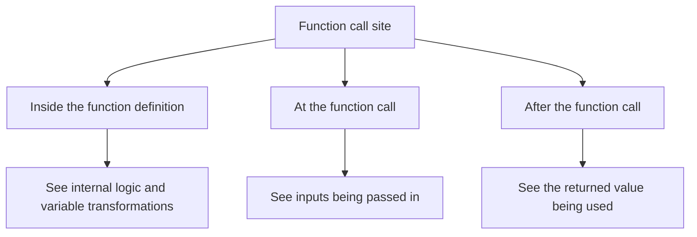
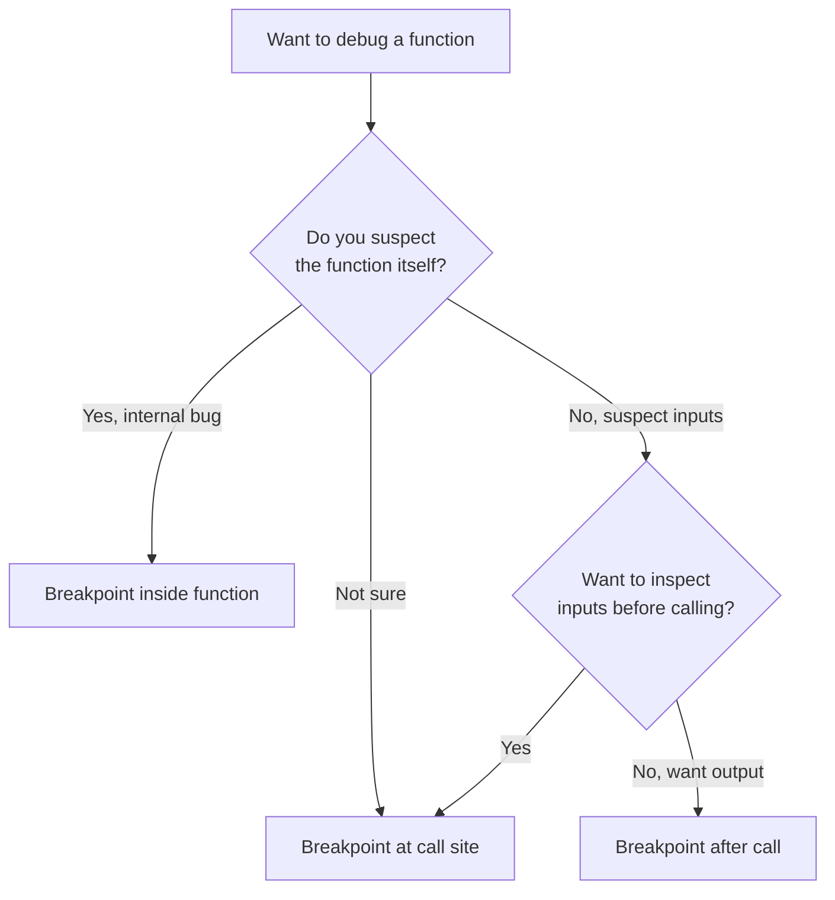

# 5. Where to Use a Breakpoint

> **Tags:** #vscode #debugging #breakpoints #strategy

Setting a breakpoint is trivial — click in the gutter. Setting a breakpoint **in the right place** is a skill. This note covers the strategic question: given a function you want to debug, where exactly should you set breakpoints to learn the most with the least effort?

---

## 5.1 The Three Strategic Positions

For any function in your code, there are three meaningful places to set breakpoints around it:



| Position | What you learn |
| --- | --- |
| **Inside the function definition** | The function's internal logic, variable transformations, line-by-line execution. |
| **At the function call site** | The values being passed in as arguments. |
| **After the function call** | The return value and how the calling code uses it. |

---

## 5.2 A Concrete Example

Consider this code:

```javascript
// Line A
function calculateDiscountedPrice(itemPrice, discount) {
    let amountOff = itemPrice * (discount / 100);   // Line A
    let salePrice = itemPrice - amountOff;           // Line B
    return salePrice;                                // Line C
}

// ... elsewhere ...

let itemPrice = 100;
let discount = 20;

// Line E
let salePrice = calculateDiscountedPrice(itemPrice, discount);

// Line F
console.log("The sale price is:", salePrice);
```

Three positions for breakpoints:

- **Inside the function (Lines A, B, C):** to understand the internal logic.
- **At the call site (Line E):** to inspect `itemPrice` and `discount` before the call.
- **After the call (Line F):** to see `salePrice` after the function returns.

---

## 5.3 Position 1 — Inside the Function Definition

**What you learn:** the function's internal logic, variable transformations, and step-by-step execution.

**When to use it:**

- You suspect the function has a bug in its own logic.
- You want to understand how the function transforms its inputs into outputs.
- You are learning unfamiliar code and want to trace its execution.

**Setup:** Set a breakpoint on Line A (or the first executable line of the function).

When the breakpoint is hit, the call stack shows where the call came from. You can Step Over through Lines A, B, C to watch each variable change. Variables pane shows `itemPrice`, `discount`, `amountOff`, `salePrice` as they are computed.

**Tip:** If you want to break on this function *every time it is called, regardless of caller*, a breakpoint inside the function is the right choice. Alternatively, use a **function breakpoint** (see [[6. Inner Breakpoints and Conditional Breakpoints]]) — break by function name without setting a line.

---

## 5.4 Position 2 — At the Function Call (Line E)

**What you learn:** the values being passed *into* the function as arguments.

**When to use it:**

- You want to verify the inputs before the function runs.
- You suspect the function is correct but is being called with wrong arguments.
- You want to choose between Step Into (drill in) and Step Over (skip internals) based on what the inputs look like.

**Setup:** Set a breakpoint on Line E (`let salePrice = calculateDiscountedPrice(itemPrice, discount);`).

When the breakpoint is hit:

- The debugger pauses *before* the function is called.
- Inspect `itemPrice` and `discount`: you see they are 100 and 20.
- Now you have options:
    - **Step Into (F11):** descend into `calculateDiscountedPrice`, landing at Line A.
    - **Step Over (F10):** execute the entire function, assign the result to `salePrice`, and pause at Line F. You do not see the steps inside the function.

**Tip:** The call site breakpoint is the most flexible — it lets you decide between Step Into and Step Over based on what you see. If you do not know whether the bug is inside or outside the function, start here.

---

## 5.5 Position 3 — After the Function Call (Line F)

**What you learn:** the value the function returned and what the calling code does with that value.

**When to use it:**

- You want to see the *result* of the function call in the context of the calling code.
- You are less concerned about the internal workings and more about the outcome.
- You have already established that the function itself works (or have debugged its internals separately).

**Setup:** Set a breakpoint on Line F (`console.log("The sale price is:", salePrice);`).

To reach Line F, you typically:

- Hit Continue from a breakpoint at Line E (the call site), or
- Hit Step Over from Line E.

When the breakpoint at Line F is hit:

- Inspect `salePrice`: you see the returned value (e.g., 80).
- You can Step Over Line F to confirm the `console.log` outputs the expected value.

**Tip:** Combine Position 2 and Position 3 to compare inputs and outputs in one session. Set breakpoints on both Line E and Line F. Step through: Line E pauses (inspect inputs), Continue, Line F pauses (inspect output). You learn the function's behavior in one round trip.

---

## 5.6 Decision Tree



---

## 5.7 Practical Strategy: Start at the Call Site

When you encounter a function you do not understand, start by setting a breakpoint on the **function call (Line E)**. Then:

1. **Inspect the inputs.** If they are wrong, the bug is in the caller — go up the call stack and debug there.
2. **Step Into the function.** If the inputs are right, drill in and look at the internal logic line by line.
3. **If you realize you need to see the output first**, set a breakpoint after the call (Line F), Continue, and inspect the return value.

This strategy avoids the trap of stepping through a function only to realize at the end that the inputs were wrong all along.

---

## 5.8 Multiple Calls to the Same Function

If a function is called multiple times (e.g., in a loop or from different callers), a breakpoint inside the function will hit for every call. To narrow down:

- **Use a conditional breakpoint** (see [[6. Inner Breakpoints and Conditional Breakpoints]]) that breaks only when a specific condition is true.
- **Use the call stack** at each pause to identify which caller invoked the function.
- **Use a logpoint** instead of a breakpoint to log each call without pausing — useful for understanding call patterns.

---

## 5.9 Setting Breakpoints on Function Definitions

A useful trick: if you want to break every time a function is *entered*, set a breakpoint on the **first executable line inside the function** (not the `function` declaration line, which may not be hit at runtime in some languages).

Alternatively, use a **function breakpoint**:

1. In the Breakpoints pane, click **+**.
2. Type the function name (e.g., `calculateDiscountedPrice`).
3. The debugger will break whenever that function is entered, regardless of source line.

Function breakpoints are language-dependent but supported by most modern debug adapters.

---

## 5.10 Common Mistakes

- **Setting a breakpoint on a non-executable line** (blank line, comment, declaration). The breakpoint will not hit. Always set breakpoints on lines that do something.
- **Setting a breakpoint on a function declaration line** (`function foo() {`). In some languages this line is not "executed" at runtime. Set the breakpoint on the first executable line *inside* the function instead.
- **Forgetting to remove breakpoints when done.** Stale breakpoints cause the debugger to pause unexpectedly in future sessions. The Breakpoints pane lets you toggle or remove them all.
- **Setting too many breakpoints at once.** You spend more time pressing Continue than inspecting. Set breakpoints strategically — usually two or three is enough for one debugging session.

---

## 5.11 Key Takeaways

- Three strategic positions: inside the function, at the call site, after the call.
- **Inside** → understand internal logic.
- **At the call site** → inspect inputs, decide whether to Step Into or Step Over.
- **After the call** → see the return value in context.
- When in doubt, start at the call site — it gives you the most flexibility.
- Use conditional breakpoints and logpoints to refine multiple-call scenarios.

---

**Previous:** [[4. Step Into and Step Out]]
**Next:** [[6. Inner Breakpoints and Conditional Breakpoints]]
