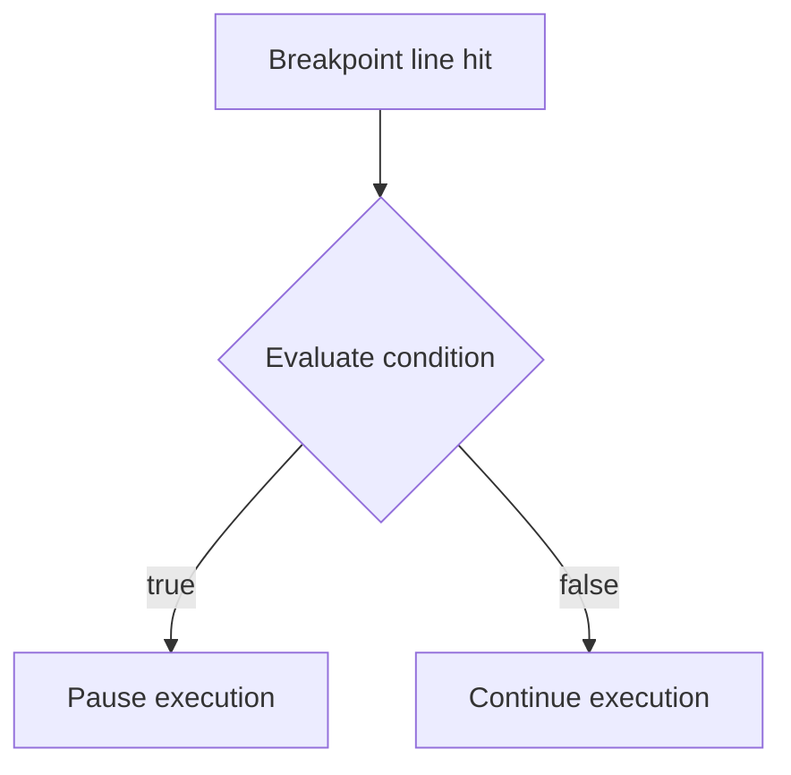

# 6. Inner Breakpoints and Conditional Breakpoints

> **Tags:** #vscode #debugging #breakpoints #conditional #logpoints

A plain breakpoint pauses every time the line is hit. That is fine for code that runs once. But for code inside a loop, or for code that runs many times before the bug appears, a plain breakpoint forces you to press Continue dozens of times before reaching the iteration you care about. **Conditional breakpoints** solve this: they pause only when a condition you specify is true.

This note covers conditional breakpoints, hit-count breakpoints, and logpoints (the "inner breakpoint" concept that prints without pausing).

---

## 6.1 The Problem With Plain Breakpoints

Consider:

```javascript
for (let i = 1; i <= 1000; i++) {
    let result = processItem(i);  // Line 2
    sum += result;
}
```

If `processItem` has a bug that only appears when `i` is 742, setting a plain breakpoint on Line 2 means pressing Continue 741 times before reaching the iteration you care about. Worse, you might miss the bug entirely if it appears nondeterministically.

---

## 6.2 Conditional Breakpoints

A **conditional breakpoint** is a breakpoint with a Boolean expression attached. The debugger evaluates the expression each time the line is hit; it pauses only if the expression is true.



### How to Set a Conditional Breakpoint in VS Code

1. Right-click on the red breakpoint circle in the gutter.
2. Choose **Edit Breakpoint...** from the context menu.
3. A dropdown appears with options: **Expression**, **Hit Count**, **Log Message**.
4. Choose **Expression**.
5. Type a JavaScript (or language-appropriate) expression in the input box.
6. Press Enter.

The breakpoint dot now has an `=` sign inside it, indicating it is conditional.

### Example 1 — Break Only When `i === 3`

On Line 2 (the `for` loop line):

- Right-click the breakpoint.
- Choose Edit Breakpoint.
- Type: `i === 3`

**What happens:**

- The program starts.
- The debugger executes the `for` loop.
- It skips iterations where `i` is 1 and 2.
- When `i` becomes 3, the debugger pauses on Line 2 because the condition `i === 3` is true.
- You can inspect `sum` and `i` at that exact moment.

### Example 2 — Break Only When `user.isAdmin` Is True

```javascript
users.forEach(user => {
    processUser(user);  // Breakpoint here
});
```

Condition: `user.isAdmin === true`

The debugger pauses only for admin users, skipping regular users.

### Example 3 — Break on a Specific Error State

```javascript
function processOrder(order) {
    let total = calculateTotal(order);  // Breakpoint here
    // ...
}
```

Condition: `total < 0`

The debugger pauses only when `calculateTotal` returns a negative value — typically a sign of a bug.

---

## 6.3 Hit Count Breakpoints

A **hit count breakpoint** pauses only when the line has been hit a specific number of times. Useful for "the bug appears on the 7th invocation."

### How to Set a Hit Count Breakpoint

1. Right-click the breakpoint.
2. Choose **Edit Breakpoint...**.
3. Choose **Hit Count** from the dropdown.
4. Type a number or expression.

VS Code supports several hit-count modes (depending on the debugger):

| Mode | Meaning |
| --- | --- |
| `5` (default, "equals") | Pause on the 5th hit. |
| `> 5` | Pause on every hit after the 5th. |
| `>= 5` | Pause on the 5th hit and every hit after. |
| `% 5` | Pause every 5th hit (5th, 10th, 15th, ...). |

### Example

To break on the 7th iteration of a loop:

1. Set a breakpoint on the line inside the loop.
2. Edit Breakpoint → Hit Count → `7`.
3. The debugger pauses the 7th time the line is hit.

---

## 6.4 Logpoints — Print Without Pausing

A **logpoint** is a breakpoint that *prints a message* instead of pausing. It is the debugging equivalent of inserting a `console.log` without modifying your source code.

### How to Set a Logpoint

1. Right-click in the gutter.
2. Choose **Add Logpoint...**.
3. Type a message. Use `{expression}` syntax to interpolate values.
4. Press Enter.

The breakpoint dot becomes a **diamond shape**, indicating a logpoint.

### Example

On a line inside a loop, add a logpoint with the message:

```
Iteration i={i}, sum={sum}
```

Every time the line is hit, the Debug Console prints:

```
Iteration i=1, sum=0
Iteration i=2, sum=1
Iteration i=3, sum=3
...
```

Without ever pausing execution.

### When to Use Logpoints

- **Long-running loops** where pausing each iteration is too slow.
- **Tracking variable values across many calls** without modifying source.
- **Debugging in production-like environments** where you cannot easily edit code.

Logpoints are particularly powerful when combined with conditional expressions — you can log only when a condition is true.

---

## 6.5 Combining Conditions, Hit Counts, and Log Messages

VS Code lets you combine these. For example:

- A logpoint that prints only when `i % 100 === 0` (every 100th iteration).
- A conditional breakpoint that pauses when `i === 500` AND `sum > 1000`.

The exact combination options depend on the debug adapter, but the JavaScript and Node.js debuggers support all three.

---

## 6.6 The "Inner Breakpoint" Concept

The phrase "inner breakpoint" sometimes refers to the idea of pausing not just on a line, but when a *condition within that line* is met. This is exactly what conditional breakpoints provide.

For example, given a `for` loop with `let i = 1; i <= 5`:

- A plain breakpoint on the `for` line pauses once at the start.
- A conditional breakpoint `i === 3` on the same line pauses only when `i` becomes 3.
- A hit count breakpoint `>= 3` pauses on the 3rd hit and every hit after.

This is what makes conditional breakpoints so powerful: they let you "pause inside" a line based on state, not just position.

---

## 6.7 Performance Considerations

Conditional breakpoints have a cost: the debugger must evaluate the condition each time the line is hit. For lines hit millions of times (e.g., inside a tight loop), this can slow the program significantly.

Mitigations:

- Use **hit count** breakpoints instead of complex conditions where possible. Hit counts are tracked by the debugger without evaluating expressions.
- Use **logpoints** to gather data, then narrow down with conditional breakpoints.
- Move the breakpoint *out* of the hot loop to a less-frequently-hit line that still captures the information you need.

---

## 6.8 Practical Exercise

```javascript
for (let i = 1; i <= 10; i++) {
    let result = i * 2;
    console.log(`i=${i}, result=${result}`);
}
```

1. Set a plain breakpoint on the `console.log` line. Press Continue repeatedly — it pauses 10 times.
2. Edit the breakpoint to a conditional one: `i === 5`. Restart. The debugger pauses once, when `i` is 5.
3. Edit the breakpoint to a hit count of `>= 7`. Restart. The debugger pauses on the 7th, 8th, 9th, and 10th hits.
4. Replace the breakpoint with a logpoint: `Log: i={i}, result={result}`. Restart. Nothing pauses, but the Debug Console prints all 10 lines.
5. Add a condition to the logpoint: `i % 2 === 0`. Restart. The Debug Console prints only even iterations.

---

## 6.9 Common Mistakes

- **Forgetting the condition syntax.** Conditions are expressions in the program's language, not a special DSL. `i === 3` is JavaScript, not `i == 3` (which would also work in JS but is loose equality).
- **Setting a condition that uses variables not in scope.** The condition is evaluated in the context of the breakpoint. If you reference a variable that does not exist there, the condition is treated as falsy and the breakpoint never hits.
- **Using conditional breakpoints in tight loops.** Performance suffers. Use hit counts or move the breakpoint out of the loop.
- **Confusing logpoints with breakpoints.** Logpoints do not pause — they only print. If you want to pause, use a regular or conditional breakpoint.
- **Forgetting to clear conditional breakpoints.** They persist across sessions. If a conditional breakpoint starts hitting unexpectedly, check the Breakpoints pane.

---

## 6.10 Key Takeaways

- **Conditional breakpoints** pause only when a Boolean expression is true.
- **Hit count breakpoints** pause on a specific hit number or pattern.
- **Logpoints** print a message without pausing — the debugging equivalent of `console.log` without source edits.
- Combine them: logpoint with a condition, conditional with a hit count.
- Watch performance in tight loops — conditional evaluation is not free.

---

**Previous:** [[5. Where to Use a Breakpoint]]
**Next:** [[7. The Watch Pane]]
