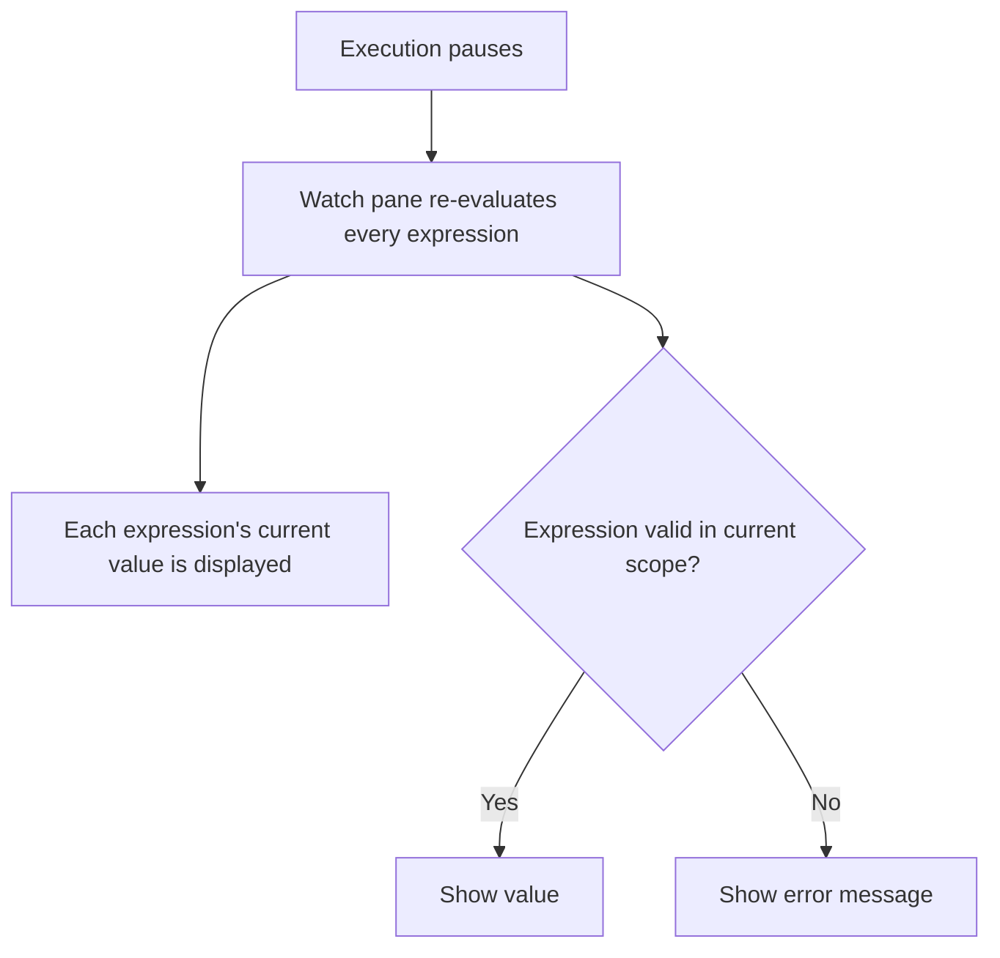

# 7. The Watch Pane

> **Tags:** #vscode #debugging #watch #variables

The **Watch** pane lets you pin expressions that are evaluated every time execution pauses. It is the debugger's version of "show me this value at every step" — without modifying your code to add `console.log` statements.

---

## 7.1 What the Watch Pane Does

The **Variables** pane (next to Watch) shows every variable in the current scope. That is useful but noisy: in a complex function, there may be dozens of variables, and the one you care about is buried.

The **Watch** pane is the opposite: you explicitly add the expressions you care about, and only those are shown. They are re-evaluated every time execution pauses, so their values stay current.



---

## 7.2 Adding a Watch Expression

1. Click the **+** icon in the Watch pane.
2. Type an expression. This can be:
    - A variable name: `user`
    - A property access: `user.name`
    - A computed expression: `user.orders.length`
    - A function call: `getTotal(user)`
    - A comparison: `user.age >= 18`
3. Press Enter.

The expression appears in the Watch pane with its current value. Each time execution pauses, the value updates.

---

## 7.3 When to Use Watch

### Use Case 1 — Track a Variable Across Scopes

If a variable is defined in an outer scope and you want to track its value as you step through inner functions, the Variables pane may not show it (because it only shows the current scope). The Watch pane shows it regardless of scope.

### Use Case 2 — Monitor a Computed Expression

Instead of mentally calculating "what is `user.orders.length` right now?", pin it as a watch expression. You see the value update as you step.

### Use Case 3 — Compare Two Values

Pin `expectedTotal` and `actualTotal` side by side. As you step, you see both update and can spot when they diverge.

### Use Case 4 — Test Hypotheses

Pin expressions like `user.isAdmin`, `index < array.length`, or `result !== null`. As you step, the Boolean values tell you immediately whether your hypothesis holds.

---

## 7.4 The Variables Pane vs the Watch Pane

| Aspect | Variables pane | Watch pane |
| --- | --- | --- |
| What it shows | Every variable in the current scope | Only the expressions you explicitly add |
| Updates on pause | Yes | Yes |
| Cross-scope visibility | No (only current scope) | Yes |
| Computed expressions | No | Yes |
| Noise | High (many variables) | Low (only what you added) |
| Use case | General inspection | Focused tracking |

Both panes are useful. The Variables pane is for "what is here?"; the Watch pane is for "what is this specific thing doing?".

---

## 7.5 Setting Variable Values

Both the Variables and Watch panes let you **set values** on the fly:

1. Right-click a variable or watch expression.
2. Choose **Set Value**.
3. Type a new value.
4. Press Enter.

The variable's value is updated in the running program. This is invaluable for:

- Testing how the program behaves with different inputs without re-running.
- Forcing a code path (e.g., set `user.isAdmin = true` to test the admin branch).
- Recovering from a bad state (e.g., set `index = array.length - 1` to skip a broken iteration).

Note: setting values can have side effects if the expression is a setter or triggers reactivity (in frameworks like React or Vue). Use with care.

---

## 7.6 Editing and Removing Watch Expressions

- **Edit:** Hover over an expression, click the pencil icon (or right-click → Edit Expression).
- **Remove:** Hover over an expression, click the X icon (or right-click → Remove Expression).
- **Remove all:** Click the `...` menu in the Watch pane header → Remove All Expressions.

Watch expressions persist across debug sessions in the same project. If you restart the debugger, your watches are still there.

---

## 7.7 Worked Example: Tracking a Loop Accumulator

```javascript
let sum = 0;
for (let i = 1; i <= 10; i++) {
    sum += i * i;  // Line 3
}
console.log(sum);
```

1. Set a breakpoint on Line 3.
2. Add watch expressions: `i`, `sum`, `i * i`, `sum + i * i`.
3. Start debugging. Each time Line 3 is hit, the Watch pane shows:

| `i` | `sum` (before) | `i * i` | `sum + i * i` (predicted next sum) |
| --- | --- | --- | --- |
| 1 | 0 | 1 | 1 |
| 2 | 1 | 4 | 5 |
| 3 | 5 | 9 | 14 |
| 4 | 14 | 16 | 30 |
| ... | ... | ... | ... |

By watching `sum + i * i`, you can predict the *next* value of `sum` before stepping. This is a powerful way to verify your mental model against the program's actual behavior.

---

## 7.8 The Debug Console as a Complementary Tool

The Watch pane evaluates expressions *automatically* on each pause. The **Debug Console** evaluates expressions *on demand*. They are complementary:

- **Watch:** "Show me this every time I pause."
- **Debug Console:** "Let me evaluate this once, right now."

If you want to inspect something once, use the Debug Console. If you want to track it across many pauses, add it to Watch.

---

## 7.9 Common Mistakes

- **Watching too many expressions.** The Watch pane becomes as noisy as the Variables pane. Keep it focused on a handful of key expressions.
- **Forgetting to remove stale watches.** Expressions that referenced variables from a previous scope show errors. Remove them when no longer relevant.
- **Trying to watch expressions that have side effects.** Watching `nextState()` calls the function on every pause — likely not what you want.
- **Confusing Watch with conditional breakpoints.** Watch *displays* a value; a conditional breakpoint *pauses* based on a condition. They are different tools for different problems.

---

## 7.10 Key Takeaways

- The Watch pane evaluates expressions you pin, every time execution pauses.
- Use it to track specific variables or computed values across stepping.
- Set values on the fly with right-click → Set Value.
- Watch expressions persist across debug sessions.
- Combine Watch (auto-eval) with the Debug Console (on-demand eval) for full inspection power.

---

**Previous:** [[6. Inner Breakpoints and Conditional Breakpoints]]
**Next:** [[8. Step Over Built-in Files]]
