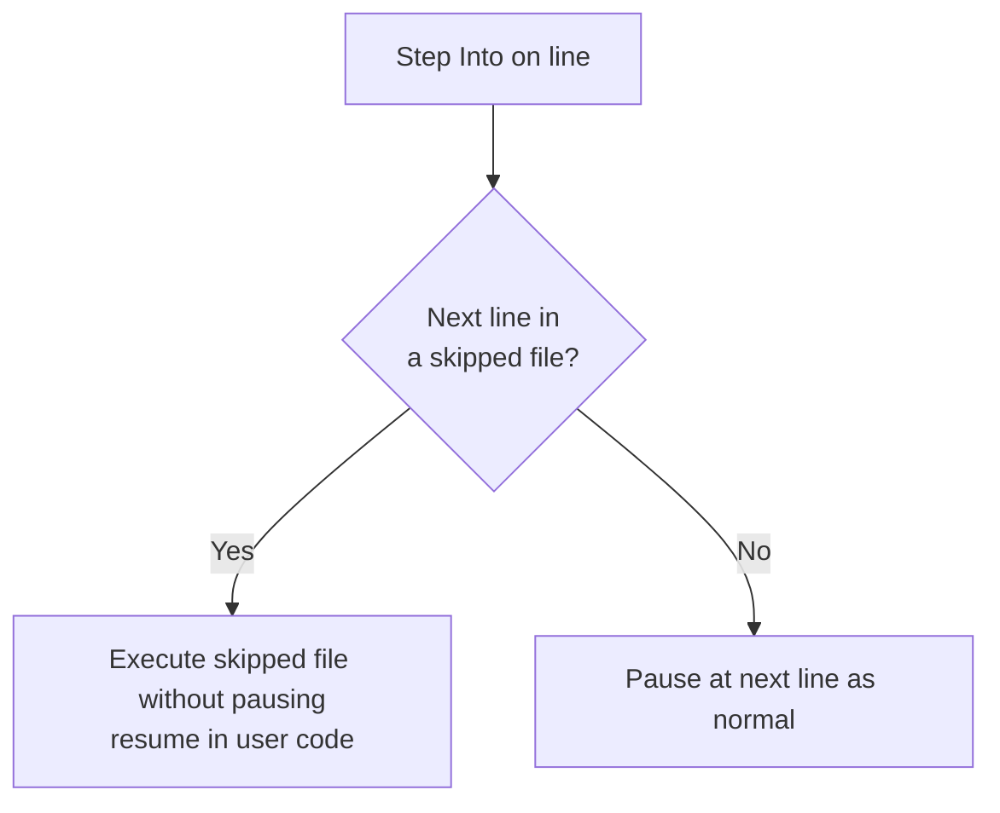

# 8. Step Over Built-in Files

> **Tags:** #vscode #debugging #skipfiles #configuration

A common frustration when stepping through code with Step Into (F11): you accidentally descend into library or framework code you do not care about. Suddenly you are stepping through `node_modules/react/cjs/react.development.js` or Node's internal modules, and you cannot easily get back to *your* code. The `skipFiles` option in `launch.json` solves this.

---

## 8.1 The Problem

Consider this line:

```javascript
const result = arr.map(x => x * 2);
```

If you press **F11** (Step Into) on this line, the debugger may try to descend into the implementation of `Array.prototype.map`. That implementation is in Node's internals or a polyfill — not your code. Stepping through it is rarely useful.

The same problem occurs with:

- Library calls (`lodash.map`, `axios.get`, `react.useState`).
- Framework internals (Vue reactivity, Angular DI).
- Node.js built-in modules (`fs`, `http`, `path`).
- Transpiled code (TypeScript → JavaScript source maps).

You can escape by pressing Shift+F11 (Step Out) repeatedly, or by clicking frames in the call stack, but it is tedious. `skipFiles` prevents the debugger from descending into these files in the first place.

---

## 8.2 Configuring `skipFiles` in `launch.json`

The `skipFiles` option is an array of glob patterns. Files matching any pattern are skipped when the debugger would otherwise step into them.

```json
{
  "version": "0.2.0",
  "configurations": [
    {
      "type": "node",
      "request": "launch",
      "name": "Debug with skipFiles",
      "program": "${file}",
      "skipFiles": [
        "<node_internals>/**",
        "node_modules/**/*.js"
      ]
    }
  ]
}
```

### Built-in Pattern: `<node_internals>/**`

The special pattern `<node_internals>/**` matches all of Node.js's built-in modules. Use this to skip `fs`, `http`, `path`, and the rest of Node's internals.

### Glob Patterns

Standard glob patterns work:

- `node_modules/**/*.js` — any `.js` file in any subdirectory of `node_modules`.
- `**/node_modules/**` — same, but more portable across workspace layouts.
- `${workspaceFolder}/node_modules/**` — explicit absolute path.
- `**/*.min.js` — minified files anywhere.

### Negation Patterns

Prefix with `!` to *un-skip* a file that would otherwise be skipped:

```json
"skipFiles": [
  "node_modules/**/*.js",
  "!node_modules/my-library/**/*.js"
]
```

This skips all of `node_modules` *except* `my-library`, which you might want to debug because you are developing it locally.

---

## 8.3 What "Skip" Actually Means

When the debugger is about to step into a file matching a `skipFiles` pattern, it instead **steps over** that file — it executes the file's code without pausing inside it. Execution resumes at the next line of *your* code.



You can still set **explicit breakpoints** inside skipped files — `skipFiles` only affects stepping, not breakpoints. If you really want to debug inside a library, set a breakpoint there directly.

---

## 8.4 A Practical Configuration

For a typical Node.js project:

```json
{
  "version": "0.2.0",
  "configurations": [
    {
      "type": "node",
      "request": "launch",
      "name": "Debug current file",
      "program": "${file}",
      "skipFiles": [
        "<node_internals>/**",
        "node_modules/**/*.js",
        "**/*.min.js"
      ]
    }
  ]
}
```

For a React project (debugging in Chrome):

```json
{
  "version": "0.2.0",
  "configurations": [
    {
      "type": "pwa-chrome",
      "request": "launch",
      "name": "React Debug",
      "url": "http://localhost:3000",
      "webRoot": "${workspaceFolder}/src",
      "skipFiles": [
        "node_modules/**/*.js",
        "**/react/**/*.js",
        "**/react-dom/**/*.js",
        "**/*.min.js"
      ]
    }
  ]
}
```

Note: when source maps are involved (e.g., TypeScript), `skipFiles` operates on the *generated* JavaScript files, not the source. Make sure your patterns match the generated paths.

---

## 8.5 Debugging with Source Maps

When you debug TypeScript or transpiled JavaScript, VS Code uses **source maps** to map generated code back to source. This means:

- You set breakpoints in your `.ts` files.
- The debugger translates them to breakpoints in the generated `.js` files.
- When a breakpoint hits, the debugger shows the `.ts` file in the editor.

`skipFiles` patterns match the *generated* file paths. If you want to skip a library that ships as TypeScript, you may need patterns for both the `.ts` source and the generated `.js`.

---

## 8.6 The "Just My Code" Setting

For .NET debugging in VS Code, the equivalent setting is `justMyCode`:

```json
{
  "type": "coreclr",
  "request": "launch",
  "name": "C# Debug",
  "program": "${workspaceFolder}/bin/Debug/net8.0/MyApp.dll",
  "justMyCode": true
}
```

When `justMyCode` is `true`, the debugger skips framework and library code automatically. This is the .NET equivalent of `skipFiles` with `<node_internals>` and `node_modules`.

For Python, the equivalent is `justMyCode` in the Python debug configuration:

```json
{
  "type": "python",
  "request": "launch",
  "name": "Python Debug",
  "program": "${file}",
  "justMyCode": true
}
```

---

## 8.7 Verifying `skipFiles` Is Working

To verify your `skipFiles` configuration:

1. Set a breakpoint on a line that calls into library code (e.g., `arr.map(...)`).
2. Start debugging. Pause at the breakpoint.
3. Press **F11** (Step Into).
4. If `skipFiles` is working, the debugger steps *over* the library call and pauses on the next line of your code.
5. If `skipFiles` is not working, the debugger descends into the library file.

If the debugger still descends, your pattern does not match the file's path. Check the file path in the editor's tab when the debugger descends — that is the path you need to skip.

---

## 8.8 Escaping When You Forgot to Configure `skipFiles`

If you accidentally Step Into library code and `skipFiles` is not configured:

1. **Quick escape:** Press **Shift+F11** (Step Out) to finish the current function and return to the caller. Repeat until you are back in your code.
2. **Faster escape:** Click a frame in the **Call Stack** pane to jump directly to that frame's context.
3. **Permanent fix:** Add the file's pattern to `skipFiles` in your `launch.json` and restart the debug session.

---

## 8.9 Common Mistakes

- **Forgetting to add `<node_internals>/**`.** Without this, Step Into descends into Node's built-in modules.
- **Patterns too narrow.** `"node_modules/react/**"` misses `node_modules/react-dom/**`. Use broader patterns or multiple entries.
- **Patterns too broad.** `"node_modules/**"` skips everything, including libraries you *do* want to debug. Use negation patterns (`!`) to un-skip specific libraries.
- **Forgetting to restart the debug session.** `skipFiles` is read at session start. Edits to `launch.json` do not affect an in-progress session.

---

## 8.10 Key Takeaways

- `skipFiles` in `launch.json` prevents the debugger from stepping into library and built-in code.
- Use `<node_internals>/**` to skip Node's built-ins.
- Use `node_modules/**/*.js` to skip dependencies.
- Use negation (`!`) to un-skip specific libraries you want to debug.
- For .NET and Python, the equivalent setting is `justMyCode`.
- `skipFiles` patterns match generated file paths, so account for source maps.

---

**Previous:** [[7. The Watch Pane]]
**Next:** [[9. Debugging Workflow Patterns]]
