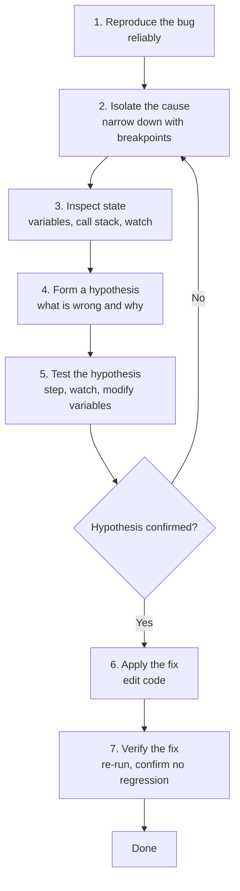

# 9. Debugging Workflow Patterns

> **Tags:** #vscode #debugging #workflow #patterns

This note puts the previous eight notes together into repeatable workflows. By the end, you should be able to look at a bug, decide which workflow fits, and execute it without fumbling.

---

## 9.1 The Universal Debugging Loop

Every debugging session, no matter how complex, follows the same loop:



The debugger accelerates steps 2, 3, and 5. The other steps still require thinking.

---

## 9.2 Workflow 1 — "Wrong Value Somewhere"

**Scenario:** A variable has an unexpected value and you do not know where it went wrong.

**Steps:**

1. Set a breakpoint where you first observe the wrong value.
2. Inspect the Variables pane. Confirm the value is wrong.
3. Look at the Call Stack. Identify the function that produced this value.
4. Set a breakpoint at the call site of that function (see [[5. Where to Use a Breakpoint]]).
5. Restart the debug session. Pause at the call site.
6. Inspect the inputs. Are they correct?
    - If yes: the bug is inside the function. Step Into (F11) and walk through it.
    - If no: the bug is in the caller. Go up the call stack and repeat.
7. Once you find the line where the wrong value is produced, form a hypothesis about why.
8. Test the hypothesis by modifying variables (right-click → Set Value) or by stepping through with Watch expressions.
9. Apply the fix in code. Restart and verify.

---

## 9.3 Workflow 2 — "Crash or Exception"

**Scenario:** The program throws an exception or crashes. You want to find where and why.

**Steps:**

1. In the Breakpoints pane, enable **Caught Exceptions** (and **Uncaught Exceptions** if not already enabled).
2. Start the debug session.
3. The debugger pauses at the line that threw the exception.
4. Inspect the Call Stack — the bottom frame is the entry point; the top frame is where the exception was thrown.
5. Walk up the call stack to find the frame where the bad input originated.
6. Set a breakpoint at that frame's relevant line and restart, to inspect the inputs before the exception.
7. Form a hypothesis, fix, verify.

For Node.js, configure `launch.json` to break on exceptions:

```json
{
  "type": "node",
  "request": "launch",
  "name": "Break on exceptions",
  "program": "${file}",
  "skipFiles": ["<node_internals>/**"]
}
```

VS Code's Breakpoints pane has checkboxes for "Caught Exceptions" and "Uncaught Exceptions" — toggle them as needed.

---

## 9.4 Workflow 3 — "Infinite Loop or Hang"

**Scenario:** The program is stuck. You suspect an infinite loop or a deadlock.

**Steps:**

1. Start the program under the debugger (or attach to the running process).
2. Click the **Pause** button on the debug toolbar (if available). The debugger pauses at whatever line is currently executing.
3. Inspect the Call Stack. You will likely be inside the suspected loop.
4. Look at the loop condition. Why does it not terminate?
    - Wrong counter increment?
    - Wrong comparison?
    - Awaiting a promise that never resolves?
    - Deadlock (two threads waiting on each other)?
5. Set a breakpoint inside the loop with a **hit count** of `>= 1000` (or whatever is reasonable). Restart. When the breakpoint hits, inspect the loop state.
6. Form a hypothesis, fix, verify.

If the program is in a deadlock (multi-threaded), the Call Stack pane shows the state of every thread. Look for threads blocked on locks or waits.

---

## 9.5 Workflow 4 — "Bug Only Happens on the Nth Iteration"

**Scenario:** A loop has a bug that only manifests on a specific iteration.

**Steps:**

1. Set a breakpoint inside the loop.
2. Right-click → Edit Breakpoint → Conditional.
3. Enter a condition that identifies the buggy iteration (e.g., `i === 742` or `user.id === "u_12345"`).
4. Start the debug session. The debugger skips all other iterations and pauses only on the one you care about.
5. Inspect state, form hypothesis, fix, verify.

If you cannot write a precise condition, use a **hit count** breakpoint: pause on the Nth hit. Or use a **logpoint** to print state every iteration and identify the buggy one from the log.

---

## 9.6 Workflow 5 — "Bug in a Specific Code Path"

**Scenario:** The bug only occurs when a specific branch of code is taken (e.g., only for admin users, only on weekends, only when the cart is empty).

**Steps:**

1. Identify the branching point in code.
2. Set a breakpoint on the line inside the branch.
3. Make the condition match: trigger the bug through the UI or by setting variables.
4. The debugger pauses inside the branch. Inspect state.
5. Walk through the branch line by line with Step Over (F10).
6. Form hypothesis, fix, verify.

If the branch is hit many times but only misbehaves occasionally, add a **conditional breakpoint** that captures the bad case (e.g., `user.isAdmin && result < 0`).

---

## 9.7 Workflow 6 — "Debugging Tests"

**Scenario:** A test fails and you want to debug it.

**Steps:**

1. Open the test file.
2. Above each test function, VS Code shows a **Debug Test** code lens (small text above the function). Click it.
3. VS Code runs only that test under the debugger.
4. If the test framework supports it, set breakpoints inside the test or in the code under test.
5. Step through, inspect, fix, re-run the test.

For test frameworks without code lens support, configure a `launch.json` entry that runs the test command:

```json
{
  "type": "node",
  "request": "launch",
  "name": "Debug Jest tests",
  "program": "${workspaceFolder}/node_modules/.bin/jest",
  "args": ["--runInBand", "--testNamePattern", "${input: testName}"],
  "console": "integratedTerminal"
}
```

---

## 9.8 Workflow 7 — "Debugging a Running Process"

**Scenario:** The program is already running (e.g., a server) and you want to attach a debugger to it.

**Steps:**

1. Start the program with debugging enabled. For Node.js: `node --inspect=9229 server.js`.
2. In VS Code, create a `launch.json` with `request: "attach"`:

```json
{
  "type": "node",
  "request": "attach",
  "name": "Attach to running process",
  "port": 9229,
  "localRoot": "${workspaceFolder}",
  "remoteRoot": "."
}
```

3. Set breakpoints in your code.
4. Press F5 to attach.
5. Trigger the code path you want to debug. The debugger pauses at your breakpoints.

This is the standard workflow for debugging servers, containers, and remote processes.

---

## 9.9 The Anti-Workflows: What Not to Do

### Anti-Workflow 1 — Random `console.log` Everywhere

Sprinkling `console.log` everywhere is debugging by trial and error. It works for trivial bugs but fails for anything subtle. Use the debugger.

### Anti-Workflow 2 — Changing Code Without Understanding

If you do not know *why* the bug exists, do not start fixing it. You will introduce new bugs. Use the debugger to confirm the cause first.

### Anti-Workflow 3 — Stepping Through Everything

Stepping through every line of a long function is slow. Set strategic breakpoints and use Continue (F5) to skip between them.

### Anti-Workflow 4 — Forgetting to Remove Breakpoints

Stale breakpoints cause the debugger to pause unexpectedly in future sessions. Clean up the Breakpoints pane when done.

---

## 9.10 A Mental Checklist

Before each debug session, mentally run through:

- [ ] Can I reproduce the bug reliably?
- [ ] Do I have a hypothesis about the cause?
- [ ] Where should I set my first breakpoint? (Usually: where the wrong value first appears.)
- [ ] Are my `skipFiles` configured to avoid stepping into library code?
- [ ] Do I need a conditional breakpoint or logpoint?
- [ ] Once I find the bug, can I write a test that reproduces it before fixing?

The last point is crucial: a regression test ensures the bug does not come back.

---

## 9.11 Key Takeaways

- Every debug session follows: reproduce → isolate → inspect → hypothesize → test → fix → verify.
- Different bugs call for different workflows: wrong-value, crash, infinite-loop, Nth-iteration, code-path, tests, running-process.
- Strategic breakpoints + Watch + Call Stack are the core toolkit.
- Always confirm the cause before fixing. Always write a regression test after fixing.
- Avoid anti-workflows: random logging, blind fixes, stepping through everything, forgetting to clean up breakpoints.

---

**Previous:** [[8. Step Over Built-in Files]]
**Next chapter:** [[1. Introduction to Refactoring]] (Chapter 5)
