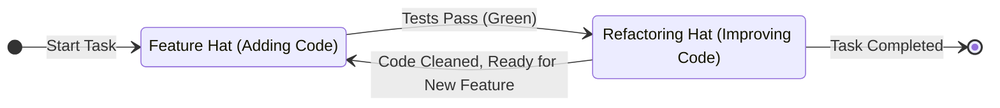
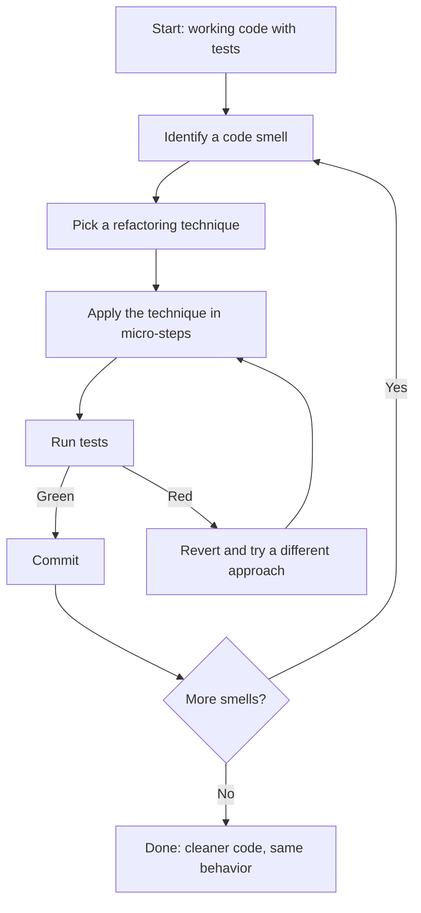

# 1. Introduction to Refactoring: Core Theory and Discipline

> **Tags:** #refactoring #theory #discipline #clean-code

In professional software development, code is read orders of magnitude more often than it is written. Over time, as requirements change and features are added, code quality naturally degrades — a phenomenon known as **Software Entropy**.

**Refactoring** is the systematic practice of improving the internal structure of existing code without altering its external behavior. It is the primary tool for combating software entropy, reducing technical debt, and keeping codebases cheap and safe to modify.

---

## 1.1 Refactoring vs. Other Code Modifications

To practice refactoring with discipline, you must distinguish it from other types of code changes:

| Attribute | Refactoring | Performance Optimization | Feature Development | Bug Fixing |
| :--- | :--- | :--- | :--- | :--- |
| **Changes Observable Behavior?** | **No** | **No** | **Yes** (Adds behavior) | **Yes** (Corrects behavior) |
| **Primary Goal** | Readability, maintainability, simplicity. | Execution speed, memory reduction, resource usage. | Value delivery, satisfying new requirements. | System correctness, resolving operational failures. |
| **Impact on Architecture** | Decouples components, simplifies structures. | Often introduces complexity (caching, low-level optimizations). | Expands the domain model. | Patches or corrects existing logic paths. |

The defining trait of refactoring is the **"without altering its external behavior"** clause. If your change alters what the program does (even slightly), you are not refactoring — you are doing one of the other three activities. This distinction matters because it determines what safety checks you need.

---

## 1.2 The "Two Hats" Metaphor (Martin Fowler)

When developing software, you should consciously divide your time between wearing two distinct hats:

1. **The Feature Hat:** You are adding new capabilities to the system. Your success is measured by writing tests and making them pass. You do not modify existing structures; you only add to them.
2. **The Refactoring Hat:** You are strictly restructuring existing code. You **must not add any new features or test cases** during this time. Your sole focus is moving, simplifying, and decoupling existing code. Your success is measured by making the existing test suite pass without modifications.

*Never try to wear both hats at the exact same time.* Doing so increases cognitive load and makes tracking down bugs significantly harder. If you are mid-refactor and realize you need to add a feature, finish the refactor first (commit it), then switch hats.

---

## 1.3 The Three Golden Rules of Refactoring

Before you modify a single line of code, you must establish three baseline conditions:

### Rule 1 — Solid Test Coverage Is Mandatory

If you do not have automated tests, you are not refactoring — you are just changing code and hoping for the best. Without a test suite to verify that your changes have not broken existing behavior, you cannot refactor safely.

The minimum bar is:

- Tests that cover the **public interface** of the code you intend to refactor.
- Tests that cover the **edge cases** — null inputs, empty collections, boundary values.
- Tests that run **fast enough** that you can run them after every micro-step (under 10 seconds for the parts you are touching).

If coverage is insufficient, your first task is to **add tests for the existing behavior** before you start changing anything. This is called **characterization testing** — pinning down the current behavior so you can refactor with confidence.

### Rule 2 — Take Micro-Steps (Baby Steps)

Do not try to clean up an entire class in one go. Instead, make tiny, atomic modifications: extract one variable, rename one parameter, or split one conditional.

- Compile and run your tests after **every single change**.
- If a change breaks the build, revert it immediately instead of trying to patch a series of broken steps.

The principle is: at any moment, the code should be in a working state. If you take a wrong turn, you lose minutes — not hours.

### Rule 3 — Maintain Micro-Commits

Commit your changes to local version control frequently. If you complete a successful micro-refactoring and your tests pass, commit it. This allows you to easily roll back to a known-good state if your next step goes wrong.

A good refactoring commit:

- Has a message describing the refactoring, not the feature (e.g., `refactor: extract Address class from User`).
- Contains **only** the refactoring change — no unrelated edits.
- Leaves the test suite green.

---

## 1.4 When to Refactor (and When Not to)

### Refactor When:

- **You are about to add a feature** and the existing code is hard to extend. Refactor first to make the feature easy to add, then add it (Rule of Three: the third time you do something similar, refactor).
- **You are fixing a bug** and the code is hard to understand. Refactor for clarity first, then fix the bug — the fix will be easier and the bug less likely to recur.
- **During code review** when you notice code smells. Small refactors as part of review keep the codebase healthy.
- **At the end of a sprint or feature** — a "cleanup commit" pass before merging.

### Do Not Refactor When:

- **You do not have tests.** Add tests first.
- **You are close to a deadline.** Ship the working code; refactor later.
- **The code is about to be rewritten entirely.** Do not polish code that will be deleted next week.
- **You are reviewing someone else's PR and the changes are unrelated.** Note the smell for later; do not refactor in their PR.

---

## 1.5 The Refactoring Cycle

This cycle is the heartbeat of refactoring. Every iteration makes the code slightly better, and the test suite guarantees you have not broken anything.

---

## 1.6 The Cost of Not Refactoring

Codebases that are never refactored accumulate **technical debt** — the implied future cost of working around current design flaws. Symptoms:

- **Estimated effort for new features keeps growing.** Each feature touches more code because the code is tangled.
- **Bug fixes introduce new bugs.** The code is so coupled that a fix in one place breaks something elsewhere.
- **Developers leave.** Nobody wants to work in a codebase they cannot understand.
- **Fear of change.** The team avoids touching certain parts of the code because "nobody knows what will break."

Refactoring is the payment schedule for this debt. Pay a little each sprint, or pay it all at once when the codebase becomes unmaintainable — at which point the only option is a full rewrite, which is expensive, risky, and often fails.

---

## 1.7 Refactoring Is a Skill, Not a Talent

Refactoring is learned through deliberate practice. The catalogs in [[2. Catalog of Code Smells]] and [[3. Catalog of Refactoring Techniques]] give you the vocabulary; your own codebase gives you the practice ground.

Recommended progression:

1. Read the code smells catalog. Learn to **name** what you see.
2. Read the refactoring techniques catalog. Learn the **mechanics** of each transformation.
3. Practice on real code. Pick a smell in your codebase, identify the matching technique, apply it.
4. Use your IDE's automated refactoring tools (see [[4. Automated IDE Refactoring]]) for the mechanical parts.
5. Review your refactors with a colleague. Other people spot things you miss.

---

## 1.8 Key Takeaways

- Refactoring improves **structure** without changing **behavior**.
- Wear the **Feature Hat** or the **Refactoring Hat** — never both at once.
- Three golden rules: **tests first, micro-steps, micro-commits**.
- Refactor when adding features, fixing bugs, or during review.
- Do not refactor without tests, near deadlines, or in code about to be deleted.
- Refactoring is a learnable skill — practice on your own codebase.

---

**Next:** [[2. Catalog of Code Smells]]
