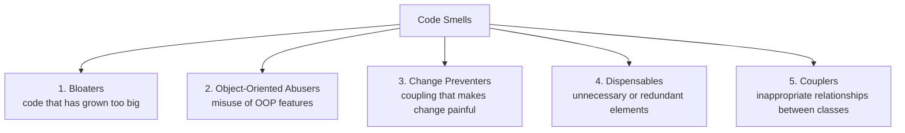
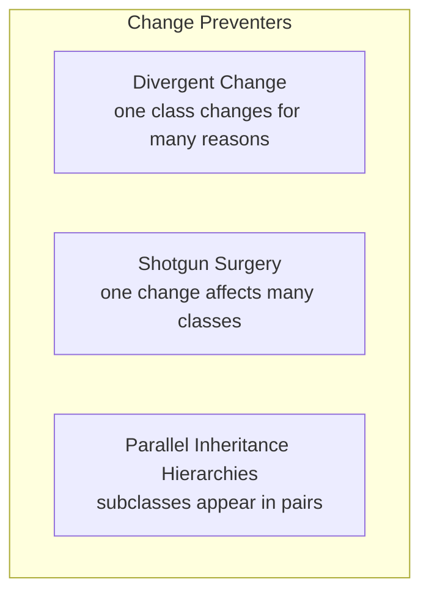
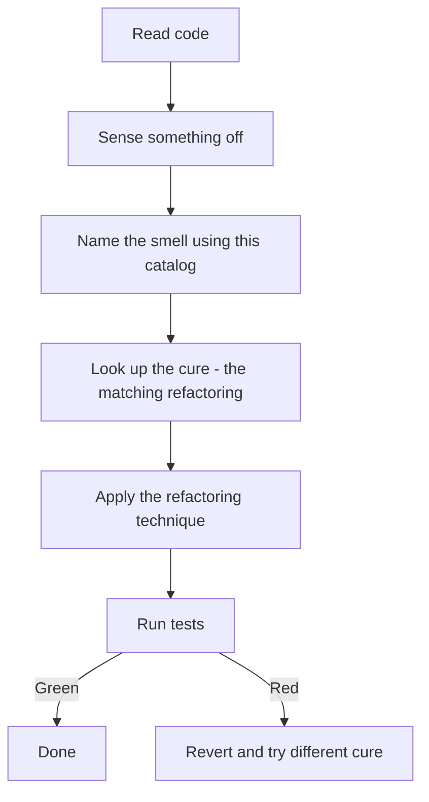

# 2. Catalog of Code Smells: Diagnosing Technical Debt

> **Tags:** #refactoring #code-smells #diagnostics #clean-code

A **Code Smell** is a surface-level indicator that suggests there may be a deeper design flaw in your application's architecture. Code smells are not bugs — the system may still run perfectly — but they indicate poor maintainability, tight coupling, or high complexity.

The term was popularized by Kent Beck and Martin Fowler in the book *Refactoring: Improving the Design of Existing Code*. The metaphor is apt: a smell is something you sense before you can name it precisely. With practice, you develop a "nose" for code that needs refactoring.

---

## 2.1 Taxonomy of Code Smells



Each category contains several specific smells. We cover the most important ones below.

---

## 2.2 The Bloaters

Bloaters are methods, classes, or data structures that have grown to a size where they are extremely difficult to understand, maintain, or reuse.

### Long Method

- **Description:** A single method containing too many lines of code (typically more than 20 lines). It tries to handle multiple responsibilities, making its execution flow difficult to follow.
- **Symptom:** You scroll. And scroll. And the method keeps going.
- **The Cure:** Use **Extract Method** to split cohesive blocks of logic into smaller, dedicated helper functions with descriptive names.

### Large Class (God Object)

- **Description:** A class containing too many fields, methods, or responsibilities. It acts as an orchestrator for the entire system, violating the Single Responsibility Principle.
- **Symptom:** You cannot describe what the class does in one sentence without using "and".
- **The Cure:** Use **Extract Class** or **Extract Interface** to delegate responsibilities to smaller, highly focused classes.

### Primitive Obsession

- **Description:** Using basic data types (strings, integers, arrays) to represent complex domain concepts (e.g., using a plain string for an email address, or a plain float for currency). This leads to duplicate validation logic scattered across the codebase.
- **Symptom:** The same validation (e.g., "is this a valid email?") appears in five different files.
- **The Cure:** Use **Replace Data Value with Object** or **Introduce Parameter Object**.

### Long Parameter List

- **Description:** A method takes more than three or four parameters. Callers have to remember the order, and adding a new parameter requires updating every caller.
- **Symptom:** Method signatures span multiple lines, or callers pass `null` for parameters they do not care about.
- **The Cure:** Use **Introduce Parameter Object** to group related parameters, or **Preserve Whole Object** to pass the entire object instead of its parts.

---

## 2.3 Object-Oriented Abusers

These smells occur when object-oriented programming features are used incorrectly or ignored entirely.

### Alternative Classes with Different Interfaces

- **Description:** Two or more classes that perform identical or highly similar functions but have different method names. This makes it impossible to use them interchangeably.
- **Symptom:** You find yourself writing `if (logger instanceof FileLogger) { ((FileLogger) logger).writeFile(msg); } else if (logger instanceof ConsoleLogger) { ((ConsoleLogger) logger).printLine(msg); }`.
- **The Cure:** Use **Rename Method** and **Move Method** to align their signatures, then extract a common interface or abstract superclass.

### Refused Bequest

- **Description:** A subclass inherits from a superclass but overrides or throws exceptions for most of its inherited methods because it does not actually need them. This indicates an incorrect use of inheritance over composition.
- **Symptom:** A subclass with methods that just throw `UnsupportedOperationException`.
- **The Cure:** Replace inheritance with composition (**Replace Inheritance with Delegation**) or push unused methods down into a more appropriate sibling class.

### Speculative Generality

- **Description:** Code is added "for future flexibility" that is not currently needed. Abstract classes, hooks, and configuration points proliferate without any concrete use case.
- **Symptom:** Classes with a single concrete subclass; methods with `TODO: implement later` comments.
- **The Cure:** Delete the unused abstractions. **YAGNI** (You Aren't Gonna Need It) — add abstractions when you have a second use case, not before.

---

## 2.4 The Change Preventers

These smells make it difficult to modify your codebase, turning simple feature additions into painful, error-prone tasks.



### Divergent Change

- **Description:** You have to modify the same class in different ways whenever you make unrelated changes to the system (e.g., you must modify `OrderProcessor` when adding a new payment type **and** when changing the invoice PDF layout).
- **Symptom:** A single class has commits from many unrelated feature branches.
- **The Cure:** Split the class (**Extract Class**) so that each class has only a single reason to change. This is the **Single Responsibility Principle** in action.

### Shotgun Surgery

- **Description:** Making a single logical change (such as adding a new user role) requires you to make dozens of small modifications across many different classes.
- **Symptom:** A feature ticket requires touching 15 files, each with one or two line changes.
- **The Cure:** Use **Move Method** and **Move Field** to consolidate these related behaviors into a single, cohesive class.

### Parallel Inheritance Hierarchies

- **Description:** Every time you create a subclass of `Animal`, you also have to create a corresponding subclass of `AnimalFood`, `AnimalHabitat`, etc. The hierarchies grow in lockstep.
- **Symptom:** New subclass creations always come in pairs or triples.
- **The Cure:** Move references to one hierarchy into instances of the other, so that adding a new subclass does not require parallel additions.

---

## 2.5 The Dispensables

Dispensables are useless, redundant, or unnecessary elements in your codebase that should be removed to keep your project clean.

### Comments as Deodorant

- **Description:** Complex, hard-to-read code that is covered up by detailed inline comments explaining *how* the code works, rather than *why* it was written.
- **Symptom:** Comments like `// increment i by 1` next to `i++`.
- **The Cure:** Refactor the code to be self-documenting using **Extract Method** and **Rename Variable**.

*Before:*

```javascript
// Check if user is eligible for premium upgrade
if (user.age > 18 && user.score > 800 && user.status === 'active') { ... }
```

*After:*

```javascript
if (user.isEligibleForPremiumUpgrade()) { ... }
```

The comment disappears because the code now says what it means.

### Duplicate Code

- **Description:** Identical or highly similar code blocks exist in multiple places. This is a major risk, as fixing a bug in one place means you must remember to fix it in all other copies.
- **Symptom:** You fix a bug, then a week later a similar bug is reported in a different module.
- **The Cure:** Use **Extract Method** and pull common logic up into a shared utility, helper, or superclass. For structural duplication (same shape, different types), consider generics or a strategy pattern.

### Data Class

- **Description:** A class that is just a bag of data — fields with getters and setters, no behavior. Other classes operate on its data, violating the **Tell, Don't Ask** principle.
- **Symptom:** `User` has only getters and setters; all logic about users lives in `UserService`.
- **The Cure:** Move behavior that operates on the data into the data class itself (**Move Method**).

### Dead Code

- **Description:** Variables, methods, or classes that are no longer called by anything.
- **Symptom:** IDE highlights them as unused; git blame shows no recent edits.
- **The Cure:** Delete them. Source control remembers them if you need them back.

---

## 2.6 The Couplers

Couplers represent inappropriate or excessive relationships between classes, violating the core design principle of **High Cohesion and Low Coupling**.

### Feature Envy

- **Description:** A method in Class A spends more time calling data access and helper methods of Class B than it does working with its own local data.
- **Symptom:** A method on `Order` that mostly accesses `customer.getAddress()`, `customer.getPhone()`, `customer.getEmail()`.
- **The Cure:** Use **Move Method** to relocate the behavior to the class that actually owns the data it is working with.

### Message Chains

- **Description:** A client requests an object from another object, which then requests another object, creating a long chain of temporary variables and method calls (e.g., `user.getAccount().getBilling().getDetails().getAddress()`). This tightly couples the client to the entire internal structure of the object graph.
- **Symptom:** A single line of code with four or more dots in a method call chain.
- **The Cure:** Use **Hide Delegate**. Wrap the navigation logic within the parent object so the client only has to call a single, direct method (e.g., `user.getBillingAddress()`).

### Inappropriate Intimacy

- **Description:** One class knows too much about another class's internals — accessing fields that should be private, calling methods that should be implementation details.
- **Symptom:** A class reaches into another class's "private" parts through friend access, reflection, or by exposing too much through getters.
- **The Cure:** Use **Move Method** and **Extract Class** to redraw the boundaries. If two classes are deeply intertwined, consider merging them.

### Middle Man

- **Description:** A class that does nothing but delegate to another class — every method just calls the same method on a wrapped object.
- **Symptom:** `class Wrapper { method() { return this.wrapped.method(); } }` repeated for every method.
- **The Cure:** Remove the middle man and have clients call the wrapped object directly, or merge the two classes.

---

## 2.7 How to Use This Catalog



The catalog is a **diagnostic tool**. When you read code and feel "this is messy," the catalog gives you a precise name for what you are sensing. Once you have a name, you can look up the matching refactoring technique in [[3. Catalog of Refactoring Techniques]].

---

## 2.8 Smells Are Heuristics, Not Laws

Not every smell requires refactoring. Context matters:

- A **Long Method** that is a long sequence of straightforward setup statements (e.g., test fixtures) may be more readable as one method than split into ten.
- **Duplicate Code** of two lines may not be worth extracting if the duplication is coincidental rather than structural.
- **Primitive Obsession** for a single internal field may not justify a value object if the field has no invariants.

The catalog tells you *where to look*; judgment tells you *what to fix*. When in doubt, ask: "Would refactoring this make the next change easier?" If yes, refactor. If no, move on.

---

## 2.9 Key Takeaways

- Code smells are surface indicators of deeper design problems.
- Five categories: Bloaters, OO Abusers, Change Preventers, Dispensables, Couplers.
- Each smell has a matching cure (a refactoring technique).
- Use the catalog to **name** what you sense, then look up the cure.
- Smells are heuristics, not laws — context determines whether to fix.

---

**Previous:** [[1. Introduction to Refactoring]]
**Next:** [[3. Catalog of Refactoring Techniques]]
