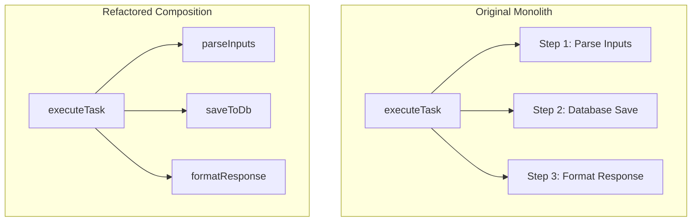
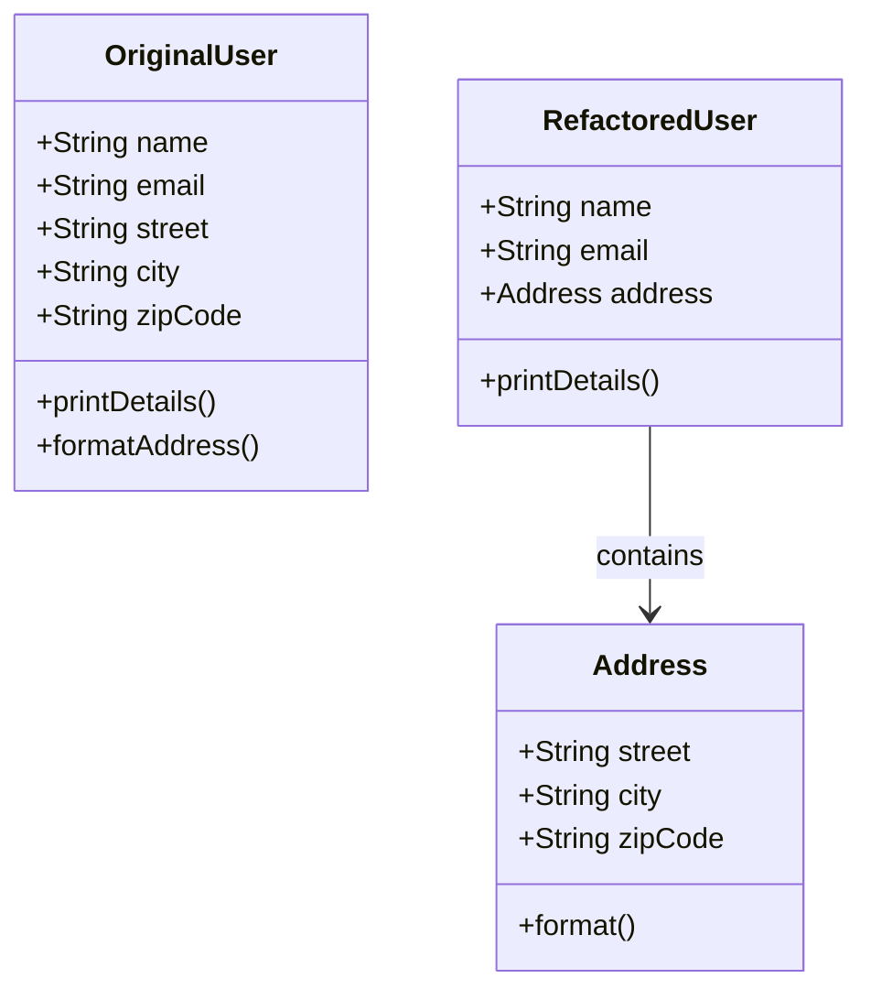
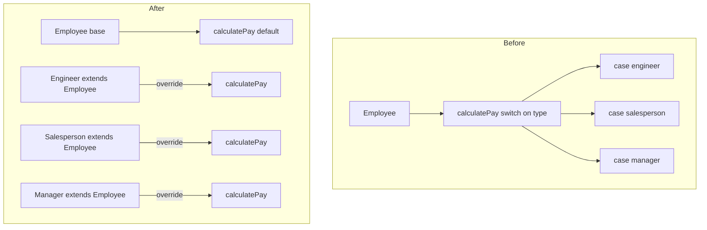
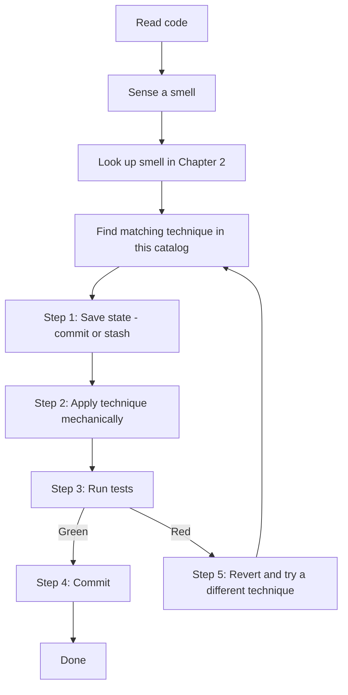

# 3. Catalog of Refactoring Techniques: Step-by-Step Transformations

> **Tags:** #refactoring #techniques #transformations #clean-code

This catalog provides a reference for the most common and powerful refactoring transformations. Each technique includes a conceptual explanation, structural mappings, and code examples.

---

## 3.1 Extract Method

### The Problem

You have a long method containing multiple logical steps. This makes the method difficult to read, reuse, and test in isolation.



### Mechanics

1. Create a new method with a name that describes what it does (not how).
2. Copy the relevant code into the new method.
3. Pass in any local variables it needs as parameters.
4. If the extracted code assigns to a variable that is used later, return that variable from the new method.
5. Replace the original code with a call to the new method.
6. Run tests.

### Step-by-Step Transition

```javascript
// BEFORE REFACTORING
function printUserStatement(user) {
    let outstanding = 0;

    // Print Banner
    console.log("*****************************");
    console.log("****** User Statement *******");
    console.log("*****************************");

    // Calculate Outstanding
    for (let order of user.orders) {
        if (order.status === "unpaid") {
            outstanding += order.amount;
        }
    }

    // Print Details
    console.log(`Name: ${user.name}`);
    console.log(`Outstanding Balance: $${outstanding}`);
}
```

```javascript
// AFTER REFACTORING: Extracting logical blocks into dedicated, single-purpose functions
function printUserStatement(user) {
    printBanner();
    const outstanding = calculateOutstanding(user.orders);
    printDetails(user.name, outstanding);
}

function printBanner() {
    console.log("*****************************");
    console.log("****** User Statement *******");
    console.log("*****************************");
}

function calculateOutstanding(orders) {
    return orders
        .filter(order => order.status === "unpaid")
        .reduce((sum, order) => sum + order.amount, 0);
}

function printDetails(name, outstanding) {
    console.log(`Name: ${name}`);
    console.log(`Outstanding Balance: $${outstanding}`);
}
```

The refactored version reads like a table of contents: `printBanner`, `calculateOutstanding`, `printDetails`. A reader can understand the high-level flow in seconds, then drill into each helper only if they need the details.

---

## 3.2 Extract Class

### The Problem

A single class carries too many responsibilities, resulting in a large number of fields and methods that can be split into smaller, cohesive units.



### Mechanics

1. Identify a cohesive subset of fields and methods that could form a new class.
2. Create the new class.
3. Move the fields into the new class using **Move Field**.
4. Move the methods into the new class using **Move Method**.
5. In the original class, hold a reference to an instance of the new class.
6. Update callers to delegate through the new class.
7. Run tests.

### Step-by-Step Transition

```javascript
// BEFORE REFACTORING: User class is bloated with address validation and formatting logic
class User {
    constructor(name, email, street, city, zipCode) {
        this.name = name;
        this.email = email;
        this.street = street;
        this.city = city;
        this.zipCode = zipCode;
    }

    getCompleteAddress() {
        return `${this.street}, ${this.city} - ${this.zipCode}`;
    }

    hasValidZip() {
        return this.zipCode.length === 5;
    }
}
```

```javascript
// AFTER REFACTORING: Extracting the address logic into its own cohesive Address class
class Address {
    constructor(street, city, zipCode) {
        this.street = street;
        this.city = city;
        this.zipCode = zipCode;
    }

    format() {
        return `${this.street}, ${this.city} - ${this.zipCode}`;
    }

    isValid() {
        return this.zipCode.length === 5;
    }
}

class User {
    constructor(name, email, address) {
        this.name = name;
        this.email = email;
        this.address = address; // Delegate address operations to the extracted Address class
    }
}
```

Now `User` knows only about people; `Address` knows only about locations. Each can be tested and extended independently.

---

## 3.3 Replace Conditional with Polymorphism

### The Problem

You have a complex conditional statement (like a `switch` or `if-else` chain) that performs different actions based on an object's type or state. This violates the Open/Closed Principle — every new type requires editing the switch.



### Step-by-Step Transition

```javascript
// BEFORE REFACTORING
class Employee {
    constructor(type, monthlySalary, commission) {
        this.type = type;
        this.monthlySalary = monthlySalary;
        this.commission = commission;
    }

    calculatePay() {
        switch (this.type) {
            case 'engineer':
                return this.monthlySalary;
            case 'salesperson':
                return this.monthlySalary + this.commission;
            case 'manager':
                return this.monthlySalary * 1.2;
            default:
                throw new Error(`Unknown type: ${this.type}`);
        }
    }
}
```

```javascript
// AFTER REFACTORING: Replacing the switch statement with polymorphic class inheritance
class Employee {
    constructor(monthlySalary) {
        this.monthlySalary = monthlySalary;
    }
    calculatePay() {
        return this.monthlySalary;
    }
}

class Engineer extends Employee {}

class Salesperson extends Employee {
    constructor(monthlySalary, commission) {
        super(monthlySalary);
        this.commission = commission;
    }
    calculatePay() {
        return this.monthlySalary + this.commission;
    }
}

class Manager extends Employee {
    calculatePay() {
        return this.monthlySalary * 1.2;
    }
}
```

Adding a new employee type no longer requires modifying `Employee.calculatePay` — you just add a new subclass. The Open/Closed Principle is satisfied.

---

## 3.4 Introduce Parameter Object

### The Problem

A method requires a long list of primitive parameters (e.g., separate parameters for start dates, end dates, minimum values, and maximum values). This makes the method call signature difficult to read and leads to duplicate validation checks.

```javascript
// BEFORE REFACTORING
function getOrdersWithinRange(startDate, endDate, minAmount, maxAmount) {
    // Complex queries matching these 4 primitives...
}

// Client Call: Extremely difficult to understand what each primitive number represents
getOrdersWithinRange("2026-01-01", "2026-06-01", 100, 5000);
```

```javascript
// AFTER REFACTORING: Introduce dedicated parameter structures
class DateRange {
    constructor(start, end) {
        this.start = start;
        this.end = end;
    }
}

class PriceFilter {
    constructor(min, max) {
        this.min = min;
        this.max = max;
    }
}

function getOrdersWithinRange(dateRange, priceFilter) {
    // Logic queries now read cleanly from structured domain parameters
}

// Client Call: Clean, readable, and structured
const searchRange = new DateRange("2026-01-01", "2026-06-01");
const budgetLimit = new PriceFilter(100, 5000);

getOrdersWithinRange(searchRange, budgetLimit);
```

The parameter objects can also encapsulate their own validation (e.g., `DateRange` can require `start <= end`), reducing duplication across all callers.

---

## 3.5 Rename Variable / Method

### The Problem

A variable or method has a name that does not clearly express its purpose. Readers have to look at the implementation to understand what it does.

### Mechanics

1. If renaming a method, check all callers (IDE refactoring tools handle this automatically).
2. Change the name.
3. Run tests.

### Example

```javascript
// BEFORE
function calc(u, d) {
    return u * d / 100;
}
let r = calc(price, rate);
```

```javascript
// AFTER
function calculateDiscount(originalPrice, discountPercent) {
    return originalPrice * discountPercent / 100;
}
let discountAmount = calculateDiscount(price, rate);
```

The renamed version is self-documenting. No comment is needed.

---

## 3.6 Replace Temp with Query

### The Problem

A local variable holds the result of an expression and is used only once or twice. The variable adds noise without adding clarity.

```javascript
// BEFORE
function calculateTotal() {
    let basePrice = quantity * itemPrice;
    if (basePrice > 1000) {
        return basePrice * 0.95;
    } else {
        return basePrice * 0.98;
    }
}
```

```javascript
// AFTER
function calculateTotal() {
    if (basePrice() > 1000) {
        return basePrice() * 0.95;
    } else {
        return basePrice() * 0.98;
    }
}

function basePrice() {
    return quantity * itemPrice;
}
```

The query method can be reused elsewhere, and the calculation is encapsulated. Use judgment — if the expression is expensive or called many times, keeping the temp may be better for performance.

---

## 3.7 Move Method

### The Problem

A method is in the wrong class — it operates mostly on data from another class (Feature Envy smell).

### Mechanics

1. Create a copy of the method in the target class.
2. Remove the method from the source class.
3. Update callers to invoke the method on the target class.

### Example

```javascript
// BEFORE: AccountType has a method that uses Account's data heavily
class AccountType {
    overdraftCharge(account) {
        if (this.isPremium()) {
            const result = 10;
            if (account.daysOverdrawn > 7) result += (account.daysOverdrawn - 7) * 0.85;
            return result;
        } else {
            return account.daysOverdrawn * 1.75;
        }
    }
}

class Account {
    overdraftCharge() {
        return this.type.overdraftCharge(this);
    }
}
```

```javascript
// AFTER: Move the logic to Account, which owns the data
class Account {
    overdraftCharge() {
        if (this.type.isPremium()) {
            const result = 10;
            if (this.daysOverdrawn > 7) result += (this.daysOverdrawn - 7) * 0.85;
            return result;
        } else {
            return this.daysOverdrawn * 1.75;
        }
    }
}
```

---

## 3.8 Replace Inheritance with Delegation

### The Problem

A subclass uses only a small part of a superclass's interface, or overrides methods to throw exceptions (Refused Bequest smell). Inheritance is being used for code reuse rather than subtyping.

```javascript
// BEFORE: Stack extends Vector but refuses most of Vector's methods
class Stack extends Array {
    push(item) { super.push(item); }
    pop() { return super.pop(); }
    // Refuse all the random-access methods inherited from Array
    insertAt(index, item) { throw new Error("Not supported"); }
    removeAt(index) { throw new Error("Not supported"); }
}
```

```javascript
// AFTER: Stack delegates to an internal array
class Stack {
    constructor() {
        this.items = [];
    }
    push(item) { this.items.push(item); }
    pop() { return this.items.pop(); }
    // No need to refuse methods — they are not exposed at all
}
```

The principle: prefer composition over inheritance unless the subclass truly "is-a" superclass.

---

## 3.9 A Workflow for Applying These Techniques



---

## 3.10 Key Takeaways

- **Extract Method** is the most-used technique — split long methods into named helpers.
- **Extract Class** splits bloated classes along responsibility boundaries.
- **Replace Conditional with Polymorphism** replaces switches with subclass overrides.
- **Introduce Parameter Object** groups related primitive parameters.
- **Rename** is the simplest and most powerful technique — make code self-documenting.
- **Move Method** relocates behavior to the class that owns the data.
- **Replace Inheritance with Delegation** prefers composition over inheritance.

---

**Previous:** [[2. Catalog of Code Smells]]
**Next:** [[4. Automated IDE Refactoring]]
