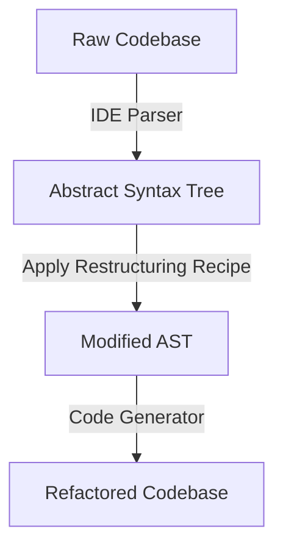
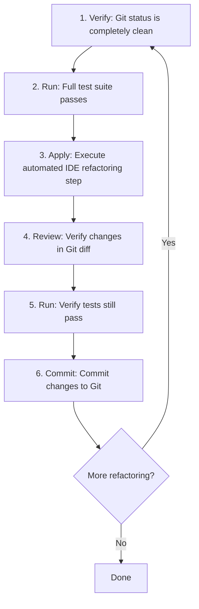

# 4. Automated IDE Refactoring: Leveraging Tooling Safely

> **Tags:** #refactoring #ide #tooling #automation

Modern Integrated Development Environments (IDEs) like VS Code and the JetBrains suite (IntelliJ, WebStorm, Rider) are not simple text editors. They parse your source code into an **Abstract Syntax Tree (AST)** — a structured, hierarchical representation of your program's syntax.

Because the IDE understands the AST, it can perform complex structural transformations automatically and safely. This is a force multiplier for refactoring: tasks that would take 20 minutes of careful manual editing (and risk introducing typos) can be done in seconds with IDE refactoring tools.

---

## 4.1 How IDE Refactoring Works

1. The IDE parses your source code into an AST.
2. You invoke a refactoring command (e.g., "Rename Method").
3. The IDE applies a **restructuring recipe** to the AST — modifying the symbol's node, all references to it, and any related nodes (e.g., import statements).
4. The IDE regenerates source code from the modified AST.
5. The result is a clean, consistent refactor across every file in your project.

Because the IDE works on the AST rather than on raw text, it does not get confused by string literals that happen to contain the same characters, or by comments that mention the old name. It refactors only the actual code symbols.

---

## 4.2 Essential Automated Refactoring Shortcuts

Always prioritize your IDE's built-in refactoring tools over manual editing. They are faster, eliminate typos, and automatically update imports and references across your entire project.

### 1. Safe Rename (The Most Important Shortcut)

- **The Problem:** Renaming a widely used class, method, or file using simple "Find and Replace" can break unrelated code (such as matching string literals or variables with similar names).
- **The Solution:** Use **Safe Rename**. The IDE analyzes the AST to locate only the actual occurrences of that specific symbol, updating them across all files while ignoring unrelated matches in strings or comments.

| IDE | Shortcut |
| --- | --- |
| VS Code | `F2` |
| JetBrains (IntelliJ, WebStorm, PyCharm, Rider) | `Shift + F6` |

Usage:

1. Place the cursor on the symbol you want to rename.
2. Press the shortcut.
3. Type the new name.
4. Press Enter. The IDE updates every reference across the project.

### 2. Extract Method / Extract Function

- **The Problem:** You have identified a block of code inside a long method that should be extracted into its own function.
- **The Solution:** Highlight the lines of code you want to extract, trigger the refactoring menu, and select "Extract Method". The IDE automatically:
    1. Determines which local variables are used inside the block and passes them in as parameters.
    2. Identifies any returned values and assigns them correctly in the calling function.
    3. Replaces the highlighted lines with a clean call to the new helper method.

| IDE | Shortcut |
| --- | --- |
| VS Code | Highlight → Right-Click → `Refactor...` → `Extract Function` (or `Ctrl+.` menu) |
| JetBrains | `Ctrl + Alt + M` (Windows/Linux) or `Cmd + Option + M` (macOS) |

### 3. Extract Variable / Constant

- **The Problem:** You have a complex mathematical expression or conditional evaluation that is difficult to read.
- **The Solution:** Highlight the expression and extract it into a variable. The IDE will declare a new variable with the expression's value and replace all duplicate occurrences of that expression throughout the file with the new variable.

| IDE | Shortcut |
| --- | --- |
| VS Code | Highlight → `Ctrl+.` → `Extract to constant` |
| JetBrains | `Ctrl + Alt + V` (Windows/Linux) or `Cmd + Option + V` (macOS) for variable; `Ctrl + Alt + C` for constant |

### 4. Inline (Reverse of Extract)

- **The Problem:** A method or variable adds indirection without value — it is called once, or it is trivially clear.
- **The Solution:** Use **Inline Method** or **Inline Variable**. The IDE replaces every call to the method with the method's body, or every reference to the variable with the variable's value.

| IDE | Shortcut |
| --- | --- |
| VS Code | `Ctrl+.` → `Inline` (varies by language extension) |
| JetBrains | `Ctrl + Alt + N` (Windows/Linux) or `Cmd + Option + N` (macOS) |

### 5. Move / Move Instance Method

- **The Problem:** A method is in the wrong class.
- **The Solution:** Use **Move** to relocate it. The IDE updates the visibility, parameter list, and all callers.

| IDE | Shortcut |
| --- | --- |
| VS Code | `Ctrl+.` → `Move to...` (varies) |
| JetBrains | `F6` |

### 6. Change Signature

- **The Problem:** You want to add, remove, or reorder a method's parameters. Doing this manually breaks every caller.
- **The Solution:** Use **Change Signature**. The IDE walks every call site and updates it to match the new signature, with sensible defaults for new parameters.

| IDE | Shortcut |
| --- | --- |
| VS Code | varies by language extension |
| JetBrains | `Ctrl + F6` (Windows/Linux) or `Cmd + F6` (macOS) |

---

## 4.3 Safeguarding Your Refactoring Pipeline

Even though automated IDE refactoring is highly reliable, you should still follow this structured workflow to ensure safety:

1. **Verify Git is clean:** Never start refactoring if you have uncommitted feature work or unrelated changes in your working directory. If something goes wrong, you want a clean baseline to revert to.
2. **Run your test suite:** Ensure your application is working correctly before applying any transformations. If tests were already failing, you cannot tell whether the refactor broke them.
3. **Execute the automated step:** Use your IDE shortcut to apply a single, specific refactoring transformation (e.g., rename a class or extract a method). One step at a time.
4. **Review the Git diff:** Run `git diff` inside your terminal to review the exact changes the IDE made. Confirm that no unexpected files were modified.
5. **Run tests again:** Verify that the refactoring has not broken any existing behavior.
6. **Commit your changes:** Commit the successful refactoring step to your local git history with a descriptive message (e.g., `refactor: extract address logic from User to Address class`).

---

## 4.4 When IDE Refactoring Falls Short

IDE refactoring is powerful but not omniscient. Cases where manual refactoring may be needed:

1. **Reflection / metaprogramming:** If your code calls methods via reflection (e.g., `obj[methodName]()`), the IDE cannot see the call site. A rename will miss it.
2. **String-based dispatch:** Code that calls methods by string name (e.g., `eval("user." + methodName + "()")`) is opaque to the IDE.
3. **Cross-language refactors:** Renaming a function called from both JavaScript and TypeScript may require updating both sides.
4. **Generated code:** Code created by code generators (gRPC stubs, ORM models) is regenerated on each build; IDE refactors on generated code are lost.
5. **Macro-heavy code:** Languages with powerful macros (Lisp, Rust) can have call sites that the IDE cannot statically analyze.

In these cases, fall back to manual refactoring, supplemented by global search (`Ctrl+Shift+F`) and careful review.

---

## 4.5 IDE Refactoring in Different Languages

| Language | IDE | Refactoring quality |
| --- | --- | --- |
| Java | IntelliJ IDEA | Excellent — best-in-class refactoring |
| Kotlin | IntelliJ IDEA | Excellent |
| C# | Rider / Visual Studio | Excellent |
| TypeScript | VS Code / WebStorm | Very good |
| JavaScript | VS Code / WebStorm | Good (dynamic typing limits some refactors) |
| Python | PyCharm / VS Code + Pylance | Good (depends on type hints) |
| Go | gopls (VS Code, GoLand) | Good |
| Rust | rust-analyzer | Good and improving |
| C++ | CLion | Good (but C++ makes refactoring hard) |

The stronger the type system, the better the refactoring. Statically typed languages give the IDE more information, so it can refactor more aggressively and safely.

---

## 4.6 Keyboard Shortcut Cheat Sheet

| Action | VS Code | JetBrains |
| --- | --- | --- |
| Rename | `F2` | `Shift+F6` |
| Extract Method | `Ctrl+.` menu | `Ctrl+Alt+M` / `Cmd+Option+M` |
| Extract Variable | `Ctrl+.` menu | `Ctrl+Alt+V` / `Cmd+Option+V` |
| Extract Constant | `Ctrl+.` menu | `Ctrl+Alt+C` / `Cmd+Option+C` |
| Extract Field | varies | `Ctrl+Alt+F` / `Cmd+Option+F` |
| Inline | `Ctrl+.` menu | `Ctrl+Alt+N` / `Cmd+Option+N` |
| Move | `Ctrl+.` menu | `F6` |
| Change Signature | varies | `Ctrl+F6` / `Cmd+F6` |
| Pull Members Up | varies | `Ctrl+Alt+Shift+U` |
| Push Members Down | varies | `Ctrl+Alt+Shift+D` |

Learn the three you use most often first: **Rename**, **Extract Method**, and **Extract Variable**. These three cover 80% of daily refactoring.

---

## 4.7 Common Mistakes

- **Renaming via Find and Replace instead of Safe Rename.** Breaks string literals, comments, and unrelated identifiers.
- **Extracting methods without running tests afterward.** IDE refactors are reliable but not perfect — always verify.
- **Refactoring generated code.** Changes are lost on the next regeneration.
- **Forgetting to commit between refactoring steps.** A failed refactor contaminates the next one.
- **Not using the IDE preview.** Most IDEs show a preview of changes before applying. Use it for unfamiliar refactors.

---

## 4.8 Key Takeaways

- IDE refactoring works on the AST, not raw text, so it is safe and precise.
- Learn the keyboard shortcuts for **Rename**, **Extract Method**, and **Extract Variable**.
- Always: clean Git → run tests → apply refactor → review diff → run tests → commit.
- IDE refactoring falls short with reflection, metaprogramming, generated code, and cross-language calls.
- Stronger type systems enable better refactoring.

---

**Previous:** [[3. Catalog of Refactoring Techniques]]
**Next chapter:** Back to [[README]]
