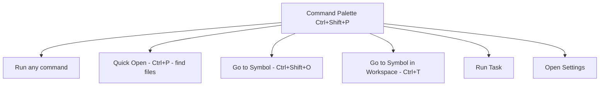

# 1. VS Code Mastery

> **Tags:** #vscode #ide #editors #productivity

VS Code is the most popular code editor in the world. This note covers the features that separate casual users from power users: navigation, multi-cursor editing, the command palette, integrated terminal, extensions, and customization.

---

## 1.1 The Command Palette

The **Command Palette** (`Ctrl+Shift+P` / `Cmd+Shift+P`) is the central nervous system of VS Code. Every action — every command, setting, and shortcut — is accessible from it.



Type `>` to see commands, `@` to see symbols, `#` to see workspace symbols, `:` to jump to a line number. Learn these prefixes; they save enormous time.

---

## 1.2 Navigation

| Shortcut | Action |
| --- | --- |
| `Ctrl+P` | Quick Open a file by name. |
| `Ctrl+Shift+P` | Command Palette. |
| `Ctrl+G` | Go to line number. |
| `F12` | Go to definition. |
| `Ctrl+F12` | Go to implementation (for interfaces). |
| `Shift+F12` | Find all references. |
| `Alt+F12` | Peek definition (inline preview). |
| `Ctrl+Shift+O` | Go to symbol in current file. |
| `Ctrl+T` | Go to symbol in workspace. |
| `Ctrl+Tab` | Switch between open files. |
| `Ctrl+-` / `Ctrl+Shift+-` | Go back / forward (after Go to Definition). |
| `Ctrl+K Ctrl+S` | Open keyboard shortcuts. |

---

## 1.3 Multi-Cursor Editing

Multi-cursor is VS Code's most powerful editing feature. Create multiple cursors and edit them simultaneously.

| Shortcut | Action |
| --- | --- |
| `Alt+Click` | Add a cursor at click position. |
| `Ctrl+Alt+Down` / `Ctrl+Alt+Up` | Add cursor below / above. |
| `Ctrl+D` | Select next occurrence of current word. |
| `Ctrl+Shift+L` | Select all occurrences of current word. |
| `Shift+Alt+Drag` | Column (block) selection. |
| `Ctrl+U` | Undo last cursor operation. |

Example: to rename a variable that appears 10 times, put the cursor on it, press `Ctrl+D` 9 times (or `Ctrl+Shift+L` for all), then type the new name. All occurrences update simultaneously.

---

## 1.4 The Integrated Terminal

`Ctrl+`` opens the integrated terminal. It shares the workspace directory. Benefits:

- No context switch to a separate terminal window.
- Terminal and editor share the same process group (Ctrl+C works as expected).
- Multiple terminal tabs and split panes.
- Debugger integration (the Debug Console is a separate tab).

Configure the default shell in settings: `"terminal.integrated.defaultProfile.linux": "zsh"`.

---

## 1.5 Extensions Worth Knowing

| Extension | Purpose |
| --- | --- |
| **Prettier** | Code formatter (auto-format on save). |
| **ESLint** | JavaScript/TypeScript linter. |
| **GitLens** | Blame, history, and Git integration superpowers. |
| **Error Lens** | Show errors inline next to the code. |
| **Path Intellisense** | Autocomplete file paths in imports. |
| **Live Share** | Real-time collaborative editing. |
| **Remote - SSH** | Edit code on a remote machine as if local. |
| **Docker** | Manage containers from the sidebar. |
| **REST Client** | Send HTTP requests from a `.http` file. |
| **Tailwind CSS IntelliSense** | Autocomplete Tailwind classes. |

Install extensions from the Extensions sidebar (`Ctrl+Shift+X`). Disable extensions you do not use to keep VS Code fast.

---

## 1.6 Settings and Customization

VS Code settings live in `settings.json` (`Ctrl+Shift+P` → "Open User Settings (JSON)"). A few high-impact settings:

```json
{
  "editor.formatOnSave": true,
  "editor.defaultFormatter": "esbenp.prettier-vscode",
  "editor.tabSize": 2,
  "editor.insertSpaces": true,
  "editor.rulers": [80, 120],
  "editor.minimap.enabled": false,
  "editor.bracketPairColorization.enabled": true,
  "editor.guides.bracketPairs": "active",
  "files.autoSave": "onFocusChange",
  "files.trimTrailingWhitespace": true,
  "files.insertFinalNewline": true,
  "terminal.integrated.scrollback": 10000,
  "workbench.editor.enablePreview": false,
  "search.exclude": {
    "**/node_modules": true,
    "**/dist": true,
    "**/.git": true
  }
}
```

Workspace settings (`.vscode/settings.json`) override user settings for a specific project. Use them for project-specific configurations (formatter, linter, excluded files).

---

## 1.7 Snippets

Snippets are templates for common code patterns. Define them in `Ctrl+Shift+P` → "Configure User Snippets":

```json
{
  "Console log": {
    "prefix": "clg",
    "body": ["console.log('$1', $2);"],
    "description": "Console log with label"
  }
}
```

Type `clg` and press Tab to expand. `$1` and `$2` are tab stops; press Tab to jump between them.

---

## 1.8 Tasks and Build Integration

Define tasks in `.vscode/tasks.json`:

```json
{
  "version": "2.0.0",
  "tasks": [
    {
      "label": "build",
      "type": "shell",
      "command": "npm run build",
      "group": { "kind": "build", "isDefault": true },
      "problemMatcher": ["$tsc"]
    }
  ]
}
```

Run tasks with `Ctrl+Shift+B` (build) or `Ctrl+Shift+P` → "Run Task". The `problemMatcher` parses compiler output and turns errors into clickable problems.

---

## 1.9 Key Takeaways

- The Command Palette (`Ctrl+Shift+P`) is the gateway to everything.
- Master navigation: `Ctrl+P` (files), `F12` (definition), `Shift+F12` (references).
- Multi-cursor (`Ctrl+D`, `Ctrl+Shift+L`) is the biggest productivity boost.
- Customize `settings.json` for format-on-save, rulers, and exclusions.
- Use snippets for common patterns.
- Define tasks in `tasks.json` for build automation.

---

**Next:** [[2. IntelliJ and JetBrains IDEs]]
