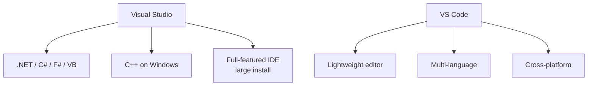

# 3. Visual Studio

> **Tags:** #visual-studio #ide #microsoft #dotnet #csharp

**Visual Studio** (not to be confused with VS Code) is Microsoft's flagship IDE for .NET and C++ development on Windows. It is a large, feature-rich IDE with deep integration into the Microsoft ecosystem.

---

## 3.1 Visual Studio vs VS Code



| Aspect | Visual Studio | VS Code |
| --- | --- | --- |
| Platform | Windows, macOS (limited) | Windows, macOS, Linux |
| .NET support | First-class, official | Via extensions (C# Dev Kit) |
| Size | 5-30 GB install | ~100 MB |
| Refactoring | Best-in-class for C# | Good with C# Dev Kit |
| Debugger | World-class | Good |
| Target audience | Professional .NET and C++ developers | All developers |

For serious .NET development on Windows, Visual Studio is the standard. For cross-platform or lighter work, VS Code with C# Dev Kit is a viable alternative.

---

## 3.2 Editions

| Edition | Cost | Features |
| --- | --- | --- |
| **Community** | Free | Full features for individuals, small teams, open source, education. |
| **Professional** | Paid | Adds professional tooling (Azure dev, CodeLens, etc.). |
| **Enterprise** | Paid | Adds advanced testing (IntelliTest), architecture tools, Live Unit Testing. |

Community is sufficient for most individual developers and small teams.

---

## 3.3 Key Features

### IntelliSense

Visual Studio's IntelliSense is the gold standard. It provides:

- Member completion filtered by accessibility.
- Parameter Info (signature help).
- Quick Info (tooltips on hover).
- Smart completions based on context.

### CodeLens

CodeLens shows metadata above each class and method:

- Number of references (click to see them).
- Last commit that modified the method.
- Associated unit tests (and pass/fail status).
- Code coverage indicator.

CodeLens is a Visual Studio Enterprise feature and is incredibly useful for understanding which code is tested and actively maintained.

### Live Unit Testing

(Enterprise only) Runs affected unit tests in real time as you type. Failing tests are highlighted immediately in the editor. This enables a "test-driven" workflow where you see test results without manually running anything.

### Debugger

Visual Studio has one of the best debuggers available:

- Edit and Continue (modify code while paused).
- Time Travel Debugging (record execution and step backward).
- PerfTips (timing info in the editor gutter).
- Exception settings (break on thrown, unhandled, or specific exception types).
- Parallel Stacks (visualize all threads).

### Refactoring

| Shortcut | Action |
| --- | --- |
| `Ctrl+R, Ctrl+R` | Rename. |
| `Ctrl+R, Ctrl+M` | Extract method. |
| `Ctrl+R, Ctrl+V` | Extract variable. |
| `Ctrl+R, Ctrl+F` | Extract field. |
| `Ctrl+R, Ctrl+I` | Extract interface. |
| `Ctrl+.` | Quick actions and refactoring menu. |

`Ctrl+.` is the equivalent of JetBrains' `Alt+Enter` — a context-aware menu of fixes and refactors.

---

## 3.4 Navigation

| Shortcut | Action |
| --- | --- |
| `Ctrl+,` | Go to symbol. |
| `Ctrl+;` | Search Solution Explorer. |
| `Ctrl+T` | Go to all (files, types, members). |
| `F12` | Go to definition. |
| `Ctrl+F12` | Go to implementation. |
| `Shift+F12` | Find all references. |
| `Ctrl+-` / `Ctrl+Shift+-` | Navigate backward / forward. |
| `Ctrl+G` | Go to line. |
| `Ctrl+M, Ctrl+M` | Toggle outlining (fold/unfold). |

---

## 3.5 Projects and Solutions

Visual Studio organizes code into **solutions** (`.sln`) containing **projects** (`.csproj`, `.vbproj`, etc.).

- A **solution** is a container for one or more projects.
- A **project** corresponds to a build target (an executable, a library, a test project).
- Projects can reference each other.

In modern .NET (Core 3.0+), you can also use `dotnet` CLI commands alongside Visual Studio:

```bash
dotnet new sln
dotnet new console -o MyApp
dotnet sln add MyApp/MyApp.csproj
```

---

## 3.6 NuGet Package Management

NuGet is the .NET package manager. In Visual Studio:

- Right-click a project → **Manage NuGet Packages**.
- Browse, install, and update packages from nuget.org or private feeds.
- Package Manager Console (`Tools → NuGet Package Manager → Package Manager Console`) for `Install-Package` commands.

Equivalent CLI: `dotnet add package Newtonsoft.Json`.

---

## 3.7 Extensions

Notable Visual Studio extensions:

- **ReSharper** — JetBrains' refactoring and analysis add-in. Very popular; transforms VS into a JetBrains-like experience. Paid.
- **GitHub Extension for Visual Studio** — GitHub integration.
- **VsVim** — Vim emulation.
- **Visual Studio IntelliCode** — AI-assisted IntelliSense.
- **SonarLint** — Real-time code quality analysis.

---

## 3.8 Key Takeaways

- Visual Studio is Microsoft's flagship IDE for .NET and C++ on Windows.
- Community edition is free for individuals and small teams.
- CodeLens, Live Unit Testing, and the debugger are best-in-class.
- `Ctrl+.` is the quick actions menu (like JetBrains' `Alt+Enter`).
- Solutions contain projects; projects produce build artifacts.
- NuGet is the package manager; manage via UI or CLI.

---

**Previous:** [[2. IntelliJ and JetBrains IDEs]]
**Next:** [[4. Choosing the Right Editor]]
