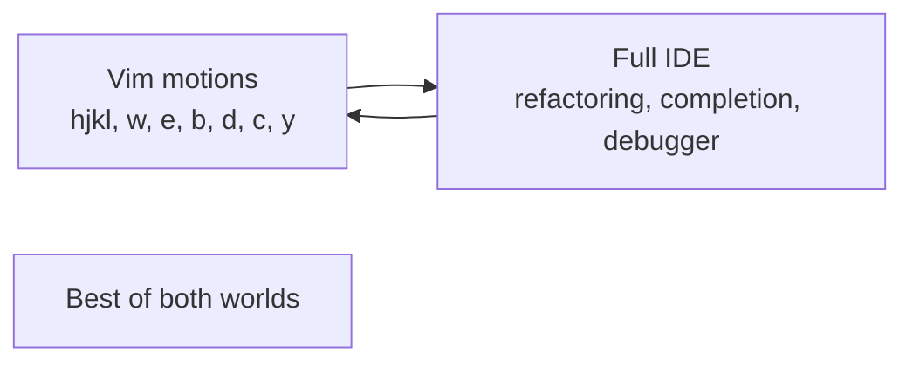

# 4. Choosing the Right Editor

> **Tags:** #editors #ide #comparison #workflow

The "which editor?" debate is one of the oldest in software development. The honest answer: **the best editor is the one you know deeply.** That said, different editors have different strengths. This note helps you choose based on your situation.

---

## 4.1 The Decision Tree

```mermaid
graph TD
    Start[What are you doing?] --> Q1{Primary language?}
    Q1 -->|Java/Kotlin| IntelliJ
    Q1 -->|C#/.NET on Windows| VS
    Q1 -->|Python| Q2{Preference?}
    Q2 -->|Full IDE| PyCharm
    Q2 -->|Lightweight| VSCode
    Q1 -->|JavaScript/TypeScript| Q3{Team standard?}
    Q3 -->|JetBrains shop| WebStorm
    Q3 -->|No standard| VSCode
    Q1 -->|Go| Q4{Preference?}
    Q4 -->|Full IDE| GoLand
    Q4 -->|Lightweight| VSCode
    Q1 -->|Rust| Q5{Preference?}
    Q5 -->|Full IDE| CLion or RustRover
    Q5 -->|Lightweight| VSCode
    Q1 -->|C++| Q6{Platform?}
    Q6 -->|Windows| Visual Studio
    Q6 -->|Cross-platform| CLion or VSCode
    Start --> Q7{Want modal editing?}
    Q7 -->|Yes| Vim or Neovim
```

---

## 4.2 Editor Comparison

| Editor | Strengths | Weaknesses | Best for |
| --- | --- | --- | --- |
| **VS Code** | Free, cross-platform, huge extension ecosystem, fast | Not as deep as JetBrains for static analysis | General-purpose, web dev, polyglot |
| **IntelliJ / JetBrains** | Best refactoring, smart completion, deep analysis | Paid (except Community), heavy, slower startup | Java, Kotlin, Python (PyCharm), Go (GoLand) |
| **Visual Studio** | Best .NET and C++ on Windows, world-class debugger | Windows-only (mostly), huge install, paid for Pro+ | Professional .NET, Windows C++ |
| **Vim / Neovim** | Keyboard-driven, fast, everywhere (servers), modal | Steep learning curve, configuration-heavy | Power users, server editing, pair with IDE |
| **Emacs** | Extensible (Emacs Lisp), org-mode, magit | Steep learning curve, esoteric | Power users who want a programmable editor |
| **Sublime Text** | Extremely fast, polished, multi-cursor pioneer | Limited language intelligence, paid | Quick editing, large files |
| **Zed** | Very fast (Rust), modern, collaborative | New, limited extension ecosystem | Early adopters who want speed |

---

## 4.3 The Hybrid Approach: Vim Layers

Many developers use Vim keybindings inside a full IDE:

- **IdeaVim** — IntelliJ, WebStorm, PyCharm, etc.
- **VsVim** — Visual Studio.
- **VS Code Neovim** — VS Code (uses actual Neovim as backend).
- **vstudio-mode** — various.

This gives you the modal editing speed of Vim with the deep language intelligence of a full IDE. It is the most popular setup for power users.



---

## 4.4 Factors to Consider

### Language Support

- **Static languages** (Java, C#, Kotlin, Go) benefit most from full IDEs — the type information enables powerful features.
- **Dynamic languages** (JavaScript, Python, Ruby) work well in VS Code or lightweight editors, though PyCharm and RubyMine add value.
- **Multiple languages** in one project → VS Code handles this well; JetBrains requires a separate IDE per language family.

### Team Conventions

If your team standardizes on one editor, use it. Shared configs, shared shortcuts, and pair programming all benefit from consistency. You can always install your preferred editor alongside for personal use.

### Project Size

- **Small projects**: any editor works.
- **Large monorepos**: JetBrains or VS Code with remote development features.
- **Enormous monorepos** (Google-scale): specialized tools (Cider, Bazel).

### Performance

- **VS Code**: fast startup, good with most project sizes.
- **JetBrains**: slower startup (10-30 seconds on large projects), fast once indexed.
- **Vim/Neovim**: instant startup, works on any machine including over SSH.
- **Visual Studio**: slow startup, heavy memory usage.

### Remote Development

- **VS Code Remote - SSH**: excellent.
- **JetBrains Gateway**: good.
- **Vim over SSH**: native, no setup needed.

For editing code on remote servers, Vim (or VS Code Remote) is the standard.

---

## 4.5 Learning Path

Regardless of which editor you choose, follow this path:

1. **Learn the basics.** Open files, edit, save, search.
2. **Learn navigation shortcuts.** Go to definition, find references, find file by name.
3. **Learn multi-cursor / multiple selections.** This is the biggest single productivity boost.
4. **Learn refactoring shortcuts.** Rename, extract method, extract variable.
5. **Learn the command palette / search everywhere.** You should never hunt through menus.
6. **Customize.** Turn on format-on-save, set your theme, configure snippets.
7. **Install essential extensions.** Linter, formatter, Git integration.
8. **Practice daily.** Muscle memory takes weeks to build.

---

## 4.6 Common Mistakes

- **Switching editors constantly.** You never build muscle memory. Pick one and commit for at least 3 months.
- **Using the mouse.** Every time you reach for the mouse, you lose a second. Learn the keyboard shortcut.
- **Not customizing.** Default settings are rarely optimal. Spend 30 minutes configuring your editor.
- **Installing too many extensions.** Each extension slows startup and can conflict with others. Install only what you use.
- **Ignoring the terminal.** The integrated terminal is part of your editor. Learn to use it without switching windows.

---

## 4.7 Key Takeaways

- The best editor is the one you know deeply.
- VS Code: general-purpose, free, cross-platform.
- JetBrains: best for static languages, deep analysis, paid.
- Visual Studio: best for .NET and C++ on Windows.
- Vim/Neovim: keyboard-driven, fast, ubiquitous.
- Consider the hybrid approach: Vim keybindings inside a full IDE.
- Commit to one editor for at least 3 months to build muscle memory.

---

**Previous:** [[3. Visual Studio]]
**Next chapter:** [[1. Introduction to Testing]] (Chapter 7)
